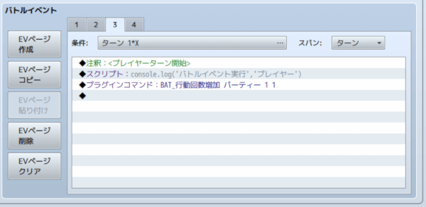

[トップページに戻る](README.md)

# [FTKR_AltTB_BattleEventConditions](FTKR_AltTB_BattleEventConditions.js) プラグイン

バトルイベントにFTKR_AltTB専用のターン条件を設定できるプラグインです。

ダウンロード: [FTKR_AltTB_BattleEventConditions.js](https://raw.githubusercontent.com/futokoro/RPGMaker/master/FTKR_AltTB_BattleEventConditions.js)

## 目次

以下の項目の順でプラグインの使い方を説明します。
1. [概要](#概要)
2. [プラグインの登録](#プラグインの登録)
1. [バトルイベントの設定](#バトルイベントの設定)
* [プラグインの更新履歴](#プラグインの更新履歴)
* [ライセンス](#ライセンス)

## 概要

このプラグインを導入すると、敵グループに設定したバトルイベントの実行条件に、 FTKR_AlternatingTurnBattle 専用のターン条件を設定できます。

このプラグインは、[FTKR_AlternatingTurnBattleプラグイン※v2.0.0以降](FTKR_AlternatingTurnBattle.ja.md)が必要です。

[目次に戻る](#目次)

## プラグインの登録

以下のプラグインと組み合わせる場合は、プラグイン管理画面で、以下の順の配置になるように登録してください。
```
FTKR_AlternatingTurnBattle.js   (味方交互にターンが進むターン制戦闘システム)
↑このプラグインよりも上に登録↑
FTKR_AltTB_BattleEventConditions.js
```

[目次に戻る](#目次)

# バトルイベントの設定

下の図のように、敵グループのバトルイベントに注釈でタグを追記することで、さまざまなターン条件を追加できます。



設定できるターン条件は以下の通りです。

* [ターン開始時に実行](#ターン開始時に実行)
* [プレイヤーターン開始時に実行](#プレイヤーターン開始時に実行)
* [プレイヤーターン終了時に実行](#プレイヤーターン終了時に実行)
* [エネミーターン開始時に実行](#エネミーターン開始時に実行)
* [エネミーターン終了時に実行](#エネミーターン終了時に実行)

これらのターン条件は、既存のツクールMVのエディタで設定できる条件と併用することができます。
ただし、異なるターン条件タグを併用したり、「ターン終了」の条件と併用することはできません。
また、ターン数を指定する場合は、１ターン目以降になるように設定してください。

なお、０ターン目にだけイベントを実行させたい場合は、ターン条件で「０ + ０ *X」になるように設定してください。

[上に戻る](#バトルイベントの設定)

## ターン開始時に実行
### タグ
```
<ターン開始>
<TURN_STARTING>
```

### 内容
このタグを追記したページのイベントを、「ターン開始」時に実行します。

アクターやエネミーの行動回数を変更したり、行動速度に影響を与える変更を行う場合には、このタイミングでイベントを実行しましょう。

また、この「ターン開始」時の時点で、行動制約のあるステートを付与されているアクターだけが、次の自動行動ターンで行動を行います。
このターンで自動行動を行わせたい場合は、このターンの「ターン開始」時、またはそれ以前のターンにステートを付与させましょう。

[上に戻る](#バトルイベントの設定)

## プレイヤーターン開始時に実行
### タグ
```
<プレイヤーターン開始>
<PLAYER_TURN_STARTING>
```

### 内容
このタグを追記したページのイベントを、「プレイヤーターン開始」時に実行します。

アクターの行動選択前に何か実行したい場合には、このタイミングでイベントを実行しましょう。

また、「プレイヤー自動行動ターン」をプレイヤーターン開始時に設定していた場合に、このイベントの後にアクターの自動行動を行います。

[上に戻る](#バトルイベントの設定)

## プレイヤーターン終了時に実行
### タグ
```
<プレイヤーターン終了>
<PLAYER_TURN_ENDING>
```

### 内容
このタグを追記したページのイベントを、「プレイヤーターン終了」時に実行します。

「プレイヤー自動行動ターン」をプレイヤーターン終了時に設定していた場合に、このイベントの後にアクターの自動行動を行います。

なお、エネミーに付与したステートは、この直後に１ターン経過と自動解除判定が行われるため、「ターン終了」時に解除のステート場合、このタイミングで１ターン以下のステートを付与させてもすぐに解除してしまいます。

[上に戻る](#バトルイベントの設定)

## エネミーターン開始時に実行
### タグ
```
<エネミーターン開始>
<ENEMY_TURN_STARTING>
```

### 内容
このタグを追記したページのイベントを、「エネミーターン開始」時に実行します。

なお、この時点ですでにエネミーの行動は決定済みです。エネミーの行動は「ターン開始」時に決定します。

[上に戻る](#バトルイベントの設定)

## エネミーターン終了時に実行
### タグ
```
<エネミーターン終了>
<ENEMY_TURN_ENDING>
```

### 内容
このタグを追記したページのイベントを、「エネミーターン終了」時に実行します。

この後に、アクターに付与されているステートのターン経過と解除判定が行われます。

[上に戻る](#バトルイベントの設定)
[目次に戻る](#目次)

# プラグインの更新履歴

| バージョン | 公開日 | 更新内容 |
| --- | --- | --- |
| [ver1.0.1](FTKR_AltTB_BattleEventConditions.js) | 2018/12/04 | バトルイベントの条件が一部反映されない不具合を修正 |
| ver1.0.0 | 2018/12/02 | 新規作成 |

# ライセンス

本プラグインはMITライセンスのもとで公開しています。

[The MIT License (MIT)](https://opensource.org/licenses/mit-license.php)

#
[目次に戻る](#目次)

[トップページに戻る](README.md)