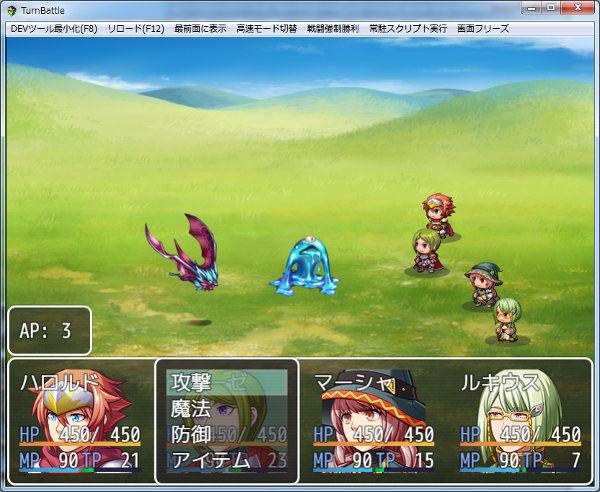
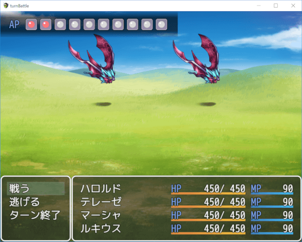

[トップページに戻る](README.md)

# [FTKR_AlternatingTurnBattle](FTKR_AlternatingTurnBattle.js) プラグイン

敵味方交互にターンが進むターン制戦闘システムのプラグインです。

ダウンロード: [FTKR_AlternatingTurnBattle.js](https://raw.githubusercontent.com/futokoro/RPGMaker/master/FTKR_AlternatingTurnBattle.js)

## 目次

以下の項目の順でプラグインの使い方を説明します。
1. [概要](#概要)
2. [プラグインの登録](#プラグインの登録)
1. [ターンの進行](#ターンの進行)
1. [プレイヤーのターン](#プレイヤーのターン)
1. [エネミーのターン](#エネミーのターン)
1. [行動回数](#行動回数)
1. [アクションポイント](#アクションポイント)
1. [FTKR_CustomSimpleActorStatus追加コード](#ftkr_customsimpleactorstatus追加コード)
1. [スクリプト](#スクリプト)
1. [プラグインコマンド](#プラグインコマンド)
* [プラグインの更新履歴](#プラグインの更新履歴)
* [ライセンス](#ライセンス)

## 概要

このプラグインを導入すると、敵味方交互にターンが進むターン制戦闘システムに変更します。

この戦闘システムは、基本的にプレイヤー側が有利に戦闘を進めることができます。

[目次に戻る](#目次)

## プラグインの登録

以下のプラグインと組み合わせる場合は、プラグイン管理画面で、以下の順の配置になるように登録してください。
```
FTKR_CustomSimpleActorStatus.js (ステータス表示を変更)
FTKR_FVActorAnimation.js        (フロントビューでアクター画像にアニメーション)
YEP_BattleEngineCore.js
YEP_X_ActSeqPack*.js
↑このプラグインよりも上に登録↑
FTKR_AlternatingTurnBattle.js
↓このプラグインよりも下に登録↓
FTKR_BattleWindowLayout.js      (バトル画面のコマンドの位置を変更)
FTKR_CSS_BattleStatus.js        (バトル画面のステータス表示を変更)
FTKR_DisplayCommandFrame.js     (カーソルの変わりに枠や画像を表示)
AttackChain.js
```

[目次に戻る](#目次)

## ターンの進行

ターンの進行は、以下の様になります。
```
 １ターン目開始⇒プレイヤーの１ターン目⇒エネミーの１ターン目⇒１ターン目終了
２ターン目開始⇒プレイヤーの２ターン目⇒･･･
```
先制攻撃が発生すると、エネミーの１ターン目が無くなり、
連続でプレイヤーが行動できます。

不意打ちが発生すると、プレイヤーの１ターン目が無くなり
エネミーの１ターン目から始まります。

[目次に戻る](#目次)

## プレイヤーのターン

プレイヤーのターンでは、以下の仕様になります。

1. アクターの行動順は任意に選択できます。
2. pgUpキーとpgDnキーで行動させるアクターを選択できます。(*1)
3. アクターを選択し行動を決定すると、即座にスキルが発動し、その後に次に行動するアクター選択に移ります。
4. キャラが行動すると、そのキャラの行動回数を１消費し、さらに、使用したスキルのアクションポイントの分、パーティーのアクションポイントを消費します。
5. 全員が行動済みになるか、パーティーのアクションポイントが 0 になるかパーティーコマンドの「ターン終了」を選ぶと、エネミーのターンに移ります。
6. キャンセルキーで、パーティーコマンドを表示できます。
7. 誰かが行動したターンでは、パーティーコマンドの「逃げる」は実行できなくなります。

(*1)プラグインパラメータ Change Player で操作方法は変更できます。

[目次に戻る](#目次)

## エネミーのターン

エネミーのターンでは、従来のMVのシステムとほぼ同じです。

1. エネミーの行動順は、エネミーの敏捷性と使用するスキルの速度補正によって決まります。
2. エネミーは、各ターン開始時に使用するスキルと行動順を決めます。

[目次に戻る](#目次)

## 行動回数

アクターは設定された行動回数の分だけ、毎ターン行動できます。

アクターの行動回数は、特徴の行動回数追加の合計＋１回です。
この値が毎ターンの行動回数になります。

ただし、ターン中にプラグインコマンドを実行することでそのターンだけ行動回数を増減させることができます。

プラグインコマンドで変化させた行動回数は、次のターンには元に戻ります。

なお、プラグインパラメータ`Disable AC`を"無効にする"に設定するとアクターは行動しても行動回数が減らなくなります。
この状態では、アクションポイントがある限り、何度でも同じアクターで行動することが可能です。

スキルやアイテムのメモ欄に、`<AltTB_noAC>`と記入するとそのスキルやアイテムを使用しても行動回数を消費ません。

[目次に戻る](#目次)

## アクションポイント

アクションポイントは、プラグインパラメータ`Enable AP`を有効にすると使用できます。

パーティーはアクションポイントというパラメータを持っています。
各アクターは行動時に、行動回数とは別に、このアクションポイントを消費します。
アクションポイントの現在値を超える行動はすることができません。

消費したアクションポイントは、ターン開始時に一定量回復します。

アクションポイントの消費量は、使用したスキルごとに個別に変わります。

### パーティーのアクションポイントの設定
パーティーのアクションポイント最大値は、プラグインパラメータ`Party AP`で設定できます。
また、プラグインコマンドで、現在値や最大値を変更できます。

### スキルやアイテムのアクションポイントの設定
スキルやアイテム使用時に消費するアクションポイントは、以下の方法で設定します。
1. プラグインパラメータ`Item AP`で、全スキル・アイテム共通のデフォルト値を設定。
2. 個別に、メモ欄に`<AltTB_AP: n>`で設定。n が消費量です。
なお、個別の設定を優先します。

また、スキルのメモ欄に`<AltTB_GainAP: n>`と設定すると、そのスキルを使用した時に、命中時に n ポイントAPを取得できます。

さらに、以下のタグを追加すると、そのAP取得に条件を設定できます。
```
<AltTB_GainAP_Conditions>
condition1
condition2
...
</AltTB_GainAP_Conditions>
```
入力例は後述。

### ターン毎のアクションポイント回復量
プラグインパラメータ`Turn Refresh AP`で、ターン毎の回復量を設定できます。
回復量はスクリプトで設定できます。

### 戦闘毎のアクションポイントのリセット
アクションポイントは戦闘毎にリセットされ、0 から開始します。
ただし、プラグインパラメータ`Enable Reset AP Every Battle`を無効にすることでアクションポイントを持ち越すことができます。

[目次に戻る](#目次)

### <AltTB_GainAP_Conditions>条件式タグの設定方法

以下のノートタグをスキルやアイテム追記することで、`<AltTB_GainAP: n>`で設定したAP取得に条件を設定することができます。
```
<AltTB_GainAP_Conditions>
condition1
condition2
...
</AltTB_GainAP_Conditions>
```

#### 条件式(condition) の値について
条件式(condition)は、ダメージ計算式のように、計算式を入力することで、
固定値以外の値を使用することができます。以下のコードを使用できます。
* a.param - 攻撃側のパラメータを参照します。(a.atk で攻撃側の攻撃力)
* b.param - 防御側のパラメータを参照します。(b.atk で防御側の攻撃力)
* s[x]    - スイッチID x の状態を参照します。
* v[x]    - 変数ID x の値を参照します。
* result  - 使用したスキルの結果を参照します。
    * result.hpDamage - 使用したスキルによって与えたHPダメージを参照します。
    * result.critical - クリティカルの発生有無を参照します。

#### 入力例）
スイッチID1 が ON の時かつ使用者がアクターID1の場合にAPを1取得。
```
<AltTB_GainAP: 1>
<AltTB_GainAP_Conditions>
!!s[1]
a.actorId() === 1
</AltTB_GainAP_Conditions>
```

#### 複数の条件を設定する場合
以下の2種類の入力例は同じ意味で、condition1とcondition2を両方満たした時にAPを取得できます。

1. 縦に複数の条件式を並べる
```
<AltTB_GainAP_Conditions>
condition1
condition2
</AltTB_GainAP_Conditions>
```

2. '&&'を使用して横に複数の条件式を並べる
```
<AltTB_GainAP_Conditions>
condition1 && condition2
</AltTB_GainAP_Conditions>
```

複数の条件の中から、いずれか一つを満たした場合の条件を設定する場合は、以下の様に'||'を使用して記述します。
```
<AltTB_GainAP_Conditions>
condition1 || condition2
</AltTB_GainAP_Conditions>
```

### パーティーのアクションポイントの表示

プラグインパラメータ`AP Draw Type`で、アクションポイントの表示方法を設定できます。

#### 数値(現在値のみ)で表示


#### 数値(現在値と最大値)で表示
ウィンドウの幅が小さい場合は、自動的に最大値が非表示になります。


#### ゲージ付きで表示
プラグインパラメータ`Display AP Gauge`を有効にすると、数値表示時にゲージをつけることができます。

ゲージの色を設定できます。


#### アイコンで表示
現在値と最大値をそれぞれ別のアイコンで表示します。

使用するアイコンや、アイコン同士の間隔を設定できます。


#### ウィンドウ背景の変更

プラグインパラメータ`AP Window Layout`の`background`の設定により、ウィンドウ背景をデフォルトの「ウィンドウ」から「暗くする」「透明」に変更できます。

下は暗くした場合



[目次に戻る](#目次)

## FTKR_CustomSimpleActorStatus追加コード

当プラグインでは以下のコードをプラグインパラメータ`Actor Status Text*`に使用できます。

### コード：`actc`

アクターの行動回数を表示します。

### コード：`actp`

パーティーのアクションポイントを表示します。
プラグインパラメータ `Display AP` を設定している場合は、「設定した文字列：値」という表示になります。

[目次に戻る](#目次)

## スクリプト

このプラグインでは、以下のスクリプトが使用できます。

### 行動回数の現在値の取得
アクターID n の場合

`$gameActors.actor(n).actionCount()`

パーティーの n 番目のキャラの場合

`$gameParty.members()[n-1].actionCount()`

敵グループの n 番目のキャラの場合

`$gameTroop.members()[n-1].actionCount()`

### パーティーのアクションポイントの現在値の取得
`$gameParty.actionPoint()`

### パーティーのアクションポイントの最大値の取得
`$gameParty.maxActionPoint()`

[目次に戻る](#目次)

## プラグインコマンド

このプラグインでは、以下のプラグインコマンドが使用できます。
※[]は実際の入力に使用しません

### 行動回数の増加
対象の行動回数を操作します。減らすことも出来ます。
減らしたことで、行動回数が 0 になった対象は、そのターン行動できなくなります。
```
AltTB_行動回数増加 [対象分類] [対象ID] [増加量]
AltTB_ADD_AC [targetType] [targetId] [value]
```
#### 対象分類(targetType)
行動回数を増加させる対象をどのように選ぶかを指定します。
以下の文字列を入力してください。
* アクターまたは Actor
* パーティー または Party
* 敵グループ または Troop

#### 対象ID(targetId)
対象分類に合わせて、以下のIDを指定します。
* アクターなら、対象のアクターID。
* パーティーなら、パーティー先頭を 1 とした並び順。
* 敵グループなら、敵グループ先頭を 1 とした並び順。

\v[n] と指定することで変数 n の値を参照できます。

#### 増加量(value)
行動回数を増加させる値を指定します。
負の値を指定した場合、対象の行動回数は減少します。
\v[n] と指定することで変数 n の値を参照できます。

#### 入力例)
```
AltTB_行動回数増加 アクター 1 1
AltTB_ADD_AC Actor 1 1
```
アクターID 1 の行動回数を 1 増やします。

```
AltTB_行動回数増加 パーティー 2 \v[5]
AltTB_ADD_AC Party 2 \v[5]
```
パーティーの 2 番目のキャラの行動回数を 変数ID 5 の値分、増やします。

```
AltTB_行動回数増加 敵グループ 3 -1
AltTB_ADD_AC Troop 3 -1
```
敵グループの 3 番目のキャラの行動回数を 1 減らします。

### アクションポイントの現在値の増加

パーティーのアクションポイントの現在値を操作します。減らすこともできます。
減らしたことで、アクションポイントが 0 になった場合は、プレイヤーターンを終了します。
```
AltTB_アクションポイント増加 [増加量]
AltTB_ADD_AP [value]
```
#### 増加量(value)
アクションポイントを増加させる値を指定します。
負の値を指定した場合、アクションポイントは減少します。
\v[n] と指定することで変数 n の値を参照できます。

#### 入力例
```
AltTB_アクションポイント増加 1
AltTB_ADD_AP 1
```
アクションポイントを 1 増やします。

### アクションポイントの現在値の増加

現在値と同様に、パーティーのアクションポイントの最大値を操作できます。

```
AltTB_アクションポイント増加 [増加量] 最大値
AltTB_ADD_AP [value] MAX
```

#### 入力例
```
AltTB_アクションポイント増加 1 最大値
AltTB_ADD_AP 1 MAX
```
アクションポイントの最大値を 1 増やします。

[目次に戻る](#目次)

## プラグインの更新履歴

| バージョン | 公開日 | 更新内容 |
| --- | --- | --- |
| [ver1.4.0](FTKR_AlternatingTurnBattle.js)| 2018/08/18 | アクションポイントの最大値を設定する機能を追加<br>アクションポイントの表示方式を現在値と最大値、ゲージ、またはアイコンに変更<br>アクションポイントウィンドウの表示レイヤーをパーティーコマンドウィンドウの下に変更<br>アクションポイントウィンドウの背景を設定する機能を追加 |
| ver1.3.3| 2018/08/17 | FTKR_CustomSimpleActorStatus または FTKR_FVActorAnimation と組合せた時に、行動済みのアクターの「名前＋顔画像をグレー表示」が正常に動作しない不具合を修正。 |
| ver1.3.2 | 2018/08/05 | 行動後モーションを停止に設定した場合、ターン開始時に待機モーションに戻らない不具合を修正。(サイドビュー)<br>プレイヤーターン終了時に未行動のアクターのモーションを設定する機能を追加<br>キー操作でアクターを変更する場合に、行動回数を追加したアクターから次のアクターにカーソルが正常に移らない不具合を修正<br>複数回行動可能なアクターが、行動後にまだ行動回数が残っていても１歩下がってしまう不具合を修正。(サイドビュー)<br>行動回数消費を無効かつアクターコマンド選択から開始に設定した場合に、最初のアクターが前進後にすぐに一歩下がってしまう不具合を修正。(サイドビュー) |
| ver1.3.1| 2018/07/27 | FTKR_FVActorAnimation.jsと組み合わせた時に、FTKR_FVActorAnimationのアクターエフェクト機能が正常に動作しない不具合を修正<br>FTKR_CustomSimpleActorStatus.jsで行動回数とアクションポイントを表示する機能を追加 |
| ver1.3.0| 2018/05/04 | 使用したスキル命中時に、<AltTB_GainAP:n>で設定したAP取得の条件を設定できる機能を追加 |
| ver1.2.2| 2018/04/30 | 自動でプレイヤーターンを飛ばす処理が正常に動作しない不具合を修正<br>エネミーターンに移行した直後にゲームが止まる不具合を修正<br>特定のスキル・アイテムの行動回数の消費を無効にする機能を追加 |
| ver1.2.1| 2018/04/29 | AP0になった時に、ゲームがフリーズする不具合を修正<br>戦闘行動の強制で消費APを無効にしても、AP0になった際に戦闘行動の強制を実行できない不具合を修正<br>アクターの行動回数を無効にした時に、同じアクターを２回以上行動させるとエラーになる不具合を修正<br>アクターの行動回数を無効にした時に、エネミーターンが終わらない不具合を修正<br>プレイヤーが全員行動できなくなった時に、自動でプレイヤーターンを飛ばすかどうか設定する機能を追加<br>パーティーの初期APとスキル・アイテムの消費APのデフォルト値を、どちらも 0 に設定できるように変更 |
| ver1.2.0| 2018/04/29 | アクションポイントウィンドウのレイアウト設定機能を追加<br>スキル使用後にAPを一定値自動取得可能な機能を追加<br>アクターの行動回数による行動制限を無効にする機能を追加 |
| ver1.1.0| 2018/04/09 | アクターコマンドのAP表示部の処理を見直し<br>APの表示幅や表示色を設定する機能を追加<br>残り行動回数を表示する機能を追加<br>マウスクリックでアクターを変更する機能を追加 |
| ver1.0.0 | 2018/04/08 | 初版作成 |

## 拡張プラグイン

以下のプラグインを使用することで、本プラグインの機能を拡張できます。

* [FTKR_BattleWindowLayout](FTKR_BattleWindowLayout.ja.md) - 戦闘時のウィンドウ配置を変更する。

## ライセンス

本プラグインはMITライセンスのもとで公開しています。

[The MIT License (MIT)](https://opensource.org/licenses/mit-license.php)

#
[目次に戻る](#目次)

[トップページに戻る](README.md)