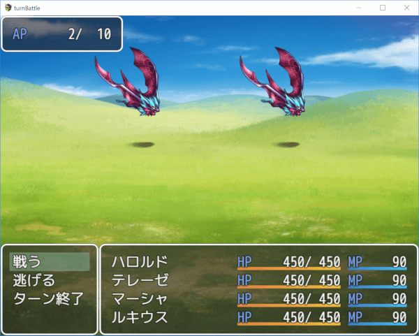
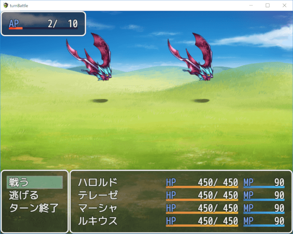
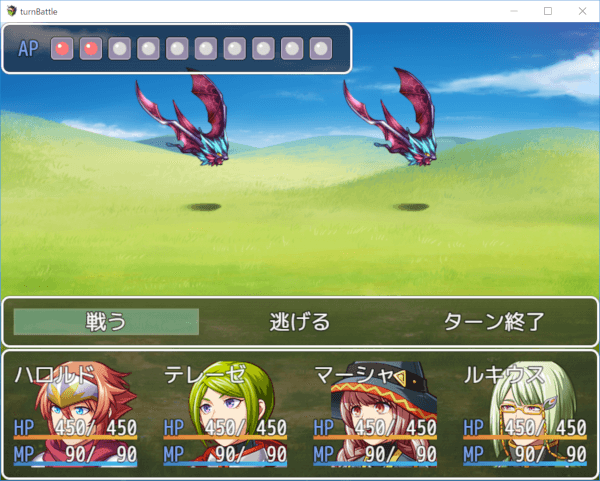

[トップページに戻る](README.md)

# [FTKR_BattleActionPoints](FTKR_BattleActionPoints.js) プラグイン

パーティーメンバーで共有する消費コスト用のパラメータ「アクションポイント(AP)」を導入するプラグインです。

ダウンロード: [FTKR_BattleActionPoints.js](https://raw.githubusercontent.com/futokoro/RPGMaker/master/FTKR_BattleActionPoints.js)

## 目次

以下の項目の順でプラグインの使い方を説明します。
1. [概要](#概要)
2. [プラグインの登録](#プラグインの登録)
1. [アクションポイント](#アクションポイント)
1. [最大APの設定](#最大APの設定)
1. [消費APの設定](#消費APの設定)
1. [取得APの設定](#取得APの設定)
1. [初期APの設定](#初期APの設定)
1. [ターン回復APの設定](#ターン回復APの設定)
1. [現在APの操作](#現在APの操作)
1. [戦闘シーンでのAPの表示](#戦闘シーンでのAPの表示)
* [プラグインの更新履歴](#プラグインの更新履歴)
* [ライセンス](#ライセンス)

## 概要

このプラグインを導入すると、以下の機能を追加します。

* パーティーメンバーで共有するパラメータ「アクションポイント(AP)」を導入
* 戦闘シーンに「アクションポイント(AP)」の現在値や最大値を表示
* スキルやアイテムに、この「アクションポイント(AP)」を消費コストとして設定できる
* スキルやアイテムに、「アクションポイント(AP)」の現在値を増減させる使用効果を設定できる
* アクターや職業などに、「アクションポイント(AP)」の最大値を増減させる特徴や、消費量を変化させる特徴を設定できる

このプラグインは、[FTKR_AlternatingTurnBattleプラグイン※v2.0.0以降](FTKR_AlternatingTurnBattle.ja.md)と組み合わせて使用することを想定して作成しています。

[目次に戻る](#目次)

## プラグインの登録

以下のプラグインと組み合わせる場合は、プラグイン管理画面で、以下の順の配置になるように登録してください。
```
FTKR_CustomSimpleActorStatus.js (ステータス表示を変更)
FTKR_AlternatingTurnBattle.js   (味方交互にターンが進むターン制戦闘システム)
FTKR_ExBattleCommand.js
↑このプラグインよりも上に登録↑
FTKR_BattleActionPoints.js
```

[目次に戻る](#目次)

# アクションポイント

このプラグインを導入することで、パーティーはアクションポイント(以降、APとする)というパラメータを持ちます。

### 現在APと最大AP
APには、HPのように現在値と最大値を持っています。
現在値を「現在AP」、最大値を「最大AP」とします。

⇒[最大APの設定](#最大APの設定)<br>
⇒[現在APの操作](#現在APの操作)

### 消費AP～スキルやアイテム使用時のAP消費～
プラグインパラメータやデータベースのメモ欄の設定により、スキルやアイテムはの使用時にAPを消費します。
この時の消費量を、「消費AP」とします。
消費APが現在APを超える行動は、実行することができません。
消費APは、使用するスキルやアイテムごとに個別に設定できます。

⇒[消費APの設定](#消費APの設定)

### 取得AP～スキルやアイテム使用時のAP取得～
アイテムやスキル使用時にAPを消費するだけではありません。
使用時に増加させることもできます。
この増加量を、「取得AP」とします。

⇒[取得APの設定](#取得APの設定)

### 初期AP～戦闘開始時のAPの初期値～
このプラグインでは、戦闘開始時の現在APの初期値を設定できます。
この値を、「初期AP」とします。
前の戦闘の現在APに関係なく、戦闘開始時にはこの初期APになります。
ただし、プラグインパラメータの設定により、現在APを次の戦闘に持ち越すこともできます。

⇒[初期APの設定](#初期APの設定)

### ターン回復AP～戦闘中のターンごとのAPの回復量～
また、現在APはターン開始時に一定量回復します。
この値を、「ターン回復AP」とします。

⇒[ターン回復APの設定](#ターン回復APの設定)

なお、０ターン目および１ターン目には、APのターン回復は行われません。

[目次に戻る](#目次)

# 最大APの設定
最大APは、以下の計算によって算出します。
```
(基準値＋パーティーメンバーの特徴の加算分) × パーティーメンバーの特徴の変化率 = 最大AP
```

## 基準値の設定(プラグインパラメータ)
最大APの基準値は、プラグインパラメータ`Init Max AP`で設定します。

### パラメータ名
`Init Max AP`

### 入力値
入力した数値が、最大APの基準値になります。
0 以上の数値を入力してください。

## 基準値の設定(プラグインコマンド)

また、プラグインコマンドで、最大APの基準値を増減できます。

### プラグインコマンド
```
FTKR_最大AP増加 [増加量]
FTKR_ADD_MAX_AP [value]
```

または
```
AltTB_アクションポイント増加 [増加量] 最大値
AltTB_ADD_AP [value] MAX
```

### パラメータ
#### 増加量(value)
最大APの基準値を増加させる値を指定します。
負の値を指定した場合、最大APの基準値は減少します。
\v[n] と指定することで変数 n の値を参照できます。

### 入力例
```
FTKR_最大AP増加 1
FTKR_ADD_MAX_AP 1
```
最大APの基準値を 1 増やします。

[目次に戻る](#目次)

## 加算分の設定
加算分は、データベースのメモ欄に入力した特徴で設定します。

### タグ
`<FTKR_MAX_AP_PLUS: x>`
* x : この特徴によって増加させる値。負の値を設定した場合は減少します。

### データベースでの対象
アクター、職業、武器、防具、敵キャラ、ステート

### 効果内容
設定した値の分、APの最大値が増加します。
戦闘に参加するパーティーメンバーの特徴の合計値が加算されます。

### 入力例
```
<FTKR_MAX_AP_PLUS: 1>
```
APの最大値を 1 増やします。

[目次に戻る](#目次)

## 変化率の設定
変化率は、データベースのメモ欄に入力した特徴で設定します。

### タグ
`<FTKR_MAX_AP_RATE: x>`
* x : APの最大値の変化率。％で設定します。

### データベースでの対象
アクター、職業、武器、防具、敵キャラ、ステート

### 効果内容
APの最大値が、設定した倍率で変化します。
この特徴が重複した場合は、すべての倍率を別々に積算(累積)します。
最終的な変化率は、戦闘に参加するパーティーメンバーの特徴の累積値です。

例えば、150% と 120% の特徴が重複した場合、 150% * 120% = 180% になります。

### 入力例
```
<FTKR_MAX_AP_RATE: 150>
```
APの最大値を 150% に変化させます。

[目次に戻る](#目次)

# 消費APの設定
消費APは、以下の計算によって算出します。
```
(スキルやアイテムの基準値＋使用者の特徴の加算分) × 使用者の特徴の変化率 = 消費AP
```

スキルやアイテム使用時に消費する消費APの基準値は、以下のどちらかの方法で設定します。

1. プラグインパラメータ`Item AP Cost`で、全スキル・アイテム共通のデフォルト値を設定。
2. スキルやアイテムのメモ欄に個別で設定。

## 基準値の設定
プラグインパラメータ`Item AP Cost`で、全スキル・アイテム共通のデフォルト値を設定。

### パラメータ名
`Item AP Cost`

### 入力値
入力した数値が、消費APの基準値になります。
0 以上の数値を入力してください。

## 基準値の設定(メモ欄)
スキルやアイテムのメモ欄に個別で設定。

### タグ
`<FTKR_AP_COST: x>`
* x : 使用時の消費AP

または

`<AltTB_AP: x>`

### データベースでの対象
スキル、アイテム

### 効果内容
設定した値の分、現在APを消費します。
現在APが、この消費APに満たない場合は、使用できません。
この設定は、プラグインパラメータの設定よりも優先します。

### 入力例
```
<FTKR_AP_COST: 1>
```
消費APを 1 に設定します。

[目次に戻る](#目次)

## 加算分の設定

### タグ
`<FTKR_AP_COST_PLUS: x>`
* x : 消費APの加算値。負の値の場合は減少します。この設定はすべてのスキル・アイテムに効果があります。

または

`<FTKR_AP_COST_PLUS: x type y>`
* x : 消費APの加算値。負の値の場合は減少します。この設定は次の`type y`の指定により効果対象となるスキル・アイテムを制限できます。
* type : 加算する条件を文字列で指定する
    * skillId : スキルIDで指定
    * itemId : アイテムIDで指定
    * skillType : スキルタイプIDで指定
    * elementId : 属性IDで指定
* y : 指定した条件のID

### データベースでの対象
アクター、職業、武器、防具、敵キャラ、ステート

### 効果内容
設定した値の分、すべての行動の消費APが加算します。
`type y`を指定することで、特定のスキルだけ加算させることや、スキルタイプ、属性ごとに加算させることができます。

### 入力例
```
<FTKR_AP_COST_PLUS: 1>
```
すべての行動の消費APを 1 増加します。

```
<FTKR_AP_COST_PLUS: 2 skillId 10>
```
スキルID10 の消費APを 2 増加します。

```
<FTKR_AP_COST_PLUS: -1 elementId 2>
```
属性ID2 の消費APを 1 減らします。

[目次に戻る](#目次)

## 変化率の設定

### タグ
`<FTKR_AP_COST_RATE: x>`
* x : 消費APの変化率。％で設定します。この設定はすべてのスキル・アイテムに効果があります。

または

`<FTKR_AP_COST_RATE: x type y>`
* x : 消費APの変化率。％で設定します。この設定は次の`type y`の指定により効果対象となるスキル・アイテムを制限できます。
* type : 加算する条件を文字列で指定する
    * skillId : スキルIDで指定
    * itemId : アイテムIDで指定
    * skillType : スキルタイプIDで指定
    * elementId : 属性IDで指定
* y : 指定した条件のID

### データベースでの対象
アクター、職業、武器、防具、敵キャラ、ステート

### 効果内容
設定した変化率で、すべての行動の消費APを変更します。
少数点以下は四捨五入で計算します。
`type y`を指定することで、特定のスキルだけ変えることや、スキルタイプ、属性ごとに変化させることができます。

### 入力例
```
<FTKR_AP_COST_RATE: 50>
```
すべての行動の消費APを 50% に変えます。

```
<FTKR_AP_COST_RATE: 200 skillId 10>
```
スキルID10 の消費APを 2倍にします。

[目次に戻る](#目次)

# 取得APの設定
取得APの設定には、取得する値と、発生条件の２つがあります。

## 取得APの値の設定
### タグ
`<FTKR_GAIN_AP: x>`
* x : 取得APを設定します。負の値の場合は、減少します。

または

`<AltTB_GainAP: x>`

### データベースでの対象
スキル、アイテム

### 効果内容
命中時に、設定したAPを取得します。
使用に失敗した場合や、命中しなかった場合、回避された場合は取得できません。

### 入力例
```
<FTKR_GAIN_AP: 1>
```
命中時に、APを１取得します。

[目次に戻る](#目次)

## 取得APの発生条件の設定
以下のタグを追加すると、その取得APに発動条件を設定できます。

### タグ
```
<FTKR_GAINAP_CONDITIONS>
condition1
condition2
...
</FTKR_GAINAP_CONDITIONS>
```
* condition* : 条件式。設定方法は後述。

または
```
<AltTB_GainAP_Conditions>
condition1
condition2
...
</AltTB_GainAP_Conditions>
```

### データベースでの対象
スキル、アイテム

### 効果内容
スキルやアイテムの命中時に、設定した条件式を判定し、条件を満たした場合にAPを取得します。
このタグは、必ず取得APの値の設定と合わせて使用してください。

### 条件式(condition) の値について
条件式(condition)は、ダメージ計算式のように、計算式を入力することで、
固定値以外の値を使用することができます。以下のコードを使用できます。
* a.param - 攻撃側のパラメータを参照します。(a.atk で攻撃側の攻撃力)
* b.param - 防御側のパラメータを参照します。(b.atk で防御側の攻撃力)
* s[x]    - スイッチID x の状態を参照します。
* v[x]    - 変数ID x の値を参照します。
* result  - 使用したスキルの結果を参照します。
    * result.hpDamage - 使用したスキルによって与えたHPダメージを参照します。
    * result.critical - クリティカルの発生有無を参照します。

### 入力例）
スイッチID1 が ON の時かつ使用者がアクターID1の場合にAPを1取得。
```
<FTKR_GAIN_AP: 1>
<FTKR_GAINAP_CONDITIONS>
!!s[1]
a.actorId() === 1
</FTKR_GAINAP_CONDITIONS>
```

### 複数の条件を設定する場合
以下の2種類の入力例は同じ意味で、condition1とcondition2を両方満たした時にAPを取得できます。

1. 縦に複数の条件式を並べる
```
<FTKR_GAINAP_CONDITIONS>
condition1
condition2
</FTKR_GAINAP_CONDITIONS>
```

2. '&&'を使用して横に複数の条件式を並べる
```
<FTKR_GAINAP_CONDITIONS>
condition1 && condition2
</FTKR_GAINAP_CONDITIONS>
```

複数の条件の中から、いずれか一つを満たした場合の条件を設定する場合は、以下の様に'||'を使用して記述します。
```
<FTKR_GAINAP_CONDITIONS>
condition1 || condition2
</FTKR_GAINAP_CONDITIONS>
```

[目次に戻る](#目次)

# 初期APの設定
初期APは、以下の計算によって算出します。
```
(基準値＋パーティーメンバーの特徴の加算分) × パーティーメンバーの特徴の変化率 = 初期AP
```

## 基準値の設定
初期APの基準値は、プラグインパラメータ`Init Start AP`で設定します。

### パラメータ名
`Init Start AP`

### 入力値
入力した数値が、初期APの基準値になります。
0 以上の数値を入力してください。

[目次に戻る](#目次)

## 加算分の設定
加算分は、データベースのメモ欄に入力した特徴で設定します。

### タグ
`<FTKR_START_AP_PLUS: x>`
* x : この特徴によって増加させる値。負の値を設定した場合は減少します。

### データベースでの対象
アクター、職業、武器、防具、敵キャラ、ステート

### 効果内容
設定した値の分、APの初期値が増加します。
戦闘に参加するパーティーメンバーの特徴の合計値が加算されます。

### 入力例
```
<FTKR_START_AP_PLUS: 1>
```
APの初期値を 1 増やします。

[目次に戻る](#目次)

## 変化率の設定
変化率は、データベースのメモ欄に入力した特徴で設定します。

### タグ
`<FTKR_START_AP_RATE: x>`
* x : APの初期値の変化率。％で設定します。

### データベースでの対象
アクター、職業、武器、防具、敵キャラ、ステート

### 効果内容
APの初期値が、設定した倍率で変化します。
この特徴が重複した場合は、すべての倍率を別々に積算(累積)します。
最終的な変化率は、戦闘に参加するパーティーメンバーの特徴の累積値です。

例えば、150% と 120% の特徴が重複した場合、 150% * 120% = 180% になります。

### 入力例
```
<FTKR_START_AP_RATE: 150>
```
APの初期値を 150% に変化させます。

[目次に戻る](#目次)

## 現在APの持ち越し
プラグインパラメータ`Enabled Preserve AP`を有効にすることでAPを持ち越すことができます。

[目次に戻る](#目次)

# ターン回復APの設定
ターン回復APは、以下の計算によって算出します。
```
(基準値＋パーティーメンバーの特徴の加算分) × パーティーメンバーの特徴の変化率 = ターン回復AP
```

## 基準値の設定
ターン回復APの基準値は、プラグインパラメータ`Turn Refresh AP`で設定します。

### パラメータ名
`Turn Refresh AP`

### 入力値
入力した数値が、ターン回復APの基準値になります。
スクリプト形式で入力可能です。
`-1`を入力すると全回復します。

[目次に戻る](#目次)

## 加算分の設定
加算分は、データベースのメモ欄に入力した特徴で設定します。

### タグ
`<FTKR_REFRESH_AP_PLUS: x>`
* x : この特徴によって増加させる値。負の値を設定した場合は減少します。

### データベースでの対象
アクター、職業、武器、防具、敵キャラ、ステート

### 効果内容
設定した値の分、APのターンごとの回復量が増加します。
戦闘に参加するパーティーメンバーの特徴の合計値が加算されます。

### 入力例
```
<FTKR_REFRESH_AP_PLUS: 1>
```
APのターンごとの回復量を 1 増やします。

[目次に戻る](#目次)

## 変化率の設定
変化率は、データベースのメモ欄に入力した特徴で設定します。

### タグ
`<FTKR_REFRESH_AP_RATE: x>`
* x : APのターンごとの回復量の変化率。％で設定します。

### データベースでの対象
アクター、職業、武器、防具、敵キャラ、ステート

### 効果内容
APのターンごとの回復量が、設定した倍率で変化します。
この特徴が重複した場合は、すべての倍率を別々に積算(累積)します。
最終的な変化率は、戦闘に参加するパーティーメンバーの特徴の累積値です。

例えば、150% と 120% の特徴が重複した場合、 150% * 120% = 180% になります。

### 入力例
```
<FTKR_REFRESH_AP_RATE: 150>
```
APのターンごとの回復量を 150% に変化させます。

プラグインパラメータ`Turn Refresh AP`で、ターン毎の回復量を設定できます。
回復量はスクリプトで設定できます。

# 現在APの操作

プラグインコマンドで、現在APを増減できます。

## プラグインコマンド
```
FTKR_現在AP増加 [増加量]
FTKR_ADD_CURRENT_AP [value]
```

または
```
AltTB_アクションポイント増加 [増加量]
AltTB_ADD_AP [value]
```
### パラメータ
#### 増加量(value)
現在APを増加させる値を指定します。
負の値を指定した場合、現在APは減少します。
\v[n] と指定することで変数 n の値を参照できます。

### 入力例
```
FTKR_現在AP増加 1
FTKR_ADD_CURRENT_AP 1
```
現在APを 1 増やします。

[目次に戻る](#目次)

# 戦闘シーンでのAPの表示

プラグインパラメータ`AP Draw Type`で、APの表示方法を設定できます。

## 数値(現在値のみ)で表示


## 数値(現在値と最大値)で表示
ウィンドウの幅が小さい場合は、自動的に最大値が非表示になります。



## ゲージ付きで表示
プラグインパラメータ`Display AP Gauge`を有効にすると、数値表示時にゲージをつけることができます。

ゲージの色を設定できます。



## アイコンで表示
現在値と最大値をそれぞれ別のアイコンで表示します。

使用するアイコンや、アイコン同士の間隔を設定できます。



## ウィンドウ背景の変更

プラグインパラメータ`AP Window Layout`の`background`の設定により、ウィンドウ背景をデフォルトの「ウィンドウ」から「暗くする」「透明」に変更できます。

下は暗くした場合


[目次に戻る](#目次)

## FTKR_CustomSimpleActorStatus追加コード

当プラグインでは以下のコードをプラグインパラメータ`Actor Status Text*`に使用できます。

### コード：`actp`

パーティーのAPを表示します。
プラグインパラメータ `Display AP` を設定している場合は、「設定した文字列：値」という表示になります。

[目次に戻る](#目次)

# プラグインの更新履歴

| バージョン | 公開日 | 更新内容 |
| --- | --- | --- |
| [ver1.1.0](FTKR_BattleActionPoints.js) | 2018/12/10 | FTKR_ExBattleCommand v2.0.0 に対応 |
| ver1.0.3 | 2018/12/08 | FTKR_AlternatingTurnBattle のv2.0.2の修正に伴い、ターン回復の処理を修正 |
| ver1.0.2 | 2018/12/04 | プラグインパラメータ Show AP Window が正しく反映されない不具合を修正 |
| ver1.0.1 | 2018/12/03 | プラグインコマンドの誤記修正 |
| ver1.0.0 | 2018/12/02 | FTKR_BattleActionPoints v1.6.2 の、悪アクションポイントに関する処理を独立。処理を見直して別プラグインとして作成 |

# ライセンス

本プラグインはMITライセンスのもとで公開しています。

[The MIT License (MIT)](https://opensource.org/licenses/mit-license.php)

#
[目次に戻る](#目次)

[トップページに戻る](README.md)