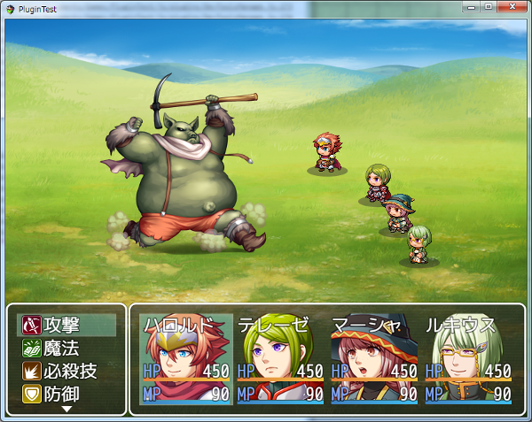
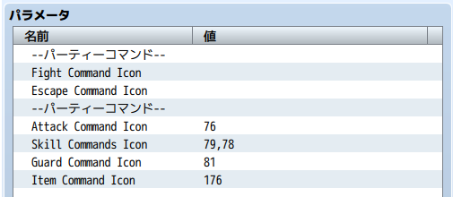

[トップページに戻る](README.md)

# [FTKR_BattleCommandIcon](FTKR_BattleCommandIcon.js) プラグイン

バトルコマンドにアイコンを追加するプラグインです。

ダウンロード: [FTKR_BattleCommandIcon.js](https://raw.githubusercontent.com/futokoro/RPGMaker/master/FTKR_BattleCommandIcon.js)

## 目次

以下の項目の順でプラグインの使い方を説明します。
1. [概要](#概要)
* [プラグインの更新履歴](#プラグインの更新履歴)
* [ライセンス](#ライセンス)

## 概要

本プラグインを実装することで、バトル画面のコマンドにアイコンを追加できます。

プラグインパラメータに、表示させたいアイコンIDを設定してください。
スキルの場合は、スキルタイプID順に、カンマ(,)で区切って設定してください。

[目次に戻る](#目次)

## プラグインの更新履歴

| バージョン | 公開日 | 更新内容 |
| --- | --- | --- |
| [ver1.0.0](FTKR_BattleCommandIcon.js) | 2017/06/24 | 初版作成 |

## ライセンス

本プラグインはMITライセンスのもとで公開しています。

[The MIT License (MIT)](https://opensource.org/licenses/mit-license.php)

#
[目次に戻る](#目次)

[トップページに戻る](README.md)