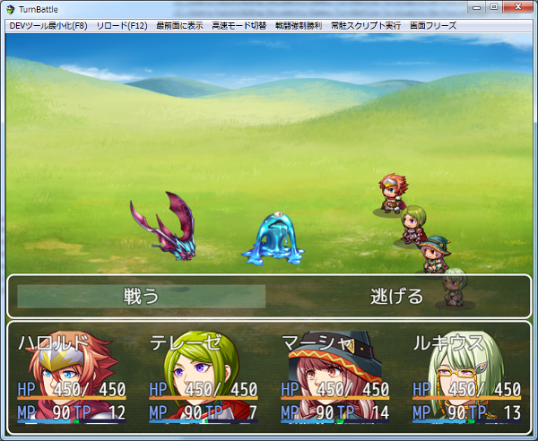
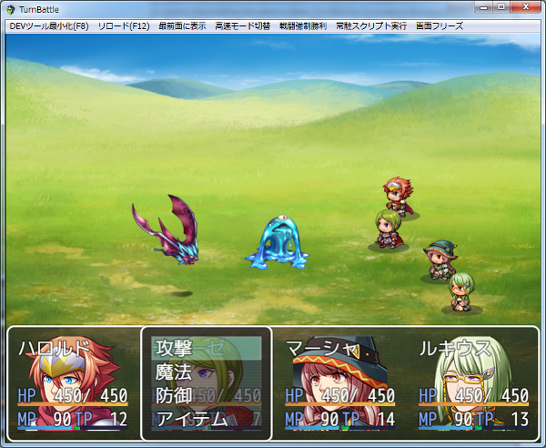
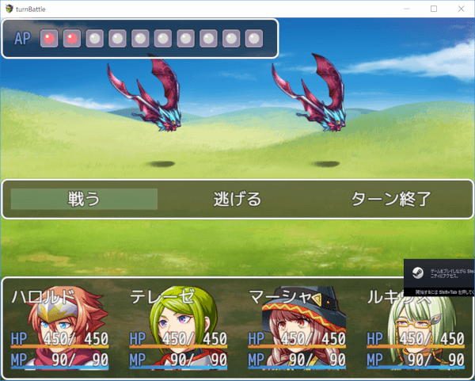
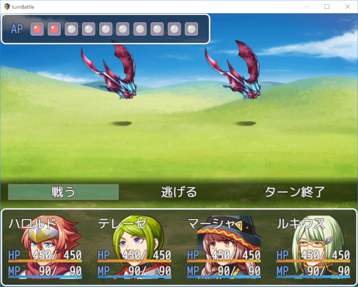
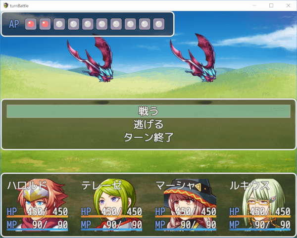
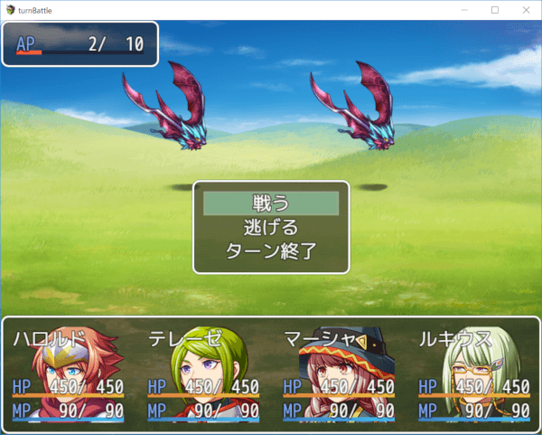
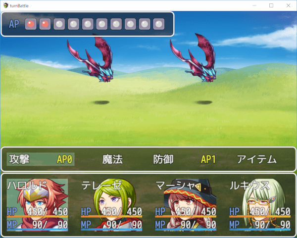
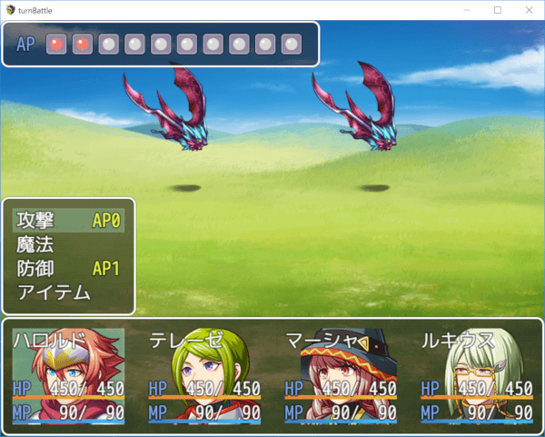
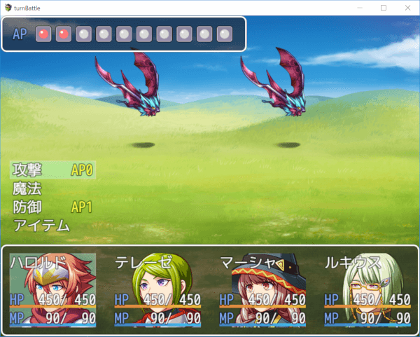
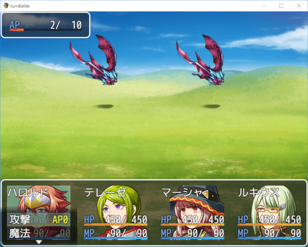

[トップページに戻る](README.md)

# [FTKR_BattleWindowLayout](FTKR_BattleWindowLayout.js) プラグイン

戦闘時のウィンドウ配置を変更するプラグインです。

ダウンロード: [FTKR_BattleWindowLayout.js](https://raw.githubusercontent.com/futokoro/RPGMaker/master/FTKR_BattleWindowLayout.js)

## 目次

以下の項目の順でプラグインの使い方を説明します。
1. [概要](#概要)
1. [プラグインの登録](#プラグインの登録)
1. [パーティーコマンドウィンドウの表示設定](#パーティーコマンドウィンドウの表示設定)
1. [アクターコマンドウィンドウの表示設定](#アクターコマンドウィンドウの表示設定)
* [プラグインの更新履歴](#プラグインの更新履歴)
* [ライセンス](#ライセンス)

## 概要

戦闘時のウィンドウ配置やサイズを変更します。

1. ステータスウィンドウの幅を画面サイズと同じにします。
2. ステータスウィンドウのアクターを横並びに変更します。
3. パーティーコマンドウィンドウをステータスウィンドウの上に表示しコマンドを横並びにします。

ステータスウィンドウの表示内容は、顔画像、名前、ステート、HP、MP、TPです。 
顔画像は、プラグインパラメータで表示のON/OFFを変えられます。 
TPは、「バトル画面でTPを表示」にチェックが入っている場合に表示します。

アクターコマンドウィンドウの表示位置を、ステータスウィンドウの選択中のアクターに重ねます。

[目次に戻る](#目次)

## プラグインの登録

FTKR_AlternatingTurnBattle.jsと組み合わせる場合は、このプラグインが下になるように配置してください。

[目次に戻る](#目次)

## パーティーコマンドウィンドウの表示設定

プラグインパラメータの設定により以下のように表示位置やサイズを変更できます。

### ステータスウィンドウの上に表示
プラグインパラメータ`Party Command PositionY` : 0

### 中央に表示
プラグインパラメータ`Party Command PositionY` : 1

### ウィンドウ背景の変更
パーティーコマンドウィンドウと同様に、背景を「ウィンドウ」「暗くする」「透明」から選択できます。

プラグインパラメータ`Party Command Window` : `background` : 1

### ウィンドウサイズの変更

パーティーコマンドウィンドウと同様に、ウィンドウ幅と高さや、寄せ方を変更できます。

高さを変更すると、１ページに収まるように自動的にコマンドの並びを調整します。

プラグインパラメータ 
`Party Command PositionY` : 1 
`Party Command Window` : `height` : 3

プラグインパラメータ 
`Party Command PositionY` : 1 
`Party Command PositionX` : 1 
`Party Command Window` : `width` : 240 
`Party Command Window` : `height` : 3

[目次に戻る](#目次)

## アクターコマンドウィンドウの表示設定

プラグインパラメータの設定により以下のように表示位置やサイズを変更できます。

### ステータスウィンドウに重ねる
プラグインパラメータ 
`Actor Command Position` : 0

### ステータスウィンドウの上に横に表示
プラグインパラメータ 
`Actor Command Position` : 1

### ステータスウィンドウの上に縦に表示
プラグインパラメータ 
`Actor Command Position` : 2

### ウィンドウ背景の変更

パーティーコマンドウィンドウと同様に、背景を「ウィンドウ」「暗くする」「透明」から選択できます。

プラグインパラメータ 
`Actor Command Position` : 2
 
`Actor Command Window` : `background` : 2

### ウィンドウサイズの変更

パーティーコマンドウィンドウと同様に、ウィンドウ幅と高さや、寄せ方を変更できます。

プラグインパラメータ 
`Actor Command Position` : 0 
`Actor Command PositionY` : 2 
`Actor Command Window` : `height` : 2 
`Actor Command Window` : `background` : 1

[目次に戻る](#目次)

## プラグインの更新履歴

| バージョン | 公開日 | 更新内容 |
| --- | --- | --- |
| [ver1.2.0](FTKR_BattleWindowLayout.js)| 2018/08/19 | パーティーコマンドとアクターコマンドの設定機能を追加 |
| ver1.1.1| 2018/08/17 | FTKR_FVActorAnimationと処理が重複していた部分を修正 |
| ver1.1.0| 2018/04/09 | ステータスウィンドウでアクター同士の表示が重なる場合がある不具合を修正 アクターコマンドウィンドウの表示位置を変更する機能を追加 FTKR_AlternatingTurnBattle.jsの v1.1.0 に対応 |
| ver1.0.0 | 2018/04/08 | 初版作成 |

## ライセンス

本プラグインはMITライセンスのもとで公開しています。

[The MIT License (MIT)](https://opensource.org/licenses/mit-license.php)

#
[目次に戻る](#目次)

[トップページに戻る](README.md)