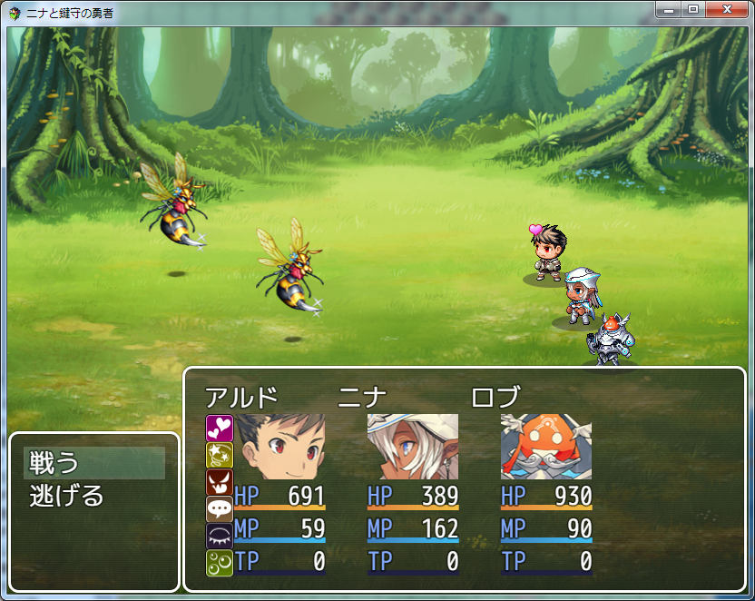
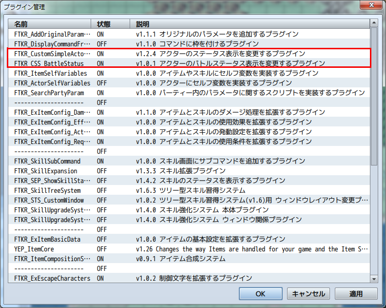
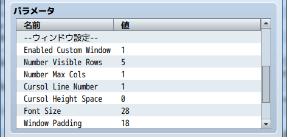
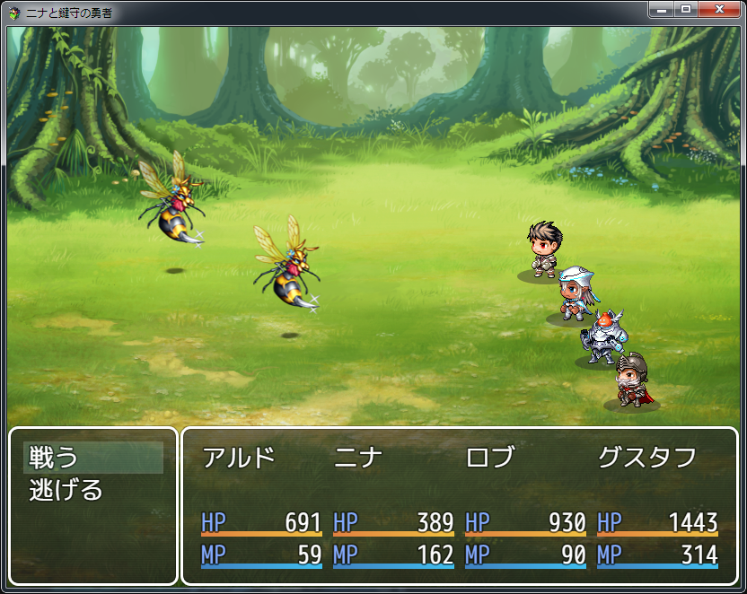
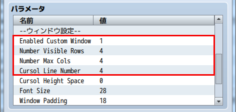
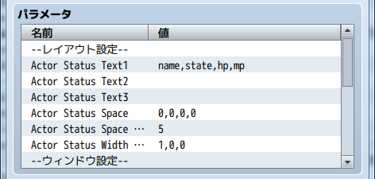
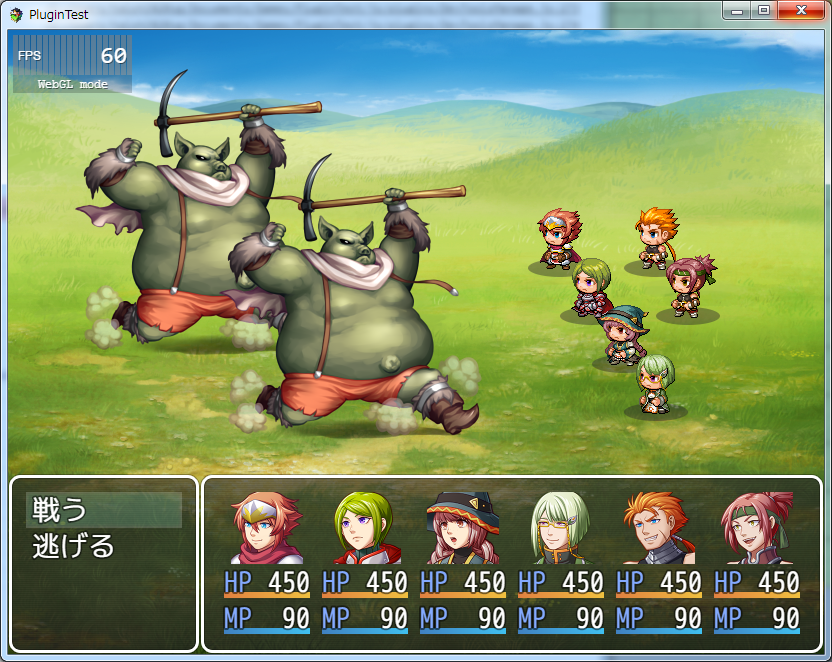
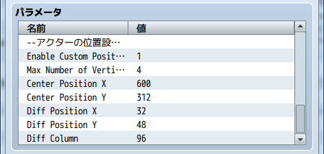

[トップページに戻る](README.md)

# [FTKR_CSS_BattleStatus](FTKR_CSS_BattleStatus.js) プラグイン

アクターのバトル画面のステータス表示を変更するプラグインです。<br>
本プラグインは、[FTKR_CustomSimpleActorStatus](FTKR_CustomSimpleActorStatus.ja.md)の拡張プラグインです。

ダウンロード: [FTKR_CSS_BattleStatus.js](https://raw.githubusercontent.com/futokoro/RPGMaker/master/FTKR_CSS_BattleStatus.js)

## 目次

以下の項目の順でプラグインの使い方を説明します。
1. [概要](#概要)
2. [プラグインの登録](#プラグインの登録)
3. [レイアウト設定](#レイアウト設定)
4. [ウィンドウの設定](#ウィンドウの設定)
    1. [プラグインパラメータの設定](#プラグインパラメータの設定)
    2. [ウィンドウ設定における補足](#ウィンドウ設定における補足)
5. [アクターの表示設定](#アクターの表示設定)
    1. [アクターの縦の表示人数を変える場合](#アクターの縦の表示人数を変える場合)
    1. [アクターを横に並べる場合](#アクターを横に並べる場合)
5. [バトルフィールド上のアクターの初期位置設定](#バトルフィールド上のアクターの初期位置設定)
* [プラグインの更新履歴](#プラグインの更新履歴)
* [拡張プラグイン](#拡張プラグイン)
* [ライセンス](#ライセンス)

## 概要

本プラグインを実装することで、バトル画面で表示するアクターのステータス表示のレイアウトを変更できます。



[目次に戻る](#目次)

## プラグインの登録

本プラグインを使用するためには、[FTKR_CustomSimpleActorStatus](FTKR_CustomSimpleActorStatus.js)の事前登録が必要です。
プラグイン管理画面で、以下の順の配置になるように登録してください。
```
FTKR_CustomSimpleActorStatus.js
FTKR_CSS_BattleStatus.js
```


[目次に戻る](#目次)

## レイアウト設定

本プラグインのステータス画面のレイアウト設定方法は、[FTKR_CustomSimpleActorStatus](FTKR_CustomSimpleActorStatus.js)と同じです。
プラグインパラメータ名も同じものを使用しています。

設定方法については、FTKR_CustomSimpleActorStatusの[マニュアル](#FTKR_CustomSimpleActorStatus.ja.md)を参照してください。

### SVキャラの表示について

バトル画面でSVキャラを表示すると、バトルフィールド上のSVキャラの動作にリンクしてステータスウィンドウ上のSVキャラも動きます。
また、アニメーションやダメージポップアップなどが、ステータスウィンドウ上のSVキャラに表示するようになります。

モーションやアニメーションなど発生させたくない場合は、FTKR_CustomSimpleActorStatusのプラグインパラメータ`Enabled Sv Motion`を 0 - 無効、または 2 - 戦闘時無効 に設定してください。

[目次に戻る](#目次)

## ウィンドウの設定
## プラグインパラメータの設定
以下のプラグインパラメータで設定できます。

### 設定の有効化
`Enabled Custom Window`

バトル画面のステータスウィンドウ変更機能を使うか指定します。
* 0 - 無効(デフォルト)
* 1 - 有効

### 縦の行数
`Number Visible Rows`

ステータスウィンドウの縦の行数を変更します。
デフォルトは4行です。
この値を変えても、コマンドウィンドウのサイズは変わりません。

### アクターを横に並べる数
`Number Max Cols`

ウィンドウ内でアクターを横に並べる数を変更します。
デフォルトは 1 です。

### カーソル高さの行数
`Cursol Line Number`

カーソルの高さを何行分にするか設定します。
デフォルトは 1 です。

### フォントサイズ
`Font Size`

ウィンドウ内のフォントサイズを変更します。
デフォルトは 28 です。(単位はpixel)

### 余白サイズ
`Window Padding`

ウィンドウの周囲の余白を変更します。
デフォルトは 18 です。(単位はpixel)

### 行の高さ
`Window Line Height`

ウィンドウ内の1行の高さを変更します。
デフォルトは 36 です。(単位はpixel)

### 背景の透明度
`Window Opacity`

ウィンドウ内の背景の透明度を変更します。
デフォルトは 192 です。
0 - 透明、255 - 不透明

### ウィンドウ枠の非表示化
`Hide Window Frame`

ウィンドウ枠を非表示にするか指定します。
* 1 - 非表示にする
* 0 - 表示する(デフォルト)

## ウィンドウ設定における補足

### ウィンドウの高さ
ウィンドウの高さは以下の計算で自動的に設定します。
```
[ウィンドウ高さ] ＝ [縦の行数] × [1行の高さ] + [余白のサイズ] × 2
```

### アクターを縦に並べる数
ウィンドウ内でアクターを縦に並べる数は、以下の計算で自動的に設定します。
```
[縦に並べる数] ＝ [縦の行数] ÷ [カーソル高さの行数]
```

### フォントサイズと行の高さ
基本的に、下の大小関係になるように設定しましょう。
```
フォントサイズ ＜ 1行の高さ
```

### ウィンドウを消す方法
以下の設定にすると、ウィンドウ枠とウィンドウの背景が消えて、アクターのステータスだけを表示します。

`Window Opacity`     : 0 <br>
`Hide Window Frame`  : 1

[目次に戻る](#目次)

## アクターの表示設定
## アクターの縦の表示人数を変える場合

下の図のように、アクターの縦の表示人数を変える場合の設定例を説明します。


### ウィンドウの設定変更
縦5人に変える場合のウィンドウの設定箇所を説明します。

#### 設定の有効化をする
`Enabled Custom Window`の設定を 1 に変えてください。

### 縦の行数を変更する
`Number Visible Rows`の設定を変更します。<br>
5人並べるため、設定を5に変更します。(カーソル高さがデフォルトの1の場合)



### レイアウトの設定変更
レイアウトの設定はデフォルトの場合は、変える箇所はありません。

[目次に戻る](#目次)

## アクターを横に並べる場合

下の図のように、アクターを横に並べる場合の設定例を説明します。



### ウィンドウの設定変更
横4人に変える場合のウィンドウの設定箇所を説明します。

#### 設定の有効化をする
`Enabled Custom Window`の設定を 1 に変えてください。

### アクターを横に並べる数を変更する
`Number Max Cols`の設定を変更します。<br>
4人の場合は、4に設定してください。

#### カーソル高さを変更する
`Cursol Line Number`の設定を変更します。<br>
ウィンドウサイズに合わせて 4 に設定してください。



### レイアウトの設定変更
レイアウトの設定を行います。
アクターを横に並べることで、表示幅が狭くなっています。
そのため、描画エリアを1つにまとめると良いでしょう。

#### 描画エリアの設定変更

描画エリア2と3の設定を削除し、描画エリア1にまとめます。
描画エリア1の設定は、以下のとおりになります。
```
name,state,hp,mp
```

#### 空白エリアの設定変更
`Actor Status Space`の設定を変更します。<br>
描画エリア2と3を削除するため、描画エリア1と2、描画エリア2と3の空白設定を 0 に変えます。
```
0,0,0,0
```

#### 描画エリアサイズの設定変更
`Actor Status Width Rate`の設定を変更します。<br>
描画エリア2と3を削除するため、描画エリア2と3の比率を 0 に変えます。
```
1,0,0
```



[目次に戻る](#目次)

## バトルフィールド上のアクターの初期位置設定

バトルフィールド上のアクターの初期位置を図のように変更できます。
バトルメンバーが４人以上の場合にも対応しています。



以下のプラグインパラメータで設定できます。

`<Enable Custom Position>`

アクターの初期位置変更機能を使うか指定します。
* 0 - 無効
* 1 - 有効

`<Max Number of Vertical>`

アクターを縦に何人まで並べるか設定します。
バトルメンバーがこの数以上になった場合、超過分の人数を後列に配置します。

上の図ではデフォルトの4に設定しています。
バトルメンバーが6人なため、超過分の2人を後列に配置しています。

`<Center Position *>`

前列の中心の座標を設定します。

`<Diff Position *>`

2番目以降のアクターの位置を先頭のアクターからどの程度ずらすか設定します。

`<Diff Column>`

横方向の列の間隔(前列に対して後列をどの程度ずらすか)を設定します。



[目次に戻る](#目次)

## プラグインの更新履歴

| バージョン | 公開日 | 更新内容 |
| --- | --- | --- |
| [ver2.0.0](FTKR_CSS_BattleStatus.js) | 2018/08/19 | FTKR_CustomSimpleActorStatus.js の v3.0.0に対応 |
| [ver1.3.0](/archive/FTKR_CSS_BattleStatus_1.3.0.js) | 2017/11/18 | FTKR_CustomSimpleActorStatus.js の v2.6.0に対応 |
| ver1.2.1 | 2017/06/11 | バトルに参加する最大人数を設定する機能を追加 |
| ver1.2.0 | 2017/05/31 | バトルフィールド上のSVキャラの初期位置変更機能拡張 |
| ver1.1.2 | 2017/05/11 | バトルフィールド上のSVキャラの初期位置変更機能追加 |
| ver1.1.1 | 2017/05/06 | 縦のカーソル間隔を設定する機能を追加 |
| ver1.1.0 | 2017/04/21 | FTKR_CustomSimpleActorStatus.jsのv1.4.0に対応<br>ウィンドウのレイアウト変更のON/OFF機能を追加 |
| [ver1.0.1](/archive/FTKR_CSS_BattleStatus.1.0.1_js) | 2017/04/12 | ウィンドウの余白と1行の高さ、透明度、枠の表示を変更する機能を追加 |
| ver1.0.0 | 2017/04/11 | 初版作成 |

## 拡張プラグイン

以下のプラグインを使用することで、本プラグインの機能を拡張できます。

* [FTKR_ExSvMotion.js](FTKR_ExSvMotion.ja.md) - ステート付加時のモーションを追加・変更できます。
* [FTKR_FTKR_FacialImageDifference.js](FTKR_FTKR_FacialImageDifference.ja.md) - 表示する顔画像をアクターの状態で変更できます。

## ライセンス

本プラグインはMITライセンスのもとで公開しています。

[The MIT License (MIT)](https://opensource.org/licenses/mit-license.php)

#
[目次に戻る](#目次)

[トップページに戻る](README.md)