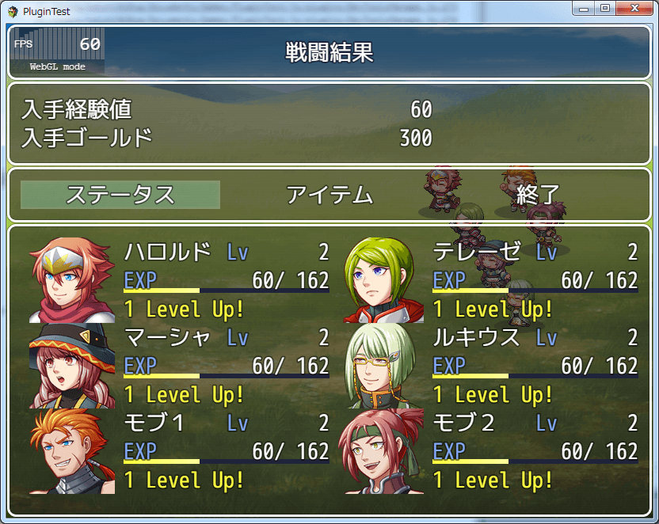
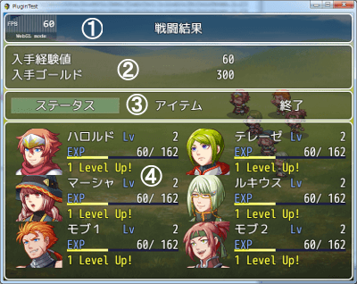
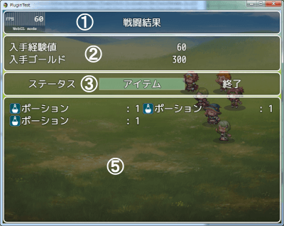
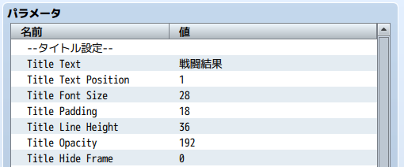
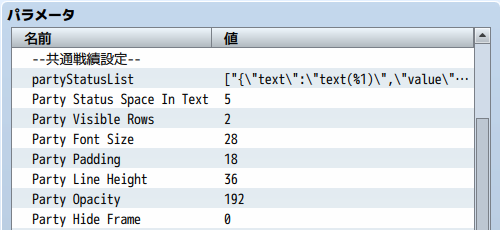
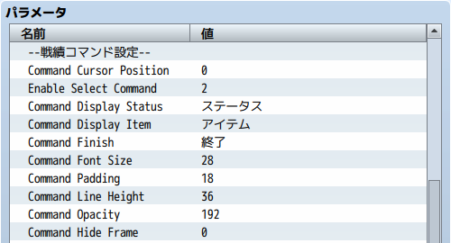
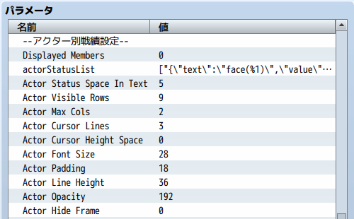
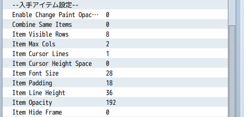

[トップページに戻る](README.md)

# [FTKR_CSS_CustomizeBattleResults](FTKR_CSS_CustomizeBattleResults.js) プラグイン

カスタム可能な戦績画面を表示するプラグインです。<br>
本プラグインは、[FTKR_CustomSimpleActorStatus](FTKR_CustomSimpleActorStatus.ja.md)の拡張プラグインです。

ダウンロード: [FTKR_CSS_CustomizeBattleResults.js](https://raw.githubusercontent.com/futokoro/RPGMaker/master/FTKR_CSS_CustomizeBattleResults.js)

## 目次

以下の項目の順でプラグインの使い方を説明します。
1. [概要](#概要)
2. [プラグインの登録](#プラグインの登録)
3. [基本仕様](#基本仕様)
4. [タイトルウィンドウの設定](#タイトルウィンドウの設定)
1. [共通戦績ウィンドウの設定](#共通戦績ウィンドウの設定)
1. [コマンドウィンドウの設定](#コマンドウィンドウの設定)
1. [アクター別戦績ウィンドウの設定](#アクター別戦績ウィンドウの設定)
1. [アイテムウィンドウの設定](#アイテムウィンドウの設定)
1. [共通設定](#共通設定)
1. [プラグインコマンド](#プラグインコマンド)
* [プラグインの更新履歴](#プラグインの更新履歴)
* [ライセンス](#ライセンス)

## 概要

本プラグインを実装することで、戦闘終了時に表示する戦闘結果メッセージの替わりに、カスタム可能な戦績画面を表示できます。



[目次に戻る](#目次)

## プラグインの登録

本プラグインを使用するためには、[FTKR_CustomSimpleActorStatus](FTKR_CustomSimpleActorStatus.js)の事前登録が必要です。
プラグイン管理画面で、以下の順の配置になるように登録してください。
```
FTKR_CustomSimpleActorStatus.js
FTKR_CSS_CustomizeBattleResults.js
```

[目次に戻る](#目次)

## 基本仕様

戦績画面は、以下ウィンドウで構成しています。
戦績画面中は、キー操作でアクター別戦績ウィンドウとアイテムウィンドウの表示を入れ替えることができます。

1. タイトルウィンドウ
2. 共通戦績ウィンドウ
3. コマンドウィンドウ
4. アクター別戦績ウィンドウ
5. アイテムウィンドウ

### コマンドウィンドウで、「ステータス」を選択中の画面
パーティーメンバーの一覧を表示します。



### コマンドウィンドウで、「アイテム」を選択中の画面
入手アイテムの一覧を表示します。



### コマンドウィンドウで、「終了」を選択

戦績画面を閉じて、バトルを終了します。

[目次に戻る](#目次)

## タイトルウィンドウの設定

以下のプラグインパラメータで、タイトルウィンドウで表示する内容を設定します。

### 表示する文字列
`Title Text`

ウィンドウに表示する文字列を設定します。
制御文字が使用できます。

### 文字列を表示する位置
`Title Text Position`

設定した文字列をウィンドウのどの位置の表示するか設定します。
* 0 - 左寄せ
* 1 - 中央 (デフォルト)
* 2 - 右寄せ

その他のプラグインパラメータは、[共通設定](#共通設定)を参照してください。



[目次に戻る](#目次)

## 共通戦績ウィンドウの設定

以下のプラグインパラメータで、タイトルウィンドウで表示する内容を設定します。

### 表示するステータス

`Party Status Text1` から `Party Status Width Rate`の設定方法は、[FTKR_CustomSimpleActorStatus](FTKR_CustomSimpleActorStatus.ja.md)と同じです。

なお、各コードで参照するアクターデータは、バトルメンバーの先頭キャラです。
以下のスクリプトで、戦績データを取得できます。

| データ | スクリプト |
| --- | --- |
| 入手経験値 | BattleManager._rewards.exp |
| 入手金 | BattleManager._rewards.gold |
| 入手アイテムリスト(配列) | BattleManager._rewards.items |
| 戦闘終了時のターン数 | $gameTroop._turnCount |


その他のプラグインパラメータは、[共通設定](#共通設定)を参照してください。



[目次に戻る](#目次)

## コマンドウィンドウの設定

以下のプラグインパラメータで、タイトルウィンドウで表示する内容を設定します。

### コマンド名

`Command Display Status`

アクター別戦績ウィンドウを表示するコマンドの名前を設定します。

`Command Display Item`

アイテムウィンドウを表示するコマンドの名前を設定します。

`Command Finish`

戦績画面を終了するコマンドの名前を設定します。

その他のプラグインパラメータは、[共通設定](#共通設定)を参照してください。



[目次に戻る](#目次)

## アクター別戦績ウィンドウの設定

以下のプラグインパラメータで、タイトルウィンドウで表示する内容を設定します。

### 表示するパーティーメンバー
`Displayed Members`の設定により、戦績ウィンドウに表示するメンバーを変更できます。

* 0:バトルメンバー
* 1:全パーティーメンバー(控え含む)

#### JS上級者向け
パラメータ入力で「テキスト」を選択し、入力欄にスクリプトを記述することで、任意の対象を表示させることもできます。
ただし、スクリプトは必ず配列データを入力してください。

### 表示するステータス
`Actor Status Text1` から `Actor Status Width Rate`の設定方法は、[FTKR_CustomSimpleActorStatus](FTKR_CustomSimpleActorStatus.ja.md)と同じです。

### 追加コード
当プラグインでは以下のコードをプラグインパラメータ`Actor Status Text*`に使用できます。

コード：`message2`

デフォルトで設定している`message`コードから変更することで、レベルアップ時のスキル習得のメッセージを表示させることができます。

ただし、表示行数が２行に変わるため、使用する場合はプラグインパラメータ`Actor Cursor Lines`の設定の見直しが必要です。


その他のプラグインパラメータは、[共通設定](#共通設定)を参照してください。



[目次に戻る](#目次)

## アイテムウィンドウの設定

### 入手アイテムを纏めて表示
`Combine Same Items`

同じアイテムの場合に、纏めて表示するかどうか設定できます。
* 0 - 纏めない(デフォルト)
* 1 - 纏めて表示

その他のプラグインパラメータは、[共通設定](#共通設定)を参照してください。



## 共通設定

各ウィンドウに共通するプラグインパラメータの設定を示します。

### 縦の行数
`*** Visible Rows`

ウィンドウの縦の行数を変更します。

### 横の列数
`*** Max Cols`

ウィンドウの横の列数を変更します。

### カーソル高さの行数
`*** Cursol Lines`

カーソルの高さ(アクター1人分の高さ)を何行分にするか設定します。

### 縦のカーソル間隔
`*** Cursol Height Space`

縦のカーソル間隔を設定します。
デフォルトは 0 です。(単位はpixel)

### フォントサイズ
`*** Font Size`

ウィンドウ内のフォントサイズを変更します。
デフォルトは 28 です。(単位はpixel)

### 余白サイズ
`*** Padding`

ウィンドウの周囲の余白を変更します。
デフォルトは 18 です。(単位はpixel)

### 行の高さ
`*** Line Height`

ウィンドウ内の1行の高さを変更します。
デフォルトは 36 です。(単位はpixel)

### 背景の透明度
`*** Opacity`

ウィンドウ内の背景の透明度を変更します。
デフォルトは 192 です。
0 - 透明、255 - 不透明

### ウィンドウ枠の非表示化
`*** Hide Frame`

ウィンドウ枠を非表示にするか指定します。
* 1 - 非表示にする
* 0 - 表示する(デフォルト)

## ウィンドウ設定における補足

### ウィンドウの高さ
ウィンドウの高さは以下の計算で自動的に設定します。
```
[ウィンドウ高さ] ＝ [縦の行数] × [1行の高さ] + [余白のサイズ] × 2
```

### フォントサイズと行の高さ
基本的に、下の大小関係になるように設定しましょう。
```
フォントサイズ ＜ 1行の高さ
```

### ウィンドウを消す方法
以下の設定にすると、ウィンドウ枠とウィンドウの背景が消えて、アクターのステータスだけを表示します。

`Window Opacity`     : 0 <br>
`Hide Window Frame`  : 1

[目次に戻る](#目次)

## プラグインコマンド

以下のプラグインコマンドを使用できます。

### 戦績画面の表示
```
CBR_戦績画面表示
CBR_SHOW_BATTLE_RESULT
```
戦績画面を表示します。
[FTKR_ExBattleEvent](FTKR_ExBattleEvent.ja.md)を使って戦闘終了時のイベントで実行する場合は、「戦闘報酬の入手コマンド」の前で実行してください。

```
CBR_戦績画面終了待ち
CBR_SHOW_BATTLE_RESULT
```
戦績画面が終了するまでイベントの処理を止めます。
[FTKR_ExBattleEvent](FTKR_ExBattleEvent.ja.md)を使って戦闘終了時のイベントで実行する場合は、「戦闘報酬の入手コマンド」の後で実行してください。


[目次に戻る](#目次)

## プラグインの更新履歴

| バージョン | 公開日 | 更新内容 |
| --- | --- | --- |
| [ver2.0.0](FTKR_CSS_CustomizeBattleResults.js) | 2018/08/19 | FTKR_CustomSimpleActorStatus.js の v3.0.0に対応 |
| [ver1.5.0](/archive/FTKR_CSS_CustomizeBattleResults_1.5.0.js) | 2018/08/04 | バトルメンバー以外も画面に表示する機能を追加 |
| ver1.4.3 | 2018/01/12 | FTKR_ExBattleEventと組み合わせたときに、戦闘終了時イベント中に正しく戦績画面の処理が実行できない不具合を修正<br>経験値のゲージが上昇している間に戦績画面を閉じると、ゲージが止まった時点までの経験値しか入手していなかった不具合を修正。<br>戦績画面で終了コマンドを実行するまで、戦闘終了時イベントの処理を止めるプラグインコマンドを追加。 |
| ver1.4.2 | 2017/11/26 | アクターコマンドとアイテムコマンドを選択できないようにする機能を変更し、白表示のまま選択できないようにする機能を追加 |
| ver1.4.1 | 2017/11/26 | アクターコマンドとアイテムコマンドを選択できないようにする機能を追加 |
| ver1.4.0 | 2017/11/20 | アイテムを入手しなかった場合に、アイテムコマンドをグレー表示にして選択できないようにする機能を追加 |
| ver1.3.1 | 2017/11/18 | GraphicalDesignMode.jsのレイアウト変更が一部反映されない不具合を修正 |
| ver1.3.0 | 2017/11/08 | GraphicalDesignMode.jsとFTKR_CSS_GDM.jsにより、デザインモード中にゲーム内でレイアウトを変更する機能を追加 |
| ver1.2.0 | 2017/08/22 | レベルアップ時のスキル習得状態を表示するメッセージコードを追加 |
| ver1.1.0 | 2017/07/13 | 同じアイテムの場合に纏めて表示する機能を追加 |
| ver1.0.2 | 2017/06/23 | 入手経験値が29以下の場合に、アクターが経験値を入手できない不具合を修正<br>戦績画面タイトルの文字列の表示位置を修正<br>プラグインパラメータに@typeを適用 |
| ver1.0.1 | 2017/06/08 | 不要なプラグインパラメータを削除 |
| ver1.0.0 | 2017/06/07 | 初版作成 |

## 拡張プラグイン

以下のプラグインを使用することで、本プラグインの機能を拡張できます。

* [FTKR_ExBattleEvent](FTKR_ExBattleEvent.ja.md) - 戦闘終了時にコモンイベントを実行できます

## ライセンス

本プラグインはMITライセンスのもとで公開しています。

[The MIT License (MIT)](https://opensource.org/licenses/mit-license.php)

#
[目次に戻る](#目次)

[トップページに戻る](README.md)