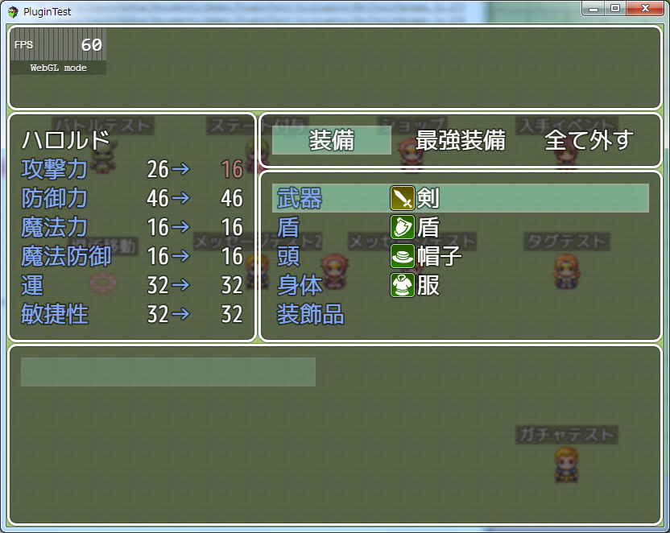

[トップページに戻る](README.md)

# [FTKR_CSS_EquipStatus](FTKR_CSS_EquipStatus.js) プラグイン

アクターの装備画面のステータス表示を変更するプラグインです。<br>
本プラグインは、[FTKR_CustomSimpleActorStatus](FTKR_CustomSimpleActorStatus.ja.md)の拡張プラグインです。

ダウンロード: [FTKR_CSS_EquipStatus.js](https://raw.githubusercontent.com/futokoro/RPGMaker/master/FTKR_CSS_EquipStatus.js)

## 目次

以下の項目の順でプラグインの使い方を説明します。
1. [概要](#概要)
2. [プラグインの登録](#プラグインの登録)
3. [レイアウト設定](#レイアウト設定)
4. [ウィンドウの設定](#ウィンドウの設定)
    1. [プラグインパラメータの設定](#プラグインパラメータの設定)
    2. [ウィンドウ設定における補足](#ウィンドウ設定における補足)
* [プラグインの更新履歴](#プラグインの更新履歴)
* [ライセンス](#ライセンス)

## 概要

本プラグインを実装することで、装備画面で表示するアクターのステータス表示のレイアウトを変更できます。



[目次に戻る](#目次)

## プラグインの登録

本プラグインを使用するためには、[FTKR_CustomSimpleActorStatus](FTKR_CustomSimpleActorStatus.js)の事前登録が必要です。
プラグイン管理画面で、以下の順の配置になるように登録してください。
```
FTKR_CustomSimpleActorStatus.js
FTKR_CSS_EquipStatus.js
```

[目次に戻る](#目次)

## レイアウト設定

本プラグインのステータス画面のレイアウト設定方法は、[FTKR_CustomSimpleActorStatus](FTKR_CustomSimpleActorStatus.js)と同じです。
プラグインパラメータ名も同じものを使用しています。

設定方法については、FTKR_CustomSimpleActorStatusの[マニュアル](#FTKR_CustomSimpleActorStatus.ja.md)を参照してください。

[目次に戻る](#目次)

## ウィンドウの設定
## プラグインパラメータの設定
以下のプラグインパラメータで設定できます。

### 設定の有効化
`Enabled Custom Window`

装備画面のステータスウィンドウ変更機能を使うか指定します。
* 0 - 無効(デフォルト)
* 1 - 有効

### 縦の行数
`Number Visible Rows`

ステータスウィンドウの縦の行数を変更します。
デフォルトは7行です。

### フォントサイズ
`Font Size`

ウィンドウ内のフォントサイズを変更します。
デフォルトは 28 です。(単位はpixel)

### 余白サイズ
`Window Padding`

ウィンドウの周囲の余白を変更します。
デフォルトは 18 です。(単位はpixel)

### 行の高さ
`Window Line Height`

ウィンドウ内の1行の高さを変更します。
デフォルトは 36 です。(単位はpixel)

### 背景の透明度
`Window Opacity`

ウィンドウ内の背景の透明度を変更します。
デフォルトは 192 です。
0 - 透明、255 - 不透明

### ウィンドウ枠の非表示化
`Hide Window Frame`

ウィンドウ枠を非表示にするか指定します。
* 1 - 非表示にする
* 0 - 表示する(デフォルト)

## ウィンドウ設定における補足

### ウィンドウの高さ
ウィンドウの高さは以下の計算で自動的に設定します。
```
[ウィンドウ高さ] ＝ [縦の行数] × [1行の高さ] + [余白のサイズ] × 2
```

### フォントサイズと行の高さ
基本的に、下の大小関係になるように設定しましょう。
```
フォントサイズ ＜ 1行の高さ
```

### ウィンドウを消す方法
以下の設定にすると、ウィンドウ枠とウィンドウの背景が消えて、アクターのステータスだけを表示します。

`Window Opacity`     : 0 <br>
`Hide Window Frame`  : 1

[目次に戻る](#目次)

## プラグインの更新履歴

| バージョン | 公開日 | 更新内容 |
| --- | --- | --- |
| [ver2.1.4](FTKR_CSS_EquipStatus.js) | 2018/12/13 | プラグインパラメータ初期値変更 |
| ver2.1.3 | 2018/10/10 | 装備シーンのステータスウィンドウ上で選択中の装備のパラメータを参照できる機能追加 |
| ver2.1.2 | 2018/09/29 | プラグインパラメータのリストで選択できる項目を追加 |
| ver2.1.1 | 2018/09/12 | プラグインパラメータ Number Visible Rows が反映されない不具合を修正 |
| ver2.1.0 | 2018/08/30 | FTKR_CustomSimpleActorStatus.js の v3.1.0に対応 |
| ver2.0.0 | 2018/08/19 | FTKR_CustomSimpleActorStatus.js の v3.0.0に対応 |
| [ver1.1.0](/archive/FTKR_CSS_EquipStatus‗1.1.0.js) | 2017/11/18 | FTKR_CustomSimpleActorStatus.js の v2.6.0に対応 |
| ver1.0.2 | 2017/07/23 | ウィンドウの設定が反映されない不具合を修正 |
| ver1.0.1 | 2017/05/17 | 選択中の武器または防具を装備した時のパラメータを参照する機能を追加 |
| ver1.0.0 | 2017/05/13 | 初版作成 |

## ライセンス

本プラグインはMITライセンスのもとで公開しています。

[The MIT License (MIT)](https://opensource.org/licenses/mit-license.php)

#
[目次に戻る](#目次)

[トップページに戻る](README.md)