[トップページに戻る](README.md)

# [FTKR_CSS_MenuStatus](FTKR_CSS_MenuStatus.js) プラグイン

アクターのメニュー画面のステータス表示を変更するプラグインです。<br>
本プラグインは、[FTKR_CustomSimpleActorStatus](FTKR_CustomSimpleActorStatus.ja.md)の拡張プラグインです。

ダウンロード: [FTKR_CSS_MenuStatus.js](https://raw.githubusercontent.com/futokoro/RPGMaker/master/FTKR_CSS_MenuStatus.js)

## 目次

以下の項目の順でプラグインの使い方を説明します。
1. [概要](#概要)
2. [プラグインの登録](#プラグインの登録)
3. [レイアウト設定](#レイアウト設定)
4. [ウィンドウの設定](#ウィンドウの設定)
    1. [プラグインパラメータの設定](#プラグインパラメータの設定)
    2. [ウィンドウ設定における補足](#ウィンドウ設定における補足)
5. [アクターの表示例](#アクターの表示例)
    1. [アクターの縦の表示人数を変える場合](#アクターの縦の表示人数を変える場合)
    1. [アクターを横に並べる場合](#アクターを横に並べる場合)
    1. [顔画像に別のステータスを重ねて表示](#顔画像に別のステータスを重ねて表示)
    1. [カスタム画像を使った表示](#カスタム画像を使った表示)
* [プラグインの更新履歴](#プラグインの更新履歴)
* [ライセンス](#ライセンス)

## 概要

本プラグインを実装することで、メニュー画面で表示するアクターのステータス表示のレイアウトを変更できます。

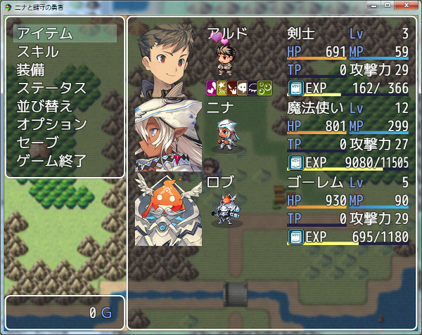

[目次に戻る](#目次)

## プラグインの登録

本プラグインを使用するためには、[FTKR_CustomSimpleActorStatus](FTKR_CustomSimpleActorStatus.js)の事前登録が必要です。
プラグイン管理画面で、以下の順の配置になるように登録してください。
```
FTKR_CustomSimpleActorStatus.js
FTKR_CSS_MenuStatus.js
```

[目次に戻る](#目次)

## レイアウト設定

本プラグインのステータス画面のレイアウト設定方法は、[FTKR_CustomSimpleActorStatus](FTKR_CustomSimpleActorStatus.js)と同じです。
プラグインパラメータ名も同じものを使用しています。

設定方法については、FTKR_CustomSimpleActorStatusの[マニュアル](#FTKR_CustomSimpleActorStatus.ja.md)を参照してください。

[目次に戻る](#目次)

## ウィンドウの設定
## プラグインパラメータの設定
以下のプラグインパラメータで設定できます。

### 設定の有効化
`Enabled Custom Window`

メニュー画面のステータスウィンドウ変更機能を使うか指定します。
* 0 - 無効(デフォルト)
* 1 - 有効

### アクターを横に並べる数
`Number Max Cols`

アクターを横に並べる数を変更します。
デフォルトは 1 です。

### カーソル高さの行数
`Cursor Line Number`

ステータスウィンドウのカーソル高さの行数を変更します。
デフォルトは4行です。

### 縦のカーソル間隔
`Cursor Height Space`

ステータスウィンドウの縦のカーソル間隔を変更します。
デフォルトは 0 です。

### フォントサイズ
`Font Size`

ウィンドウ内のフォントサイズを変更します。
デフォルトは 28 です。(単位はpixel)

### 余白サイズ
`Window Padding`

ウィンドウの周囲の余白を変更します。
デフォルトは 18 です。(単位はpixel)

### 行の高さ
`Window Line Height`

ウィンドウ内の1行の高さを変更します。
デフォルトは 36 です。(単位はpixel)

### 背景の透明度
`Window Opacity`

ウィンドウ内の背景の透明度を変更します。
デフォルトは 192 です。
0 - 透明、255 - 不透明

### ウィンドウ枠の非表示化
`Hide Window Frame`

ウィンドウ枠を非表示にするか指定します。
* 1 - 非表示にする
* 0 - 表示する(デフォルト)

## ウィンドウ設定における補足

### ウィンドウの高さ
ウィンドウの高さは以下の計算で自動的に設定します。
```
[ウィンドウ高さ] ＝ [縦の行数] × [1行の高さ] + [余白のサイズ] × 2
```

### フォントサイズと行の高さ
基本的に、下の大小関係になるように設定しましょう。
```
フォントサイズ ＜ 1行の高さ
```

### ウィンドウを消す方法
以下の設定にすると、ウィンドウ枠とウィンドウの背景が消えて、アクターのステータスだけを表示します。

`Window Opacity`     : 0 <br>
`Hide Window Frame`  : 1

[目次に戻る](#目次)

# アクターの表示例

デフォルトの設定では、メニュー画面でアクターを縦に4人まで並べて表示できます。
当プラグインの設定を変えることで、この表示人数やアクターの並べ方を変えることができます。

## アクターの縦の表示人数を変える場合

下の図のように、アクターの縦の表示人数を5人に変える場合の設定例を説明します。


### ウィンドウの設定変更
縦5人に変える場合のウィンドウの設定箇所を説明します。

#### 設定の有効化をする
`Enabled Custom Window`の設定を 1 に変えてください。

#### カーソル高さを変更する
`Cursol Line Number`の設定を変更します。<br>
ウィンドウは16行(デフォルトの場合)あるため、アクター5人を並べる場合は 1人分は3行までになります。

### 縦のカーソル間隔を調整する
`Cursol Height Space`の設定を変更します。<br>
アクターの画像同士にスペースを空けたい場合は変更してください。
上記カーソル高さ変更により1行分(デフォルトの場合は36pixel)空欄が開くため、アクター5人を並べる場合は 8pixel まで間隔をあけることが出来ます。

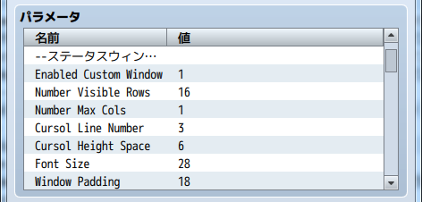

### レイアウトの設定変更
レイアウトの設定を行います。
ウィンドウ設定によりアクター1人分は 3行 までしか使用出来ません。
そのため、4行使用していた箇所を修正する必要があります。

#### 顔画像の設定変更
コード`face`は 4行分使用するため、3行に収めるためにはコード`face(3)`に変えてください。

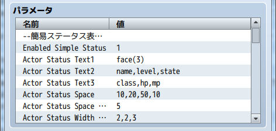

[目次に戻る](#目次)

## アクターを横に並べる場合

下の図のように、アクターを横に並べる場合の設定例を説明します。

下の図では、各ウィンドウのレイアウト変更に公式プラグインの`AltMenuScreen.js`を使用しています。
レイアウト変更のプラグインと組み合わせる場合、以下の順番のように本プラグインを下にして登録してください。
```
AltMenuScreen.js
FTKR_CustomSimpleActorStatus.js
```

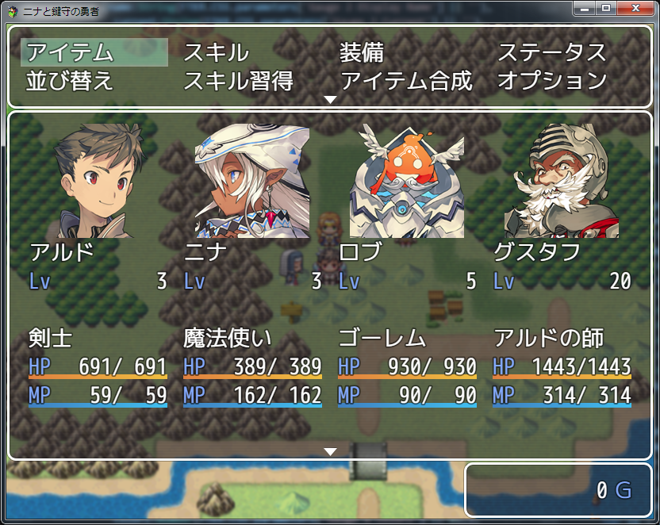

### ウィンドウの設定変更
横4人に変える場合のウィンドウの設定箇所を説明します。

#### 設定の有効化をする
`Enabled Custom Window`の設定を 1 に変えてください。

### アクターを横に並べる数を変更する
`Number Max Cols`の設定を変更します。<br>
デフォルトの4人の場合は、4に設定してください。

#### カーソル高さを変更する
`Cursol Line Number`の設定を変更します。<br>
ウィンドウサイズに合わせて 11 に設定してください。

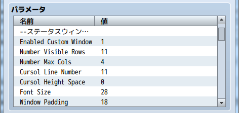

### レイアウトの設定変更
レイアウトの設定を行います。
アクターを横に並べることで、表示幅が狭くなっています。
そのため、描画エリアを1つにまとめると良いでしょう。

#### 描画エリアの設定変更

描画エリア2と3の設定を削除し、描画エリア1にまとめます。
描画エリア1の設定は、以下のとおりになります。

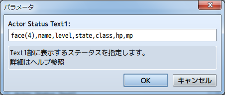

## 空白エリアの設定変更
`Actor Status Space`の設定を変更します。<br>
描画エリア2と3を削除するため、描画エリア1と2、描画エリア2と3の空白設定を 0 に変えます。
```
10,0,0,10
```

#### 描画エリアサイズの設定変更
`Actor Status Width Rate`の設定を変更します。<br>
描画エリア2と3を削除するため、描画エリア2と3の比率を 0 に変えます。
```
1,0,0
```

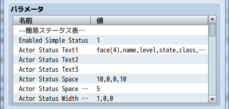

[目次に戻る](#目次)

## 顔画像に別のステータスを重ねて表示
顔画像と重ねてステータスを表示する設定例を示します。
下の図のように、アクターを横に並べることで表示エリアが狭くなった場合などに使えます。

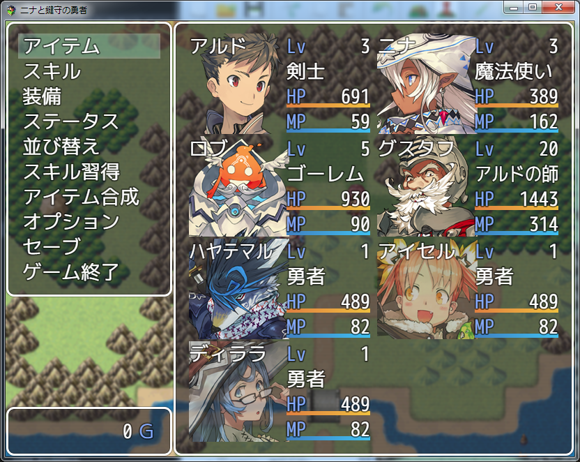

### レイアウトの設定

重ねて表示させるためのポイントは、以下の3点です。
* `Actor Status Width Rate`で描画エリア(1)の比率を 0 にする
* 描画エリア(1)の`face`に波括弧を使い描画エリアを拡張する
* `Face Position X`の設定を左寄せに変更する

この設定により、描画エリア(1)と描画エリア(2)を重ねて表示できます。


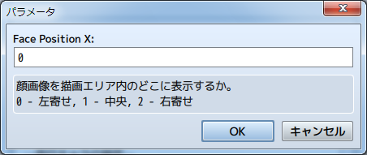

### ウィンドウの設定

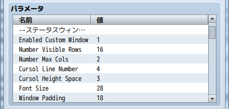

[目次に戻る](#目次)

## カスタム画像を使った表示
立ち絵のような高さがあるカスタム画像を使った場合の設定例を示します。

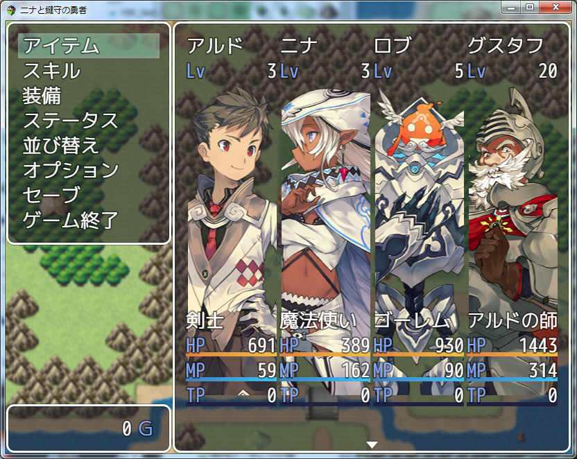

### レイアウトの設定

立ち絵は`image`で表示します。<br>
画像にステータスを重ねて表示させる方法を使います。横幅が狭いため、描画エリアは(2)だけ使用します。

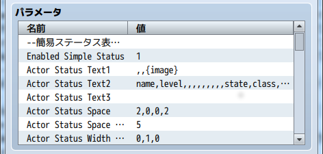

### ウィンドウの設定

アクターを横に並べる場合の設定に合わせて、パラメータを調整します。

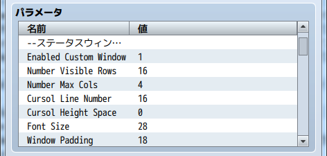

### アクターの設定

`image`で表示する画像をアクター毎に設定します。

一人分の表示エリア幅は以下の計算で求めます。
```
(画面サイズ - コマンドウィンドウの幅 - ステータスウィンドウの余白 * 2) / 横に表示する人数 
```
デフォルトの画面サイズ(816pixel)で、コマンドウィンドウの幅がデフォルト(240pixel)の場合、一人分の表示エリア幅は 135pixel です。

表示エリアの両端の空白エリアを 計4pixel 確保しているため、画像を表示可能なエリア幅は 131pixel となります。

図の例では、余白を考慮して`BGI WIDTH`を 127 に設定しました。
その他のパラメータは、画像内の立ち絵の位置や立ち絵の構造によって調整してください。

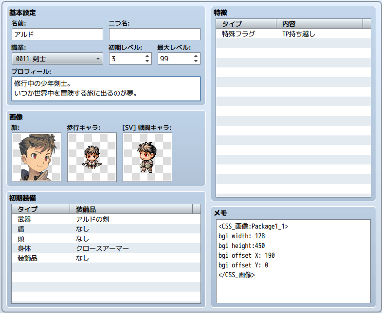

[目次に戻る](#目次)

## プラグインの更新履歴

| バージョン | 公開日 | 更新内容 |
| --- | --- | --- |
| [ver2.1.2](FTKR_CSS_MenuStatus.js) | 2018/12/13 | プラグインパラメータ初期値変更 |
| ver2.1.1 | 2018/09/12 | 不要なプラグインパラメータ を削除 |
| ver2.1.0 | 2018/08/30 | FTKR_CustomSimpleActorStatus.js の v3.1.0に対応 |
| ver2.0.0 | 2018/08/19 | FTKR_CustomSimpleActorStatus.js の v3.0.0に対応 |
| [ver1.1.0](/archive/FTKR_CSS_MenuStatus_1.1.0.js) | 2017/11/18 | FTKR_CustomSimpleActorStatus.js の v2.6.0に対応 |
| ver1.0.0 | 2017/06/18 | 初版作成 |

## ライセンス

本プラグインはMITライセンスのもとで公開しています。

[The MIT License (MIT)](https://opensource.org/licenses/mit-license.php)

#
[目次に戻る](#目次)

[トップページに戻る](README.md)