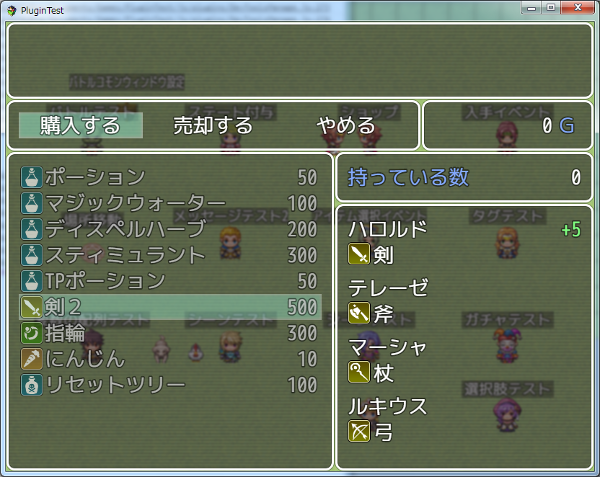
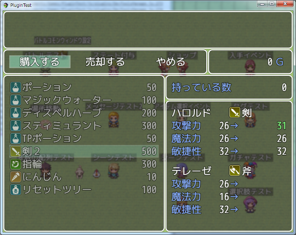

[トップページに戻る](README.md)

# [FTKR_CSS_ShopStatus](FTKR_CSS_ShopStatus.js) プラグイン

アクターのショップ画面のステータス表示を変更するプラグインです。<br>
本プラグインは、[FTKR_CustomSimpleActorStatus](FTKR_CustomSimpleActorStatus.ja.md)の拡張プラグインです。

ダウンロード: [FTKR_CSS_ShopStatus.js](https://raw.githubusercontent.com/futokoro/RPGMaker/master/FTKR_CSS_ShopStatus.js)

## 目次

以下の項目の順でプラグインの使い方を説明します。
1. [概要](#概要)
2. [プラグインの登録](#プラグインの登録)
3. [レイアウト設定](#レイアウト設定)
3. [CSS表示コードの追加](#CSS表示コードの追加)
4. [ウィンドウの設定](#ウィンドウの設定)
    1. [プラグインパラメータの設定](#プラグインパラメータの設定)
    2. [ウィンドウ設定における補足](#ウィンドウ設定における補足)
* [プラグインの更新履歴](#プラグインの更新履歴)
* [ライセンス](#ライセンス)

## 概要

本プラグインを実装することで、ショップ画面で表示するアクターのステータス表示のレイアウトを変更できます。





[目次に戻る](#目次)

## プラグインの登録

本プラグインを使用するためには、[FTKR_CustomSimpleActorStatus](FTKR_CustomSimpleActorStatus.js)の事前登録が必要です。
プラグイン管理画面で、以下の順の配置になるように登録してください。
```
FTKR_CustomSimpleActorStatus.js
FTKR_CSS_ShopStatus.js
```

[目次に戻る](#目次)

## レイアウト設定

本プラグインのステータス画面のレイアウト設定方法は、[FTKR_CustomSimpleActorStatus](FTKR_CustomSimpleActorStatus.js)と同じです。
プラグインパラメータ名も同じものを使用しています。

設定方法については、FTKR_CustomSimpleActorStatusの[マニュアル](#FTKR_CustomSimpleActorStatus.ja.md)を参照してください。

ステータスの表示内容は、武器、防具、アイテムカテゴリー毎に設定します。
共通レイアウトはどのカテゴリーでも共通して表示するステータスです。

## CSS表示コードの追加
本プラグインにより以下の表示コードを使用できます。

### カーソルで選択中の装備をしたときのパラメータ差分
`ediff(x)`

指定した x の値に従い、下記のパラメータの差分を表示します。
* 0 - 最大HP
* 1 - 最大MP
* 2 - 攻撃力
* 3 - 防御力
* 4 - 魔法攻撃
* 5 - 魔法防御
* 6 - 敏捷性
* 7 - 運

### カーソルで選択中の装備をしたときのAOPパラメータ差分
`ediffaop(x)`

指定した x の値に従い、AOPパラメータの差分を表示します。
AOPパラメータとは、`FTKR_AddOriginalParameters.js`により作成したオリジナルパラメータのことです。

x はオリジナルパラメータIDを指定してください。

### カーソルで選択中のアイテムの画像を表示
`itemimage(x)`

アイテムのメモ欄で設定した画像id x を表示します。
画像を登録した順番に x = 0,1,2,... と指定します。

設定方法は、FTKR_CustomSimpleActorStatus.jsのカスタム画像コードを参照してください。

[目次に戻る](#目次)

## ウィンドウの設定
## プラグインパラメータの設定
以下のプラグインパラメータで設定できます。

### 設定の有効化
`Enabled Custom Window`

ショップ画面のステータスウィンドウ変更機能を使うか指定します。
* 0 - 無効(デフォルト)
* 1 - 有効

### 縦の行数
`Number Visible Rows`

ステータスウィンドウの縦の行数を変更します。
共通ウィンドウのデフォルトは1行です。
アイテム別ウィンドウのデフォルトは8行です。

### アクターを表示する数
`Item Page Size`

アクターを表示する数を変更します。
デフォルトは 4 です。

パーティーメンバーがこの数よりも多い場合は、別のページで表示します。
ページの切り替えは、Shiftキーで行います。

### アクター毎の縦の行数
`Item Actor Status Rows`

ステータスウィンドウのアクター毎の縦の行数を変更します。
デフォルトは2行です。

### アクター毎の間隔
`Item Height Space`

ステータスウィンドウのアクター毎の間隔を変更します。
デフォルトは 5 です。(単位はpixel)

### フォントサイズ
`Font Size`

ウィンドウ内のフォントサイズを変更します。
デフォルトは 28 です。(単位はpixel)

### 余白サイズ
`Window Padding`

ウィンドウの周囲の余白を変更します。
デフォルトは 18 です。(単位はpixel)

### 行の高さ
`Window Line Height`

ウィンドウ内の1行の高さを変更します。
デフォルトは 36 です。(単位はpixel)

### 背景の透明度
`Window Opacity`

ウィンドウ内の背景の透明度を変更します。
デフォルトは 192 です。
0 - 透明、255 - 不透明

### ウィンドウ枠の非表示化
`Hide Window Frame`

ウィンドウ枠を非表示にするか指定します。
* 1 - 非表示にする
* 0 - 表示する(デフォルト)

## ウィンドウ設定における補足

### ウィンドウの高さ
ウィンドウの高さは以下の計算で自動的に設定します。
```
[ウィンドウ高さ] ＝ [縦の行数] × [1行の高さ] + [余白のサイズ] × 2
```

### フォントサイズと行の高さ
基本的に、下の大小関係になるように設定しましょう。
```
フォントサイズ ＜ 1行の高さ
```

### ウィンドウを消す方法
以下の設定にすると、ウィンドウ枠とウィンドウの背景が消えて、アクターのステータスだけを表示します。

`Window Opacity`   0 <br>
`Hide Window Frame`  : 1

[目次に戻る](#目次)

## プラグインの更新履歴

| バージョン | 公開日 | 更新内容 |
| --- | --- | --- |
| [ver2.0.0](FTKR_CSS_ShopStatus.js) | 2018/08/19 | FTKR_CustomSimpleActorStatus.js の v3.0.0に対応 |
| [ver1.2.2](/archive/FTKR_CSS_ShopStatus_1.2.2.js) | 2017/12/02 | GraphicalDesignMode.jsがないとエラーで立ち上がらない不具合を修正 |
| ver1.2.1 | 2017/11/18 | GraphicalDesignMode.jsのレイアウト変更が一部反映されない不具合を修正 |
| ver1.2.0 | 2017/11/08 | GraphicalDesignMode.jsとFTKR_CSS_GDM.jsにより、デザインモード中にゲーム内でレイアウトを変更する機能を追加 |
| ver1.1.2 | 2017/11/01 | 装備のパラメータが正しく表示できない場合がある不具合を修正 |
| ver1.1.1 | 2017/8/23 | ディプロイメントの「未使用ファイルを含まない」に対応 |
| ver1.1.0 | 2017/8/22 | カーソル選択中のアイテムの画像を表示するコードを追加 |
| ver1.0.0 | 2017/07/23 | 初版作成 |

## ライセンス

本プラグインはMITライセンスのもとで公開しています。

[The MIT License (MIT)](https://opensource.org/licenses/mit-license.php)

#
[目次に戻る](#目次)

[トップページに戻る](README.md)