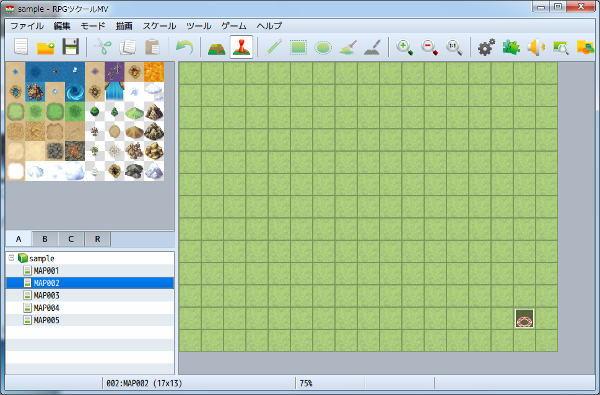
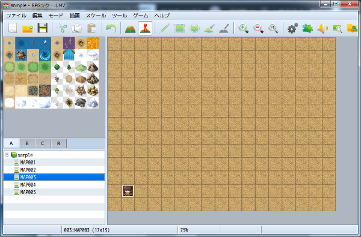
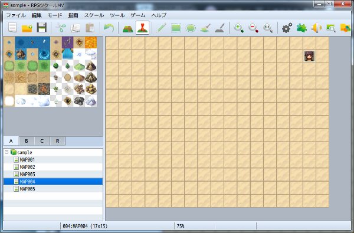
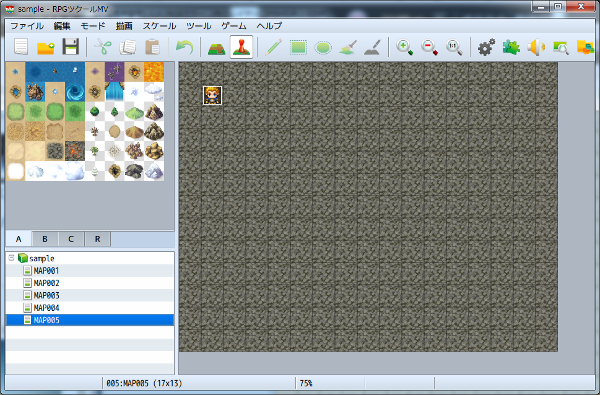
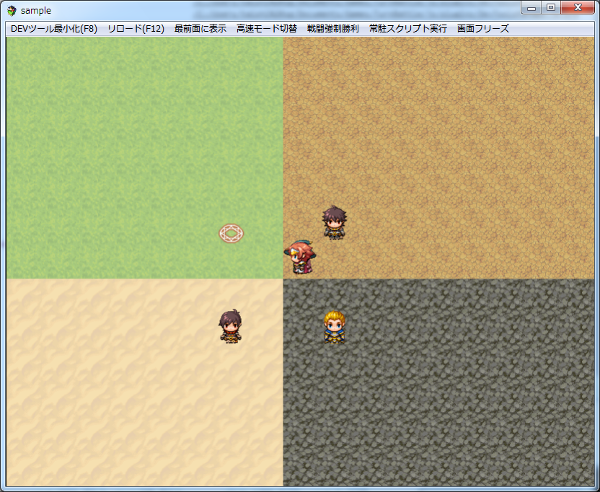

[トップページに戻る](README.md)

# [FTKR_ConnectingMapGenerator](FTKR_ConnectingMapGenerator.js) プラグイン

複数のマップを繋げて１つの大きなマップにするプラグインです。

ダウンロード: [FTKR_ConnectingMapGenerator.js](https://raw.githubusercontent.com/futokoro/RPGMaker/master/FTKR_ConnectingMapGenerator.js)

## 目次

以下の項目の順でプラグインの使い方を説明します。
1. [概要](#概要)
2. [マップを連結する方法](#マップを連結する方法)
2. [連結マップから場所移動する場合](#連結マップから場所移動する場合)
2. [マップを連結させるための条件](#マップを連結させるための条件)
2. [連結後のマップ設定](#連結後のマップ設定)
* [プラグインの更新履歴](#プラグインの更新履歴)
* [ライセンス](#ライセンス)

## 概要

複数のマップを繋げて１つの大きなマップとして表示することができます。

連結後のマップでは、各マップに設定したイベントも個々に実行することができます。
ただし、イベントのIDは、連結後のマップでは変わるため注意が必要です。

### 連結前の各マップ









### 連結後のマップ



[目次に戻る](#目次)

## プラグインの登録

このプラグインは、プラグイン管理画面で、一番下になるように登録してください。

[目次に戻る](#目次)

## マップを連結する方法

## 連結させるマップの数の設定

まず、縦横に何枚のマップを連結させてマップを生成するか設定します。

設定方法は以下の２通りです。
* プラグインパラメータで縦横の枚数の初期値を設定。
* 以下のプラグインコマンドを実施し、場所移動ごとに設定。

### プラグインコマンド
※[]は実際の入力に使用しません

```
CMG_連結マップサイズ [横のマップ数] [縦のマップ数]
CMG_CONNECTING_MAP_SIZE [cols] [lines]
```

#### 横のマップ数(cols)
横に連結させるマップの数を変更します。
\v[n] と指定することで変数 n の値を参照できます。

#### 縦のマップ数(lines)
縦に連結させるマップの数を変更します。
\v[n] と指定することで変数 n の値を参照できます。

## 連結させるマップIDの設定

場所移動コマンド実行前に、以下のプラグインコマンドを実行します。<br>
なお、この時に、同じマップIDを複数回入力することが可能です。<br>
※[]は実際の入力に使用しません

```
CMG_マップ連結 [マップ1] [マップ2] [マップ3] [マップ4] ...
CMG_CONNECTING_MAP [map1] [map2] [map3] [map4] ...
```

#### マップ1(map1)
連結後にマップの左上に配置されるマップのIDを指定します。
連結後のマップ設定は、マップ1の設定を引き継ぎます。
\v[n] と指定することで変数 n の値を参照できます。

#### マップ*(map*)
連結させるマップの数だけ、マップIDを指定します。
縦横2*2の場合は マップ4 まで、縦横3*3の場合は マップ9 まで入力します。
\v[n] と指定することで変数 n の値を参照できます。

入力例)2*2のマップを連結させる場合の入力
```
CMG_マップ連結 2 3 4 5
CMG_CONNECTING_MAP 2 3 4 5
```

入力例) 変数を使って2*1のマップを連結させる場合の入力
```
CMG_マップ連結 \v[1] \v[2]
CMG_CONNECTING_MAP \v[1] \v[2]
```
変数ID1の中の値をマップ１として、変数ID2の中の値をマップ2として連結します。


### 行ごとに分割して設定
行ごとに分割して設定することもできます。
4*4などのサイズ数が大きくなると、データベース上で見づらくなるためこちらを利用すると良いです。

```
CMG_マップ連結 分割 [分割ID] マップ [マップ1] [マップ2] [マップ3] [マップ4] ...
CMG_CONNECTING_MAP SPLIT [splitId] MAP [map1] [map2] [map3] [map4] ...
```
#### 分割ID(splitId)
0 から、連結させるマップの行数 - 1 までの値を指定します。
すべての行で設定が必要です。

#### マップ*(map*)
連結させるマップの列数だけ、マップIDを指定します。
縦横2*2の場合は マップ2 まで、縦横3*3の場合は マップ3 まで入力します。
\v[n] と指定することで変数 n の値を参照できます。
\R[n] と指定することで、ランダムパーツID n に設定した複数のマップIDから
一つランダムで選ばれその値を設定します。


分割データを設定した後に、生成を行います。
```
CMG_マップ連結 生成
CMG_CONNECTING_MAP MAKE
```

入力例) 2*2のマップを連結させる場合の入力
```
CMG_マップ連結 分割 0 マップ 2 3
CMG_マップ連結 分割 1 マップ 4 5
CMG_マップ連結 生成
```
```
CMG_CONNECTING_MAP SPLIT 0 MAP 2 3
CMG_CONNECTING_MAP SPLIT 1 MAP 4 5
CMG_CONNECTING_MAP MAKE
 ```

 ### 連結した時のマップの配置

連結した時のマップの配置は、マップ1を左上に、そこから右にマップ2、マップ3、...と配置します。
横のマップ数上限に達した場合、１段下に下がり、マップを連結し画面右下が一番最後のマップになります。

簡単なマップ配置イメージ

#### 1*2の場合
```
1
2
```
#### 2*2の場合
```
1 2
3 4
```
#### 3*2の場合
```
1 2 3
4 5 6
```

#### 3*3の場合
```
1 2 3
4 5 6
7 8 9
```

## 連結したマップへの場所移動

連結マップのサイズと、連結させるマップIDを設定したら場所移動イベントを実行してください。

場所移動時のマップIDと座標の設定は、連結させるマップのいずれかを選べば連結後のその位置に移動します。

なお、同じマップIDを複数回連結させている場合は、一番最初に配置した場所のマップ上に移動します。

[目次に戻る](#目次)

## 連結マップから場所移動する場合

場所移動する場合は、必ず以下のコマンドを実行してください。

```
CMG_マップ連結解除
CMG_CLEAR_CONNECTING_MAP
```

[目次に戻る](#目次)

## マップを連結させるための条件

連結させるマップ同士は幅や高さを合わせる必要があります。

例えば、2*2のマップを連結させる場合、
1. マップ1 と マップ2 の 高さ は同じにしてください。
2. マップ1 と マップ3 の 幅 は同じにしてください。
3. マップ2 と マップ4 の 幅 を同じにしてください。
4. マップ3 と マップ4 の 高さ を同じにしてください。

また、タイルセットはすべてのマップで同じものを使用しなくてはいけません。

[目次に戻る](#目次)

## 連結後のマップ設定

連結後のマップ設定(*1)は、"マップ1"に使用したマップの設定を引き継ぎます。

(*1)引き継ぐマップ設定
* スクロールタイプ
* マップタイル
* 敵出現歩数
* BGM自動演奏
* BGS自動演奏
* 戦闘背景設定
* ダッシュ禁止設定
* 遠景設定
* メモの内容

例えば、以下のコマンドで連結した場合
```
CMG_マップ連結 2 3 4 5
```
連結後のマップ設定は、マップID2と同じです。

以下の設定については連結連結前後で変わるため注意が必要です。

* エンカウント
* イベントID

[目次に戻る](#目次)

### 連結後のマップのエンカウント

連結後のマップのエンカウントは、それぞれのマップで設定したエンカウントの設定を合成したものになります。

例えば、連結前のマップで
* マップ1の全域に敵グループID1
* マップ2の全域に敵グループID2

を設定していた場合は、連結後は
* 連結マップ全域に敵グループID1と敵グループID2

がエンカウントするようになります。


また、リージョンによるエンカウント設定の場合も、同様で例えば、連結前のマップで
* マップ1のリージョン1に敵グループID1
* マップ2のリージョン1に敵グループID2
* マップ3のリージョン2に敵グループID3

を設定していた場合は、連結後は
* 連結マップのリージョン1に敵グループID1と敵グループID2
* 連結マップのリージョン2に敵グループID3

がエンカウントするようになります。

これは、連結前のマップ1でリージョン2に設定していたエリアにも連結後は、敵グループID3が出現するようになる、ということです。

[目次に戻る](#目次)

### 連結後のマップのイベントID

連結後のマップのイベントIDは、以下のスクリプトで取得できます。

```
$gameMap.cmgEventId(mapId, eventId)
```
* mapId: そのイベントを作成したマップのID(データベース上のマップです)
* eventIdそのイベントを作成したマップ上のイベントID

入力例)
```
$gameMap.cmgEventId(2, 3)
```

ただし、そのイベント内であれば、this._eventId で自分のIDを取得できます。
これは、連結後も変わりません。

[目次に戻る](#目次)

### ランダムパーツIDについて

連結マップの設定時に\R[n]と指定することで、ランダムパーツID n に設定した複数のマップIDから一つランダムで選ばれその値を設定します。

ランダムパーツIDの設定方法は、以下のプラグインコマンドを実行することで設定できます。
```
CMG_ランダムパーツセット [パーツID] マップ [マップID] [マップID] [マップID] ...
CMG_SET_RANDOM_PARTS [partsId] MAP [mapId] [mapId] [mapId] ...
```

#### パーツID(partsId)
0 以上の任意の値を指定します。
連結マップのマップIDを設定するときに\R[n]で指定する番号に相当します。

#### マップID(mapId)
このセットで選ばれるマップのIDを設定します。
設定可能な数に制限はありません。
\v[n] と指定することで変数 n の値を参照できます。

[目次に戻る](#目次)

## プラグインの更新履歴

| バージョン | 公開日 | 更新内容 |
| --- | --- | --- |
| [ver1.2.0](FTKR_ConnectingMapGenerator.js) | 2018/04/28 | 場所移動先によって、アクターが表示されずゲームが動かなくなる不具合を修正<br>結マップが正しく生成できない場合がある不具合を修正<br>連結マップの行ごとに分割して設定する機能を追加<br>ランダムに複数のマップIDから一つを設定する機能を追加 |
| ver1.1.1 | 2018/04/22 | ヘルプ修正<br>プラグインコマンドに変数を使用できることを追記 |
| ver1.1.0 | 2018/04/22 | 連結する縦横のマップの数を設定する機能を追加。4つ以上のマップを連結可能<br>マップ数の設定機能に合わせて、連結するマップIDを設定するプラグインコマンドの仕様を変更 |
| ver1.0.0 | 2018/04/22 | 初版公開 |

## ライセンス

本プラグインはMITライセンスのもとで公開しています。

[The MIT License (MIT)](https://opensource.org/licenses/mit-license.php)

#
[目次に戻る](#目次)

[トップページに戻る](README.md)