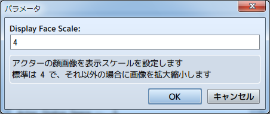
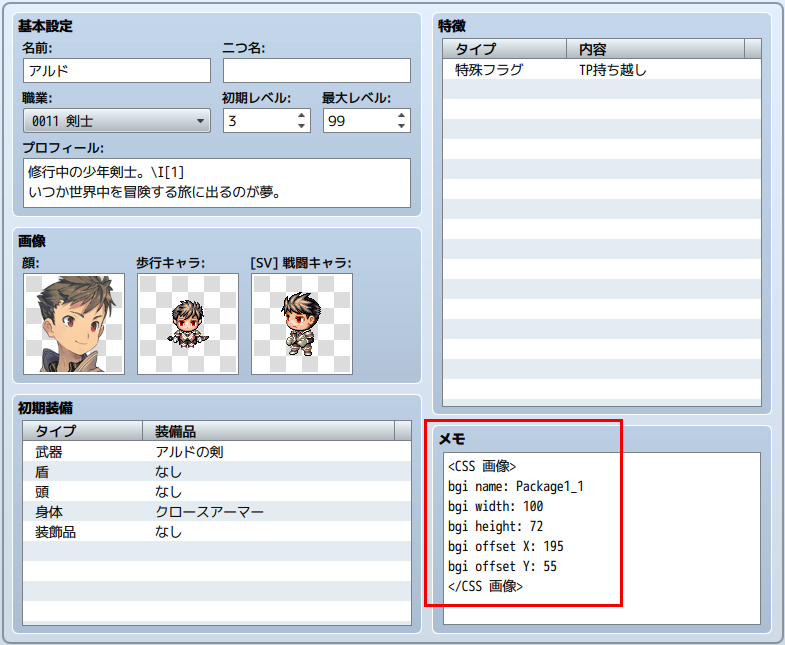

[トップページに戻る](README.ja.md)

# [FTKR_CustomSimpleActorStatus](FTKR_CustomSimpleActorStatus.js) プラグイン

アクターのステータス表示を変更するプラグインです。

ダウンロード: [FTKR_CustomSimpleActorStatus.js](https://raw.githubusercontent.com/futokoro/RPGMaker/master/FTKR_CustomSimpleActorStatus.js)

## 目次

以下の項目の順でプラグインの使い方を説明します。
1. [概要](#概要)
2. [基本設定](#基本設定)
    1. [レイアウトの基本構成](#レイアウトの基本構成)
    2. [表示できるステータス](#表示できるステータス)
3. [簡易ステータス画面の設定](#簡易ステータス画面の設定)
    1. [設定の有効化](#設定の有効化)
    2. [描画エリアサイズの設定](#描画エリアサイズの設定)
    3. [描画エリアの設定](#描画エリアの設定)
    4. [空白エリアの設定](#空白エリアの設定)
    5. [顔画像サイズの設定](#顔画像サイズの設定)
4. [詳細ステータス画面の設定](#詳細ステータス画面の設定)
    1. [設定の有効化](#詳細ステータス設定の有効化)
    2. [表示エリアサイズの設定](#表示エリアサイズの設定)
    3. [表示エリア間のラインの設定](#表示エリア間のラインの設定)
    4. [表示エリアの設定](#表示エリアの設定)
    5. [顔画像サイズの設定](#詳細ステータスの顔画像サイズの設定)
5. [ステータスの表示](#ステータスの表示)
    1. [歩行キャラ画像の表示](#歩行キャラ画像の表示)
    2. [SV戦闘キャラ画像の表示](#SV戦闘キャラ画像の表示)
    3. [ステートアイコンの表示](#ステートアイコンの表示)
    4. [カスタムパラメータの表示](#カスタムパラメータの表示)
    5. [カスタムゲージの表示](#カスタムゲージの表示)
    6. [カスタム画像の表示](#カスタム画像の表示)
* [プラグインの更新履歴](#プラグインの更新履歴)
* [拡張プラグイン](#拡張プラグイン)
* [ライセンス](#ライセンス)

## 概要

本プラグインを実装することで、メニューや、スキル画面で表示するアクターのステータス表示のレイアウトを変更できます。


[目次に戻る](#目次)

## 基本設定
## レイアウトの基本構成

### 表示エリア

本プラグインでは、以下の図の赤枠で囲まれた (１)～(７) のレイアウト構成を基本の単位にしています。 (１)～(７) を合わせて表示エリアとします。


### 描画エリア
表示エリアの中で、各ステータスを表示するエリアを描画エリアとします。<br>
上の図の(1) ～ (3)の３つのエリアが該当します。<br>
それぞれの個別に幅を指定し、表示するステータスも個別に設定します。

### 空白エリア
表示エリアの中で、空白分として何も表示しないエリアを空白エリアとします。<br>
上の図の(4) ～ (7)の４つのエリアが該当します。<br>
それぞれの個別に幅を指定します。

[目次に戻る](#目次)

## 表示できるステータス

各描画エリアに表示することができるステータスは以下の通りです。

コードは、描画エリア設定用のプラグインパラメータに入力する文字列です。
大文字小文字の区別はありません。

制御文字の○×は、表示できる内容に制御文字が使用できるかどうかを表しています。使用できる場合が○です。

| ステータス名 | コード | 制御文字 |説明 |
| ----------- | ----- | ---- | ---- |
| 名前 | name | × | アクターの名前を表示します
| 二つ名 | nickname | × | アクターの二つ名を表示します |
| 職業 | class | × | アクターの職業を表示します |
| レベル | level | × | アクターの現在レベルを表示します |
| ＨＰ | hp | × | アクターの現在HPと最大HPとHPゲージを表示します |
| ＭＰ | mp | × | アクターの現在MPと最大MPとMPゲージを表示します |
| ＴＰ | tp | × | アクターの現在TPとTPゲージを表示します |
| 顔画像 | face | × | アクターの顔画像を表示します |
| [歩行キャラ画像](#歩行キャラ画像の表示) | chara | × | アクターの歩行キャラ画像(正面)を表示します |
| [SV戦闘キャラ画像](#SV戦闘キャラ画像の表示) | sv | × | アクターのSVの戦闘キャラ画像を表示します |
| [ステートアイコン](#ステートアイコンの表示) | state <br> state2(x) | × | アクターに付与されているステートのアイコンを並べて表示します |
| プロフィール | profile | ○ | アクターのプロフィールを表示します <br> プロフィールは自動的に描画エリアを拡張して表示します |
| 通常能力値 | param(x) | × | 攻撃力や防御力等の通常能力名と数値を表示します <br> x に指定する数値と表示する能力は以下の通りです <br> 0 - 最大HP、1 - 最大MP、2 - 攻撃力、3 - 防御力 <br> 4 - 魔法攻撃、5 - 魔法防御、6 - 敏捷性、7 - 運|
| 装備 | equip(x) | × | 装備の名前とアイコンを表示します <br> x が装備タイプ番号を示します |
| [カスタムパラメータ](#カスタムパラメータの表示) | custom(x) | ○ | プラグインパラメータで設定したパラメータを表示します |
| [カスタムゲージ](#カスタムゲージの表示) | gauge(x) | ○ | プラグインパラメータで設定したゲージを表示します |
| [カスタム画像](#カスタム画像の表示) | image | × | アクターのメモ欄で設定した画像を表示します |
| テキスト | text(x) | ○ | 文字列 x を表示します |

[目次に戻る](#目次)

## 簡易ステータス画面の設定

メニュー画面およびスキル画面の簡易ステータスの表示内容を設定します。

## 設定の有効化
プラグインパラメータ`Enabled Simple Status`が 1 であることを確認してください。<br>
（デフォルトで設定済み）

この状態の時に、メニュー画面およびスキル画面の簡易ステータスの表示内容に対して、本プラグインの設定を反映します。


## 描画エリアサイズの設定

描画エリアのサイズは、プラグインパラメータ`Actor Status Width Rate`で設定します。３つの描画エリアの幅の**比率**を、カンマ(,)で区切って入力してください。

下の図の設定の場合は、表示エリアに対して描画エリア(1)~(3)を 2 : 2 : 3 の比率で分けます。
例えば表示エリアの幅が 350pixel だった場合、各描画エリアの幅は以下になります。(空白エリアのサイズが 0 だった場合)
* 描画エリア(1)の幅 - 100pixel
* 描画エリア(2)の幅 - 100pixel
* 描画エリア(3)の幅 - 150pixel


[目次に戻る](#目次)

## 描画エリアの設定
### 描画エリアの表示方法

プラグインパラメータ`Actor Status Text*`に設定した[コード](#表示できるステータス)の内容を、各[描画エリア](#描画エリア)に表示します。
* `Actor Status Text1` - 描画エリア(1)の内容
* `Actor Status Text2` - 描画エリア(2)の内容
* `Actor Status Text3` - 描画エリア(3)の内容


### ステータスの表示方式

プラグインパラメータに[コード](#表示できるステータス)を入力すると、描画エリア内にステータスを表示します。
```
name
```
長いアクターの名前など描画エリアの幅よりもテキスト幅が長いステータスの場合でも、横に圧縮して描画エリア内に表示させます。


### カンマを使った入力
カンマ(,)で区切って入力したコードは、描画エリア内の次(下)の行に表示します。
```
class,hp,mp
```
複数のカンマで区切ることで縦に何行でも表示できますが、表示エリアを越えても表示できてしまうため、描画させるステータスの行数は表示エリアの高さ内に収めるようにしましょう。


カンマ(,)を続けて2個入力すると、1行空欄ができます。
```
name,,level
```


### 波括弧を使った入力
コードを波括弧( { } )で囲むと、そのステータスを右側の描画エリアも使用して表示します。
長い名前などをフォントサイズを変えずに表示させたい場合に使用できます。
```
{name},level
```
ただし、右側の描画エリアと表示が重なりますので、右側の描画エリアは 1行空けるように設定しましょう。
```
,,class,hp,mp
```


### 角括弧を使った入力
複数のコードを角括弧('[' ']')で囲み、スラッシュ(/)で区切ると、描画エリア内の同じ行に横に並べて表示します。
角括弧内の片側を空欄にした場合は、描画エリアも片側が非表示になります。
```
class,[hp/mp],[tp/]
```


横に並べる際の表示間隔は、プラグインパラメータ`Actor Status Space In Text`の設定値(pixel単位)に従います。


[目次に戻る](#目次)

## 空白エリアの設定
空白エリアのサイズは、プラグインパラメータ`Actor Status Space`で設定します。４つの空白エリアの幅(pixel単位)を、カンマ(,)で区切って入力してください。

下の図の設定の場合は、各[空白エリア](#空白エリア)の幅は以下になります。
* 空白エリア(4)の幅 - 10pixel
* 空白エリア(5)の幅 - 20pixel
* 空白エリア(6)の幅 - 50pixel
* 空白エリア(7)の幅 - 10pixel


なお、描画エリアのサイズは、表示エリアの幅から空白エリアの全幅を引いた値を元に、プラグインパラメータ`Actor Status Width Rate`の比率で分けます。
空白エリアを取りすぎると、描画エリアが小さくなりすぎてしまうので注意してください。

[目次に戻る](#目次)

## 顔画像サイズの設定

コード`face`で表示する顔画像を何行分で表示するか設定します。

コード`face`で表示する顔画像は、MVデフォルトでは 144*144 のサイズです。
1行は 36pixel に設定されているため、当倍サイズで表示するために必要な行数は 4 行です。

プラグインパラメータ`Display Face Scale`の設定値を変えると、顔画像を圧縮拡大して、設定した行数に収まるように画像を変形します。



下の画像は、設定値を 3 に変更したものです。顔画像が3行に収まるので、その下にTPゲージなど、ステータスを追加できます。


顔画像は、描画エリアの幅を超えて表示できません。
設定を 5 にした場合、描画に必要な幅は 180pixelになりますが、描画エリアの幅がこの値以下の場合は、描画エリアの幅までしか拡大できません。
プラグインパラメータ`Actor Status Width Rate`の設定も合わせて調整してください。

[目次に戻る](#目次)

## 詳細ステータス画面の設定

本プラグインは、ステータス画面の表示内容も変更することができます。

## 詳細ステータス設定の有効化

プラグインパラメータ`Enabled Detailed Status`を 1 に設定してください。デフォルトでは無効設定です。

この状態の時に、ステータス画面の表示内容に対して、本プラグインの設定を反映します。


[目次に戻る](#目次)

## 表示エリアサイズの設定

### ステータス画面の表示エリア

ステータス画面は、下の図の(1)～(4)の4つの表示エリアで構成しています。
各表示エリア内の構成は、[レイアウトの基本構成](#レイアウトの基本構成)と同じです。


### 表示エリアサイズの設定

表示エリアのサイズ(行数)は、プラグインパラメータ`DS Lines Number`で設定します。４つの表示エリアの行数を、カンマ(,)で区切って入力してください。

下の図の設定の場合は、表示エリアの行数は以下になります。
* 表示エリア(1)の高さ - 1 行
* 表示エリア(2)の高さ - 4 行
* 表示エリア(3)の高さ - 6 行
* 表示エリア(4)の高さ - 2 行

なお、デフォルトの画面サイズの場合、表示可能な行数は最大で16行です。
ラインも1本 1行と数えます。


[目次に戻る](#目次)

## 表示エリア間のラインの設定

表示エリア間のラインの色、太さ、透明度を設定できます。


以下のプラグインパラメータで設定します。

`DS Horz Line Color`

ラインの色番号を指定します。<br>
-1 を入力した場合は非表示になり、表示エリアが上にずれます。

`DS Horz Line Thick`

ラインの太さを指定します。<br>
0 を入力した場合は非表示になりますが、表示エリアはずれません。

`DS Horz Line Opacity`

ラインの色の透明度を指定します。<br>
0 で透明、255で不透明になります。


[目次に戻る](#目次)

## 表示エリアの設定

表示エリアは、以下の4つのプラグインパラメータで設定します。

`DS Line* Status`<br>
`DS Space*`<br>
`DS Space In Text*`<br>
`DS Width Rate*`<br>

プラグインパラメータの*印の番号と表示エリアの番号は以下の組み合わせです。
* *印の 0番 - 表示エリア(1)の設定
* *印の 1番 - 表示エリア(2)の設定
* *印の 2番 - 表示エリア(3)の設定
* *印の 3番 - 表示エリア(4)の設定


### ステータス画面の描画エリアの表示設定

プラグインパラメータ`DS Line* Status`で、描画エリアの表示内容を設定します。

以下のようにセミコロン(;)を使用して、各描画エリアのコードを区切ります。
```
描画エリア(1);描画エリア(2);描画エリア(3)
```
各描画エリアのコード入力は、[`Actor Status Text*`](#描画エリアの表示方法)の設定と同じです。

#### 入力例
表示エリア(2)のデフォルト設定
```
face;level,state,hp,mp;custom(0),custom(1),custom(2),custom(3)
```
上記の入力の場合、各描画エリアの表示内容は以下の通りです。
* 描画エリア(1) - 顔画像 を表示
* 描画エリア(2) - レベル、ステートアイコン、HPゲージ、MPゲージ を縦に表示
* 描画エリア(3) - カスタムパラメータの0～3 を縦に表示

### ステータス画面の表示エリアのその他の設定

`DS Space*`

空白エリアのサイズを設定します。
[`Actor Status Space`](#空白エリアの設定)の設定と同じです。

`DS Space In Text*`

角括弧を使ったときの表示間隔を設定します。
[`Actor Status Space In Text`](#角括弧を使った入力)の設定と同じです。

`DS Width Rate*`

描画エリアのサイズの比率を設定します。
[`Actor Status Width Rate`](#描画エリアサイズの設定)の設定と同じです。

[目次に戻る](#目次)

## 詳細ステータスの顔画像サイズの設定

プラグインパラメータ`Display DS Face Scale`で設定します。
仕様は、[簡易ステータスの顔画像サイズの設定](#顔画像サイズの設定)と同じです。


[目次に戻る](#目次)

## ステータスの表示

## 歩行キャラ画像の表示

コード`chara`を入力した場合、アクターのキャラクタ画像(歩行キャラ)を表示します。
キャラクタ画像について、以下のパラメータで設定を変更できます。

`Chara Image Width`<br>
`Chara Image Height`

アクターのキャラクタ画像のサイズを設定します。
標準では48*48の画像を使用していますが、それ以外のサイズの
キャラ画像を使用している場合に、設定値を変えてください。


[目次に戻る](#目次)

## SV戦闘キャラ画像の表示
コード`sv`を入力した場合、アクターのSVキャラクタ画像(SV戦闘キャラ)を表示します。
SVキャラクタ画像について、以下のパラメータで設定を変更できます。


### 画像サイズの設定

`Sv Image Width`<br>
`Sv Image Height`

アクターのSVキャラクタ画像のサイズを設定します。
標準では64*64の画像を使用していますが、それ以外のサイズの
キャラ画像を使用している場合に、設定値を変えてください。

### 表示モーションの設定

`Sv Image Motion`

標準で表示するモーションを設定します。
表示するモーションのコード名を入力してください。
ループの○×は、デフォルトでループするかどうかを示しています。

| モーション | コード | ループ | 備考 |
| --- | --- | --- | --- |
| 歩行 | walk | ○ |  |
| 待機 | wait | ○ | デフォルト設定 |
| 詠唱 | chant | ○ |  |
| 防御 | guard | ○ |  |
| ダメージ | damage | × |  |
| 回避 | evade | × |  |
| 払い | thrust | × |  |
| 突き | swing | × |  |
| 飛び道具 | missile | × |  |
| スキル使用 | skill | × |  |
| SV魔法スキル使用 | spell | × |  |
| アイテム使用 | item | × |  |
| 逃走 | escape | ○ |  |
| 勝利 | victory | ○ |  |
| 瀕死 | dying | ○ |  |
| 状態異常 | abnormal | ○ |  |
| 睡眠 | sleep | ○ |  |
| 戦闘不能 | dead | ○ |  |

`Sv Motion Loop`

一部のループしないモーションに対して、表示モーションを
ループさせるか設定します。
* 0 - ループさせない
* 1 - ループさせる(デフォルト)

`Enabled State Motion`

ステートモーションを有効にするか設定します。
* 0 - 無効
* 1 - 有効(デフォルト)

有効にした場合、状態異常、戦闘不能、睡眠になっているキャラは、そのステートのモーションを表示します。

[目次に戻る](#目次)

## ステートアイコンの表示

コード`state`また`state2(x)`を入力した場合、アクターに付与されているステートのアイコンを表示することができます。
以下のプラグインパラメータで設定できます。

`Animation Wait`

ステートアイコンの切り替え時間を指定します。

`Enable Overlap`

ステートアイコンの重なり表示を有効にする。
* 0 - 無効(デフォルト)
* 1 - 有効
有効にすると、アイコンを重ねて表示させることで
一度に表示できるアイコン数を増やします。

`Overlap Rate`

ステートアイコンの重なり表示を有効にした場合に、
アイコンサイズの重なりの許容できる比率を指定します。
 0 ~ 1 の値を設定してください。

`Enable Auto Scale`

行の高さに合わせてアイコンサイズを縮小するか設定します。
* 0 - 無効(デフォルト)
* 1 - 有効
アイコンサイズ以上に拡大はしません。

### アイコンを横に並べて表示

アイコンを横に並べて表示させる場合は、コード`state`を使用します。
`Enable Overlap`が有効で、ステートが複数付与されていて描画エリアの幅に収まらない場合は、図のように重ねて表示します。


### アイコンを縦に並べて表示

アイコンを縦に並べて表示させる場合は、コード`state2(x)`を使用します。
x は何行を使って表示するか指定する値です。
`Enable Overlap`が有効で、ステートが複数付与されていて指定した行内に収まらない場合は、図のように重ねて表示します。

下の図の場合は、以下のコードを入力して4行に表示しています。
```
state2(4)
```


[目次に戻る](#目次)

## カスタムパラメータの表示

コード`custom(x)`を入力した場合、プラグインパラメータ`Custom Param x`で設定したパラメータを表示することができます。
カスタムパラメータは、最大で20種類設定できます。

### パラメータの設定

`Custom x Display Name`

パラメータの表示名を設定します。
表示名には制御文字が使用できます。

`Custom x References`

パラメータの値の参照先を 計算式(eval) で設定します。

### 計算式(eval) の値について

計算式(eval)は、ダメージ計算式のように、計算式を入力することで、固定値以外の値を使用することができます。以下のコードを使用できます。
* a.param - アクターのパラメータを参照します。(a.hit でアクターの命中率)
* v[x]    - 変数ID x の値を参照します。
* s[x]    - スイッチID x の値を参照します。

命中率のような百分率の値の場合、`a.hit`とそのまま記述すると少数で表示します。
そのため、以下のように記述して整数に変換するようにします。
```
a.hit * 100
a.hit.parcent()
```


[目次に戻る](#目次)

## カスタムゲージの表示
コード`gauge(x)`を入力した場合、`Gauge Param x`で設定したゲージを表示することができます。
カスタムゲージは、最大で10種類設定できます。

### パラメータの設定
`Gauge x Display Name`

ゲージの表示名を設定します。
表示名には制御文字が使用できます。

`Gauge x Current`

ゲージの現在値の参照先を 計算式(eval) で設定します。

`Gauge x Max`

ゲージの最大値の参照先を 計算式(eval) で設定します。

`Gauge x Color1`<br>
`Gauge x Color2`

ゲージの色1と色2を設定します。
色1と色2の値を変えることで、HPゲージのようにグラデーションに表示します。

### 計算式(eval) の値について

計算式(eval)は、ダメージ計算式のように、計算式を入力することで、固定値以外の値を使用することができます。以下のコードを使用できます。
* a.param - アクターのパラメータを参照します。(a.hit でアクターの命中率)
* v[x]    - 変数ID x の値を参照します。
* s[x]    - スイッチID x の値を参照します。

命中率のような百分率の値の場合、`a.hit`とそのまま記述すると少数で表示します。
そのため、以下のように記述して整数に変換するようにします。
```
a.hit * 100
a.hit.parcent()
```

プラグインには、デフォルトで ゲージ0 に現在EXPと次レベルのEXPからなる経験値ゲージを設定しています。
カスタムゲージを作る上での参考にしてください。


[目次に戻る](#目次)

## カスタム画像の表示
コード`image`を入力した場合、アクターのメモ欄で設定した画像を表示する
ことができます。


### メモ欄の設定
設定には以下のタグを入力します。
```
<CSS 画像>
code
</CSS 画像>
```
### code に使用できるタグ

`Bgi Name: 画像名`

表示させたい画像名を入力します。<br>
画像は、プロジェクトフォルダ内の/img/picture/に保存してください。

以下のタグで、画像を四角に切り取って表示することができます。
設定しない場合は、画像をそのまま表示します。

`Bgi offset X: n`

画像ファイルを四角に切り取る時の左上のX座標 n を入力します。

`Bgi offset Y: n`

画像ファイルを四角に切り取る時の左上のY座標 n を入力します。

`Bgi width: n`

画像ファイルを四角に切り取る時の幅 n を入力します。

`Bgi height: n`

画像ファイルを四角に切り取る時の高さ n を入力します。

下の図の設定の場合、Package1_1.pngの画像ファイルの座標(195,55)から幅 100 高さ 72 の部分を切り取って表示します。
座標は画像内左上を原点として数えます。



[目次に戻る](#目次)

## プラグインの更新履歴

| バージョン | 公開日 | 更新内容 |
| --- | --- | --- |
| [ver1.3.1](FTKR_CustomSimpleActorStatus.js) | 2017/04/21 | FTKR_ExSvMotion.jsに対応 |
| ver1.3.0 | 2017/04/19 | ステートアイコンの表示仕様を変更 |
| [ver1.2.5](/archive/FTKR_CustomSimpleActorStatus_1.2.5.js) | 2017/04/15 | ステートアイコンの表示位置を微調整 <br> 行の高さに合わせてステートアイコンのサイズを調整する機能を追加 |
| ver1.2.4 | 2017/04/12 | 顔画像の拡大縮小処理修正 |
| ver1.2.3 | 2017/04/11 | ヘルプ修正 |
| ver1.2.2 | 2017/04/11 | 機能追加、GitHubで公開開始 |
| ver1.2.1 | 2017/04/01 | 機能削除、機能追加、[ツクマテ](http://tm.lucky-duet.com/viewtopic.php?f=5&t=3305)で公開 |
| ver1.0.0 | 2017/03/09 | 初版作成、[ツクマテ](http://tm.lucky-duet.com/viewtopic.php?f=5&t=3305)で公開 |

## 拡張プラグイン

以下のプラグインを使用することで、本プラグインの機能を拡張できます。

* [FTKR_CSS_BattleStatus](FTKR_CSS_BattleStatus.ja.md) - バトル画面のステータスレイアウトを変更できます
* [FTKR_AddOriginalParameters](FTKR_AddOriginalParameters.ja.md) - カスタムパラメータやカスタムゲージに使用可能なアクターのオリジナルパラメータを作成できます
* [FTKR_ExSvMotion.js](FTKR_ExSvMotion.ja.md) - ステート付加時のモーションを追加・変更できます。

## ライセンス

本プラグインはMITライセンスのもとで公開しています。

[The MIT License (MIT)](https://opensource.org/licenses/mit-license.php)

#
[目次に戻る](#目次)

[トップページに戻る](README.ja.md)