[トップページに戻る](README.md)
[目次に戻る](FTKR_CustomSimpleActorStatus.ja.md#目次)

# レイアウトの設定
1. [statusListの操作](#statuslistの操作)
1. [statusListパラメータの設定](#statuslistパラメータの設定)
    1. [表示するステータスの設定](#表示するステータスの設定)
    3. [表示位置と表示幅の設定](#表示位置と表示幅の設定)
1.  [その他の設定](#その他の設定)

## statusListの操作

### 既存のステータスを編集する

既存のステータスを編集するためには、編集したい対象のステータスにカーソルを合わせてダブルクリックをします。

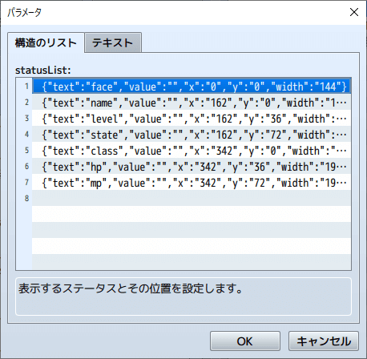

### 既存のステータスを削除する

既存のステータスを削除するためには、削除したい対象のステータスにカーソルを合わせて`Delete`キーを押します。

削除してもプラグインパラメータのウィンドウをキャンセルすれば、元に戻せます。

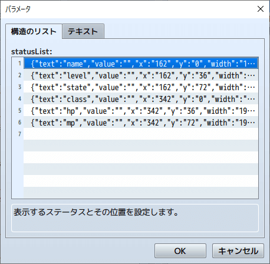

### 既存のステータスをコピーする

既存のステータスにカーソルを合わせて`Shift`キーを押しながらカーソルを選択することで、一度に複数のステータスを選択することもできます。

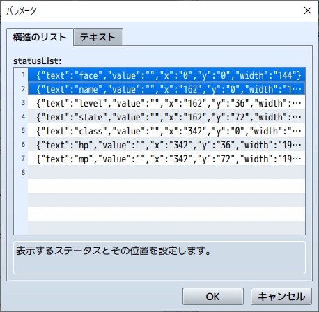

選択したステータスは、`Ctrl + c`キーでコピーし、任意の場所にペーストすることができます。

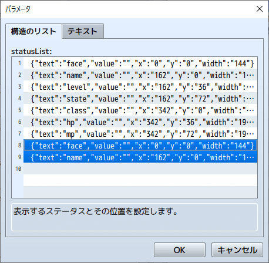

### ステータスの配置を変える

既存のステータスにカーソルを合わせて選択し、ドラッグ操作をして上下にずらすと、黄色いカーソルが表示します。

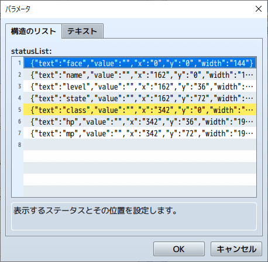

この時、ドラッグ操作をやめると、選択したステータスの配置を変更することができます。

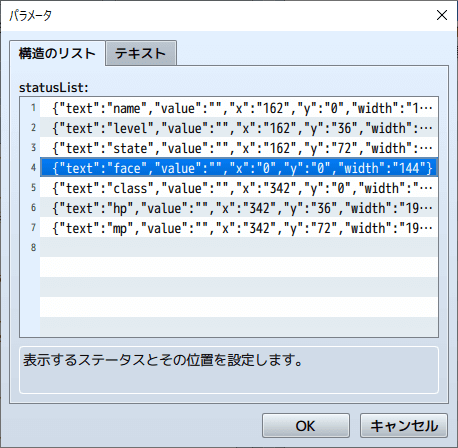

### 新しいステータスを追加する

新しいステータスを追加する場合は、リストの一番下の何もない部分をダブルクリックしてください。

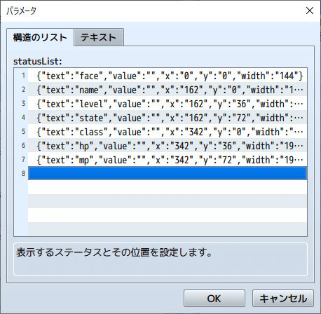

[上に戻る](#レイアウトの設定)　　　[目次に戻る](FTKR_CustomSimpleActorStatus.ja.md#目次)

## statusListパラメータの設定

### 表示するステータスの設定

`text`は、プルダウン選択方式になっているため、表示したいステータスを選んで指定してください。

なお、プラグインウィンドウの上部の「テキスト」ボタンを押して、直接文字列を入力することもできます。
プルダウンリストにない場合や、後述の角括弧を使った表示をする場合に、直接入力を行ってください。

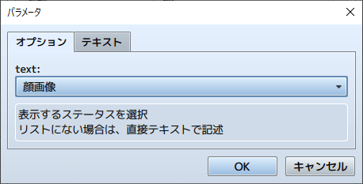

選択したステータスが、`code(%1)`の形式だった場合は`value`の入力が必要です。

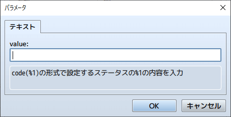

なお、`value`にはスクリプトを入力することもできます。以下はFTKR_CSS_ShopStatusでの例。
ただし、スクリプトを使うと処理が重くなります。

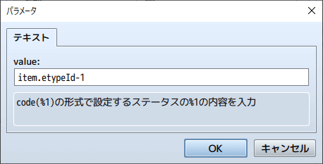

[上に戻る](#レイアウトの設定)　　　[目次に戻る](FTKR_CustomSimpleActorStatus.ja.md#目次)

### 表示位置と表示幅の設定

表示位置の座標(x, y)と表示幅をpixel単位で指定します。
ここでのx座標・y座標は、ウィンドウ内の相対座標です。

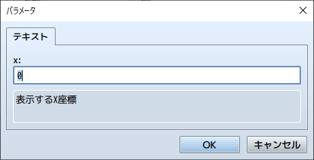

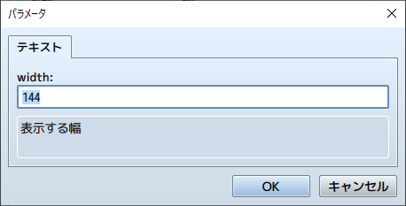

基本的には数字を入力しますが、スクリプトで入力することもできます。
ただし、スクリプトを使うと処理が重くなります。

スクリプトの場合は、以下の文字定数を使えます。
* x : ウィンドウのX座標を参照します。
* y : ウィンドウのY座標を参照します。
* width : ウィンドウ内の表示可能なエリアの幅を参照します。
* height : ウィンドウ内の表示可能なエリアの高さを参照します。
* line : １行の高さを参照します。

[上に戻る](#レイアウトの設定)　　　[目次に戻る](FTKR_CustomSimpleActorStatus.ja.md#目次)

## その他の設定

### 角括弧を使った入力
複数のコードを角括弧('[' ']')で囲み、スラッシュ(/)で区切ると、描画エリア内の同じ行に横に並べて表示します。
角括弧内の片側を空欄にした場合は、描画エリアも片側が非表示になります。

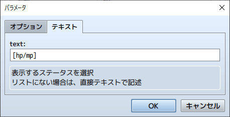

横に並べる際の表示間隔は、プラグインパラメータ`Actor Status Space In Text`の設定値(pixel単位)に従います。

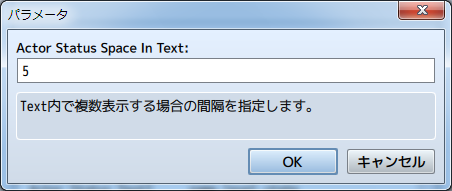

[上に戻る](#レイアウトの設定)　　　[目次に戻る](FTKR_CustomSimpleActorStatus.ja.md#目次)
