[トップページに戻る](README.md)
[目次に戻る](FTKR_CustomSimpleActorStatus.ja.md#目次)

# ステータスの表示

1. [顔画像の表示](#顔画像の表示)
2. [歩行キャラ画像の表示](#歩行キャラ画像の表示)
3. [SV戦闘キャラ画像の表示](#SV戦闘キャラ画像の表示)
4. [ステートアイコンの表示](#ステートアイコンの表示)
5. [パラメータの差分表示](#パラメータの差分表示)
5. [装備パラメータの表示](#装備パラメータの表示)
5. [ＡＯＰ装備パラメータの表示](#ＡＯＰ装備パラメータの表示)
5. [カスタムパラメータの表示](#カスタムパラメータの表示)
6. [カスタムゲージの表示](#カスタムゲージの表示)
7. [カスタム画像の表示](#カスタム画像の表示)
6. [アクター別のカスタムゲージの表示](#アクター別のカスタムゲージの表示)
6. [クラス別のカスタムゲージの表示](#クラス別のカスタムゲージの表示)
6. [メッセージの表示](#メッセージの表示)

## 顔画像の表示

コード`face`または`face(x)`を入力した場合、アクターの顔画像を表示します。

コード`face`で表示する顔画像は、MVデフォルトでは 144*144 のサイズです。
1行は 36pixel に設定されているため、当倍サイズで表示するために必要な行数は 4 行です。

`face(x)`を使用すると、顔画像を圧縮拡大して x 行に収まるように画像を変形します。


下の画像は、`face(3)`で表示したものです。顔画像が3行に収まるので、その下にTPゲージなど、ステータスを追加できます。

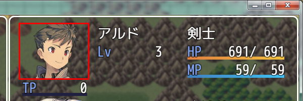

顔画像は、描画エリアの幅を超えて表示できません。
設定を 5 にした場合、描画に必要な幅は 180pixelになりますが、描画エリアの幅がこの値以下の場合は、描画エリアの幅までしか拡大できません。
プラグインパラメータ`Actor Status Width Rate`の設定も合わせて調整してください。

顔画像について、以下のパラメータで設定を変更できます。

`Face Position X`

アクターの顔画像を描画エリアのどの位置に表示するか設定します。
* 0 - 左寄せ
* 1 - 中央(デフォルト)
* 2 - 右寄せ

描画エリアの幅が、顔画像の表示幅よりも大きい場合に機能します。
また、波括弧を使って描画エリアを拡張した場合にも有効です。

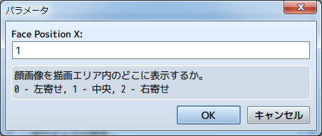

[上に戻る](#ステータスの表示)　　　[目次に戻る](FTKR_CustomSimpleActorStatus.ja.md#目次)

## 歩行キャラ画像の表示

コード`chara`を入力した場合、アクターのキャラクタ画像(歩行キャラ)を表示します。
キャラクタ画像について、以下のパラメータで設定を変更できます。

`Chara Image Width`<br>
`Chara Image Height`

アクターのキャラクタ画像のサイズを設定します。
標準では48*48の画像を使用していますが、それ以外のサイズの
キャラ画像を使用している場合に、設定値を変えてください。

`Chara Position X`

アクターのキャラクタ画像を描画エリアのどの位置に表示するか設定します。
* 0 - 左寄せ
* 1 - 中央(デフォルト)
* 2 - 右寄せ

`Chara Direction`

アクターのキャラクタ画像の向きを設定します。
* 0 - 正面固定(デフォルト)
* 1 - マップ上の先頭プレイヤーの向き

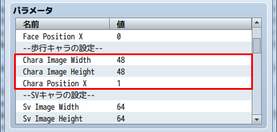

[上に戻る](#ステータスの表示)　　　[目次に戻る](FTKR_CustomSimpleActorStatus.ja.md#目次)

## SV戦闘キャラ画像の表示
コード`sv`を入力した場合、アクターのSVキャラクタ画像(SV戦闘キャラ)を表示します。
SVキャラクタ画像について、以下のパラメータで設定を変更できます。

### 画像サイズの設定

`Sv Image Width`<br>
`Sv Image Height`

アクターのSVキャラクタ画像のサイズを設定します。
標準では64*64の画像を使用していますが、それ以外のサイズの
キャラ画像を使用している場合に、設定値を変えてください。

### 表示位置の設定

`Sv Position X`

アクターのSVキャラクタ画像を描画エリアのどの位置に表示するか設定します。
* 0 - 左寄せ
* 1 - 中央(デフォルト)
* 2 - 右寄せ

### 表示モーションの設定

`Enabled Sv Motion`

アクターのSVキャラクタ画像のモーションを有効にするか設定します。
* 0 - 無効
* 1 - 有効(デフォルト)
* 2 - 戦闘時以外有効

無効にした場合は、モーションを表示せず、画像ファイル内の左上のSVキャラクタ画像で固定です。
フロントビューモードの場合は、強制的に無効になります。

`Sv Image Motion`

標準で表示するモーションを設定します。
表示するモーションの[コード名](Code_List.ja.md#モーション)を入力してください。

`Enabled State Motion`

ステートモーションを有効にするか設定します。
* 0 - 無効
* 1 - 有効(デフォルト)

有効にした場合、状態異常、戦闘不能、睡眠になっているキャラは、そのステートのモーションを表示します。


[上に戻る](#ステータスの表示)　　　[目次に戻る](FTKR_CustomSimpleActorStatus.ja.md#目次)

## ステートアイコンの表示

コード`state`また`state2(x)`を入力した場合、アクターに付与されているステートのアイコンを表示することができます。
以下のプラグインパラメータで設定できます。

`Enable CSS States`

ステートアイコンの表示について当プラグインの専用描画処理を有効にするか設定します。
* 0 - 無効
* 1 - 有効(デフォルト)

有効にすると、以下のプラグインパラメータの設定に従いステートアイコンを表示します。
無効の場合はMVのデフォルトの描画処理を使用します。

`Animation Wait`

ステートアイコンの切り替え時間を指定します。

`Enable Overlap`

ステートアイコンの重なり表示を有効にする。
* 0 - 無効(デフォルト)
* 1 - 有効

有効にすると、アイコンを重ねて表示させることで
一度に表示できるアイコン数を増やします。

`Overlap Rate`

ステートアイコンの重なり表示を有効にした場合に、
アイコンサイズの重なりの許容できる比率を指定します。
 0 ~ 1 の値を設定してください。

`Enable Auto Scale`

行の高さに合わせてアイコンサイズを縮小するか設定します。
* 0 - 無効(デフォルト)
* 1 - 有効

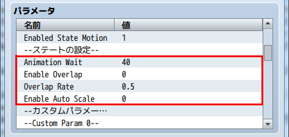

### アイコンを横に並べて表示

アイコンを横に並べて表示させる場合は、コード`state`を使用します。
`Enable Overlap`が有効で、ステートが複数付与されていて描画エリアの幅に収まらない場合は、図のように重ねて表示します。

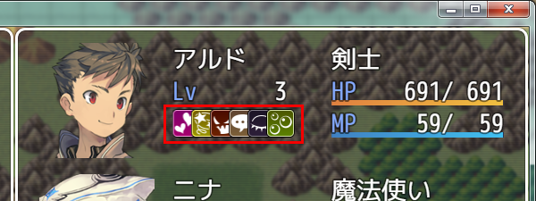

### アイコンを縦に並べて表示

アイコンを縦に並べて表示させる場合は、コード`state2(x)`を使用します。
x は何行を使って表示するか指定する値です。
`Enable Overlap`が有効で、ステートが複数付与されていて指定した行内に収まらない場合は、図のように重ねて表示します。

下の図の場合は、以下のコードを入力して4行に表示しています。
```
state2(4)
```
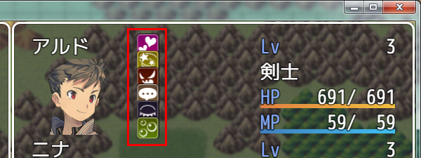

[上に戻る](#ステータスの表示)　　　[目次に戻る](FTKR_CustomSimpleActorStatus.ja.md#目次)

## パラメータの差分表示
コード`pdiff(x)`,`ediff(x)`,`aopdiff(x)`,`eaopdiff(x)`を入力した場合に、さまざまなパラメータの差分値を表示することができます。

この表示内容は、プラグインパラメータ`Format PDIFF Plus`(増加の場合)と、`Format PDIFF Minus`(減少の場合)で設定できます。

また、表示内容に制御文字を使えるかどうかを、プラグインパラメータ`Enabled Escapecharacters By PDIFF`で設定できます。
* 有効の場合は、制御文字で任意の色に変えることなどできますが、左詰めで幅を無視して表示します
* 無効の場合は、制御文字が使えませんが、右詰めで指定幅の範囲内に納めて表示します

制御文字で色を指定しない場合や、制御文字を無効にした場合の差分値の表示色は、増加が緑、減少が赤になります。

## 装備パラメータの表示

コード`eparam(x)`を入力した場合、指定したアイテムを装備した時のパラメータを表示することができます。
`x`は 0 ~ 7 の値で、以下のどのパラメータを表示するか指定します。
* 0 - 最大HP
* 1 - 最大MP
* 2 - 攻撃力
* 3 - 防御力
* 4 - 魔法攻撃
* 5 - 魔法防御
* 6 - 敏捷性
* 7 - 運

デフォルトの装備画面と同様に右矢印`→`と合わせて、パラメータ値を表示します。

右矢印記号は、以下のプラグインパラメータで変更できます。

`Equip Right Arrow`

装備を変える時に表示する右矢印記号を指定します。
制御文字が使用できます。

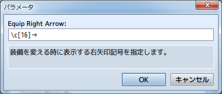

[上に戻る](#ステータスの表示)　　　[目次に戻る](FTKR_CustomSimpleActorStatus.ja.md#目次)

## ＡＯＰ装備パラメータの表示

コード`eaop(x)`を入力した場合、指定したアイテムを装備した時のAOPパラメータを表示することができます。

AOPパラメータとは、FTKR_AddOriginalParameters.js で作成したオリジナルパラメータです。
x にはパラメータIDを指定してください。

デフォルトの装備画面と同様に右矢印`→`と合わせて、パラメータ値を表示します。

このコードを使用するためには、FTKR_AddOriginalParameters.jsが必要です。

[上に戻る](#ステータスの表示)　　　[目次に戻る](FTKR_CustomSimpleActorStatus.ja.md#目次)

## カスタムパラメータの表示

コード`custom(x)`を入力した場合、プラグインパラメータ`Custom Param x`で設定したパラメータを表示することができます。
カスタムパラメータは、最大で20種類設定できます。

### パラメータの設定

`Custom x Display Name`

パラメータの表示名を設定します。
表示名には制御文字が使用できます。

`Custom x References`

パラメータの値の参照先を 計算式(eval) で設定します。

`Custom x Unit`

パラメータの値の単位を設定します。
単位には制御文字が使用できます。

### 計算式(eval) の値について

計算式(eval)は、ダメージ計算式のように、計算式を入力することで、固定値以外の値を使用することができます。以下のコードを使用できます。
* a.param - アクターのパラメータを参照します。(a.hit でアクターの命中率)
* v[x]    - 変数ID x の値を参照します。
* s[x]    - スイッチID x の値を参照します。

命中率のような百分率の値の場合、`a.hit`とそのまま記述すると少数で表示します。
そのため、以下のように記述して整数に変換するようにします。
```
a.hit * 100
a.hit.percent()
```

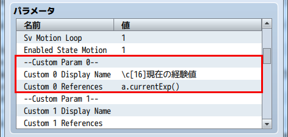

[上に戻る](#ステータスの表示)　　　[目次に戻る](FTKR_CustomSimpleActorStatus.ja.md#目次)

## カスタムゲージの表示
コード`gauge(x)`を入力した場合、`Gauge Param x`で設定したゲージを表示することができます。
カスタムゲージは、最大で10種類設定できます。

### 共通設定
`Gauge Param Digit`

現在値と最大値の表示幅を指定した桁数に設定します。
この桁数以上の値の場合、横に圧縮して表示します。

### 個別パラメータの設定
`Gauge x Display Name`

ゲージの表示名を設定します。
表示名には制御文字が使用できます。
表示名を設定しない場合、ゲージの現在値と最大値の数値を表示しません。

`Gauge x References`

ゲージで表示する値の参照先をeval値で設定します。
この値を設定すると、現在値と最大値は表示しません。

`Gauge x Current`

ゲージの現在値の参照先を 計算式(eval) で設定します。

`Gauge x Max`

ゲージの最大値の参照先を 計算式(eval) で設定します。
最大値の数値は、描画エリアの幅が足りない場合には表示しません。

`Gauge x Color1`<br>
`Gauge x Color2`

ゲージの色1と色2を設定します。
色1と色2の値を変えることで、HPゲージのようにグラデーションに表示します。
-1 を指定すると、ゲージバーを非表示にします。

### 計算式(eval) の値について

計算式(eval)は、ダメージ計算式のように、計算式を入力することで、固定値以外の値を使用することができます。以下のコードを使用できます。
* a.param - アクターのパラメータを参照します。(a.hit でアクターの命中率)
* v[x]    - 変数ID x の値を参照します。
* s[x]    - スイッチID x の値を参照します。

命中率のような百分率の値の場合、`a.hit`とそのまま記述すると少数で表示します。
そのため、以下のように記述して整数に変換するようにします。
```
a.hit * 100
a.hit.percent()
```

プラグインには、デフォルトで ゲージ0 に現在EXPと次レベルのEXPからなる経験値ゲージを設定しています。
カスタムゲージを作る上での参考にしてください。

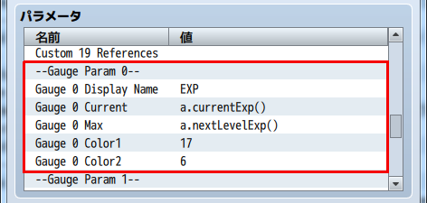

[上に戻る](#ステータスの表示)　　　[目次に戻る](FTKR_CustomSimpleActorStatus.ja.md#目次)

## カスタム画像の表示
コード`image`または`image(x)`を入力した場合、アクターのメモ欄で設定した画像を表示する
ことができます。

* `image` - 最初に登録した画像を表示します。
* `image(x)` - 画像を登録した順番に x = 0,1,2,... と指定します。

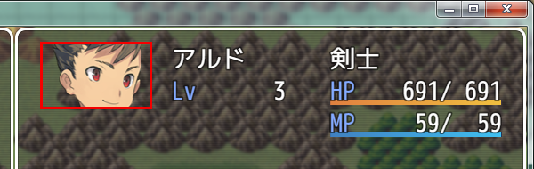

### メモ欄の設定
設定には以下のタグを入力します。
```
<CSS_画像:画像名>
code
</CSS_画像>
```
または
```
<CSS_IMAGE:imagename>
code
</CSS_IMAGE>
```
表示させたい画像名を入力します。<br>
画像は、プロジェクトフォルダ内の/img/picture/に保存してください。
異なる画像名であれば、複数の画像を設定すことができます。

#### code に使用できるタグ

以下のタグで、画像を四角に切り取って表示(トリミング)することができます。
設定しない場合は、画像をそのまま表示します。

`Bgi offset X: n`

画像ファイルを四角に切り取る時の左上のX座標 n を入力します。
指定しない場合は 0 になります。

`Bgi offset Y: n`

画像ファイルを四角に切り取る時の左上のY座標 n を入力します。
指定しない場合は 0 になります。

`Bgi width: n`

画像ファイルを四角に切り取る時の幅 n を入力します。
指定しない場合は 画像のサイズ になります。

`Bgi height: n`

画像ファイルを四角に切り取る時の高さ n を入力します。
指定しない場合は 画像のサイズ になります。

`Bgi scale: n`

画像ファイルを表示するときの拡大率(%)を入力します。
指定しない場合は原寸サイズで表示します。(原寸サイズ = 100)

### プラグインパラメータの設定

カスタム画像について、以下のパラメータで設定を変更できます。

`Image Position X`

カスタム画像を描画エリアのどの位置に表示するか設定します。
* 0 - 左寄せ
* 1 - 中央(デフォルト)
* 2 - 右寄せ

描画エリアの幅が、カスタム画像の幅よりも大きい場合に機能します。
また、波括弧を使って描画エリアを拡張した場合にも有効です。

### カスタム画像に使用できるプラグインコマンド

設定したカスタム画像は、以下のプラグインコマンドを実行することでゲーム中に変更できます。<br>
※[]は実際の入力に使用しません

```
CSS_カスタム画像変更 [アクター または パーティー] [アクターID または パーティー順番] [カスタム画像ID] [画像名] [X座標] [Y座標] [幅] [高さ] [拡大率]
CSS_CHANGE_CUSTOM_IMAGE [ACTOR or PARTY] [actorID or partyNumber] [customImageID] [imageName] [offsetX] [offsetY] [width] [height] [scale]
```

`アクター または パーティー(ACTOR or PARTY)`<br>
変更したい対象アクターの指定方法を選択します。<br>
いずれかの文字列を記載してください。

   `アクターID または パーティー順番(actorID or partyNumber)`<br>
     上記で設定した指定方法に合わせてアクターIDかパーティー順番の番号を入力します。<br>
       なお、パーティー順番は、先頭キャラを 0番と数えます。<br>
       \v[n]で変数を指定することも可能です。

   `カスタム画像ID(customImageID)`<br>
     変更したいカスタム画像IDを設定します。<br>
       \v[n]で変数を指定することも可能です。

   `画像名(imageName)`<br>
     変更する画像ファイル名を文字列で設定します。<br>
       画像は、プロジェクトフォルダ内の/img/pictures/に保存してください。

なお、このファイルはディプロイメントの「未使用ファイルを含まない」の対象外です。<br>
別途イベントでピクチャとして登録しておくなど、回避手段を講じてください。

   `X座標(offsetX)`<br>
   `Y座標(offsetY)`<br>
   `幅(width)`<br>
   `高さ(height)`<br>
   `拡大率(scale)`<br>
     画像ファイルの表示設定を変更します。<br>
       アクターのメモ欄の設定方法と同じです。<br>
       変更しない場合は、-1 と入力します。<br>
       \v[n]で変数を指定することも可能です。<br>

入力例）
```
◆プラグインコマンド：CSS_カスタム画像変更 アクター 1 0 Package1_2 -1 -1 -1 -1 50
```
このコマンドで、アクターID 1 のカスタム画像ID 0 の画像を、/img/pictures/Package1_2.png に変更した上で、トリミングサイズは変更せず、拡大率を 50% に設定します。

[上に戻る](#ステータスの表示)　　　[目次に戻る](FTKR_CustomSimpleActorStatus.ja.md#目次)

## アクター別のカスタムゲージの表示
コード`agauge(x)`を入力した場合、アクターのメモ欄で設定したゲージを表示することができます。
メモ欄で設定していないアクターは、空欄になります。

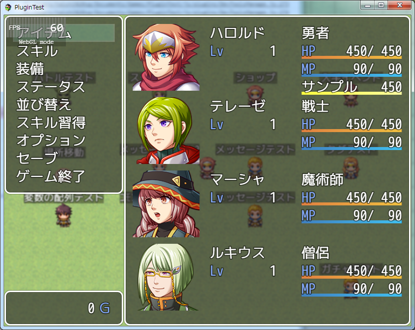

### メモ欄の設定
設定には以下のタグを入力します。
```
<CSS_カスタム: x>
code
</CSS_カスタム>
```
または
```
<CSS_CUSTOM: x>
code
</CSS_CUSTOM>
```
コード`agauge(x)`で表示するゲージを設定します。
現在値と最大値の表示桁数はカスタムゲージの設定を使用します。

### code に使用できるタグ
```
表示名: y
NAME: y
```
ゲージの表示名を設定します。
表示名には制御文字が使用できます。
表示名を設定しない場合、ゲージの現在値と最大値の数値を表示しません。

```
参照先: eval
REFERENCES: eval
```
ゲージで表示する値の参照先をeval値で設定します。
この値を設定すると、現在値と最大値は表示しません。

```
現在値: eval
CURRENT: eval
```
ゲージの現在値の参照先を 計算式(eval) で設定します。

```
最大値: eval
MAX: eval
```
ゲージの最大値の参照先を 計算式(eval) で設定します。
最大値の数値は、描画エリアの幅が足りない場合には表示しません。

```
色: y1,y2
COLOR: y1,y2
```
ゲージの色1を y1 に、色2を y2 に設定します。
色1と色2の値を変えることで、HPゲージのようにグラデーションに表示します。
-1 を指定すると、ゲージバーを非表示にします。

### 計算式(eval) の値について

計算式(eval)は、ダメージ計算式のように、計算式を入力することで、固定値以外の値を使用することができます。以下のコードを使用できます。
* a.param - アクターのパラメータを参照します。(a.hit でアクターの命中率)
* v[x]    - 変数ID x の値を参照します。
* s[x]    - スイッチID x の値を参照します。

命中率のような百分率の値の場合、`a.hit`とそのまま記述すると少数で表示します。
そのため、以下のように記述して整数に変換するようにします。
```
a.hit * 100
a.hit.percent()
```

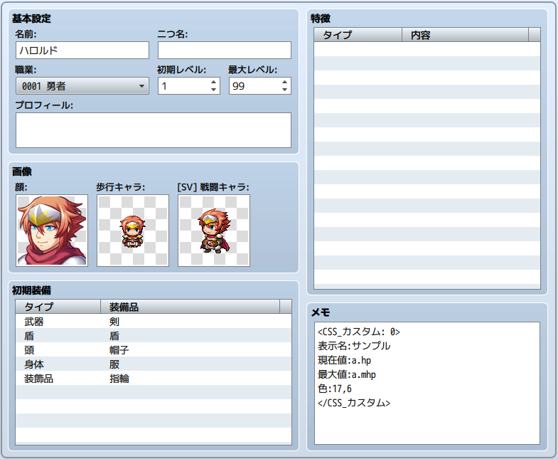

[上に戻る](#ステータスの表示)　　　[目次に戻る](FTKR_CustomSimpleActorStatus.ja.md#目次)

## クラス別のカスタムゲージの表示
コード`cgauge(x)`を入力した場合、クラスのメモ欄で設定したゲージを表示することができます。
メモ欄で設定していないクラスは、空欄になります。

### メモ欄の設定
アクター別のカスタムゲージと同じです。

### code に使用できるタグ
アクター別のカスタムゲージと同じです。

### 計算式(eval) の値について
アクター別のカスタムゲージと同じです。

[上に戻る](#ステータスの表示)　　　[目次に戻る](FTKR_CustomSimpleActorStatus.ja.md#目次)

## メッセージの表示
コード`message`を入力した場合、アクターの状態変化に合わせて以下のメッセージ表示することができます。

### アクターのレベルアップ
アクターがレベルアップすると、レベルアップメッセージを表示します。
メッセージの内容は、プラグインパラメータ`Display LevelUp Message`で設定します。
メッセージには制御文字を使用できます。

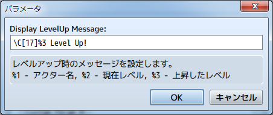

[上に戻る](#ステータスの表示)　　　[目次に戻る](FTKR_CustomSimpleActorStatus.ja.md#目次)
