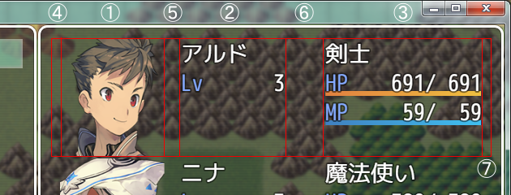
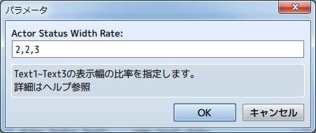
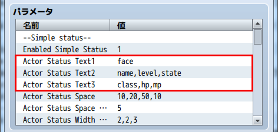
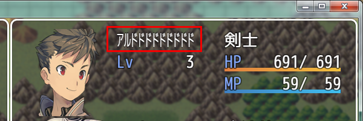
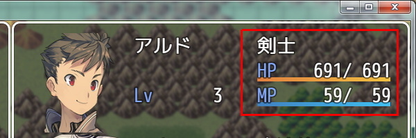
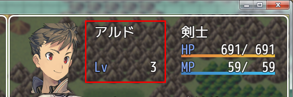
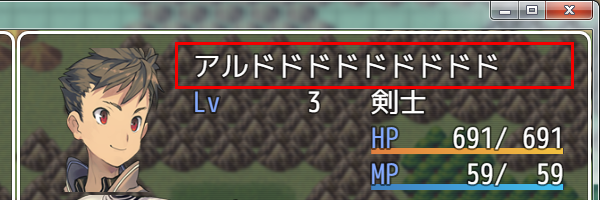
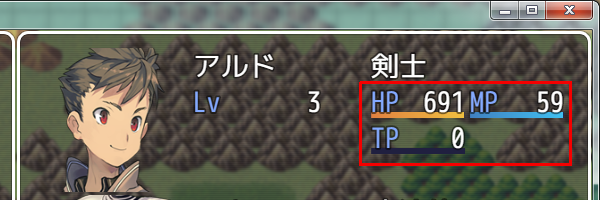
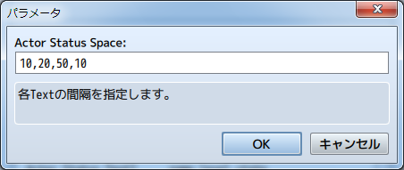

[トップページに戻る](README.md)
[目次に戻る](FTKR_CustomSimpleActorStatus.ja.md#目次)

# レイアウトの基本構成

### 表示エリア

本プラグインでは、以下の図の赤枠で囲まれた (１)～(７) のレイアウト構成を基本の単位にしています。 (１)～(７) を合わせて表示エリアとします。



### 描画エリア
表示エリアの中で、各ステータスを表示するエリアを描画エリアとします。<br>
上の図の(1) ～ (3)の３つのエリアが該当します。<br>
それぞれの個別に幅を指定し、表示するステータスも個別に設定します。

### 空白エリア
表示エリアの中で、空白分として何も表示しないエリアを空白エリアとします。<br>
上の図の(4) ～ (7)の４つのエリアが該当します。<br>
それぞれの個別に幅を指定します。

[目次に戻る](#目次)

# レイアウトの設定

1. [描画エリアサイズの設定](#描画エリアサイズの設定)
3. [描画エリアの設定](#描画エリアの設定)
4. [空白エリアの設定](#空白エリアの設定)

## 描画エリアサイズの設定

描画エリアのサイズは、プラグインパラメータ`Actor Status Width Rate`で設定します。３つの描画エリアの幅の**比率**を、カンマ(,)で区切って入力してください。

下の図の設定の場合は、表示エリアに対して描画エリア(1)~(3)を 2 : 2 : 3 の比率で分けます。
例えば表示エリアの幅が 350pixel だった場合、各描画エリアの幅は以下になります。(空白エリアのサイズが 0 だった場合)
* 描画エリア(1)の幅 - 100pixel
* 描画エリア(2)の幅 - 100pixel
* 描画エリア(3)の幅 - 150pixel



[上に戻る](#レイアウトの設定)　　　[目次に戻る](FTKR_CustomSimpleActorStatus.ja.md#目次)

## 描画エリアの設定
### 描画エリアの表示方法

プラグインパラメータ`Actor Status Text*`に設定した[コード](#表示できるステータス)の内容を、各[描画エリア](#描画エリア)に表示します。
* `Actor Status Text1` - 描画エリア(1)の内容
* `Actor Status Text2` - 描画エリア(2)の内容
* `Actor Status Text3` - 描画エリア(3)の内容



### ステータスの表示方式

プラグインパラメータに[コード](#表示できるステータス)を入力すると、描画エリア内にステータスを表示します。

描画エリア(2)の設定例
```
name,level
```
長いアクターの名前など描画エリアの幅よりもテキスト幅が長いステータスの場合でも、横に圧縮して描画エリア内に表示させます。



### カンマを使った入力
カンマ(,)で区切って入力したコードは、描画エリア内の次(下)の行に表示します。
複数のカンマで区切ることで縦に何行でも表示できますが、表示エリアを越えても表示できてしまうため、描画させるステータスの行数は表示エリアの高さ内に収めるようにしましょう。

描画エリア(3)の設定例
```
class,hp,mp
```


カンマ(,)を続けて2個入力すると、下の図のように1行空欄ができます。

描画エリア(2)の設定例
```
name,,level
```


### 波括弧を使った入力
コードを波括弧( { } )で囲むと、そのステータスを右側の描画エリアも使用して表示します。

長い名前などをフォントサイズを変えずに表示させたい場合に使用できます。
ただし、右側の描画エリアと表示が重なるため、右側の描画エリアは 1行空けるように設定しましょう。

描画エリア(2)の設定例
```
{name},level
```
描画エリア(3)の設定例
```
,,class,hp,mp
```


### 角括弧を使った入力
複数のコードを角括弧('[' ']')で囲み、スラッシュ(/)で区切ると、描画エリア内の同じ行に横に並べて表示します。
角括弧内の片側を空欄にした場合は、描画エリアも片側が非表示になります。
```
class,[hp/mp],[tp/]
```


横に並べる際の表示間隔は、プラグインパラメータ`Actor Status Space In Text`の設定値(pixel単位)に従います。


[上に戻る](#レイアウトの設定)　　　[目次に戻る](FTKR_CustomSimpleActorStatus.ja.md#目次)

## 空白エリアの設定
空白エリアのサイズは、プラグインパラメータ`Actor Status Space`で設定します。４つの空白エリアの幅(pixel単位)を、カンマ(,)で区切って入力してください。

下の図の設定の場合は、各[空白エリア](#空白エリア)の幅は以下になります。
* 空白エリア(4)の幅 - 10pixel
* 空白エリア(5)の幅 - 20pixel
* 空白エリア(6)の幅 - 50pixel
* 空白エリア(7)の幅 - 10pixel



なお、描画エリアのサイズは、表示エリアの幅から空白エリアの全幅を引いた値を元に、プラグインパラメータ`Actor Status Width Rate`の比率で分けます。
空白エリアを取りすぎると、描画エリアが小さくなりすぎてしまうので注意してください。

[上に戻る](#レイアウトの設定)　　　[目次に戻る](FTKR_CustomSimpleActorStatus.ja.md#目次)


#
[目次に戻る](#目次)

[トップページに戻る](README.md)