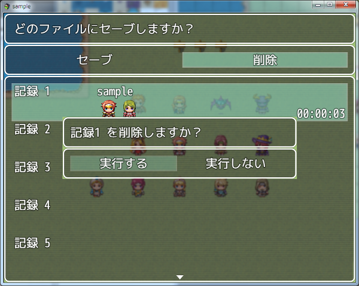

[トップページに戻る](README.md)

# [FTKR_DeleteSavefile](FTKR_DeleteSavefile.js) プラグイン

セーブファイルを削除するコマンドを追加するプラグインです。

ダウンロード: [FTKR_DeleteSavefile.js](https://raw.githubusercontent.com/futokoro/RPGMaker/master/FTKR_DeleteSavefile.js)

## 目次

以下の項目の順でプラグインの使い方を説明します。
1. [概要](#概要)
* [プラグインの更新履歴](#プラグインの更新履歴)
* [ライセンス](#ライセンス)

## 概要

本プラグインを実装することで、セーブ画面やコンティニュー画面に、セーブファイルを削除するコマンドを追加します。

削除時に確認画面を表示させることもできます。

[目次に戻る](#目次)

## プラグインの更新履歴

| バージョン | 公開日 | 更新内容 |
| --- | --- | --- |
| [ver1.0.4](FTKR_DeleteSavefile.js)| 2018/04/06 | プラグインパラメータが空欄だった場合の処理を一部見直し |
| ver1.0.3| 2018/04/04 | windowskinを変更した場合に、初回表示時に反映されない不具合を修正 |
| ver1.0.2| 2018/04/03 | 削除でファイルを選択した時に決定SEを鳴らすように変更 確認画面のウィンドウを個別に設定する機能を追加 |
| ver1.0.1| 2018/03/01 | 確認画面でカーソルの初期位置を「実行しない」に変更 |
| ver1.0.0| 2018/02/25 | 初版作成 |

## ライセンス

本プラグインはMITライセンスのもとで公開しています。

[The MIT License (MIT)](https://opensource.org/licenses/mit-license.php)

#
[目次に戻る](#目次)

[トップページに戻る](README.md)