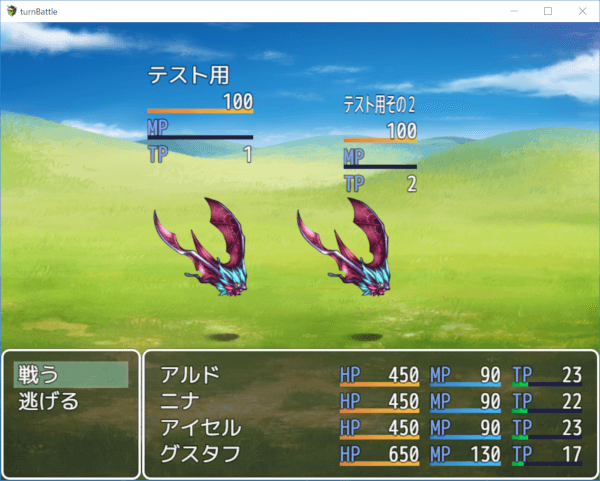

[トップページに戻る](README.md)

# [FTKR_DisplayEnemyParameters](FTKR_DisplayEnemyParameters.js) プラグイン

戦闘画面にエネミーのパラメータを表示するプラグインです。

ダウンロード: [FTKR_DisplayEnemyParameters.js](https://raw.githubusercontent.com/futokoro/RPGMaker/master/FTKR_DisplayEnemyParameters.js)

## 目次

以下の項目の順でプラグインの使い方を説明します。
1. [仕様](#仕様)
* [プラグインの更新履歴](#プラグインの更新履歴)
* [ライセンス](#ライセンス)

## 仕様
戦闘画面にエネミーのパラメータを表示します。

表示するパラメータや、表示位置やサイズはプラグインパラメータで設定可能です。

表示位置とサイズは、エネミーのメモ欄で個別に設定可能です。

`<FTKR_STATUS_POS_X: x>`
* x : 表示位置のX座標の差（負の値で左にずれる）

`<FTKR_STATUS_POS_Y: y>`
* y : 表示位置のY座標の差（負の値で上にずれる）

`<FTKR_STATUS_WIDTH: w>`
* w : ステータスの表示幅

また、HP・MP・TPは、プラグインパラメータでラベル(HPやMPなどの文字)、数値、ゲージの表示を個別にON/OFFすることができます。

なお、このパラメータはエネミー画像の表示位置に合わせているため、エネミーが動くと、それに合わせてパラメータの表示位置も変わります。

[目次に戻る](#目次)

## プラグインの更新履歴

| バージョン | 公開日 | 更新内容 |
| --- | --- | --- |
| [ver1.1.1](FTKR_DisplayEnemyParameters.js) | 2018/12/20 | プラグインパラメータ Display Width が正しく反映されない不具合を修正 |
| ver1.1.0 | 2018/12/19 | エネミーごとにステータスの表示位置と表示幅を設定する機能を追加 パラメータのラベル、数値、ゲージの表示ON/OFF機能追加 |
| ver1.0.0 | 2018/04/17 | 初版公開 |

## ライセンス

本プラグインはMITライセンスのもとで公開しています。

[The MIT License (MIT)](https://opensource.org/licenses/mit-license.php)

#
[目次に戻る](#目次)

[トップページに戻る](README.md)