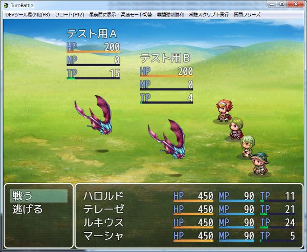

[トップページに戻る](README.md)

# [FTKR_DisplayEnemyParameters](FTKR_DisplayEnemyParameters.js) プラグイン

戦闘画面にエネミーのパラメータを表示するプラグインです。

ダウンロード: [FTKR_DisplayEnemyParameters.js](https://raw.githubusercontent.com/futokoro/RPGMaker/master/FTKR_DisplayEnemyParameters.js)

## 目次

以下の項目の順でプラグインの使い方を説明します。
1. [仕様](#仕様)
* [プラグインの更新履歴](#プラグインの更新履歴)
* [ライセンス](#ライセンス)

## 仕様
戦闘画面にエネミーのパラメータを表示します。

表示するパラメータや、表示位置やサイズはプラグインパラメータで設定可能です。

なお、このパラメータはエネミー画像の表示位置に合わせているため、エネミーが動くと、それに合わせてパラメータの表示位置も変わります。

[目次に戻る](#目次)

## プラグインの更新履歴

| バージョン | 公開日 | 更新内容 |
| --- | --- | --- |
| [ver1.0.0](FTKR_DisplayEnemyParameters.js) | 2018/04/17 | 初版公開 |

## ライセンス

本プラグインはMITライセンスのもとで公開しています。

[The MIT License (MIT)](https://opensource.org/licenses/mit-license.php)

#
[目次に戻る](#目次)

[トップページに戻る](README.md)