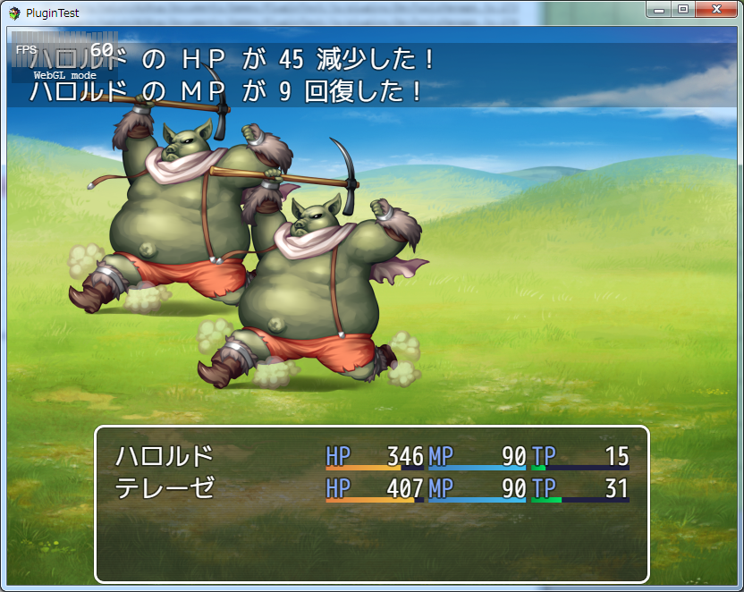
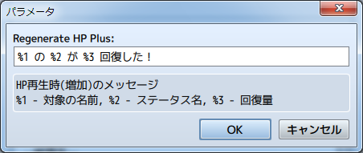

[トップページに戻る](README.md)

# [FTKR_DisplayRegenerateMessage](FTKR_DisplayRegenerateMessage.js) プラグイン

HP再生値をバトルログに表示するプラグインです。

ダウンロード: [FTKR_DisplayRegenerateMessage.js](https://raw.githubusercontent.com/futokoro/RPGMaker/master/FTKR_DisplayRegenerateMessage.js)

## 目次

以下の項目の順でプラグインの使い方を説明します。
1. [仕様](#仕様)
* [プラグインの更新履歴](#プラグインの更新履歴)
* [ライセンス](#ライセンス)

## 仕様
各種再生率によるターン終了時の回復量をバトルログに表示します。

表示するメッセージは下の図のようにプラグインパラメータで設定できます。
増加時と減少時でメッセージを変えることが出来ます。

[目次に戻る](#目次)

## プラグインの更新履歴

| バージョン | 公開日 | 更新内容 |
| --- | --- | --- |
| [ver1.1.0](FTKR_DisplayRegenerateMessage.js) | 2017/05/27 | 増加時と減少時でメッセージを分離 HPとMPのメッセージを分離 |
| ver1.0.0 | 2017/05/26 | 初版公開 |

## ライセンス

本プラグインはMITライセンスのもとで公開しています。

[The MIT License (MIT)](https://opensource.org/licenses/mit-license.php)

#
[目次に戻る](#目次)

[トップページに戻る](README.md)