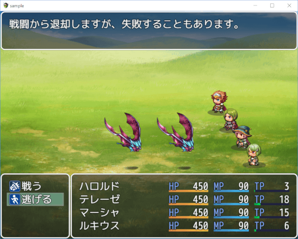
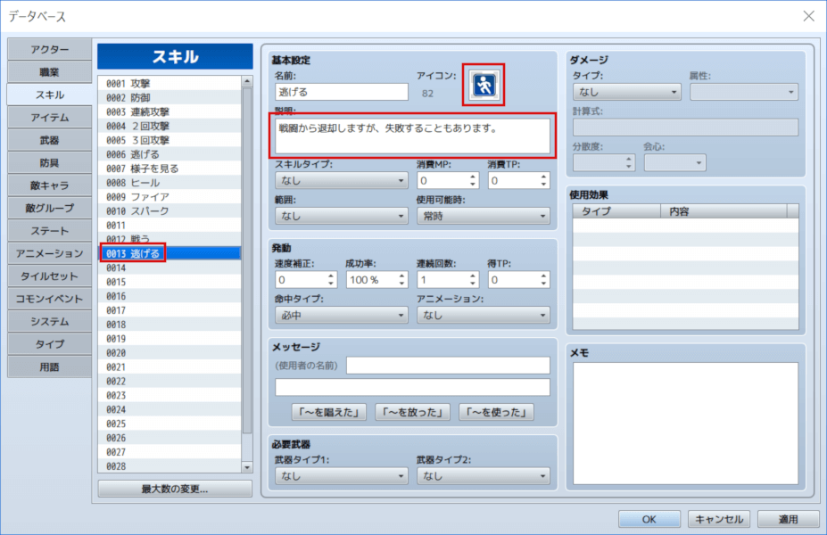
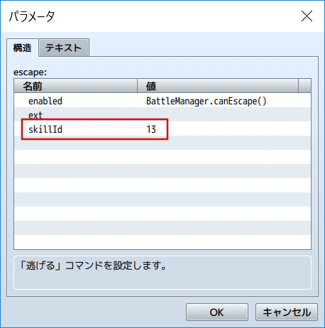
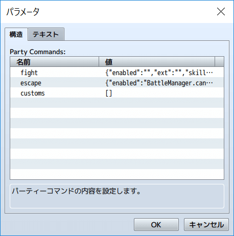
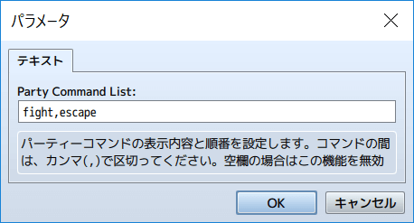
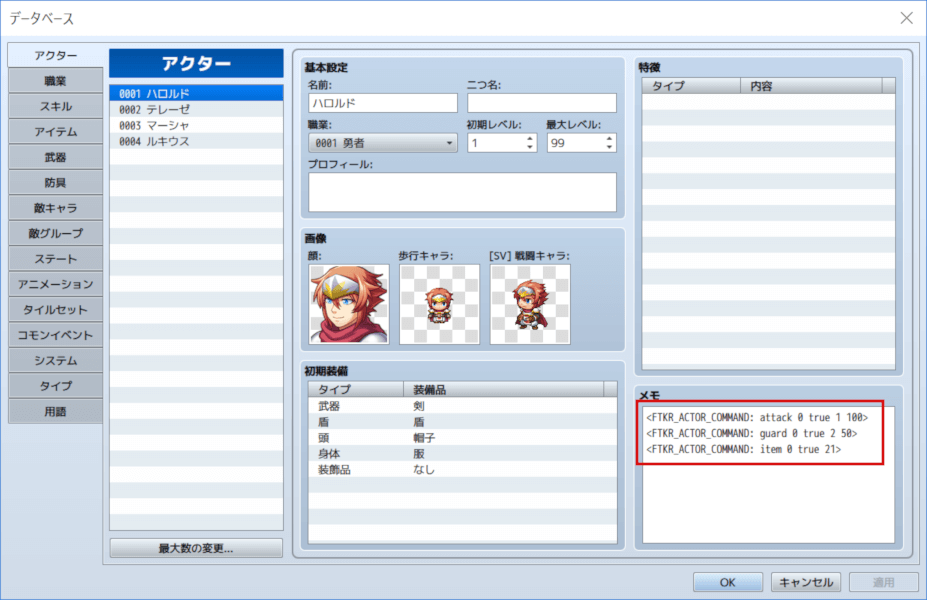
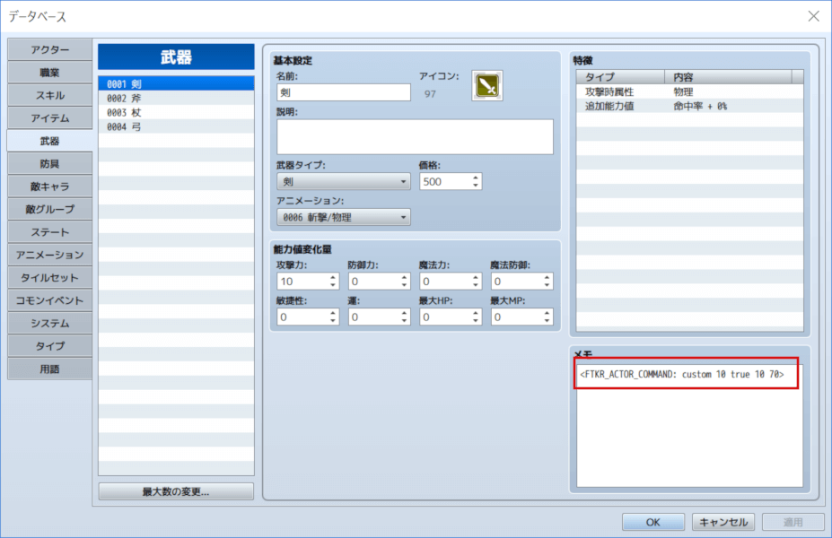
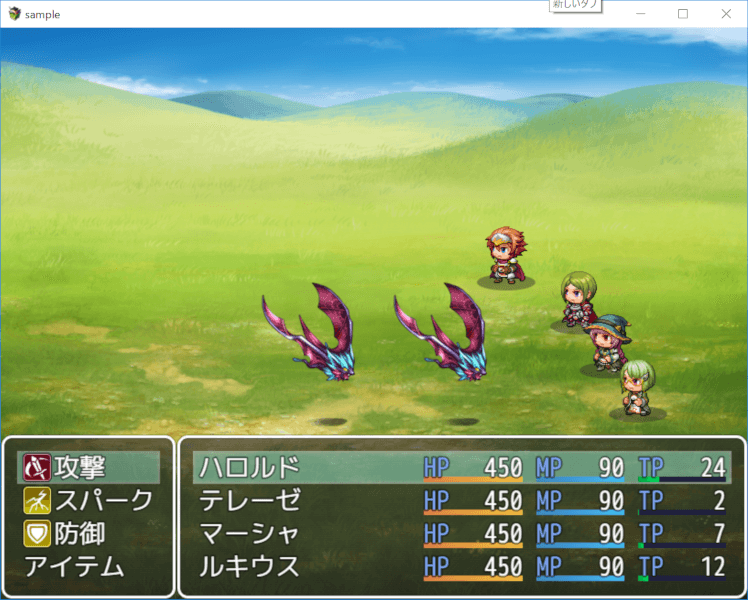

[トップページに戻る](README.md)

# [FTKR_ExBattleCommand](FTKR_ExBattleCommand.js) プラグイン

アクターのバトルコマンドの表示を変更するプラグインです。

ダウンロード: [FTKR_ExBattleCommand.js](https://raw.githubusercontent.com/futokoro/RPGMaker/master/FTKR_ExBattleCommand.js)

## 目次

以下の項目の順でプラグインの使い方を説明します。
1. [概要](#概要)
2. [プラグインの登録](#プラグインの登録)
1. [パーティーコマンドの設定方法](#パーティーコマンドの設定方法)
    1. [パーティーコマンドにアイコンと説明文を追加する](#パーティーコマンドにアイコンと説明文を追加する)
    1. [パーティーコマンドの表示内容設定](#パーティーコマンドの表示内容設定)
    1. [パーティーコマンドの並び](#パーティーコマンドの並び)
1. [アクターコマンドの設定方法](#アクターコマンドの設定方法)
    1. [アクターコマンドを変更する](#アクターコマンドを変更する)
    1. [コマンドの設定](#コマンドの設定)
1. [コマンドの表示内容の変更](#コマンドの表示内容の変更)
* [プラグインの更新履歴](#プラグインの更新履歴)
* [ライセンス](#ライセンス)

## 概要

アクターのバトルコマンドを変更します。
変更可能な項目は以下の通りです。

1. パーティーコマンドやアクターコマンドにアイコンや説明文を表示できます。
2. パーティーコマンドの表示内容や順番を設定できます。
3. アクターコマンドの表示内容をアクター毎に設定できます。
4. アクターコマンドに直接スキルを設定できます。



[目次に戻る](#目次)

## プラグインの登録

以下のプラグインと組み合わせる場合は、プラグイン管理画面で、以下の順の配置になるように登録してください。
```
FTKR_AlternatingTurnBattle.js
FTKR_AISkillEvalute.js
↑このプラグインよりも上に登録↑
FTKR_ExBattleCommand.js
↓このプラグインよりも下に登録↓
FTKR_BattleActionPoints.js
FTKR_DisplayCommandFrame.js
```

[目次に戻る](#目次)

# パーティーコマンドの設定方法

## パーティーコマンドにアイコンと説明文を追加する

### データベースのスキルにコマンドの参照先を用意する

アイコンと説明文を入力します。
スキルの名前はコマンドと同じにする必要はありませんが、わかりやすさから同じにしておくといいと思います。



### プラグインパラメータにスキルIDを登録する

プラグインパラメータ`Party Commands`の設定したいコマンドを選択し、そのパラメータの`skillId`に、先ほど作成したスキルIDを登録します。

`fight`なら「戦う」、`escape`なら「逃げる」コマンドです。



プラグインパラメータ`Show Command Icon`を有効に設定することで、コマンドにアイコンを追加できます。

プラグインパラメータ`Show Command Description`を有効に設定することで、コマンドにカーソルを合わせている間、コマンドの説明文を表示させることができます

### 戦闘画面で確認

設定したコマンドにアイコンが追加され、コマンドにカーソルを合わせると、説明文を表示します。


[目次に戻る](#目次)

## パーティーコマンドの表示内容設定
プラグインパラメータ`Party Commands`で、パーティーコマンドの表示内容を設定できます。



## 「戦う」コマンド
### 設定対象
`fight`

### パラメータ
* enabled
    * 実行するための条件を設定する場合に、スクリプトで入力してください。空欄の場合は、常に実行可能です。
* ext
    * 入力不要です。
* skillId
    * アイコンや説明文を表示させたい場合に、参照先のスキルIDを設定してください。

[目次に戻る](#目次)

## 「逃げる」コマンド
### 設定対象
`escape`

### パラメータ
* enabled
    * 実行するための条件を設定する場合に、スクリプトで入力してください。空欄の場合は、常に実行可能です。
* ext
    * 入力不要です。
* skillId
    * アイコンや説明文を表示させたい場合に、参照先のスキルIDを設定してください。

[目次に戻る](#目次)

## その他のコマンド
リスト形式で、複数のコマンドを追加できます。
他のプラグインでコマンドを追加している場合は、ここで追加しないと表示されません。

設定する内容は、各プラグインのコマンドの仕様に合わせてください。

### 設定対象
`customs`

### パラメータ
* name
    * 表示させるコマンド名です。
* symbol
    * コマンドの仕様に合わせて入力してください。
* enabled
    * コマンドの仕様に合わせて、スクリプトで入力してください。空欄の場合は、常に実行可能にできます。
* ext
    * コマンドの仕様に合わせて入力してください。
* skillId
    * アイコンや説明文を表示させたい場合に、参照先のスキルIDを設定してください。

[目次に戻る](#目次)

## パーティーコマンドの並び
プラグインパラメータ`Party Command List`で、パーティーコマンドの表示順番を設定できます。
テキスト入力で、以下の英字を表示させたい順番に、カンマ(,)で区切って入力してください。

空欄にした場合は、このプラグインの設定を無視します。

* fight- 「戦う」コマンド
* escape  - 「逃げる」コマンド
* custom* - プラグインパラメータ`Party Commands`の`customs`に追加したコマンド
    * custom* の部には、リストの番号を記載します。

### 入力例

※半角スペースは入れない



[目次に戻る](#目次)

# アクターコマンドの設定方法

各アクターが使用できるアクターコマンドを個別に設定できます。
さらに、職業や武器などにも設定することで、付け替えでアクターコマンドをゲーム中に変更することができます。

## アクターコマンドを変更する

### 表示させるコマンドをメモ欄に設定する

下の図のように、データベースのメモ欄にコマンド設定用のタグを記入することで、表示させるコマンドを設定できます。

例) アクターに直接設定<br>
複数のコマンドを設定する場合は、タグを複数記述します。
下の例では、「攻撃」「防御」「アイテム」を設定しています。


例) 武器にコマンドを設定<br>
武器や防具など、アクター以外にもコマンドの設定は可能です。
下の場合では、`custom`で直接スキルをコマンドに表示させる設定です。
この武器を装備している間に設定したコマンドが追加されます。


### 戦闘画面で確認
アクターに設定した３つのコマンドと、武器に設定したコマンド「スパーク」の合計４つが表示されました。<br>
「スパーク」のコマンドが、アクターで設定したコマンドの間に表示されていますが、コマンドの表示順もタグの内容で自由に設定できます。



## コマンドの設定
次のタグで、コマンドを１つ設定できます。
複数のコマンドを設定する場合は、タグを複数設定してください。

このタグによるコマンドの設定が１つもない場合は、このプラグインの機能を無効にして、標準のアクターコマンドを表示します。

### タグ
`<FTKR_ACTOR_COMMAND: type ext enabled skillId priority>`
* type : コマンドの種類に合わせて、以下の英字を指定します。
    * attack : 「攻撃」コマンド
    * guard : 「防御」コマンド
    * skill : 「スキル」コマンド(extでスキルタイプを指定)
    * item : 「アイテム」コマンド
    * custom : 追加コマンド(extで実行するスキルIDを指定)
* ext : 「スキル」コマンドの場合は、ここでスキルタイプIDを指定します。追加コマンドの場合は、実行するスキルのIDを指定します。それ以外のコマンドの場合は 0 にしてください。
* enabled : 実行するための条件を設定する場合に、スクリプトで入力してください。条件を指定しない場合は true にしてください。
* skillId : アイコンや説明文を表示させたい場合に、参照先のスキルIDを設定してください。追加コマンドの場合は、実行するスキルとアイコンや説明文の参照先のスキルを変えることもできます。不要の場合は 0 にしてください。
* priority : コマンドの表示順番を決めるための表示優先度を数値で入力します。数値が大きいほうを上に表示します。

#### スクリプトの記述について

* `this._actor`でコマンド選択中のアクターデータを参照できます。
    * 例：`this._actor.isStateAffected(ステートID)`でステートIDが付与されているか判定。
* 条件式を記述する場合、スペースを空けてはいけません。
    * 例：アクターの残りHPが100より多い場合を判定する式で、`this._actor.hp > 100`はNGです。`this._actor.hp>100`にして下さい。
* ダメージ計算式で使用可能な`a`や`b`などの省略記述は使えません。

### データベースでの対象
アクター、職業、武器、防具、ステート

### 効果内容
設定した内容に合わせて、アクターが行動時に選択可能なコマンドを追加します。
最終的に使用可能なアクターコマンドは、職業や武器、防具などのすべての設定を合わせたものになります。

### 入力例
#### 標準と同じコマンドにする場合
```
<FTKR_ACTOR_COMMAND: attack>
<FTKR_ACTOR_COMMAND: guard>
<FTKR_ACTOR_COMMAND: skill 1>
<FTKR_ACTOR_COMMAND: item>
```
`skill 1`でスキルタイプID 1（標準の場合「魔法」）のコマンドを設定できます。
実行条件やスキルID、表示優先度の設定が不要なら、これらの記述は不要です。
この場合、タグを登録した順番にコマンドが並びます。

#### 参照先のスキルを設定する場合
```
<FTKR_ACTOR_COMMAND: attack 0 true 1>
<FTKR_ACTOR_COMMAND: guard 0 true 2>
<FTKR_ACTOR_COMMAND: skill 1 true 20>
<FTKR_ACTOR_COMMAND: item 0 true 21>
```
アイコンや説明文を表示させたい場合には、`ext`と`enabled`部も入力が必要です。
表示優先度の設定がないため、上から順番にコマンドが並びます。

#### 複数のデータベースでコマンドを設定する場合
アクターA
```
<FTKR_ACTOR_COMMAND: attack 0 true 1 100>
<FTKR_ACTOR_COMMAND: guard 0 true 2 50>
<FTKR_ACTOR_COMMAND: item 0 true 21>
```
アクターAは、標準で「攻撃」「防御」「アイテム」のコマンドを持っています。

職業B
```
<FTKR_ACTOR_COMMAND: skill 1 true 10 20>
```
職業Bについているアクターは、「魔法」のコマンドが追加されます。
このコマンドの表示優先度は 20 のため、アクターAの場合は「防御」と「アイテム」の間に表示します。

武器C
```
<FTKR_ACTOR_COMMAND: custom 10 true 10 70>
```
武器Cを装備しているアクターは、スキルID 10 のスキルが、直接コマンドに追加されます。
このコマンドの表示優先度は 70 のため、アクターAの場合は「攻撃」と「防御」の間に表示します。

[目次に戻る](#目次)

# コマンドの表示内容の変更

パーティーコマンドやアクターコマンドは、通常、コマンド名のみ表示されます。
このプラグインを使うことで、コマンドの横にアイコンを追加したり、コマンドにカーソルを合わせている間、コマンドの説明文を表示させることができます。

アイコンと説明文は同時に表示させることができます。

[目次に戻る](#目次)

## コマンドにアイコンを追加
プラグインパラメータ`Show Command Icon`を有効に設定することで、コマンドにアイコンを追加できます。

アイコンを追加するためには、各コマンドに参照先のスキルを設定する必要があります。
そのスキルに設定されたアイコンが、コマンドのアイコンとして表示されます。

パーティーコマンドの場合は、 プラグインパラメータ`Party Commands`の`skillId`に、参照先のスキルIDを指定してください。

アクターコマンドの場合は、メモ欄に追記するタグの`skillId`に、参照先のスキルIDを指定してください。

[目次に戻る](#目次)

## コマンドに説明文を追加
プラグインパラメータ`Show Command Description`を有効に設定することで、コマンドにカーソルを合わせている間、コマンドの説明文を表示させることができます

説明文を表示するためには、各コマンドに参照先のスキルを設定する必要があります。
そのスキルに設定された説明文が、コマンドの説明文として表示されます。

説明文は、画面上部にウィンドウで表示されます。

パーティーコマンドの場合は、 プラグインパラメータ`Party Commands`の`skillId`に、参照先のスキルIDを指定してください。

アクターコマンドの場合は、メモ欄に追記するタグの`skillId`に、参照先のスキルIDを指定してください。

[目次に戻る](#目次)

# プラグインの更新履歴

| バージョン | 公開日 | 更新内容 |
| --- | --- | --- |
| [ver2.0.1](FTKR_ExBattleCommand.js) | 2018/12/11 | パーティーコマンドに追加コマンドを設定するとエラーになる不具合を修正 |
| ver2.0.0 | 2018/12/10 | データベースのスキルを使って、コマンドのアイコンや説明文を設定するように変更<br>アクターコマンドの設定方法を変更（タグ変更、プラグインパラメータ削除）<br>カスタムコマンドの表示条件を設定する機能を削除<br>コストを表示する機能を削除 |
| [ver1.2.2](archive/FTKR_ExBattleCommand_1.2.2.js) | 2018/10/09 | 説明文を表示した状態でパーティーコマンドを表示させた場合に、説明文がそのまま残ってしまう不具合を修正 |
| ver1.2.1 | 2018/10/05 | カスタムコマンドのコストを非表示にしていても、コマンド名が左右につぶれて表示してしまう不具合を修正 |
| ver1.2.0 | 2018/10/05 | カスタムコマンド選択時にスキルに設定した説明文を表示する機能を追加 |
| ver1.1.0 | 2018/04/09 | FTKR_AlternatingTurnBattle.jsの v1.1.0 に対応<br>パーティーコマンドの表示順番を設定する機能を追加<br>カスタムコマンドのコストを表示する機能を追加 |
| ver1.0.1 | 2018/03/27 | 複数の特徴欄で同じスキルタイプを追加したときに、コマンドが重複して表示してしまう不具合を修正 |
| ver1.0.0 | 2017/11/25 | 初版作成 |

# ライセンス

本プラグインはMITライセンスのもとで公開しています。

[The MIT License (MIT)](https://opensource.org/licenses/mit-license.php)

#
[目次に戻る](#目次)

[トップページに戻る](README.md)