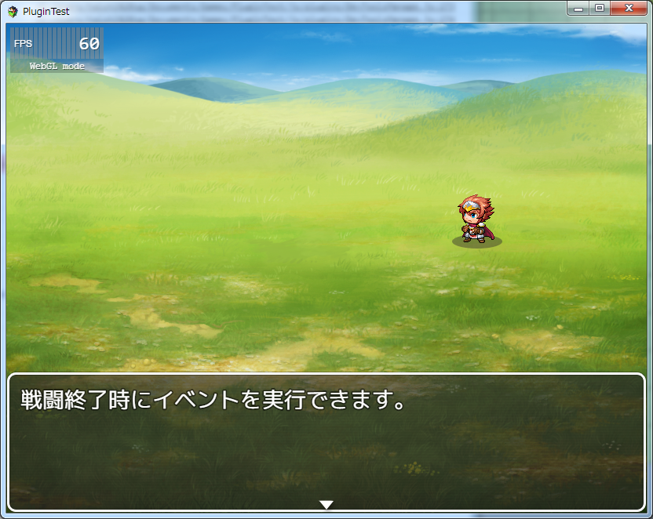
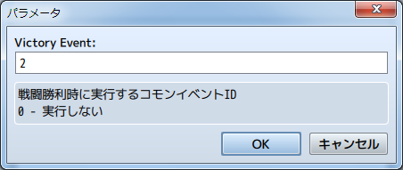
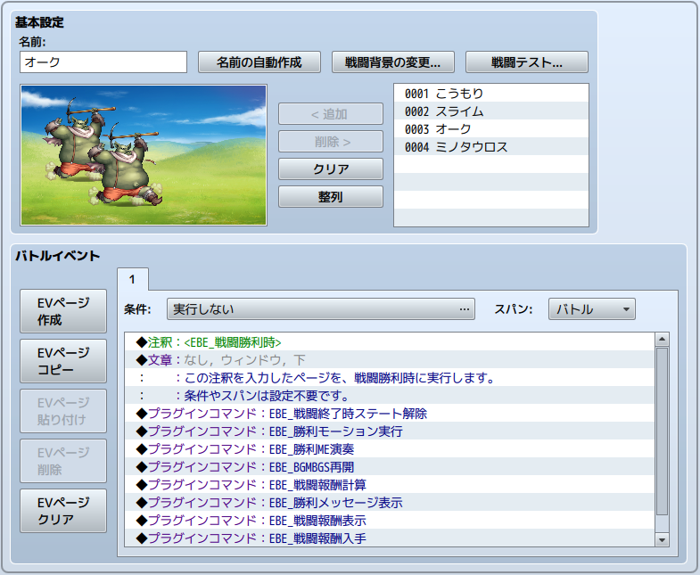
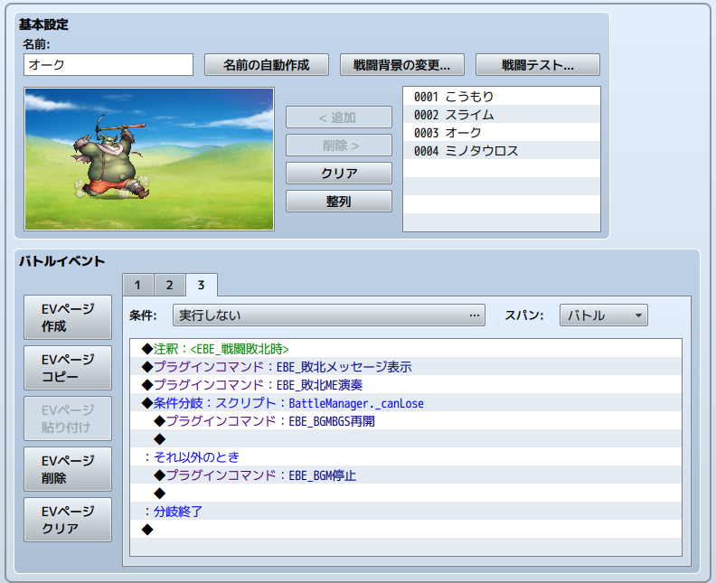
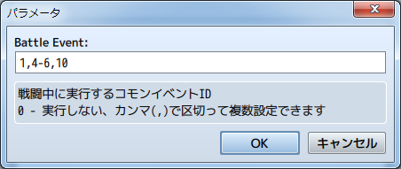
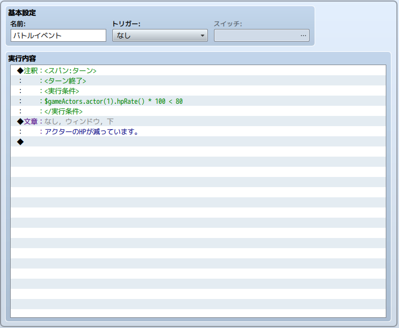
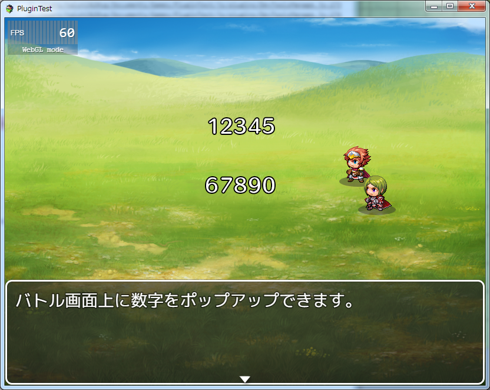

[トップページに戻る](README.md)

# [FTKR_ExBattleEvent](FTKR_ExBattleEvent.js) プラグイン

バトルイベントを拡張するプラグインです。

ダウンロード: [FTKR_ExBattleEvent.js](https://raw.githubusercontent.com/futokoro/RPGMaker/master/FTKR_ExBattleEvent.js)

# 目次

以下の項目の順でプラグインの使い方を説明します。
1. [概要](#概要)
1. [プラグインの登録](#プラグインの登録)
1. [戦闘勝利時のイベントの設定](#戦闘勝利時のイベントの設定)
1. [戦闘敗北時のイベントの設定](#戦闘敗北時のイベントの設定)
1. [戦闘中のイベントの設定](#戦闘中のイベントの設定)
1. [プラグインコマンド](#プラグインコマンド)
* [プラグインの更新履歴](#プラグインの更新履歴)
* [ライセンス](#ライセンス)

# 概要

本プラグインを実装することで、バトルイベントを拡張します。

１．通常の戦闘勝利時の処理(*1)の前に、コモンイベントまたは敵グループに設定したイベントを実行します。

２．通常の戦闘敗北時の処理(*1)の前に、コモンイベントまたは敵グループに設定したイベントを実行します。

３．バトル中に、バトルイベントとしてコモンイベントを実行します。

(*1)戦闘終了時のステートの解除から、勝利等のメッセージ、戦闘報酬の処理など

イベントの処理が終了すると、バトル画面が終了します。



[目次に戻る](#目次)

# プラグインの登録

[FTKR_ExVariablesChange](FTKR_ExVariablesChange.ja.md)プラグインと組み合わせて使用する場合は、当プラグインを上にしてください。

[FTKR_CSS_CustomizeBattleResults](FTKR_CSS_CustomizeBattleResults.ja.md)と組み合わせて使用する場合は、当プラグインを下にしてください。

```
FTKR_CSS_CustomizeBattleResults.js
FTKR_ExBattleEvent.js
FTKR_ExVariablesChange.js
```
順番が逆(当プラグインが下)の場合、正常に動作しません。
また、戦闘終了時の処理は、戦闘勝利イベントや敗北イベントの後に実行します。

[目次に戻る](#目次)

# 戦闘勝利時のイベントの設定

通常の戦闘勝利時の処理前に、コモンイベントまたは敵グループに設定したイベントを実行します。
実行するイベントは以下のいずれかです。

１．プラグインパラメータ`<Victory Event>`に設定したIDのコモンイベント



２．敵グループのバトルイベントで、注釈で`<EBE_戦闘勝利時>`と記入したページ



１と２どちらもある場合は、バトルイベントを実行します。

バトルイベント内では、`this._eventId` で敵グループIdを取得できます。

## 戦闘勝利時の処理について
プラグインパラメータ`<Custom Victory Event>`を 1 に設定していると、戦闘終了時の処理を独自に設定することができます。

通常、戦闘勝利時には以下の処理を実行しています。
独自処理にする場合、これらの処理が必要な場合はイベント内で実行しなくてはいけません。

### １．戦闘終了時のステート解除

パーティー内に、戦闘終了時に解除されるステートを受けている場合にそれを解除します。

プラグインコマンド
```
EBE_戦闘終了時ステート解除
EBE_REMOVE_BATTLE_STATES
```

### ２．勝利モーションの実行

パーティーメンバーが、戦闘勝利モーションを実行します。

プラグインコマンド
```
EBE_勝利モーション実行
EBE_PREFORM_VICTORY
```

### ３．勝利MEの演奏

データベースの[システム]-[音楽]で設定した勝利MEを演奏します。

プラグインコマンド
```
EBE_勝利ME演奏
EBE_PLAY_VICTORY_ME
```

### ４．BGMBGSの再開

戦闘前のBGMとBGSを再開します。

プラグインコマンド
```
EBE_BGMBGS再開
EBE_REPLAY_BGM_AND_BGS
```

### ５．戦闘報酬の計算

経験値やお金、アイテムの計算を行います。
入手するアイテムはこのコマンドで選定されます。

プラグインコマンド
```
EBE_戦闘報酬計算
EBE_MAKE_REWARDS
```

### ６．勝利メッセージの表示

データベースの[用語]-[メッセージ]で設定した勝利メッセージを表示します。<br>
半角スペースを空けて"-s"を付けると、メッセージを閉じるまでイベント処理を止めます。


プラグインコマンド
```
EBE_勝利メッセージ表示 (-s)
EBE_DISPLAY_VICTORY_MESSAGE (-s)
```

### ７．戦闘報酬の表示

戦闘報酬の計算結果に合わせて、データベースの[用語]-[メッセージ]で設定したメッセージを表示します。<br>
半角スペースを空けて"-s"を付けると、メッセージを閉じるまでイベント処理を止めます。
プラグインコマンド
```
EBE_戦闘報酬表示 (-s)
EBE_DISPLAY_REWARDS (-s)
```

なお、FTKR_CSS_CustomizeBattleResultsプラグインがあると、以下のプラグインコマンドで専用の戦闘結果画面を表示させることができます。
```
CBR_戦績画面表示
CBR_SHOW_BATTLE_RESULT
```

### ８．戦闘報酬の入手

戦闘報酬の計算結果をパーティーメンバーに反映します。
このコマンドを実行しないと、経験値やお金アイテムは実際に入手できません。

プラグインコマンド
```
EBE_戦闘報酬入手
EBE_GAIN_REWARDS
```

[目次に戻る](#目次)

# 戦闘敗北時のイベントの設定

通常の戦闘敗北時の処理の前に、コモンイベントまたは敵グループに設定したイベントを実行します。
実行するイベントは以下のいずれかです。

１．プラグインパラメータ`<Defeat Event>`に設定したIDのコモンイベント<br>
２．敵グループのバトルイベントで、注釈で`<EBE_戦闘敗北時>`と記入したページ



１と２どちらもある場合は、バトルイベントを実行します。

バトルイベント内では、`this._eventId` で敵グループIdを取得できます。

## 戦闘敗北時の処理について
プラグインパラメータ`<Custom Defeat Event>`を 1 に設定していると、戦闘終了時の処理を独自に設定することができます。

通常、戦闘敗北時には以下の処理を実行しています。
独自処理にする場合、これらの処理が必要な場合はイベント内で実行しなくてはいけません。

### １．敗北メッセージの表示

データベースの[用語]-[メッセージ]で設定した敗北メッセージを表示します。<br>
半角スペースを空けて"-s"を付けると、メッセージを閉じるまでイベント処理を止めます。


プラグインコマンド
```
EBE_敗北メッセージ表示 (-s)
EBE_DISPLAY_DEFEAT_MESSAGE (-s)
```

### ２．敗北MEの演奏

データベースの[システム]-[音楽]で設定した敗北MEを演奏します。

プラグインコマンド
```
EBE_敗北ME演奏
EBE_PLAY_DEFEAT_ME
```

### ３．BGMBGSの再開またはBGMの停止

戦闘前のBGMとBGSを再開するか、またはBGMを停止します。
マップイベントで戦闘の敗北を許可しているかどうかで条件分岐します。

戦闘の敗北フラグ
```
BattleManager._canLose
```

BGMBGSの再開のプラグインコマンド
```
EBE_BGMBGS再開
EBE_REPLAY_BGM_AND_BGS
```

BGMの停止のプラグインコマンド
```
EBE_BGM停止
EBE_STOP_BGM
```

 [目次に戻る](#目次)

# 戦闘中のイベントの設定
敵グループに設定するバトルイベントの替わりに、コモンイベントを実行します。

実行するイベントは以下のとおりです。

１．プラグインパラメータ`<Battle Event>`に設定したIDのコモンイベントの中で実行条件を満たすイベント。

プラグインパラメータ`<Battle Event>`にはカンマ(,)とハイフン(-)を使うことで複数のコモンイベントIDを設定できます。
ハイフン(-)は、繋げた前後のIDの間のすべてのIDを登録します。



複数のイベントIDを入力した場合、入力した順番(左から)に実行条件を判定して、条件を満たしていればそのイベントを実行します。

## 戦闘中のコモンイベントの実行条件の設定

コモンイベントに以下の注釈を入力することで、実行条件を設定できます。



### 実行スパンの設定
```
<スパン: [タイミング]>
<SPAN: [TIMING]>
```
実行回数に関する条件を設定します。
スパンを指定しない場合は、戦闘中に１回だけ実行します。<br>
[タイミング] には以下を入力してください。
* バトル or BATTLE - 戦闘中に１回だけ実行します。
* ターン or TURN   - ターン中に１回だけ実行します。
* モーメント or MOMENT - 条件を満たす度に実行します。

### ターン終了時に実行
```
<ターン終了>
<TURNEND>
```
ターン終了時に実行します。

### 指定ターンに実行
```
<ターン:a + b *X>
<TURN:a + b *X>
```
指定したターンに実行します。
a と b に数値を入力してください。(* と X は半角, XはそのままXと入力)
* a - 最初に実行するターン数
* b - 次に何ターン後に実行するか(以降この値のターンが経過する毎に実行)
例)
```
<ターン:1 + 2 *X>
<TURN:2 + 4 *X>
```

### 敵キャラの残りHPで実行
```
<敵キャラHP: #a b %以下>
<ENEMY_HP: #a LESS THAN b %>
```
指定した敵キャラのHP残量によって実行します。
a と b に数値を入力してください。(# と % は半角)<br>
a と b の間には必ず半角スペースを入れてください。
* a - 敵キャラの番号(グループに追加した順番)
* b - 残りHPの割合値
例)
```
<敵キャラHP: #1 50 %以下>
<ENEMY_HP: #2 LESS THAN 70 %>
```

### アクターの残りHPで実行
```
<アクターHP: #a b %以下>
<ACTOR_HP: #a LESS THAN b %>
```
指定したアクターのHP残量によって実行します。
a と b に数値を入力してください。(# と % は半角)<br>
a と b の間には必ず半角スペースを入れてください。
* a - アクターID
* b - 残りHPの割合値
例)
```
<アクターHP: #1 50 %以下>
<ACTOR_HP: #2 LESS THAN 70 %>
```

### スイッチで実行
```
<スイッチ: a>
<SWITCH: a>
```
指定したスイッチがONの時に実行します。
a に数値を入力してください。
* a - スイッチID

### JavaScript計算式で条件を設定
```
<実行条件>
条件式
</実行条件>
```
または
```
<Conditions>
code
</Conditions>
```
条件式(code)で記述したJavaScript計算式を判定して実行します。
 
 [目次に戻る](#目次)

# プラグインコマンド

バトルイベント用に以下のプラグインコマンドが使用できます。

1. [パーティーメンバーに指定のモーションをとらせる](#パーティーメンバーに指定のモーションをとらせる)
2. [戦闘を再開する](#戦闘を再開する)
3. [画面に数字をポップアップさせる](#画面に数字をポップアップさせる)
4. [戦闘行動を再設定する](#戦闘行動を再設定する)

## パーティーメンバーに指定のモーションをとらせる
```
EBE_モーション実行 [モーション名] [対象メンバー]
EBE_REQUEST_MOTION [MOTION NAME] [TARGET MEMBER]
```
モーション名(MOTION NAME)には以下を入力してください。(要小文字)
```
walk, wait, chant, guard, damage, evade, thrust, swing,
missile, skill, spell, item, escape, victory, dying,
abnormal, sleep, dead,
```
対象メンバーには以下を入力してください。
空欄の場合は、すべてのメンバーを対象にします。
* 0~ - 先頭を 0番としたときの隊列順
* 全員 or ALL - すべてのメンバー

例)
```
EBE_モーション実行 victory 1
EBE_REQUEST_MOTION wait ALL
```

## 戦闘を再開する
```
EBE_戦闘再開
EBE_RESTART_BATTLE
```
勝利イベントや敗北イベントはイベント終了時にバトルが終了しますがこのコマンドを実行することで、バトルを再開します。
ただし、エネミーが何もいない場合や、アクターが全員戦闘不能な場合はバトルを再開しても、すぐに勝利イベントや敗北イベントを再度実行します。

このコマンドがイベント中常に実行する場合はバトルが終わりません。
バトルを終わらせる時に、条件分岐等で再開コマンドを実行しないようにイベントを組んでください。

## 画面に数字をポップアップさせる
```
EBE_数字ポップアップ [スプライト番号] [設定内容]
EBE_POPUP_NUMBER [SPRITE_NUMBER] [SETTING]
```

画面に数字をポップアップさせます。
スプライト番号を変えることで、複数の数字を表示できます。



設定内容には以下を入力してください。(順不同)<br>
なお、数値には`\V[x]`でゲーム内変数を指定できます。

```
表示内容 [数値]
VALUE [Number]
```
- 入力した数値を画面に表示します。

```
画像番号 [数値]
IMAGENUM [Number]
```
- 使用する画像は ダメージポップアップ用の img/system/damage.png です。<br>
上から 0番として、指定した列の数字スプライトを使用します。
指定しない場合は、0番(白)を使用します。

```
表示時間 [数値]
DURATION [Number]
```
- ポップアップする時間を指定します。(デフォルト 30)<br>
実際の表示時間は、この値と表示する数字の桁数を掛けた値です。<br>
10未満の数値になると、スプライト画像の透明度が上がります。
0で透明(非表示)になります。

```
表示差 [数値]
DIFF_COUNT [Number]
```
- 数字の桁毎の表示タイミングのずれを指定します。(デフォルト 0)

```
ポップアップ高さ [高さ] [差分]
POPUP_HEIGHT [Number] [Offset]
```
- ポップアップする高さを指定します。<br>
高さで、基準の高さを指定します。(デフォルト 40)<br>
差分で、桁毎の高さの差を指定します。(デフォルト 0.5)<br>
差分は変えたい場合にのみ指定してください。
```
表示座標 [X] [Y]
POSITION [X] [Y]
```
- スプライト画像を表示する位置を指定します。

```
消去しない
REMAIN
```
- この引数を入力すると透明度が変化せず、画面に表示しつづけます。

```
消去
ERASE
```
- この引数を入力すると、指定したスプライト番号の画像を消します。

例)
```
EBE_数字ポップアップ 1 表示内容 1234 表示座標 100 100
EBE_POPUP_NUMBER 1 VALUE 1234 POSITION 100 100

EBE_数字ポップアップ 2 画像番号 1 表示内容 12345 表示座標 100 100 消去しない
EBE_POPUP_NUMBER 2 IMAGENUM 1 VALUE 12345 POSITION 100 100 REMAIN

EBE_数字ポップアップ 1 消去
EBE_POPUP_NUMBER 1 ERASE
```

## 戦闘行動を再設定する
```
EBE_敵キャラの戦闘行動の設定 [メンバーID]
EBE_BATTLE_ENEMY_ACTION [MEMBERID]
```

指定の敵キャラの戦闘行動を再設定します。
敵キャラがターン開始時に行動を設定してからターン中に行動する間にこのコマンドを実行することで、行動を変えることができます。

メンバーIDには以下を入力してください。
* 0~ - 敵グループに追加した順番に最初を 0番として、敵キャラを指定します

### 参考
指定の敵キャラが行動済みかどうかを調べるスクリプト
```
BattleManager.isActedEnemy(メンバーID)
```

[目次に戻る](#目次)

# プラグインの更新履歴

| バージョン | 公開日 | 更新内容 |
| --- | --- | --- |
| [ver1.3.3](FTKR_ExBattleEvent.js) | 2018/02/19 | Custom Victory Eventが0の時に、戦闘勝利イベントを実行すると戦闘勝利回数が2回増加してしまう不具合を修正 |
| ver1.3.2 | 2018/01/13 | メッセージ表示関係のプラグインコマンドに、イベント処理を止める機能を追加 |
| ver1.3.1 | 2018/01/12 | 戦闘終了時イベント中にウェイトコマンドを実行すると、アクターのモーションが正常に再生されない不具合を修正 |
| ver1.3.0 | 2017/06/30 | 戦闘終了時のイベントの後に、MVデフォルトの戦闘終了処理を実行する機能を追加 |
| ver1.2.0 | 2017/06/01 | 敵キャラの戦闘行動を再設定するプラグインコマンドを追加 |
| ver1.1.0 | 2017/05/26 | バトル中にコモンイベントを実行できる機能を追加<br>モーション実行コマンドにアクターを対象にできる機能を追加<br>画面に数字をポップアップさせるプラグインコマンドを追加 |
| ver1.0.0 | 2017/05/25 | 初版公開 |

# 拡張プラグイン

以下のプラグインを使用することで、本プラグインの機能を拡張できます。

* [FTKR_SetupTroops.js](FTKR_SetupTroops.ja.md) - バトル中に敵グループに設定していないエネミーを追加できます。
* [FTKR_ExVariablesChange](FTKR_ExVariablesChange.ja.md) - バトル中にイベントに拠らずに変数を操作できます。

# ライセンス

本プラグインはMITライセンスのもとで公開しています。

[The MIT License (MIT)](https://opensource.org/licenses/mit-license.php)

#
[目次に戻る](#目次)

[トップページに戻る](README.md)