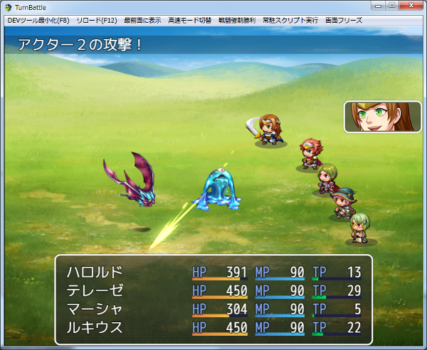

[トップページに戻る](README.md)

# [FTKR_ExForceAction](FTKR_ExForceAction.js) プラグイン

戦闘行動の強制コマンドの機能を拡張するプラグインです。

ダウンロード: [FTKR_ExForceAction.js](https://raw.githubusercontent.com/futokoro/RPGMaker/master/FTKR_ExForceAction.js)

## 目次

以下の項目の順でプラグインの使い方を説明します。
1. [概要](#概要)
* [プラグインの更新履歴](#プラグインの更新履歴)
* [ライセンス](#ライセンス)

## 概要

イベントコマンドの「戦闘行動の強制」の動作を変更できます。
プラグインパラメータで変更してください。

下の図のように、画面に顔画像やSV戦闘キャラを追加で表示させることができるようになります。


また、イベントコマンドの「戦闘行動の強制」の替わりに、以下のプラグインコマンドを実行することで、イベントごとに動作を変えることができます。
※[]や()は実際の入力に使用しません

```
EFA_戦闘行動の強制 [主体分類] [主体ID] スキル [スキルID] 対象 [対象ID] (顔表示) (リセット無効) (行動追加)
EFA_FORCE_ACTION [battlerType] [battlerId] SKILL [skillId] TARGET [targetId] (SHOW_FACE) (DISABLE_RESET) (ADD_ACTION)
```

### 主体分類(battlerType)
行動させる主体キャラをどのように選ぶかを指定します。
以下の文字列を入力してください。
* アクターまたは Actor
* パーティー または Party
* 敵グループ または Troop

### 主体ID(battlerId)
主体分類に合わせて、以下のIDを指定します。
* アクターなら、主体のアクターID。
* パーティーなら、パーティー先頭を 1 とした並び順。
* 敵グループなら、敵グループ先頭を 1 とした並び順。
* \v[n] と指定することで変数 n の値を参照できます。

### スキル [スキルID]
### SKILL [skillId]
主体キャラに使用させるスキルのIDを指定します。
\v[n] と指定することで変数 n の値を参照できます。
主体キャラがアクターで、0 と指定した場合は、そのキャラが覚えているスキルから、自動戦闘と同じ手法でスキルと対象を自動選択します。

### 対象 [対象ID]
### TARGET [targetId]
主体キャラが使用するスキルの対象を指定します。
* パーティーなら、パーティー先頭を 1 とした並び順。
* 敵グループなら、敵グループ先頭を 1 とした並び順。
* \v[n] と指定することで変数 n の値を参照できます。

なお、スキルIDを 0 に設定した場合は、入力不要です。
 
### 顔表示(SHOW_FACE)
この文字列は必要な場合のみ入力してください。
この文字列を入力すると、スキル使用時に主体キャラがアクターかつ戦闘メンバー以外なら、データベースで設定された顔画像を画面右端に表示します。(*1)<br>
顔画像は、スキル動作が完了したら消えます。
この顔画像の表示サイズや位置は、プラグインパラメータで設定できます。

### キャラ表示(SHOW_CHARA)
この文字列は必要な場合のみ入力してください。
この文字列を入力すると、スキル使用時に主体キャラがアクターかつ戦闘メンバー以外なら、データベースで設定されたSV戦闘キャラを画面に表示しモーションを実行します。<br>
SV戦闘キャラは、スキル動作が完了したら消えます。
この機能はサイドビュー戦闘のみ有効です。

### リセット無効(DISABLE_RESET)
この文字列は必要な場合のみ入力してください。(*2)<br>
ツクールMVでは、戦闘行動の強制を実行した時に、主体キャラのその後の行動はすべてキャンセルしてしまいますが、この文字列を入力すると、リセットを無効にできます。

### 行動追加(ADD_ACTION)
この文字列は必要な場合のみ入力してください。(*2)<br>
この文字列を入力すると、アクターコマンドで予約していた行動とは別に指定したスキルを実行します。
この文字列を入力しない場合は、予約していた行動と入れ替わりでスキルを実行します。

### 使用例）
```
◆プラグインコマンド：EFA_戦闘行動の強制 アクター 3 スキル 5 対象 2
```
アクターID 3 のキャラに、スキルID 5 のスキルを使用します。
スキルの対象が味方の場合は、パーティーの２番目のキャラにスキルを使用します。
スキルの対象が敵の場合は、敵グループの２番目のキャラにスキルを使用します。

```
◆プラグインコマンド：EFA_戦闘行動の強制 アクター 5 スキル 0 顔表示 リセット無効 行動追加
```
アクターID 5 のキャラに、行動を追加して自動戦闘を行わせます。
顔画像を表示します。
 

### (*1)
顔画像の表示のためには、事前に画像の読込を行う必要があります。
メニューで表示していない場合など、一度も画像の読込を行っていない場合は
画像が正しく表示できない場合があります。
プラグインパラメータ `Load Face In Battle Start` を有効にすると
戦闘開始時に、すべてのアクターの顔画像を読み込むようになります。

### (*2)
この機能は、`FTKR_AlternatingTurnBattle.js`と組み合わせて使用する場合は無効です。
行動追加をさせたい場合は、`FTKR_AlternatingTurnBattle.js`のプラグインパラメータ
`Enable Force Action AC` を無効に設定してください。

[目次に戻る](#目次)

## プラグインの更新履歴

| バージョン | 公開日 | 更新内容 |
| --- | --- | --- |
| [ver1.1.1](FTKR_ExForceAction.js) | 2018/08/06 | スキルやアイテムで「逃げる」を実行した場合に、SVキャラが消えずに残ってしまう不具合を修正 |
| ver1.1.0 | 2018/05/01 | 戦闘行動の強制で、アイテムを使用できる機能を追加 |
| ver1.0.0 | 2018/04/14 | 初版公開 |

## ライセンス

本プラグインはMITライセンスのもとで公開しています。

[The MIT License (MIT)](https://opensource.org/licenses/mit-license.php)

#
[目次に戻る](#目次)

[トップページに戻る](README.md)