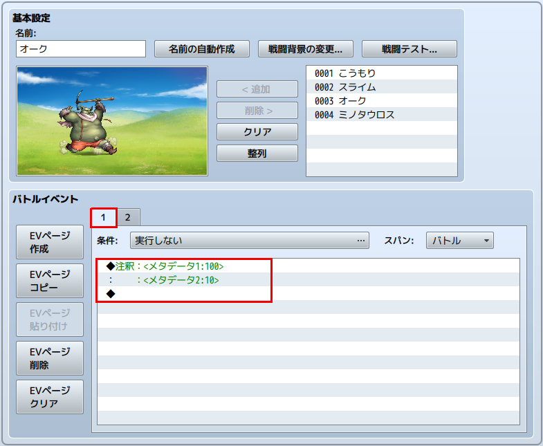
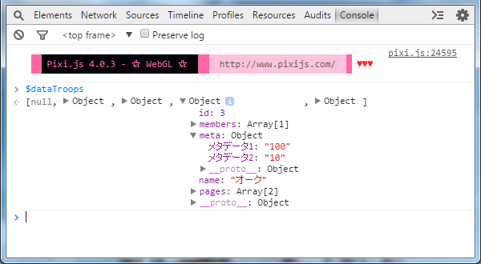

[トップページに戻る](README.md)

# [FTKR_ExMetaData](FTKR_ExMetaData.js) プラグイン

メタデータを拡張するプラグインです。

ダウンロード: [FTKR_ExMetaData.js](https://raw.githubusercontent.com/futokoro/RPGMaker/master/FTKR_ExMetaData.js)

## 目次

以下の項目の順でプラグインの使い方を説明します。
1. [概要](#概要)
* [プラグインの更新履歴](#プラグインの更新履歴)
* [ライセンス](#ライセンス)

## 概要

本プラグインは、下記のメタデータ(*1)を各オブジェクトデータに取り込みます。

(*1) `<name:data>`形式で記述したデータ

1. 敵グループのバトルイベント１ページ目の注釈内のメタデータをゲーム起動時に $dataTroops[n].meta に取り込みます。
   (n は敵グループID)

2. イベントの１ページ目の注釈内のメタデータを、マップのデータ読み込み時に $dataMap.events[n].meta に取り込みます。
   (n はイベントID)

[目次に戻る](#目次)

## 敵グループの設定例

下の図のように、バトルイベント１ページ目に注釈を追加し、注釈内でメタデータを記入してください。

このようにすると、ゲーム起動時に $dataTroops[n].meta に取り込みます。

[目次に戻る](#目次)

## プラグインの更新履歴

| バージョン | 公開日 | 更新内容 |
| --- | --- | --- |
| [ver1.0.1](FTKR_ExMetaData.js) | 2018/02/19 | 不具合修正 |
| ver1.0.0 | 2017/05/05 | 初版公開 |

## ライセンス

本プラグインはMITライセンスのもとで公開しています。

[The MIT License (MIT)](https://opensource.org/licenses/mit-license.php)

#
[目次に戻る](#目次)

[トップページに戻る](README.md)