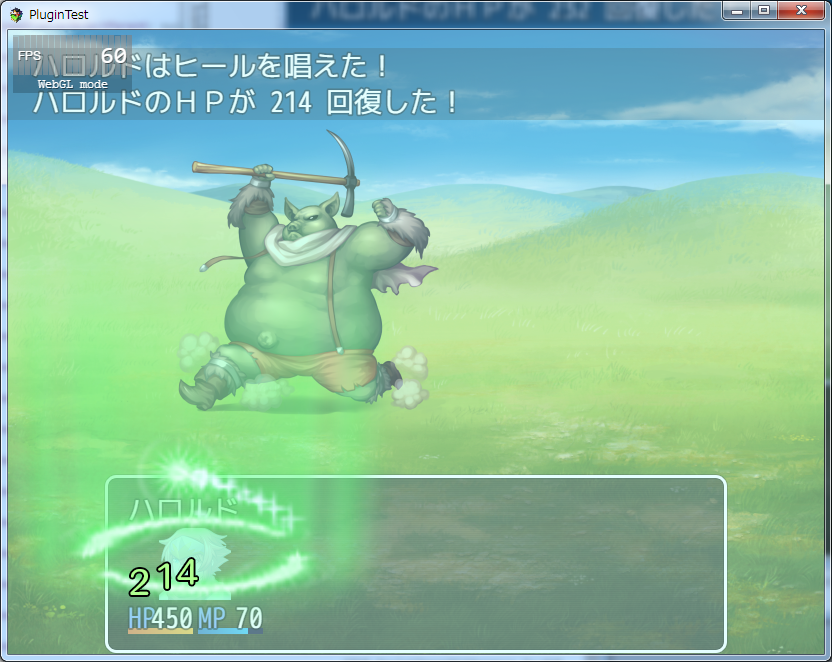

[トップページに戻る](README.md)

# [FTKR_FacialImageDifference](FTKR_FacialImageDifference.js) プラグイン

アクターの状態によって顔画像を変えるプラグインです。

ダウンロード: [FTKR_FacialImageDifference.js](https://raw.githubusercontent.com/futokoro/RPGMaker/master/FTKR_FacialImageDifference.js)

## 目次

以下の項目の順でプラグインの使い方を説明します。
1. [概要](#概要)
2. [プラグインの登録](#プラグインの登録)
2. [顔画像の変更機能が適用可能な対象について](#顔画像の変更機能が適用可能な対象について)
2. [アクターの顔画像にアニメーションを表示する](#アクターの顔画像にアニメーションを表示する)
2. [アクターの状態によって顔画像を変更する](#アクターの状態によって顔画像を変更する)
3. [FTKR_ExSvMotion.jsと併用する場合](#FTKR_ExSvMotion.jsと併用する場合)
* [プラグインの更新履歴](#プラグインの更新履歴)
* [ライセンス](#ライセンス)

## 概要

本プラグインを実装することで、アクターの顔画像に対して以下の機能を追加します。

* 顔画像にアニメーションやダメージポップアップを表示する。
* アクターの状態や行動によって顔画像を変更する。

## プラグインの登録

以下のプラグインと組み合わせて使用する場合は。
プラグイン管理画面で、以下の順の配置になるように登録してください。
```
FTKR_CustomSimpleActorStatus.js
FTKR_CSS_***の各プラグインはここに入れること
FTKR_CSS_BattleStatus.js
FTKR_ExSvMotion.js
FTKR_FacialImageDifference.js
```

## 顔画像の変更機能が適用可能な対象について

本プラグインの機能が有効な顔画像は、以下の通りです。

１．`Window_Base.prototype.drawActorFace()`で表示する顔画像<br>
２．`FTKR_CustomSimpleActorStatus.js`および、その拡張プラグインによって表示する顔画像

これ以外の方法で表示させている顔画像に対しては適用できません。

なお、MVデフォルトのメニュー画面やステータス画面の顔画像は、１の方法で表示しています。

[目次に戻る](#目次)

## アクターの顔画像にアニメーションを表示する

通常、フロントビュー戦闘においてアクターが受けたスキルやアイテムはアニメーションやダメージポップアップは表示しません。
ただし、本プラグインの機能により、以下の図のようにアニメーションを表示させることができます。



プラグインパラメータ`Enable Animation`を有効にすると、本機能を使用できます。(デフォルトで無効)

### ！！注意！！
サイドビュー戦闘でこの機能を有効にすると、SVキャラにアニメーションやダメージポップアップが表示しなくなります。
本機能はフロントビュー戦闘でのみ使用してください。

[目次に戻る](#目次)

## アクターの状態によって顔画像を変更する

本プラグインを単独で使用する場合、アクターの行動や状態によって表示する顔画像が変わります。

なお、デフォルトのプラグインの状態では、すべてのアクターの状態に対して 0番の画像を指定しています。
必要に応じて、プラグインパラメータに値を設定してください。

プラグインパラメータ`Enable Face Difference`を有効にすると、本機能を使用できます。(デフォルトで有効)

### 顔画像ファイルの仕様について

本プラグインを使用する場合、アクターの顔画像は以下の規格のものを使用してください。

* アクター１人に対して画像ファイルを１つ使用
* 一つの顔画像サイズ：144 * 144
* 一つのファイルには、顔画像を横に６列、縦に３行まで配置できます。
* 顔画像の番号は、左上を 0番、一つ右を 1番、一つ下を 6番と数えます。
  ```
  00 01 02 03 04 05
  06 07 08 09 10 11
  12 13 14 15 16 17
  ```
* 一つの画像ファイルで最大18種類の顔画像を設定できます。

ファイルは、img/face/ フォルダに保存してください。

指定された番号の箇所に、画像がない場合は空欄で表示されますので注意してください。

[目次に戻る](#目次)

## FTKR_ExSvMotion.jsと併用する場合

当プラグインは、`FTKR_ExSvMotion`の設定で各状態のモーションを変更していた場合は、その設定に合わせて顔画像を変更します。
回復時、およびカスタムモーション時に使用する顔画像番号を、当プラグインのプラグインパラメータで設定できます。

### 別画像モーション時の画像
別画像モーション時には、アクターのメモ欄で設定した顔画像ファイルを使用します。
アクターのメモ欄に以下のタグを追記してください。

```
<FID_顔画像:filename>
<FID_FACE_IMAGE:filename>
```

画像ファイル filename.png は img/face/ に保存してください。

[目次に戻る](#目次)

## プラグインの更新履歴

| バージョン | 公開日 | 更新内容 |
| --- | --- | --- |
| [ver1.1.7](FTKR_FacialImageDifference.js) | 2017/12/02 | 5ステータス画面でアクターを変えた場合に、変更前のアクターの画像が残る不具合を修正 |
| ver1.1.6 | 2017/11/24 | 5人パーティー以上で並べ替えを実施すると、正しく表示できない不具合を修正 |
| ver1.1.5 | 2017/10/01 | フロントビューモードで、ダメージ時の顔画像の変更が動作しない不具合を修正<br>睡眠ステート時の顔画像変更が動作しない不具合を修正 |
| FTKR_FacialImageDifference.js | 2017/10/01 | ステータス画面でキャラチェンジした場合に、前のキャラの顔画像が残る不具合を修正 |
| ver1.1.3| 2017/09/24 | 顔画像をリセットする関数を追加 |
| ver1.1.2 | 2017/07/08 | シーン変更時に現在の顔画像をリセットする機能を追加 |
| ver1.1.1 | 2017/05/28 | メニュー画面で顔画像が戦闘不能以外に変わらない不具合修正<br>ダメージポップアップ位置を調整する機能を追加<br>単体スキルを受けたときのアニメーション表示位置を調整 |
| ver1.1.0 | 2017/05/23 | パーティーが全体魔法を受けた時のアニメーション表示位置を調整<br>パーティーが全体魔法を受けた時のダメージポップアップタイミングを調整<br>顔画像の変更機能の有効無効設定を追加 |
| ver1.0.3 | 2017/05/18 | 防御時の顔画像設定用プラグインパラメータの誤記修正 |
| ver1.0.2 | 2017/05/17 | 顔画像の表示レイヤーを、ステータスウィンドウのコンテンツよりも下に変更 |
| ver1.0.1 | 2017/05/11 | フロントビュー戦闘で顔画像が表示しない不具合を修正<br>顔画像にダメージポップアップやアニメーションを表示する機能を追加<br>YEP_BattleEngineCoreに対応(顔画像変更機能のみ) |
| ver1.0.0 | 2017/05/10 | 初版公開 |

## ライセンス

本プラグインはMITライセンスのもとで公開しています。

[The MIT License (MIT)](https://opensource.org/licenses/mit-license.php)

#
[目次に戻る](#目次)

[トップページに戻る](README.md)