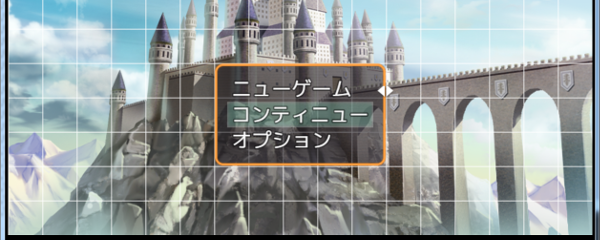
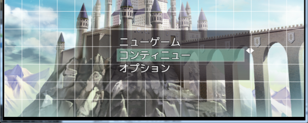
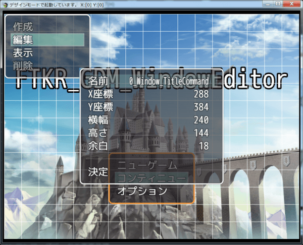

[トップページに戻る](README.md)

# [FTKR_GDM_WindowEditor](FTKR_GDM_WindowEditor.js) プラグイン

トリアコンタンさん製作のGUI画面デザインプラグイン(GraphicalDesignMode.js)の機能拡張プラグインです。<br>
オリジナルのウィンドウやシーンを作成できます。

ダウンロード: [FTKR_GDM_WindowEditor.js](https://raw.githubusercontent.com/futokoro/RPGMaker/master/FTKR_GDM_WindowEditor.js)

！注意！<br>
このプラグインは、まだ試作版です。
動作がまだ十分に安定していないため、使用にはご注意ください。
また、正式版になるまでに仕様が変わり、従来のセーブデータと互換性がなくなる可能性があります。

# 目次

以下の項目の順でプラグインの使い方を説明します。
1. [概要](#概要)
2. [プラグインの登録](#プラグインの登録)
3. [操作方法](#操作方法)
3. [ウィンドウの作成](FTKR_GDM_WindowEditor_1.ja.md)
    1. [コモンウィンドウの作成と編集](FTKR_GDM_WindowEditor_1.ja.md#コモンウィンドウの作成と編集)
    1. [セレクトウィンドウの作成と編集](FTKR_GDM_WindowEditor_1.ja.md#セレクトウィンドウの作成と編集)
    1. [コマンドウィンドウの作成と編集](FTKR_GDM_WindowEditor_1.ja.md#コマンドウィンドウの作成と編集)
3. [ウィンドウの設定変更](FTKR_GDM_WindowEditor_2.ja.md)
    1. [ウィンドウの編集](FTKR_GDM_WindowEditor_2.ja.md#ウィンドウの編集)
    1. [ウィンドウの表示内容変更](FTKR_GDM_WindowEditor_2.ja.md#ウィンドウの表示内容変更)
3. [ウィンドウの削除](FTKR_GDM_WindowEditor_3.ja.md#ウィンドウの削除)
3. [表示行ごとの個別編集](FTKR_GDM_WindowEditor_3.ja.md#表示行ごとの個別編集)
    1. [コモンテキスト編集](FTKR_GDM_WindowEditor_3.ja.md#コモンテキスト編集)
    1. [セレクトテキスト個別編集](FTKR_GDM_WindowEditor_3.ja.md#セレクトテキスト個別編集)
    1. [コマンド個別編集](FTKR_GDM_WindowEditor_3.ja.md#コマンド個別編集)
4. [コマンド等の実行処理内容の編集](FTKR_GDM_WindowEditor_3.ja.md#コマンド等の実行処理内容の編集)
* [プラグインの更新履歴](#プラグインの更新履歴)
* [ライセンス](#ライセンス)

# 概要

トリアコンタンさん製作のGUI画面デザインプラグイン(GraphicalDesignMode.js)のデザインモードを利用し、既存のウィンドウのより詳細な編集や、新規ウィンドウの追加を行います。

[GraphicalDesignMode.js(トリアコンタンさんのHPリンク)](https://triacontane.blogspot.jp/2016/03/gui.html)

[目次に戻る](#目次)

# プラグインの登録

このプラグインを使用するためには、`GraphicalDesignMode.js`プラグインが必要です。
プラグイン管理画面で、以下の順の配置になるように登録してください。
```
GraphicalDesignMode.js
FTKR_GDM_WindowEditor.js
```

また、[FTKR_CustomSimpleActorStatus_3](https://raw.githubusercontent.com/futokoro/RPGMaker/master/FTKR_CustomSimpleActorStatus_3.js)プラグインと組み合わせることで、ウィンドウにアクター画像やパラメータなどの詳細な表示設定が可能です。<br>
プラグイン管理画面で、以下の順の配置になるように登録してください。
```
GraphicalDesignMode.js
FTKR_CustomSimpleActorStatus_3.js
FTKR_GDM_WindowEditor.js
```

このプラグインは、[FTKR_OriginalSceneWindow](FTKR_OriginalSceneWindow.js)と組み合わせて使用できません。<br>
ただし、FTKR_OriginalSceneWindowプラグイン用のプラグインコマンドは使用できます。

[目次に戻る](#目次)

# 操作方法

## GraphicalDesignMode.jsからの変更点

### 右クリックでウィンドウ枠を非表示にする機能の無効化
この機能は、編集メニューの中の設定項目にあります。

変更したいウィンドウ上で右クリック ＞「表示」＞「表示設定」＞「枠非表示」OFF

### ウィンドウ枠をドラッグ＆ドロップでウィンドウサイズを変更
ウィンドウ枠にマウスポインタを合わせると、下の図のようにカーソルを表示します。



この状態で、ドラッグ＆ドロップを行うと、そのままウィンドウサイズを変更できます。<br>
Ctrlキーを押しながら行うと、グリッドに合わせてサイズ変更できます。



## 編集メニューの操作

デザインモード中に表示する編集メニューでは、以下のキーで操作可能です。

| キー | 対象 | 結果 |
| --- | --- | --- |
| ↑ | すべて | カーソルを上に移動 |
| ↓ | すべて | カーソルを下に移動 |
| ← | 数値<br>ON/OFF<br>リスト | 値を -1<br>ON/OFF切替<br>リストを1つ戻す |
| shift + ← | 数値 | 値を -10 |
| → | 数値<br>ON/OFF<br>リスト | 値を +1<br>ON/OFF切替<br>リストを1つ進める |
| shift + → | 数値 | 値を +10 |
| 決定 | コマンド<br>コマンド以外 | 次のウィンドウを表示<br>ダイアログボックスを表示し、直接入力 |



[目次に戻る](#目次)

# プラグインの更新履歴

| バージョン | 公開日 | 更新内容 |
| --- | --- | --- |
| [0.9.7](FTKR_GDM_WindowEditor.js) | 2018/07/31 | 不具合修正 |
| 0.9.0 | 2018/07/15 | 試作版公開 |

# ライセンス

本プラグインはMITライセンスのもとで公開しています。

[The MIT License (MIT)](https://opensource.org/licenses/mit-license.php)

#
[目次に戻る](#目次)

[トップページに戻る](README.md)