[トップページに戻る](README.md)
[目次に戻る](FTKR_GDM_WindowEditor.ja.md#目次)

# ウィンドウの作成

画面上で「ウィンドウがない部分」を「右クリック」してメニューを表示

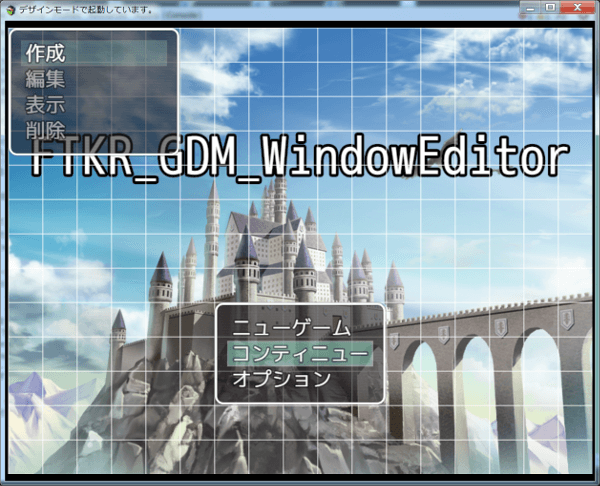

「作成」コマンドを選択し決定 
以下の３種類のウィンドウを追加する
1. [コモンウィンドウ](#コモンウィンドウの作成と編集)
1. [セレクトウィンドウ](#セレクトウィンドウの作成と編集)
1. [コマンドウィンドウ](#コマンドウィンドウの作成と編集)

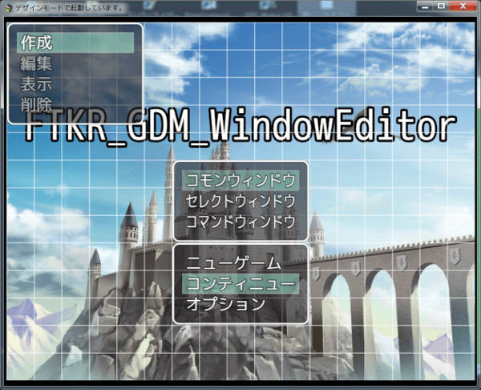

## コモンウィンドウの作成と編集

作成したコモンウィンドウの初期状態

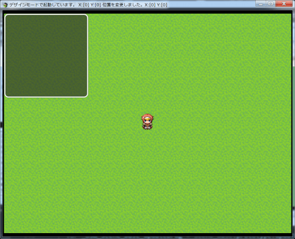

[上に戻る](#ウィンドウの作成)　　　[目次に戻る](FTKR_GDM_WindowEditor.ja.md#目次)

### 表示タイプ：テキスト

表示タイプが「テキスト」の場合の編集

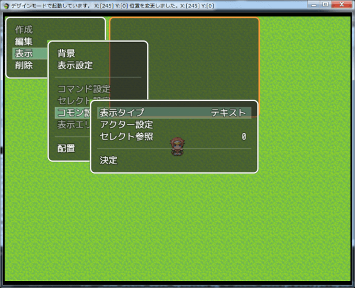

以下の作業を繰り返し、表示させる文章を追加する
1. 作成したウィンドウ上を左クリック
2. テキスト追加を選択

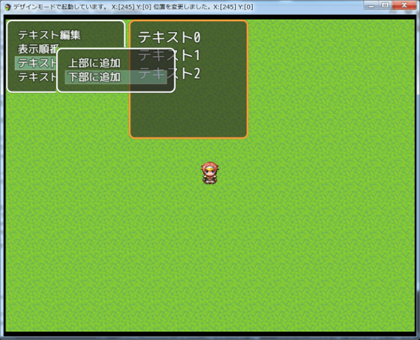

以下の作業を繰り返し、表示させる文章を編集する
1. 編集したいテキストの行を左クリック
2. テキスト編集を選択
3. 表示したダイアログボックスに文章を入力

`\v[n]`(ゲーム内変数の値を表示) や `\c[m]`(文字色の変更) などの制御文字も使用可能

作成後は、セーブ(Ctrl + S)の実行を忘れずに

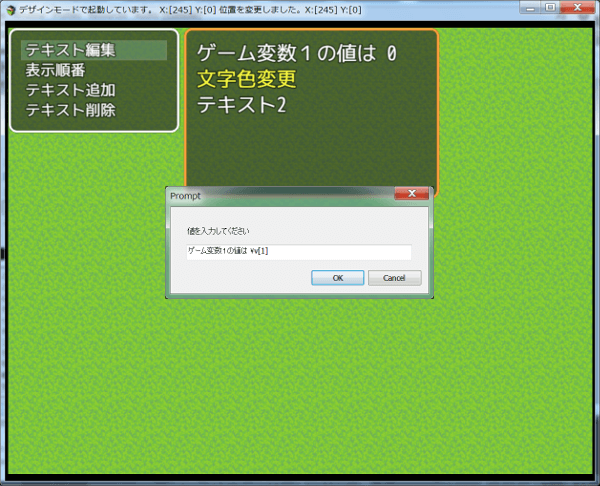

[上に戻る](#ウィンドウの作成)　　　[目次に戻る](FTKR_GDM_WindowEditor.ja.md#目次)

### 表示タイプ：詳細

アクターのデータや画像などを表示させたい場合は、表示タイプを「詳細」に変更 
この操作は、[FTKR_CustomSimpleActorStatus_3](FTKR_CustomSimpleActorStatus_3.js)が必要

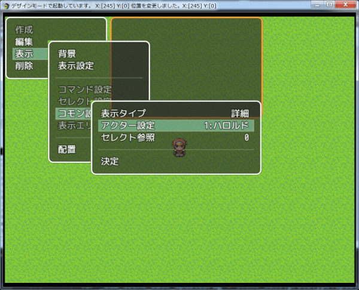

「表示」コマンドから、「表示エリア」を選択 
描画エリア１～３内容に表示させたいコードを追記 
※入力方式は[ここ](FTKR_CustomSimpleActorStatus.ja.md)参照

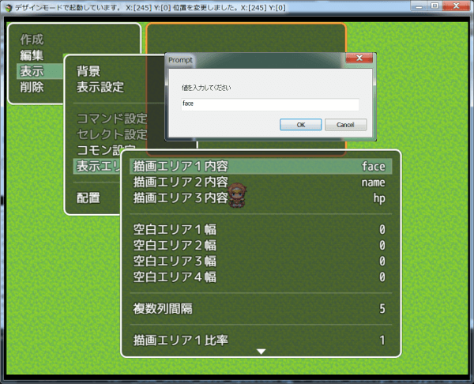

描画エリア１～３の比率を設定

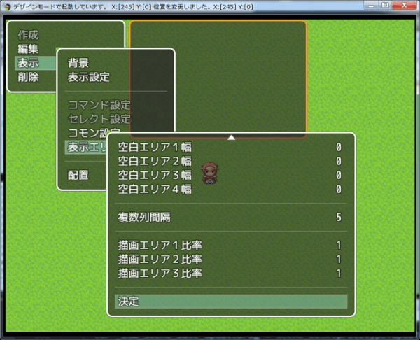

決定すると、アクターのデータをコモンウィンドウに表示

作成後は、セーブ(Ctrl + S)の実行を忘れずに

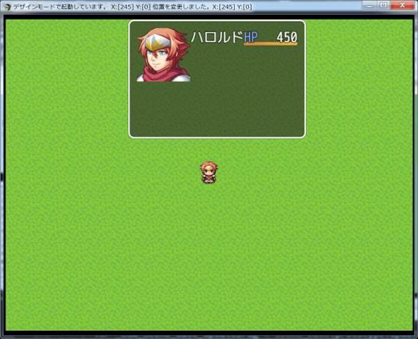

[上に戻る](#ウィンドウの作成)　　　[目次に戻る](FTKR_GDM_WindowEditor.ja.md#目次)

## セレクトウィンドウの作成と編集

作成したセレクトウィンドウの初期状態

### 表示タイプ：テキスト
表示タイプが「テキスト」の場合の編集

以下の作業を繰り返し、表示させる文章を追加する
1. 作成したウィンドウ上を左クリック
2. テキスト追加を選択

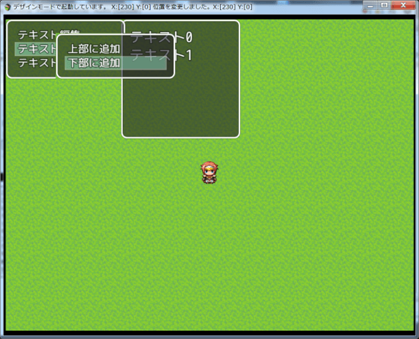

以下の作業を繰り返し、表示させる文章を編集する
1. 編集したいテキストの行を左クリック
2. テキスト編集を選択
3. 表示したダイアログボックスに文章を入力

制御文字も使用不可

作成後は、セーブ(Ctrl + S)の実行を忘れずに

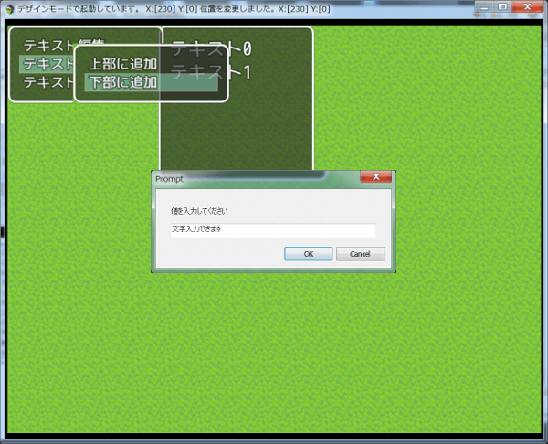

[上に戻る](#ウィンドウの作成)　　　[目次に戻る](FTKR_GDM_WindowEditor.ja.md#目次)

### 表示タイプ：テキスト以外

表示タイプをテキスト以外に設定すると、指定したデータベースのリストを表示可能

※パーティーなら、パーティーメンバーのリスト

表示する内容は、｢表示」コマンドの「表示エリア」で設定

描画エリア内容を設定 
※図の例では名前を表示

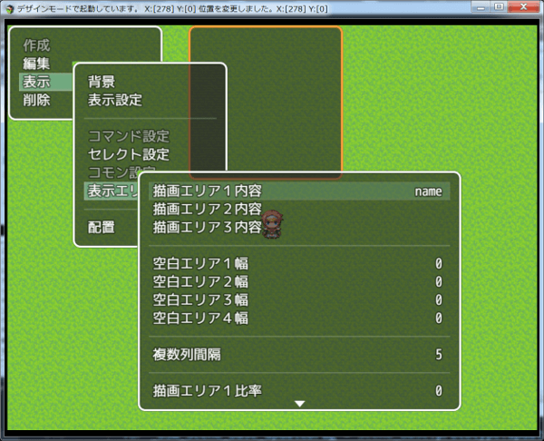

描画エリア比率を設定

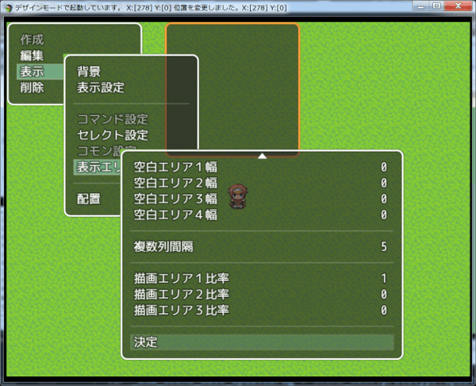

パーティーメンバーの名前がリストとして表示

作成後は、セーブ(Ctrl + S)の実行を忘れずに

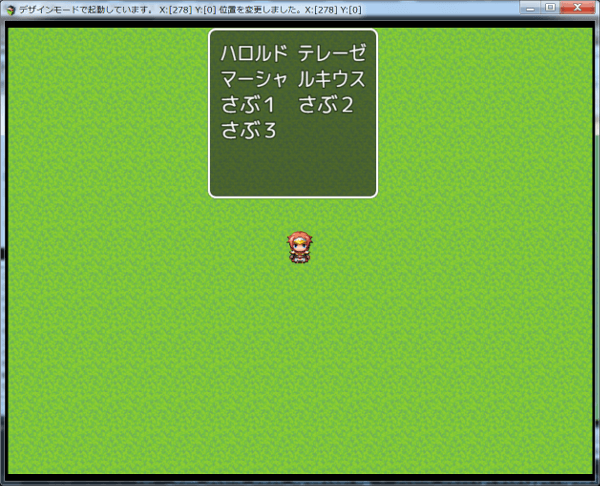

[上に戻る](#ウィンドウの作成)　　　[目次に戻る](FTKR_GDM_WindowEditor.ja.md#目次)

## コマンドウィンドウの作成と編集

作成したコマンドウィンドウの初期状態

作成後は、セーブ(Ctrl + S)の実行を忘れずに

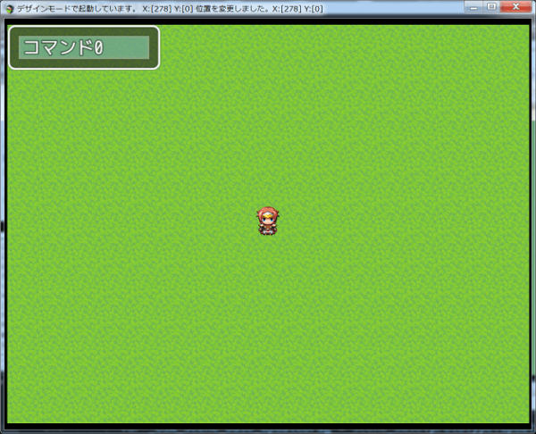

[上に戻る](#ウィンドウの作成)　　　[目次に戻る](#FTKR_GDM_WindowEditor.ja.md/目次)

#

[トップページに戻る](README.md)