[トップページに戻る](README.md)
[目次に戻る](FTKR_GDM_WindowEditor.ja.md#目次)

# ウィンドウの設定変更

画面上で「編集したいウィンドウ上」を「右クリック」してメニューを表示

「作成」コマンドがグレー表示になり、替わりに「編集」「表示」コマンドが選択可能

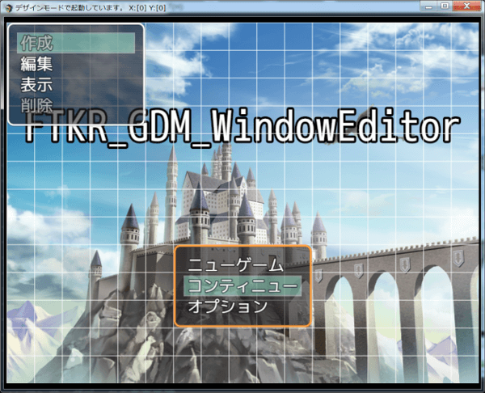

## ウィンドウの編集

「編集」コマンドを選択すると編集メニューを表示

このメニューからは以下の編集が可能
* [ウィンドウ](#ウィンドウ)
* [フォント設定](#フォント設定)
* [行列設定](#行列設定)
* [処理設定](#処理設定)

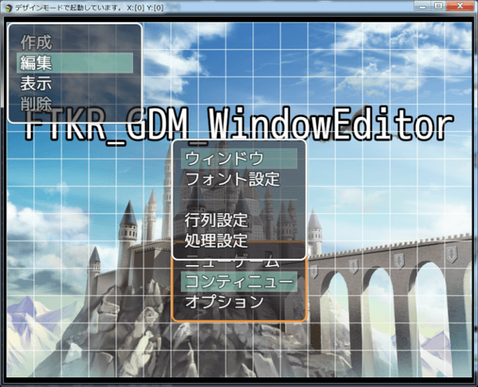

[目次に戻る](FTKR_GDM_WindowEditor.ja.md#目次)

### ウィンドウ

「ウィンドウ」を選択すると、以下の設定を変更可能

* 名前・・・「文字列」ウィンドウごとに個別の名前を設定可能
* X座標・・・「数値」
* Y座標・・・「数値」
* 横幅・・・「数値」
* 高さ・・・「数値」
* 余白・・・「数値」ウィンドウの枠と内側の表示部分の余白サイズを指定

内容変更後、「決定」を選択するとウィンドウに反映。

[上に戻る](#ウィンドウの編集)　　　[目次に戻る](FTKR_GDM_WindowEditor.ja.md#目次)

### フォント設定

「フォント設定」を選択すると、以下の設定を変更可能

* フォント・・・※未実装※
* フォントサイズ・・・「数値」

(*1) フォントデータが別途必要です

内容変更後、「決定」を選択するとウィンドウに反映。

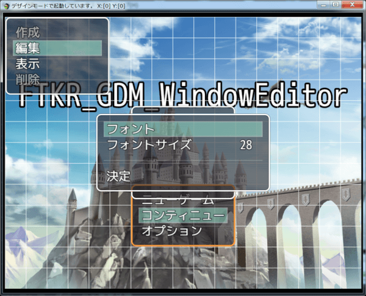

[上に戻る](#ウィンドウの編集)　　　[目次に戻る](FTKR_GDM_WindowEditor.ja.md#目次)

### 行列設定

「行列設定」を選択すると、以下の設定を変更可能

* 行高さ・・・「数値」
* 表示行数・・・「数値」※未実装
* 表示行間隔・・・「数値」
* 表示列数・・・「数値」コマンドやセレクトリストを横に並べる数
* 表示列間隔・・・「数値」
* カーソル行数・・・「数値」

内容変更後、「決定」を選択するとウィンドウに反映。

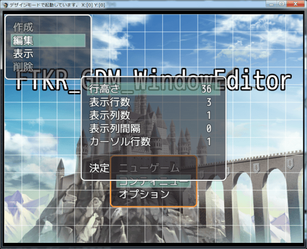

[上に戻る](#ウィンドウの編集)　　　[目次に戻る](FTKR_GDM_WindowEditor.ja.md#目次)

### 処理設定

「処理設定」を選択すると、以下の設定を変更可能

* 実行内容・・・そのウィンドウがアクティブ状態の時に、「決定」ボタンを押したときの処理
  * 実行設定・・・「リスト」詳細は[処理内容](#コマンド等の実行処理内容の編集)を参照
  * 実行詳細・・・「リスト」
  * 実行詳細２・・・「リスト」
* キャンセル内容・・・そのウィンドウがアクティブ状態の時に、「キャンセル」ボタンを押したときの処理
  * キャンセル設定・・・「リスト」詳細は[処理内容](#コマンド等の実行処理内容の編集)を参照
  * キャンセル詳細・・・「リスト」
  * キャンセル詳細２・・・「リスト」

内容変更後、「決定」を選択するとウィンドウに反映。

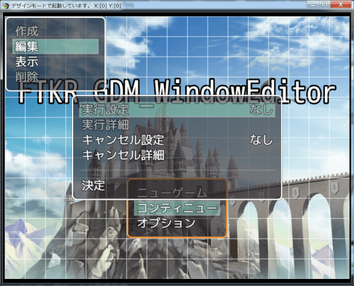

[上に戻る](#ウィンドウの編集)

[目次に戻る](FTKR_GDM_WindowEditor.ja.md#目次)

## ウィンドウの表示内容変更

「表示」コマンドを選択すると表示内容変更メニューを表示

このメニューからは以下の編集が可能
* [背景](#背景)
* [表示設定](#表示設定)
* [コマンド設定](#コマンド設定)
* [セレクト設定](#セレクト設定)
* [コモン設定](#コモン設定)
* [表示エリア](#表示エリア)
* [配置](#配置)

コマンドウィンドウの場合

コモンウィンドウ(表示エリア有効)の場合

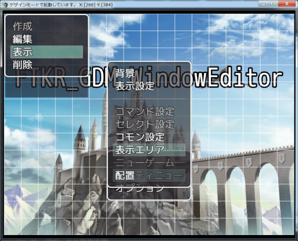

セレクトウィンドウの場合

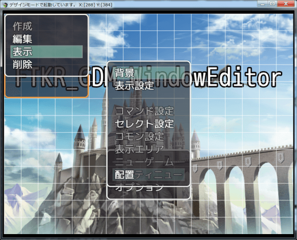

### 背景

「背景」を選択すると、以下の設定を変更可能

* 背景透明度・・・「数値」
* 背景画像・・・※未実装※

内容変更後、「決定」を選択するとウィンドウに反映。

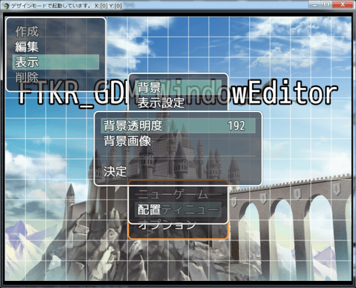

[上に戻る](#ウィンドウの表示内容変更)　　　[目次に戻る](FTKR_GDM_WindowEditor.ja.md#目次)

### 表示設定

「表示設定」を選択すると、以下の設定を変更可能

* 表示スイッチ・・・スイッチを指定すると、そのスイッチがONの時のみこのウィンドウを表示する
* 枠非表示・・・「ON/OFF」

内容変更後、「決定」を選択するとウィンドウに反映。

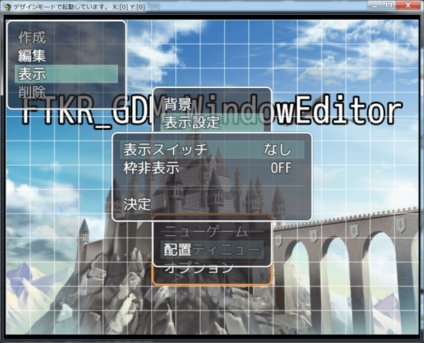

[上に戻る](#ウィンドウの表示内容変更)　　　[目次に戻る](FTKR_GDM_WindowEditor.ja.md#目次)

### コマンド設定

「コマンド設定」を選択すると、以下の設定を変更可能

* コマンド表示位置・・・「リスト」コマンド名をどちら側に寄せて表示するか指定する
* コマンド非表示解除・・・「コマンド」選択すると非表示にしていたコマンドをすべて表示する

内容変更後、「決定」を選択するとウィンドウに反映。

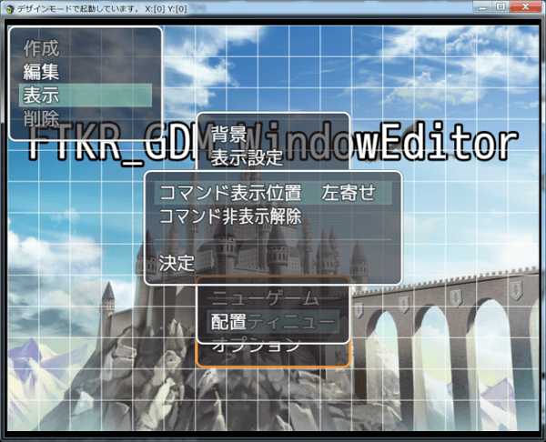

[上に戻る](#ウィンドウの表示内容変更)　　　[目次に戻る](FTKR_GDM_WindowEditor.ja.md#目次)

### セレクト設定

「セレクト設定」を選択すると、以下の設定を変更可能

* 表示タイプ・・・「リスト」そのセレクトウィンドウでどのデータベースを表示するか選択
* リストタイプ・・・「リスト」表示タイプで「パーティー」を選択した時に、設定可能
* 表示条件・・・「文字列」スクリプト形式で表示する条件を指定可能

内容変更後、「決定」を選択するとウィンドウに反映。

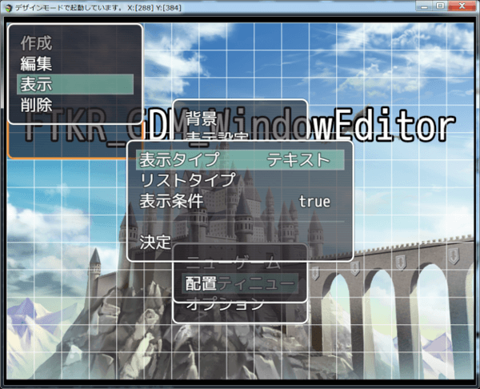

[上に戻る](#ウィンドウの表示内容変更)　　　[目次に戻る](FTKR_GDM_WindowEditor.ja.md#目次)

### コモン設定

「コモン設定」を選択すると、以下の設定を変更可能

* 表示タイプ・・・「リスト」
  * テキスト：任意の文字列を表示
  * 詳細：FTKR_CustomSimpleActorStatusによる表示設定が可能
* アクター設定・・・「リスト」表示タイプを詳細にした場合に、データ参照元のアクターを選択
* [セレクト参照](#セレクト参照)・・・「リスト」

内容変更後、「決定」を選択するとウィンドウに反映。

### アクター設定
表示タイプを詳細にした場合に、コモンウィンドウに表示するアクターを指定できる。

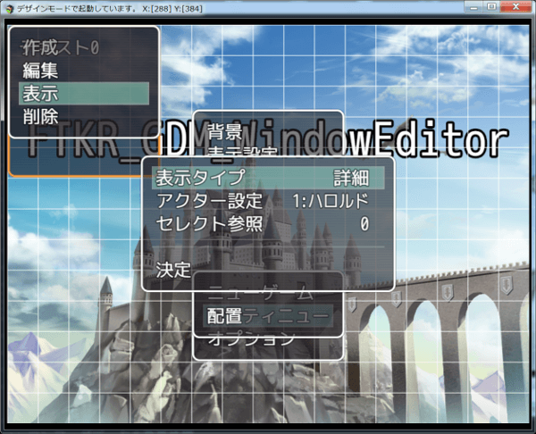

### セレクト参照
表示タイプを詳細にして、アクター設定を「なし」にした場合に、別のウィンドウで選択中のデータを参照してこのコモンウィンドウに表示することができる。

セレクト参照で、参照するウィンドウを選択。 
※選択可能なウィンドウは、セレクトウィンドウかコマンドウィンドウのみ

下の例では、アイテムリスト(手持ち防具の一覧を表示しているウィンドウ)を参照。

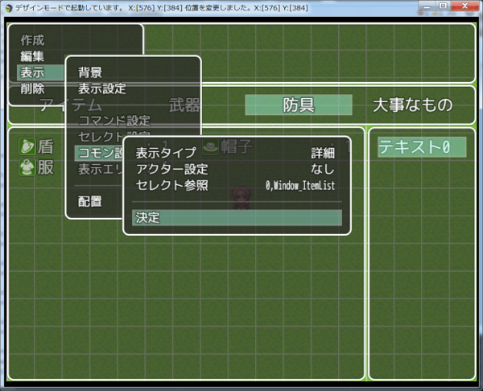

コモンウィンドウの表示タイプで、表示させるデータを`text(item.xxx)`の記述で設定。 
xxx = name なら、名前を表示。

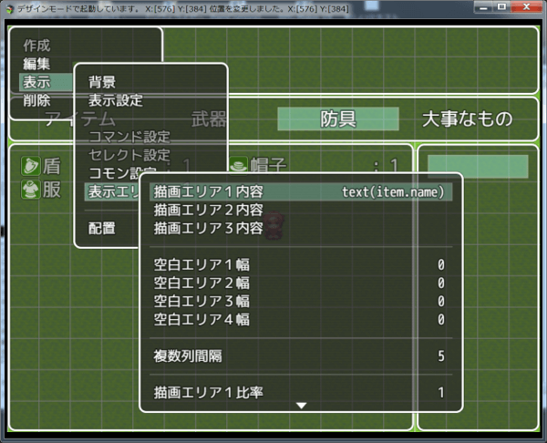

アイテムリストで、カーソル選択中のアイテムデータを参照して、コモンウィンドウにアイテム名を表示。

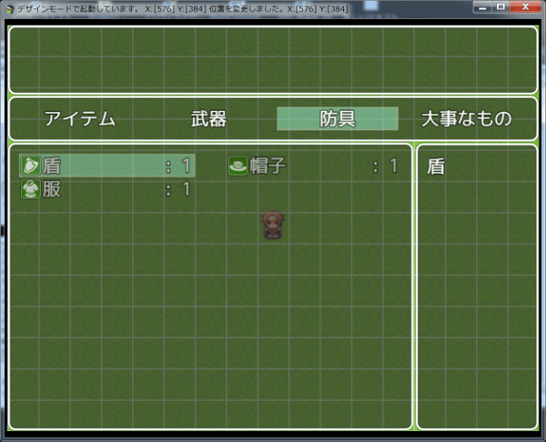

[上に戻る](#ウィンドウの表示内容変更)　　　[目次に戻る](FTKR_GDM_WindowEditor.ja.md#目次)

### 表示エリア

「表示エリア」を選択すると、以下の設定を変更可能

FTKR_CustomSimpleActorStatusプラグインの仕様に従い、表示エリアの設定を行う

内容変更後、「決定」を選択するとウィンドウに反映。

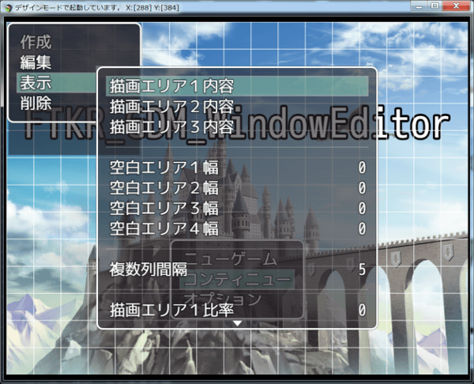

[上に戻る](#ウィンドウの表示内容変更)　　　[目次に戻る](FTKR_GDM_WindowEditor.ja.md#目次)

### 配置

「配置」を選択すると、以下の設定を変更可能

「コマンド」ウィンドウ同士が重なった時に、手前に表示するか後ろに隠れるかの配置を変更可能

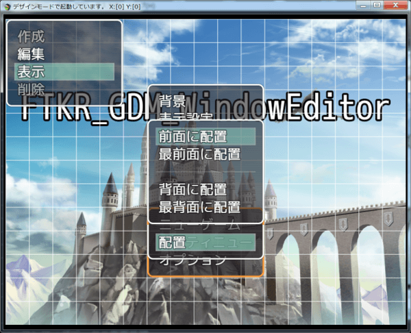

#### 変更例
変更前・・・通常、メニュー画面では、コマンドウィンドウが一番背面に配置されている

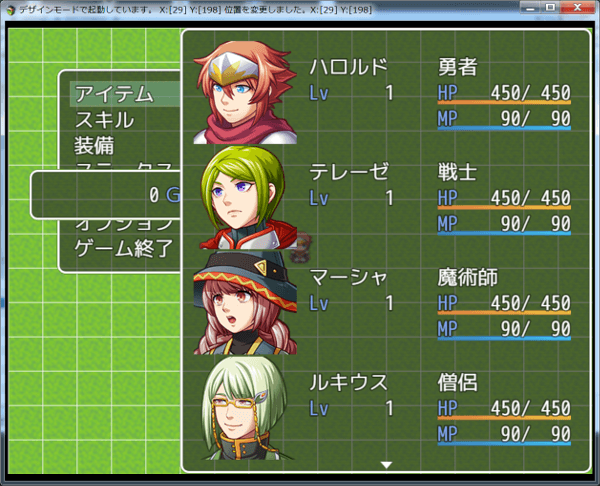

変更後・・・コマンドウィンドウの配置を最前面に変更すると、一番手前に表示される

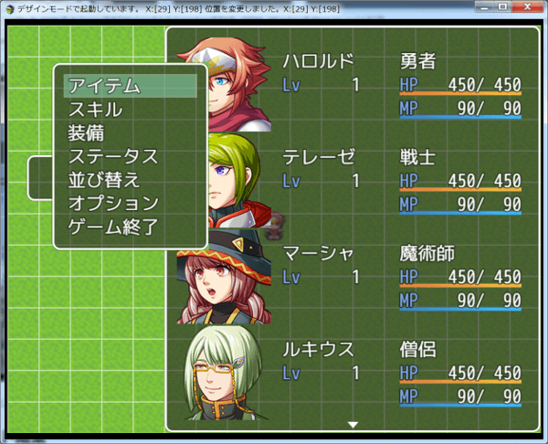

[上に戻る](#ウィンドウの表示内容変更)　　　[目次に戻る](FTKR_GDM_WindowEditor.ja.md#目次)

#

[トップページに戻る](README.md)