[トップページに戻る](README.md)
[目次に戻る](FTKR_GDM_WindowEditor.ja.md#目次)

# ウィンドウの削除

このプラグインで作成したウィンドウの場合は、削除が可能。 
既存のウィンドウは削除不可。

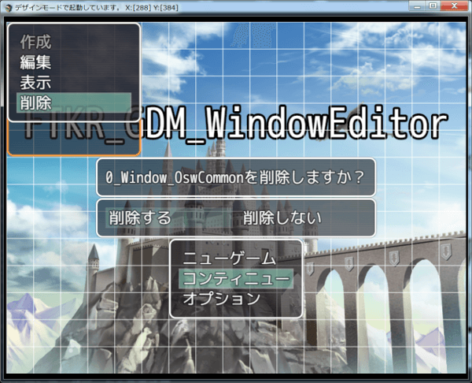

[目次に戻る](FTKR_GDM_WindowEditor.ja.md#目次)

# 表示行ごとの個別編集

## コモンテキスト編集

コモンウィンドウで、表示タイプをテキストにした場合

ウィンドウ上で左クリックすると、表示する文字列（テキスト）などを編集可能

* テキスト編集・・・ダイアログボックスで直接表示させたい文章を設定可能、制御文字も使用可能
* 表示順番
* テキスト追加・・・表示行数を増やす
* テキスト削除

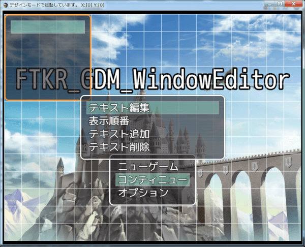

テキスト編集

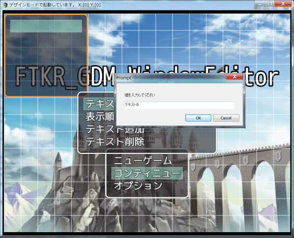

[上に戻る](#表示行ごとの個別編集)　　　[目次に戻る](FTKR_GDM_WindowEditor.ja.md#目次)

## セレクトテキスト個別編集

セレクトウィンドウで、表示タイプをテキストにした場合 
ウィンドウ上で左クリックすると、表示する文字列（テキスト）などを編集可能

* [テキスト編集](#セレクトテキスト編集)
* [テキスト追加](#セレクトテキスト追加)
* テキスト削除

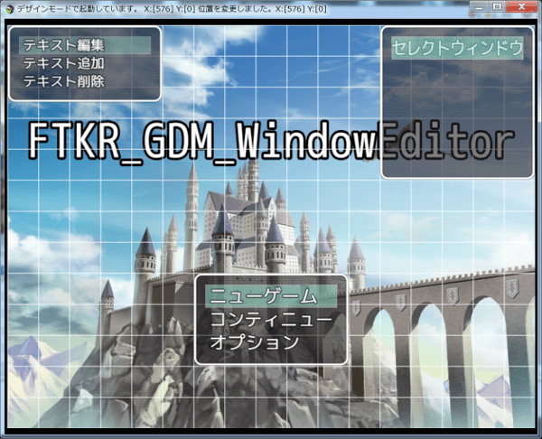

### セレクトテキスト編集

ダイアログボックスで直接表示させたい文章を設定可能

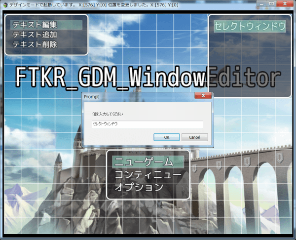

[上に戻る](#表示行ごとの個別編集)　　　[目次に戻る](FTKR_GDM_WindowEditor.ja.md#目次)

### セレクトテキスト追加

表示行数を増やす

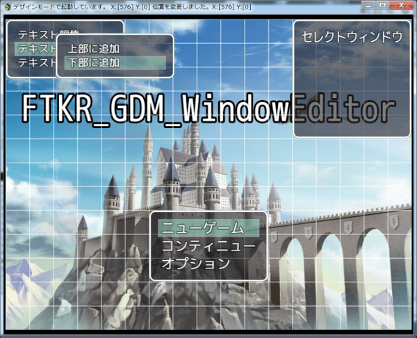

[上に戻る](#表示行ごとの個別編集)　　　[目次に戻る](FTKR_GDM_WindowEditor.ja.md#目次)

## コマンド個別編集

コマンドウィンドウ上で左クリックすると、コマンドの表示や処理を編集可能

* [コマンド編集](#コマンド編集)
* [表示順番](#表示順番)
* [コマンド追加](#コマンド追加)
* コマンド非表示・・・編集メニューの非表示解除で表示を戻せます
* コマンド削除・・・一度削除すると戻せません

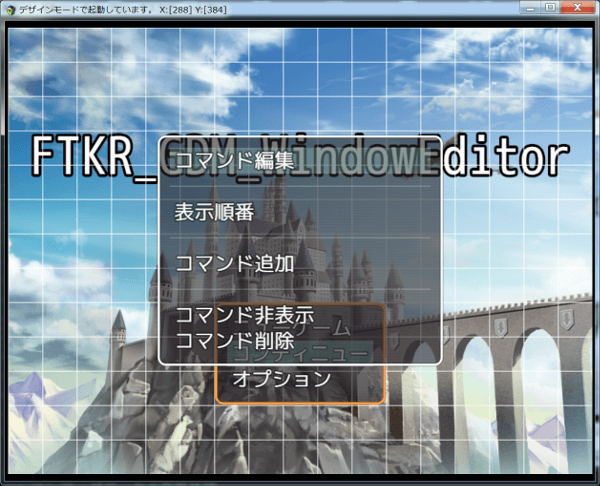

### コマンド編集

「コマンド編集」を選択すると、以下の設定を変更可能

* 表示名・・・「文字列」コマンドの表示名を変更、データベースの用語よりも優先
* 表示条件・・・「文字列」スクリプトで条件を指定すると、その条件を満たしている間だけそのコマンドを表示
* 実行設定・・・「リスト」なし以外にすると、そのコマンドを選択した時の処理を変更可能、詳細は[処理内容](#コマンド等の実行処理内容の編集)を参照
* 実行詳細・・・「リスト」
* 実行詳細2・・・「リスト」

内容変更後、「決定」を選択するとウィンドウに反映。

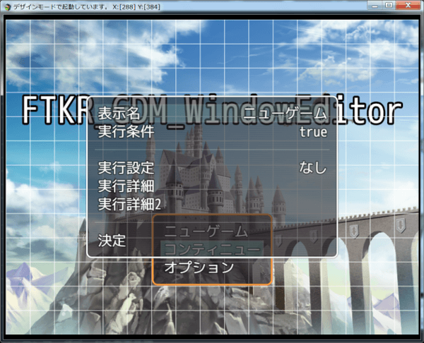

[上に戻る](#表示行ごとの個別編集)　　　[目次に戻る](FTKR_GDM_WindowEditor.ja.md#目次)

### 表示順番

「表示順番」を選択すると、以下の設定を変更可能

コマンドの表示位置を変更する

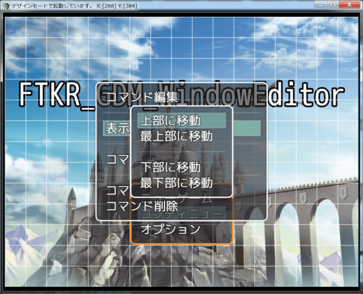

指定したコマンド「ニューゲーム」を最下部に移動した場合

[上に戻る](#表示行ごとの個別編集)　　　[目次に戻る](FTKR_GDM_WindowEditor.ja.md#目次)

### コマンド追加

「コマンド追加」を選択すると、以下の設定を変更可能

指定したコマンドの上か下に新しいコマンドを追加する

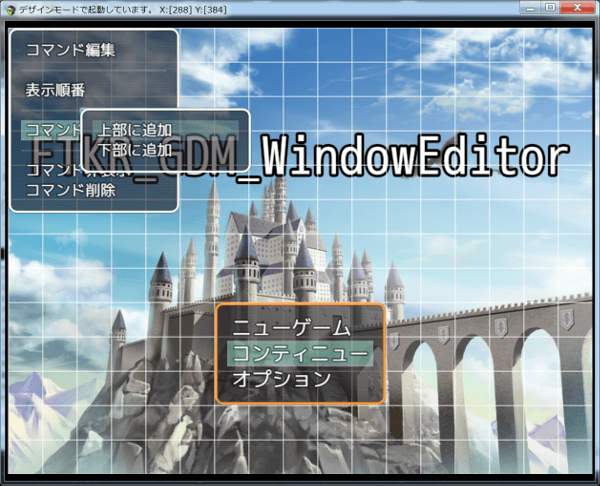

上部に追加した場合 
追加したコマンドの名前は、「コマンド」+「番号」になる

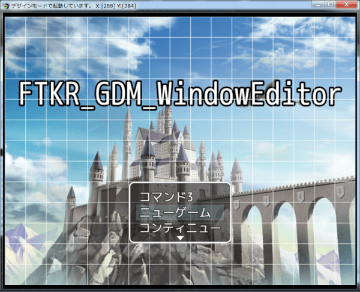

追加したコマンドの初期設定 
実行設定が「なし」になっているため、コマンド編集で設定する

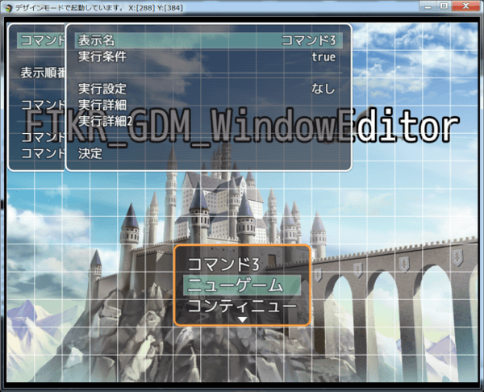

[上に戻る](#表示行ごとの個別編集)　　　[目次に戻る](FTKR_GDM_WindowEditor.ja.md#目次)

# コマンド等の実行処理内容の編集

処理内容として設定可能なものは以下の通り。
* シーン終了
* シーン変更
* コモンイベント
* ウィンドウアクティブ

### シーン終了
実行すると、シーンを終了して元のシーンに戻ります。
オリジナルシーンやメニューシーンなどから、マップシーンに戻すときに使用します。

このメソッドは、タイトルシーンとマップシーン上で使わないでください。

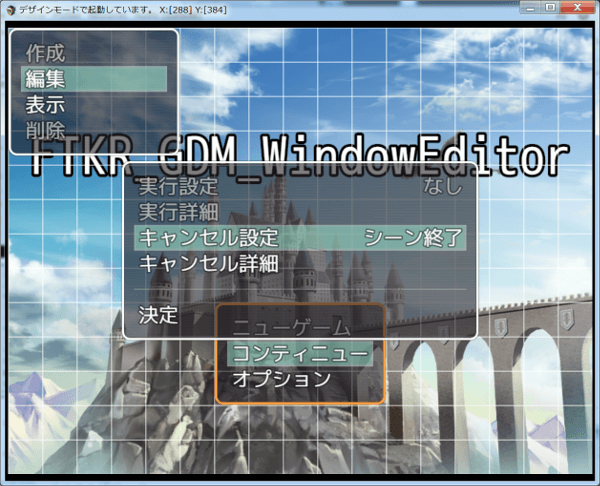

[上に戻る](#コマンド等の実行処理内容の編集)　　　[目次に戻る](FTKR_GDM_WindowEditor.ja.md#目次)

### シーン変更
実行すると、指定したシーンを表示します。

sceneの例)
* Scene_Item  - アイテムシーン(*1)
* Scene_Skill - スキルシーン(*1)
* Scene_Save - セーブシーン(*1)
* Scene_Load - ロード(コンティニュー)シーン(*2)
* Scene_Options - オプションシーン(*2)
* Scene_OSW - オリジナルシーン

(*1) メニュー画面から表示するシーンと同じです。 
(*2) スタート画面から表示するシーンと同じです。

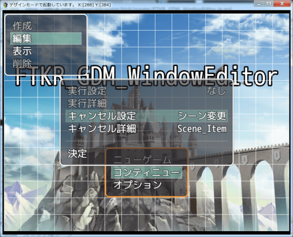

[上に戻る](#コマンド等の実行処理内容の編集)　　　[目次に戻る](FTKR_GDM_WindowEditor.ja.md#目次)

### コモンイベント
実行すると、指定したコモンイベント実行します。
コモンイベントが実行可能なシーンのみ有効です。

「詳細」で、コモンイベントを指定します。

選択すると、選択したリストの番号(先頭が0番)を記録します。
記録した番号は、以下のスクリプトで取得できます。
`$gameOswData._oswIndex`

また、選択したリストのデータは、以下のスクリプトで取得できます。（セレクトウィンドウのみ）
`$gameOswData._oswItem`

例)リストがアイテムの場合は、選択したアイテムの`$dataItems[n]`のデータが格納されます。(n:アイテムID)

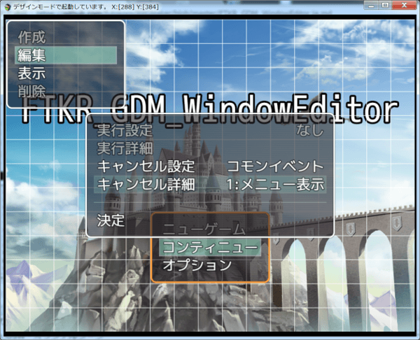

[上に戻る](#コマンド等の実行処理内容の編集)　　　[目次に戻る](FTKR_GDM_WindowEditor.ja.md#目次)

### ウィンドウアクティブ

実行すると、このウィンドウのから、指定したウィンドウにカーソル操作が移ります。

「詳細」で、ウィンドウを指定します。 
コマンドウィンドウかセレクトウィンドウを指定してください。

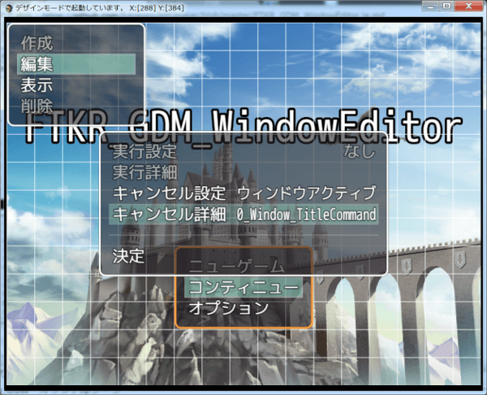

[上に戻る](#コマンド等の実行処理内容の編集)　　　[目次に戻る](FTKR_GDM_WindowEditor.ja.md#目次)

#

[トップページに戻る](README.md)