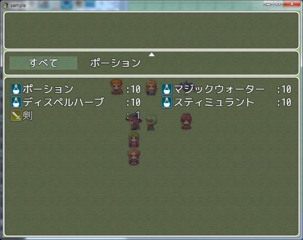
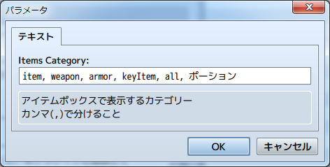
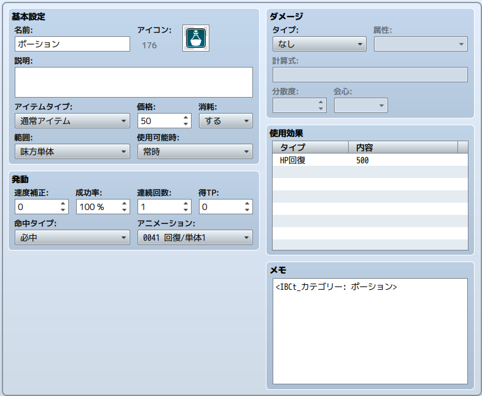

[トップページに戻る](README.md)

# [FTKR_ItemBoxCategory](FTKR_ItemBoxCategory.js) プラグイン

アイテムボックスのカテゴリーを追加変更するプラグインです。

ダウンロード: [FTKR_ItemBoxCategory.js](https://raw.githubusercontent.com/futokoro/RPGMaker/master/FTKR_ItemBoxCategory.js)

# 目次

以下の項目の順でプラグインの使い方を説明します。
1. [概要](#概要)
1. [アイテムカテゴリーの変更](#アイテムカテゴリーの変更)
* [プラグインの更新履歴](#プラグインの更新履歴)
* [ライセンス](#ライセンス)

# 概要

本プラグインを実装することで、アイテムボックスのカテゴリー(アイテム、武器、防具、大事なもの)を変更できます。

このプラグインはFTKR_ItemCategoryFixed.jsと組み合わせて使用できません。

[目次に戻る](#目次)

# アイテムカテゴリーの変更

アイテム画面や、ショップ画面のアイテムカテゴリーの表示を変更します。



## アイテムカテゴリーの表示を変える
プラグインパラメータ`<Items Category>`に設定した内容によってアイテムカテゴリーの表示を変えることができます。

入力内容は以下。

| 入力内容 | 表示名 | 対象カテゴリー |
| --- | --- | --- |
| item     | データベースの用語で設定した「アイテム」<br>またはプラグインパラメータ`<Category Item Name>`で設定した表示名 | アイテム |
| weapon   | データベースの用語で設定した「武器」| 武器 |
| armor    | データベースの用語で設定した「防具」| 防具 |
| keyItem  | データベースの用語で設定した「大事なもの」| 大事なもの |
| all      | プラグインパラメータ`<Category All Name>`で設定した表示名 | アイテム・武器・防具・大事なもの |
| 任意の文字列 | 入力した任意の文字列 | 入力した任意の文字列を追加カテゴリーとして設定したアイテム |

カンマ(,)を使って複数設定できます。
入力した順番にアイテムカテゴリーを表示します。



## カテゴリーの追加
プラグインパラメータ`<Items Category>`に任意の文字列を設定すると、その文字列を新たなアイテムカテゴリーとして追加することができます。

追加したカテゴリーは、アイテムや武器・防具のメモ欄に以下のタグを記入することで、設定することができます。
```
<IBCt_カテゴリー: カテゴリー名>
<IBCt_CATEGORY: category_name>
```


[目次に戻る](#目次)

# プラグインの更新履歴

| バージョン | 公開日 | 更新内容 |
| --- | --- | --- |
| [ver1.1.0](FTKR_ItemBoxCategory.js) | 2017/12/10 | アイテム画面で表示する「アイテム」の表示名を、メニュー画面と別に設定する機能を追加 |
| ver1.0.0 | 2017/07/01 | 初版公開 |

# ライセンス

本プラグインはMITライセンスのもとで公開しています。

[The MIT License (MIT)](https://opensource.org/licenses/mit-license.php)

#
[目次に戻る](#目次)

[トップページに戻る](README.md)