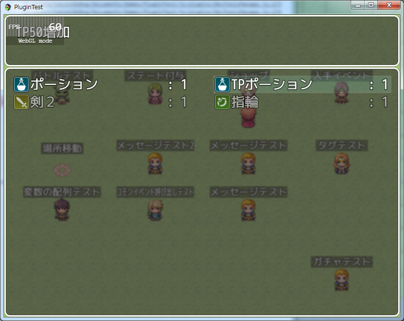

[トップページに戻る](README.md)

# [FTKR_ItemCategoryFixed](FTKR_ItemCategoryFixed.js) プラグイン

アイテムボックスのカテゴリ選択を無くすプラグインです。

ダウンロード: [FTKR_ItemCategoryFixed.js](https://raw.githubusercontent.com/futokoro/RPGMaker/master/FTKR_ItemCategoryFixed.js)

## 目次

以下の項目の順でプラグインの使い方を説明します。
1. [概要](#概要)
* [プラグインの更新履歴](#プラグインの更新履歴)
* [ライセンス](#ライセンス)

## 概要

本プラグインを実装することで、アイテムボックスのカテゴリー選択をなくします。
また、カテゴリーウィンドウを表示しません。

ボックス内に表示するアイテムのカテゴリーはプラグインパラメータ`Item Category`で設定します。
 * item   - アイテムのみ表示(大事なもの含む)
 * weapon - 武器のみ表示
 * armor  - 防具のみ表示
 * all    - アイテム・武器・防具をすべて表示

なお、ショップの売却画面にも適用します。

[目次に戻る](#目次)

## プラグインの更新履歴

| バージョン | 公開日 | 更新内容 |
| --- | --- | --- |
| [ver1.0.2](FTKR_ItemCategoryFixed.js) | 2019/04/16 | アイテム画面を開いた時にヘルプウィンドウ内の文章が表示されない不具合を修正 |
| ver1.0.1 | 2017/06/02 | ショップの売却シーンに対応 |
| ver1.0.0 | 2017/06/01 | 初版公開 |

## ライセンス

本プラグインはMITライセンスのもとで公開しています。

[The MIT License (MIT)](https://opensource.org/licenses/mit-license.php)

#
[目次に戻る](#目次)

[トップページに戻る](README.md)