[トップページに戻る](README.md)

# [FTKR_ItemCompositionSystem](FTKR_ItemCompositionSystem.js) プラグイン

アイテム合成システムを実装するプラグインです。

ダウンロード: [FTKR_ItemCompositionSystem.js](https://raw.githubusercontent.com/futokoro/RPGMaker/master/FTKR_ItemCompositionSystem.js)

サンプルプロジェクト: [日本語版](sampleProject/ItemCompositionSample.zip)
※(MVコアスクリプト v1.5.1対応)

# 目次

以下の項目の順でプラグインの使い方を説明します。
1. [概要](#概要)
1. [当プラグインの用語](#当プラグインの用語)
1. [プラグインの導入](#プラグインの導入)
    1. [合成レシピの基本設定](#合成レシピの基本設定)
    1. [アイテム合成画面を表示する](#アイテム合成画面を表示する)
4. [合成の仕組み](#合成の仕組み)
    1. [合成の基本](合成の基本)
    2. [合成の成功率](#合成の成功率)
    3. [特殊合成](#特殊合成)
3. [アイテムの合成の設定](#アイテムの合成の設定)
    1. [アイテムのタグ設定](#アイテムのタグ設定)
    1. [カテゴリー合成の設定](#カテゴリー合成の設定)
    3. [特殊合成の設定](#特殊合成の設定)
2. [基本設定](#基本設定)
    1. [メニューコマンドの設定](#メニューコマンドの設定)
    1. [アイテム合成画面の設定](#アイテム合成画面の設定)
    2. [アイテム合成時の設定](#アイテム合成時の設定)
6. [プラグインコマンド](#プラグインコマンド)
* [プラグインの更新履歴](#プラグインの更新履歴)
* [ライセンス](#ライセンス)

# 概要

本プラグインにより、アイテム合成システムを実装し、アイテム同士を合成して新たなアイテムを入手できるようになります。

[目次に戻る](#目次)

# 当プラグインの用語

当プラグインで使用する用語の意味を以下に示します。

## アイテムの区別に関する用語

### アイテム分類
データベース上の『アイテム』、『武器』、『防具』の区別のことを、アイテム分類と呼びます。

なお、当マニュアル上では、アイテム分類としての表記を『アイテム』、アイテム・武器・防具の総称としての表記を　アイテム と記載します。

また、個別のアイテムの名称（例：ポーション、など）は「ポーション」と記載します。

### 合成カテゴリー
当プラグインの機能により、アイテム分類に拠らずに自由に設定できる区別方法を、合成カテゴリーと呼びます。

合成カテゴリーは、任意の文字列を指定でき、また複数設定することができます。

合成カテゴリーは、ゲーム画面上で個別に表示させたり、レシピに設定することに使います。

### デフォルトカテゴリー
合成カテゴリーの１種ですが、プラグインのデフォルトで用意しているもので、アイテム、武器、防具の３種類の合成カテゴリーのことを指します。

[目次に戻る](#目次)

## 合成に関する用語

### アイテムの合成
当プラグインでは、複数のアイテムを消費して別のアイテムを入手することができます。

これを、アイテムの合成と呼びます。

### 合成アイテム
アイテムの合成によって入手するアイテムのことを、合成アイテムと呼びます。

### 合成素材

アイテムの合成で消費するアイテムのことを、合成素材と呼びます。

### 合成レシピ
当プラグインでは、あるアイテムを入手するために必要な、合成素材の組み合わせは、事前に設定しておかなければいけません。

この合成素材の組み合わせを、合成レシピと呼びます。または、レシピと呼びます。

○○の合成レシピ、という記載は、○○を入手するために必要な合成素材の組み合わせのことを意味します。

### 合成の成功
当プラグインでは、合成レシピ通りにアイテムを消費しても、合成アイテムを必ず入手できるとは限りません。
合成レシピの設定によって、その結果を確率で変えることができます。

設定通りにアイテムを入手できることを、合成の成功と呼びます。

他に、設定以上のアイテムを入手できる大成功、設定以下のアイテムを入手する失敗、アイテムを入手できない消失があります。

### 合成ランク
合成アイテム、合成素材にそれぞれ設定する、アイテムのレアリティを意味する数値を、合成ランクと呼びます。

合成素材のランクの平均値が、入手するアイテムのランク以上にならないと、合成に成功しないようにすることができます。

### 合成難易度
アイテムの合成の結果が、成功、大成功、失敗、消失のどれになるかを決める値を、合成難易度と呼びます。

設定した値がそのまま確率を意味する場合と、パーティーの何らかのパラメータとの大小を比較する場合の２通りの使い方があります。

[目次に戻る](#目次)

## ゲーム画面に関する用語

### アイテム合成画面

アイテムの合成を行う当プラグイン専用画面のことを、アイテム合成画面と呼びます。

メニューから表示させたり、プラグインコマンドを使ってイベントで表示させることが出来ます。


[目次に戻る](#目次)

## 合成の種類に関する用語
当プラグインでは、アイテムを合成する方法は大きく３つに分けられます。

### アイテム合成
１つの合成レシピに対して、１つの合成アイテムを設定する方法を、アイテム合成と呼びます。

合成アイテムに直接レシピを設定することで、その合成レシピによって決まった合成アイテムが入手できます。

### カテゴリー合成
１つの合成レシピに対して、複数の合成アイテムを設定する方法を、カテゴリー合成と呼びます。

合成によって入手するアイテムは、設定した合成アイテムのいずれか一つになります。

合成アイテムに直接レシピを設定せず、レシピ用のデータを別に作り、合成レシピに、合成カテゴリーを指定します。

### 特殊合成
アイテムの合成によってデータベースに設定されていないアイテムを入手できる方法を、特殊合成と呼びます。

この合成には、武器または防具しか使用することはできません。

[目次に戻る](#目次)

# プラグインの導入

この章では、アイテムの合成を行うために最低限必要な設定を説明します。

1. [合成レシピの基本設定](#合成レシピの基本設定)
1. [アイテム合成画面を表示する](#アイテム合成画面を表示する)

## 合成レシピの基本設定

アイテムの合成を行うためには、合成レシピを設定しなくては行けません。

合成レシピの設定は、下の図のように合成アイテムとなる『アイテム』『武器』『防具』のメモ欄に<ICS_レシピ>タグを記載して行います。

タグの記述方法は、以下の通りに`<ICS_レシピ></ICS_レシピ>`タグの間に、合成素材に使うアイテム名とその必要個数を記載します。
```
<ICS_レシピ>
アイテム名: 必要個数
</ICS_レシピ>
```

合成素材は５種類まで設定できます。

なお、当プラグインでは合成レシピをアクター等に事前に覚えさせる必要はありません。
レシピに必要な合成素材とその数を所持していれば、アイテムの合成を行うことができます。


[目次に戻る](#目次)

## アイテム合成画面を表示する

アイテム合成画面は、以下の方法で表示できます。

### メニューから表示

プラグインのデフォルト設定で、メニュー画面にコマンド「アイテム合成」が表示します。

このコマンドを選択すると、アイテム合成画面を表示します。


### プラグインコマンドで表示

以下のプラグインコマンドを実行することでも、アイテム合成画面を表示できます。
```
ICS_Open
ICS_合成画面表示
```

[目次に戻る](#目次)

# 合成の仕組み

## 合成の基本

### 素材から選んでアイテムを合成する

合成画面では、下の図のように「アイテム」「武器」「防具」の分類で手持ちのアイテムを表示します。


アイテムを選択すると、合成素材に使用する員数を入力します。
入力が終わると、左下の合成アイテムのスロットにアイテムが移動します。

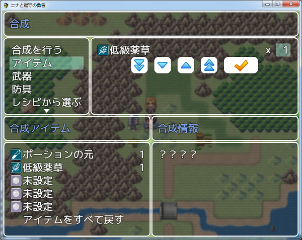

合成する素材が決まったら、「合成を行う」コマンドを実行します。
確認画面の有無は、プラグインパラメータで設定できます。

この合成は、レシピを知らなくても実行可能です。
レシピの素材と合っていれば、レシピの有無の関係なく、成功すれば合成アイテムを入手できます。

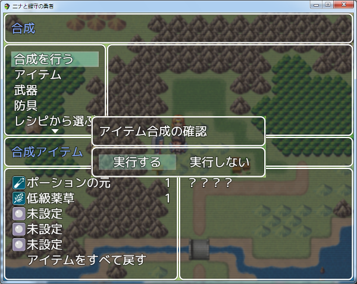

合成実行後は、下の図のような合成結果が表示します。

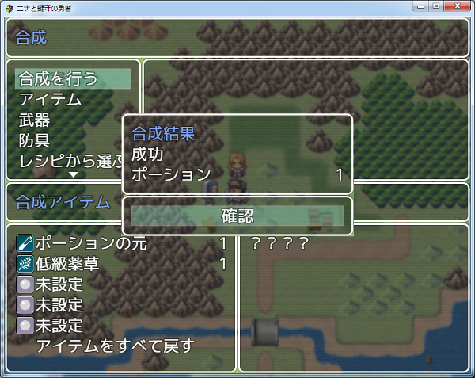

### レシピから選んでアイテムを合成する

素材から選ぶだけでなく、レシピから選んで合成することもできます。
コマンド「レシピから選ぶ」を選択すると、右側のアイテム欄が覚えているレシピの表示に変わります。

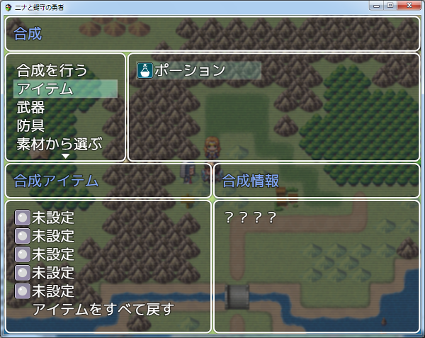

なお、プラグインパラメータ`Display Recipe Materials`を有効にしていると、合成情報ウィンドウに選択中のレシピの素材アイテムを表示します。


レシピを選択すると、生成する数の設定画面に映ります。
このとき、レシピの素材アイテムが表示します。

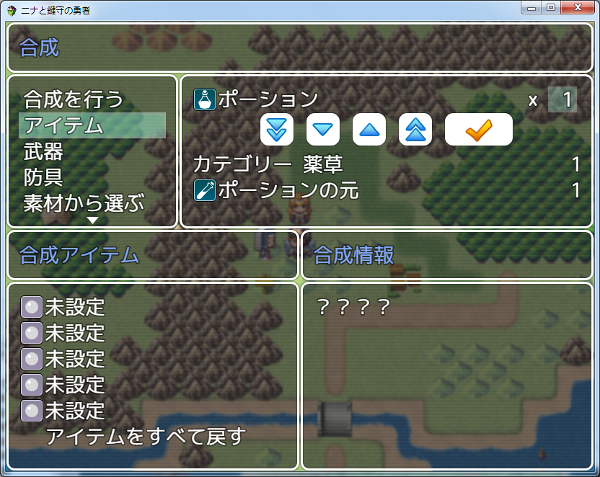

数の設定が終わると、レシピの素材アイテムがまとめて合成アイテムスロットに移ります。
また、レシピを覚えているため、右側の合成情報に合成時の詳細が表示します。

なお、この時表示する合成難易度値は、プラグインパラメータ`Display Difficulty`の設定で、非表示にすることができます。

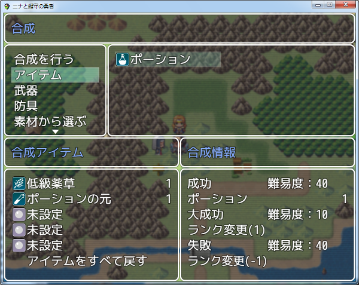

合成実行後については、素材から選ぶ場合と変わりはありません。
なお、下の図のように、合成結果には「成功」だけでなく「大成功」や「失敗」「消失」があります。

図のレシピの場合、大成功時にアイテムランクが上がるように設定しています。
そのため、成功時に「ポーション」だったものが、大成功では「ハイポーション」に変わります。


[目次に戻る](#目次)

## 合成の成功率
合成の成功率は、合成して出来るアイテムの難易度と、パーティーのパラメータから算出します。

### 成功率の算出
成功率は、以下の計算式で大成功、成功、失敗で個別に算出します。

成功率 ＝ 成功値 / プラグインパラメータ`<Max Success Rate>`の設定値

成功値 ＝ プラグインパラメータ`<Success Base Rate>`の設定値 + 成功補正値

(難易度 < パラメータ の場合)<br>
成功補正値 ＝ 難易度とパラメータの差 × `<Upper Add Rate>`の設定値(正の値)

(難易度 > パラメータ の場合)<br>
成功補正値 ＝ 難易度とパラメータの差 × `<Downer Reduce Rate>`の設定値(負の値)

アイテムの合成難易度に対して、パラメータが高ければ成功率は上がり低い場合は成功率が下がるようになっています。

### 最終的な成功率の算出
最終的に、大成功、成功、失敗、消失のどれになるかについては以下の計算式から算出します。

大成功になる確率 ＝ 成功の成功率 × 大成功の成功率<br>
成功になる確率　 ＝ 成功の成功率 - 大成功になる確率<br>
失敗になる確率　 ＝ (1 - 成功の成功率) × 失敗の成功率<br>
消失になる確率　 ＝ (1 - 成功の成功率) - 失敗になる確率<br>

上の計算式で分かると思いますが、成功の成功率が基準になっています。

### パーティーのパラメータについて
プラグインパラメータ`<Composition Parameter>`で指定した計算式を使用します。

#### 計算式 の値
計算式は、ダメージ計算式のように、計算式を入力することで、
固定値以外の値を使用することができます。以下のコードを使用できます。
* a[x].param - アクターID x のパラメータを参照します。
* s[x]    - スイッチID x の状態を参照します。
* v[x]    - 変数ID x の値を参照します。

#### 設定例
プラグインパラメータおよび、アイテムの合成難易度の設定を以下とします。
```
<Max Success Rate>  : 100
<Success Base Rate> : 80
<Upper Add Rate>    : 2
<Downer Reduce Rate>: -5
難易度: 60,50,40
```
パラメータの値が 50 だった場合、合成結果の確率は以下のようになります。

「大成功」の成功値 ＝ 80 + 10 * -5 = 30<br>
「成功」の成功値　 ＝ 80<br>
「失敗」の成功値　 ＝ 80 + 10 * 2 = 100<br>

大成功になる確率 ＝ 30% * 80% = 24%<br>
成功になる確率　 ＝ 80% - 24% = 56%<br>
失敗になる確率　 ＝ 20% * 100% = 20%<br>
消失になる確率　 ＝ 20% - 20% = 0%<br>

### パラメータを設定しない場合の最終的な成功率
プラグインパラメータ`<Composition Parameter>`に、値を設定しない場合は、アイテムに設定した難易度がそのまま最終的な成功率になります。

#### 設定例
`<Max Success Rate>`の設定値がデフォルト(100)で、アイテムに以下のように設定した場合
```
難易度: 10,50,30
```
大成功になる確率 ＝ 10 / 100 = 10%<br>
成功になる確率　 ＝ 50 / 100 = 50%<br>
失敗になる確率　 ＝ 30 / 100 = 30%<br>
消失になる確率　 ＝ (100 - (10 + 50 + 30)) / 100 = 10%<br>

[目次に戻る](#目次)

## 特殊合成

### 特殊合成の仕様

特殊合成は、他の合成と異なり以下の仕様になります。

1. レシピの一つ目に設定した素材をベースアイテムとします。
2. レシピの二つ目以降に設定した素材を付加アイテムとします。
   なお、「合成アイテム」タグをつけたアイテムは除きます。
3. 合成してできるアイテムは、ベースアイテムに付加アイテムの性能を一部乗せたアイテムになります。
4. 特殊合成は、レシピから選ぶことはできません。
5. 特殊合成は、ランク変更、カテゴリー変更、アイテム変更は選べません。

### 合成してできるアイテムの仕様

特殊合成で入手するアイテムは、他の合成と異なり以下の仕様になります。

1. アイテム分類および基本設定は、ベースアイテムと同じです。
2. 合成により、付加アイテムの能力値、または特徴をベースアイテムに付与します。
3. 付与する能力の数は、生成数に従います。
   生成数が 0 以下の場合は、何も付与しません。
4. ベースアイテムと同じ見た目ですが、ベースアイテムとは別物です。
   アイテムIDが異なりますので、武器・防具の所持数を取得する場合に別アイテムとして数えます。
5. オリジナルアイテムの名前は、「ベースアイテム名(+合成回数)」になります。

作成例）
ベースアイテムがショートソードで、合成回数が1回の場合に出来上がるアイテムは、「ショートソード(+1)」です。

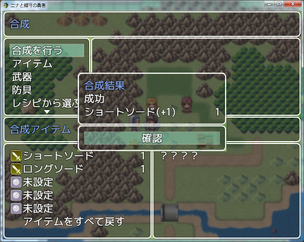

[目次に戻る](#目次)

# アイテムの合成の設定

## アイテムのタグ設定

アイテムに設定可能なタグは以下があります。

* [合成カテゴリー](#合成カテゴリーのタグ設定)
* [合成ランク](#合成ランクのタグ設定)
* [合成アイテム](#合成アイテムのタグ設定)
* [合成レシピ](#合成レシピのタグ設定)

### 合成カテゴリーのタグ設定

下記のいずれかを入力することで、合成カテゴリーを指定します。
設定しない場合は、アイテム分類と同じになります。
```
<ICS アイテム>
<ICS 武器>
<ICS 防具>
<ICS カテゴリー: カテゴリー名>
```

### 合成ランクのタグ設定
以下のタグで、アイテムにランクを設定できます。
```
<ICS ランク: x>
```
合成後にできるアイテムのランクは、素材に使用したアイテムのランクの平均値です。
ランク 0 のアイテムは、ランク計算には使いません。
このタグを設定しない場合は、ランク 0 と見なします。

### 合成アイテムのタグ設定
以下のノートタグで、アイテムを合成アイテムに設定できます。
```
<ICS 合成アイテム>
```
合成アイテムに指定すると、合成ランクの計算上で無いものとして扱われます。

### 合成レシピのタグ設定
レシピは、以下の記述で入力します。
レシピの内容については、レシピの設定を参照してください。
レシピは、一つのアイテムやカテゴリーに対して複数設定することができます。

```
<ICS レシピ>
内容
</ICS レシピ>
```

#### 生成数の設定
合成でできあがるアイテムの数を y に設定します。
```
生成数: y
```

#### 素材の設定
合成に必要な素材アイテムを設定します。
以下のいずれかの記述で入力してください。
```
アイテム[x]: y
武器[x]: y
防具[x]: y
アイテム名: y
カテゴリー[カテゴリー名]: y
```
* x - アイテムや武器等のID
* y - 必要な個数

#### 合成難易度の設定
合成の難易度を数値で設定します。
大成功の難易度が x、成功が y、失敗が z です。
```
難易度: x, y, z
```

#### 成功以外の合成結果の設定
大成功および失敗時の合成アイテムの内容を設定します。
入力しない場合は、発生しません。
例えば、大成功を入力しなければ、大成功しません。
```
大成功: 内容
失敗: 内容
```
以下の内容から選んで入力してください。

* `生成数変更(x)`
    * 生成数を変更します。負の値の場合は減ります。

* `ランク変更(x)`
    * 生成後のアイテムのランクを変更します。負の値の場合は減ります。
    * ランクが減ったことで 0 になる、またはそのランク以下のアイテムが
    ない場合は、何も生成しません。

* `カテゴリー変更(カテゴリー名)`
    * 生成後のアイテムのカテゴリーを変更します。
      変更後のカテゴリーの同ランクのアイテムになります。

* `アイテム変更(アイテム名)`
    * ランクやカテゴリーを無視して、指定したアイテムに変更します。

* `なし`
    * 何も生成しません。生成数を 0 に変更します。

入力例)
```
大成功: 生成数変更(3)
失敗: 生成数変更(1)
大成功の時に生成数が3に、失敗の時に生成数が1になる。
```

#### 合成の必要条件の設定
成功および大成功するために必要な条件を設定します。
この条件に満たない場合は、必ず失敗、または消失になります。
```
必要条件: 条件式
```
#### 条件式 の値について
条件式は、ダメージ計算式のように、計算式を入力することで、固定値以外の値を
使用することができます。以下のコードを使用できます。
* a[x].param - アクターID x のパラメータを参照します。
* s[x]    - スイッチID x の状態を参照します。
* v[x]    - 変数ID x の値を参照します。

[目次に戻る](#目次)

## カテゴリー合成の設定

カテゴリー合成レシピは、データベースの武器に作成します。

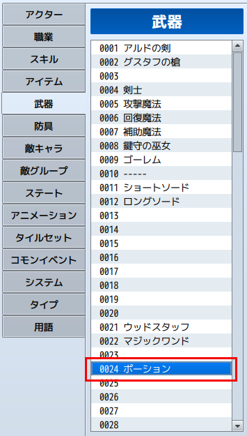

### 合成カテゴリーの設定

カテゴリー合成のレシピを作成するために、まず「武器タイプ」にカテゴリー合成レシピ用のタイプを作成してください。
武器タイプ名を「合成カテゴリー」などと付けると、分かりやすくなると思います。

設定した武器タイプIDは、プラグインパラメータ`Category Type ID`に設定してください。

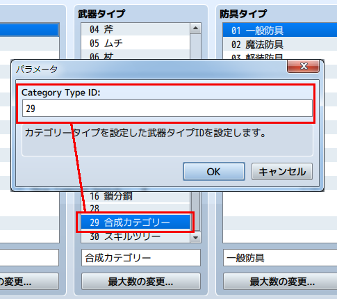

### カテゴリー合成レシピの設定

カテゴリー合成として設定が必要なデータは以下の通りです。

1. 武器タイプには、先ほど登録した合成カテゴリーIDを選択してください。
2. 武器の名前が合成カテゴリーの名前になります。
3. 武器のアイコンがアイテム合成画面でレシピを表示したときのアイコンになります。
4. メモ欄に合成用のタグを追加してください。

カテゴリー合成のレシピは、以下のように合成素材に合成カテゴリーを指定します。

```
<ICS_レシピ>
カテゴリー[カテゴリー名]: 必要素材数
アイテム名: 必要素材数
</ICS_レシピ>
```
合成素材には、合成カテゴリー以外も指定しても問題ないですが、基本的に１種類以上は合成カテゴリーを指定してください。

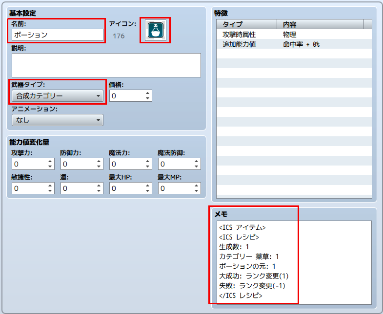

### 合成素材の合成カテゴリー素材の設定

カテゴリー合成レシピに指定した合成カテゴリーに該当する合成素材を設定します。

合成カテゴリー用の素材には、以下のように合成カテゴリーと合成ランクのタグを設定してください。

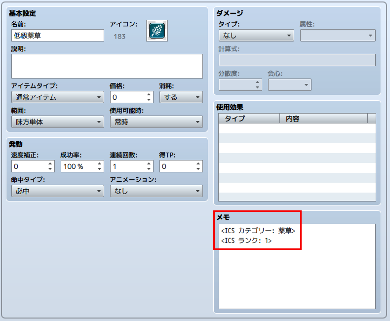

[目次に戻る](#目次)

## 特殊合成の設定

カテゴリー合成レシピに`<ICS 特殊合成>`タグを追記すると、この特殊合成になります。
通常の合成とは異なり、合成仕様が変わります。

素材に使用できるアイテム分類は「武器」および「防具」だけです。

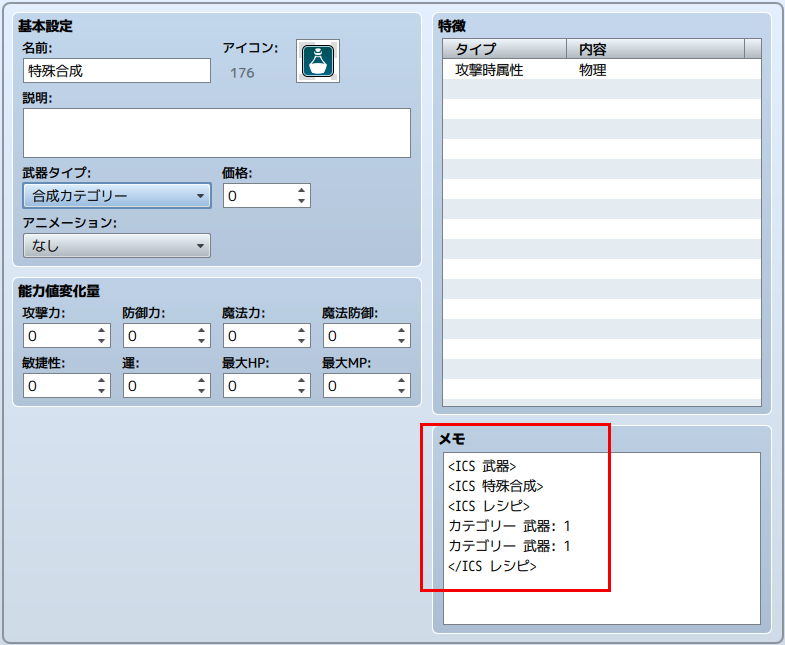

### 特殊合成の仕様

1. レシピの一つ目に設定した素材をベースアイテムとします。
2. レシピの二つ目以降に設定した素材を付加アイテムとします。
   なお、「合成アイテム」タグをつけたアイテムは除きます。
3. 合成してできるアイテムは、ベースアイテムに付加アイテムの性能を一部乗せたアイテムになります。
4. 特殊合成は、レシピから選ぶことはできません。
5. 特殊合成は、ランク変更、カテゴリー変更、アイテム変更は選べません。

### 合成してできるアイテムの仕様

1. アイテム分類および基本設定は、ベースアイテムと同じです。
2. 合成により、付加アイテムの能力値、または特徴をベースアイテムに付与します。
3. 付与する能力の数は、生成数に従います。
   生成数が 0 以下の場合は、何も付与しません。
4. ベースアイテムと同じ見た目ですが、ベースアイテムとは別物です。
   アイテムIDが異なりますので、武器・防具の所持数を取得する場合に別アイテムとして数えます。
5. オリジナルアイテムの名前は、「ベースアイテム名(+合成回数)」になります。

作成例）
ベースアイテムがショートソードで、合成回数が1回の場合に出来上がるアイテムは、「ショートソード(+1)」です。


[目次に戻る](#目次)

# 基本設定

## メニューコマンドの設定

メニュー画面に表示されるコマンドは、プラグインパラメータ`Menu Command`で設定します。

プラグインパラメータはリスト入力になっており、リストを追加するとメニュー画面上の合成コマンドを増やすことができます。

コマンド毎にどのような表示内容にするかは、別のプラグインパラメータで設定します。

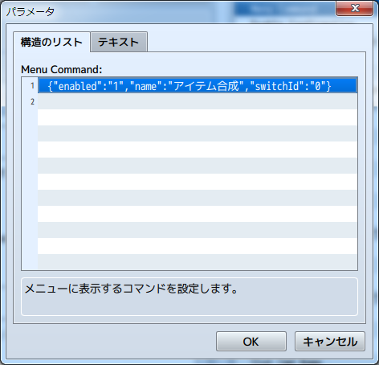

リストの中身は、下図のように構造体になっており以下の設定をリスト毎に設定できます。

`enabled`

メニュー画面にコマンドを表示するかどうかを設定します。
1 の時に表示します。（デフォルトで設定済み）

`name`

メニュー画面上に表示するコマンド名を設定します。
制御文字が使用可能です。

`switchId`

0 を指定した場合は、この機能は無効です。
1 以上の値を設定した場合、そのIDのスイッチが ON 状態の時にメニューに表示します。

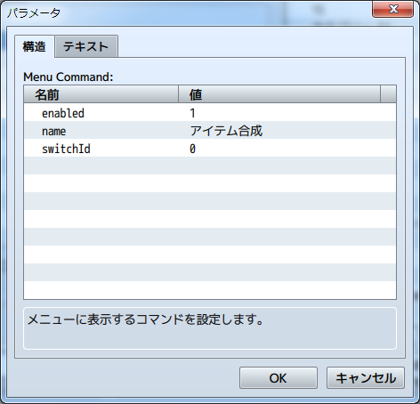

[目次に戻る](#目次)

## アイテム合成画面の設定

アイテム合成画面は、以下のウィンドウで構成しています。

* 合成タイトルウィンドウ
  * 下図で「合成」と表示している部分
* 合成コマンドウィンドウ
  * 下図で「合成を行う」等のコマンドを表示している部分
* アイテムリストウィンドウ
  * 下図でアイテム名を表示している部分
  * 合成コマンドで選択したカテゴリーの所持アイテムを表示する。
* スロットタイトルウィンドウ
  * 下図で「合成アイテム」と表示している部分
* 素材スロットウィンドウ
  * 下図で「未設定」等と表示している部分
  * アイテムリストで選択したアイテムがここに表示される。
* 合成情報タイトルウィンドウ
  * 下図で「合成情報」と表示している部分
* 合成情報ウィンドウ
  * 下図で「？？？」と表示している部分
  * 主に合成アイテムの情報や難易度、生成数などを表示する。
* 背景
  * 背景に画像を表示させることが出来ます。

表示しているアイテム名以外の文字列は、プラグインパラメータで設定可能で、制御文字が使用できます。

また、文字列を設定するプラグインパラメータは、すべてリスト方式で、リスト番号はメニューコマンドのリスト番号に紐付きます。


### 合成コマンドウィンドウの設定

合成コマンドで表示するコマンドの表示項目と順番は
プラグインパラメータ`<Command List>`の設定で変更できます。

以下の文字列を入力した順番にコマンドを上から表示します。
入力する文字列は、必ず小文字にしてください。

各コマンドは、プラグインパラメータで表示名を設定可能です。

| コード | 内容 | 表示名設定用プラグインパラメータ |
| --- | --- | --- |
| action | 合成を実行するコマンド | Action Cmd Name |
| item | 『アイテム』の選択コマンド(*1) | Item Cmd Name |
| weapon | 『武器』の選択コマンド(*1) | Weapon Cmd Name |
| armor | 『防具』の選択コマンド(*1) | Armor Cmd Name |
| change | 右側のアイテムウィンドウに、アイテムを表示するか、レシピを表示するか変えるコマンド | Change Materials Name<br>Change Resipes Name |
| slot | 素材スロットにカーソルを移動するコマンド | Slot Cmd Name |
| end | 合成を止めるコマンド | End Cmd Name |
| custom* | 特定の合成カテゴリーだけ表示する選択コマンドで、*の番号はプラグインパラメータ`Custom Cmd *`の設定番号と同じ(*1) | Custom Cmd * Name |

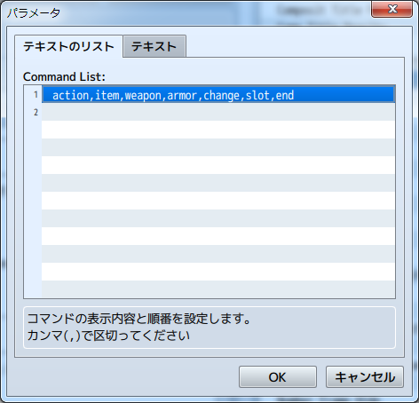

(*1)';'で入力したコマンド名を区切って２種類設定すると、素材選択時とレシピ選択時でコマンド名を変えることが出来ます。

入力例)
```
アイテム素材;アイテムレシピ
```
素材から選ぶ時はコマンド名が「アイテム素材」に、レシピから選ぶ時は「アイテムレシピ」に表示が変わります。

なお、セミコロンの片側を空欄にした場合は、空欄にした側の選択時にコマンドを表示しません。

アイテムの選択コマンド名を「アイテム;」とした場合、素材選択時は「アイテム」コマンドを表示するが、レシピ選択時は表示しません。

#### 合成カテゴリーコマンドの設定

以下のプラグインパラメータで、合成カテゴリーコマンドを設定できます。

`Custom Cmd * Name`

合成コマンドウィンドウで表示する名前を設定します。
セミコロンを使うことで、素材選択時とレシピ選択時で表示を変えることができます。
制御文字が使用できます。

`Custom Cmd * Category`

このコマンドを選択した時にアイテムリストウィンドウに表示する合成カテゴリーを指定します。

アイテムのメモ欄で設定した合成カテゴリーを記載してください。

[目次に戻る](#目次)

### 背景画像の設定

プラグインパラメータ`Background Image Name`に画像ファイルを指定すると、アイテム合成画面の背景に画像を表示することができます。

このプラグインパラメータもリスト入力になっており、メニューコマンド毎に画像を変更することが可能です。

使用する画像ファイルは、/imge/systemフォルダに保存してください。

なお、画像を表示させる場合は、各ウィンドウの透明度(opacity)をプラグインパラメータで変更すると見やすくなります。

[目次に戻る](#目次)

## アイテム合成時の設定

### レシピがない組み合わせの場合の挙動

当プラグインでは、自由に合成素材を選択して合成を実行することが可能です。
そのため、レシピがない組み合わせになる場合が考えられます。

この時の挙動をプラグインパラメータ`Not Applicable to Recipe`で設定することができます。

* lost : 使用した素材が消失します。
* reset : 使用した素材が無くならずに、アイテムリストに戻ります。

### レシピとの合致条件

例えば、「ポーション」のレシピが「ポーションの元」と「薬草」で、スロットにセットした素材が、「ポーションの元」「薬草」「毒消し草」のように、余計な素材を含んでいた場合の挙動を、プラグインパラメータ`<Recipe Matching Pattern>`で以下の様に設定できます。

 * 0 - レシピと同じ素材を含んでいれば、不要な素材をセットしても合致
 * 1 - レシピと素材アイテムの組み合わせが同一の場合に合致

### アイテム合成時の確認

`<Enable Confirmation>`

アイテム合成実行時に確認画面を表示して、実行するか確認するかを指定します。
 * 1 - 確認する
 * 0 - 確認しない


確認する場合は、アイテム合成実行時に下のウィンドウを表示します。


### アイテム合成時のＳＥ

プラグインパラメータでアイテム合成時のSEを、成功、大成功、失敗、消失のぞれぞれ別に設定できます。

SEの設定項目は、SE名、音量、ピッチ、位相です。

SEは、メニューコマンド毎に設定を変えることもできます。

[目次に戻る](#目次)

## プラグインコマンド

### アイテム合成画面表示
```
ICS_Open [compositTitle] [slotTitle] [statusTitle] [commandList] [backGroundImage]
ICS_合成画面表示 [合成タイトル] [スロットタイトル] [情報タイトル] [コマンドリスト] [背景画像]
```
[]部の入力は必須ではありません。
入力した場合、プラグインパラメータの設定を無視して、合成画面の各表示に引数で設定した文字列を使用します。
[]部には制御文字を使用できます。

コマンドリスト - プラグインパラメータ<Command List>と同じ入力方式です。

背景画像 - プラグインパラメータ<BackGround Image Name>と同じ入力方式です。

```
ICS_Open [listNumber]
ICS_合成画面表示 [リスト番号]
```
リスト番号を指定すると、合成画面の表示内容をプラグインパラメータで設定したリストの番号のものに変更します。

### レシピを追加
```
ICS_ADD_RECIPE [ITEMNAME] [RecipeId]
ICS_ADD_RECIPE [ITEM] [ItemId] [RecipeId]
ICS_レシピ追加 [アイテム名] [レシピID]
ICS_レシピ追加 [アイテム] [アイテムID] [レシピID]
```
'アイテム'部は、武器の場合は'武器'、防具の場合は'防具'と入力します。
指定したアイテムのレシピを覚えます。

アイテム名や、アイテム、アイテムID部に、v[n]と入力することで、
ゲーム内変数ID n の内容を参照できます。
レシピIDを入力しない場合は、指定したアイテムの1つめのレシピになります。

入力例) アイテムID11 がポーションの場合、以下は同じ結果になります。
```
ICS_レシピ追加 ポーション 1
ICS_レシピ追加 アイテム 11 1
```

### レシピを削除
```
ICS_REDUCE_RECIPE [ITEMNAME] [RecipeId]
ICS_REDUCE_RECIPE [ITEM] [ItemId] [RecipeId]
ICS_レシピ削除 [アイテム名] [レシピID]
ICS_レシピ削除 [アイテム] [アイテムID] [レシピID]
```
'アイテム'部は、武器の場合は'武器'、防具の場合は'防具'と入力します。
指定したアイテムのレシピを忘れます。

アイテム名や、アイテム、アイテムID部に、v[n]と入力することで、
ゲーム内変数ID n の内容を参照できます。
レシピIDを入力しない場合は、指定したアイテムの1つめのレシピになります。

入力例) アイテムID11 がポーションの場合、以下は同じ結果になります。
```
ICS_レシピ削除 ポーション 1
ICS_レシピ削除 アイテム 11 1
```

[目次に戻る](#目次)

## プラグインの更新履歴

| バージョン | 公開日 | 更新内容 |
| --- | --- | --- |
| [ver1.5.4](FTKR_ItemCompositionSystem.js) | 2018/07/12 | 他プラグインとの競合回避 |
| ver1.5.3 | 2017/12/11 | レシピを設定したアイテムにカテゴリーを設定しても、特定のカテゴリーのアイテムだけ表示する合成コマンドの機能が反映されない不具合を修正 |
| ver1.5.2 | 2017/11/01 | レシピの素材にカテゴリーを設定する場合のヘルプの説明が間違っていたため修正 |
| ver1.5.1 | 2017/10/16 | 合成画面を表示するメニューコマンドの設定方式をリスト方式に変更<br>メニュー画面に複数の合成コマンドを設定する機能を追加 |
| ver1.5.0 | 2017/10/11 | 合成画面の表示内容を設定するプラグインパラメータの入力方式をリスト方式に変更<br>プラグインコマンドで合成画面を表示するときに、オプションでリスト番号を指定すると表示内容をリストの番号に合わせて変更する機能を追加<br>合成終了時に確認画面を表示する機能を追加 |
| ver1.4.0 | 2017/10/07 | プラグインコマンドで背景画像を設定する機能を追加<br>特定のカテゴリーのアイテムだけ表示する合成コマンドを作成する機能を追加<br>合成コマンドの、素材選択時とレシピ選択時で変える機能を拡張し、素材選択時だけ、またはレシピ選択時だけ表示できる機能を追加 |
| ver1.3.2 | 2017/09/03 | v1.3.0の変更部の不具合修正 |
| ver1.3.1 | 2017/09/02 | 背景画像を設定する機能を追加 |
| ver1.3.0 | 2017/09/01 | ウィンドウ背景の透明度と枠の有無を設定する機能を追加 |
| ver1.2.0 | 2017/08/29 | １つのアイテムに複数設定したレシピを正しく読み取れない不具合を修正<br>合成コマンドの、「アイテム」「武器」「防具」の表示名を素材選択時とレシピ選択時で変える機能を追加 |
| ver1.1.0 | 2017/08/21 | 合成コマンドの、「アイテム」「武器」「防具」の表示名をプラグインパラメータで設定できる機能を追加<br>合成レシピと使用素材の合致条件を設定する機能を追加<br>素材を何もセットしていない場合に、合成実行できないように変更 |
| ver1.0.6 | 2017/08/19 | 確認ウィンドウを無効にして合成を実行するとエラーになる不具合を修正 |
| ver1.0.5 | 2017/07/12 | レシピ素材が１種類でも合成できるように変更 |
| ver1.0.4 | 2017/07/07| プラグインコマンドで、レシピIDを指定しない場合に正しく処理できない不具合を修正 |
| ver1.0.3 | 2017/06/28| 合成情報ウィンドウに必要レシピを表示する機能が、正しく動作しない不具合を修正<br>素材数指定ウィンドウに、必要レシピを表示するかどうか設定するプラグインパラメータを追加 |
| ver1.0.2 | 2017/06/27| レシピタグで難易度を設定すると、正しく反映されない不具合を修正 |
| ver1.0.1 | 2017/06/27| ヘルプ修正 |
| ver1.0.0 | 2017/06/26 | レシピから選んで生成数を設定しても、スロットに正しい素材員数がセットされない不具合を修正<br>合成画面の表示コマンドの機能拡張<br>コマンド名を設定するプラグインパラメータの名称変更<br>プラグインコマンドの表記変更 |
| ver0.9.4 | 2017/06/11 | 合成情報ウィンドウの難易度表示をON/OFFする機能を追加<br>レシピから選ぶ場合、合成情報ウィンドウに必要レシピを表示する機能を追加 |
| ver0.9.3 | 2017/06/08 | 投入したアイテムが何のレシピにも該当しない場合に、使用したアイテムが戻る処理を追加 |
| ver0.9.2 | 2017/04/13 | 特殊合成を追加 |
| ver0.9.1 | 2017/04/13 | 不具合修正、デフォルトカテゴリーを追加 |
| ver0.9.0 | 2017/04/08 | 試作版公開 |

## ライセンス

本プラグインはMITライセンスのもとで公開しています。

[The MIT License (MIT)](https://opensource.org/licenses/mit-license.php)

#
[目次に戻る](#目次)

[トップページに戻る](README.md)