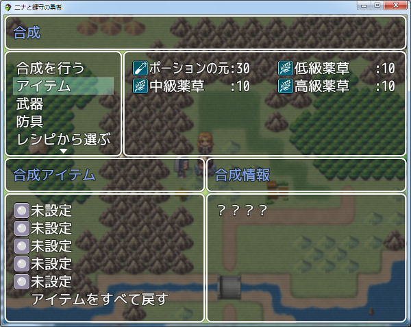
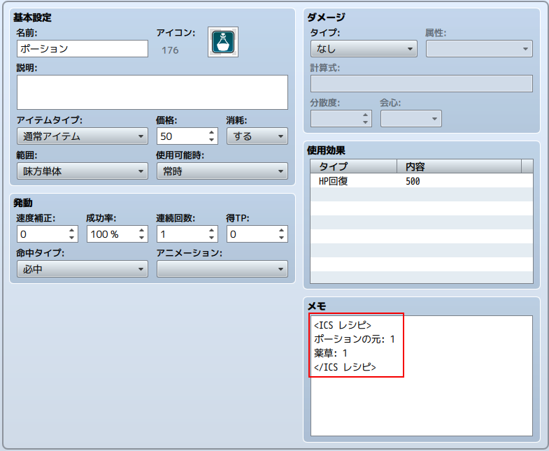
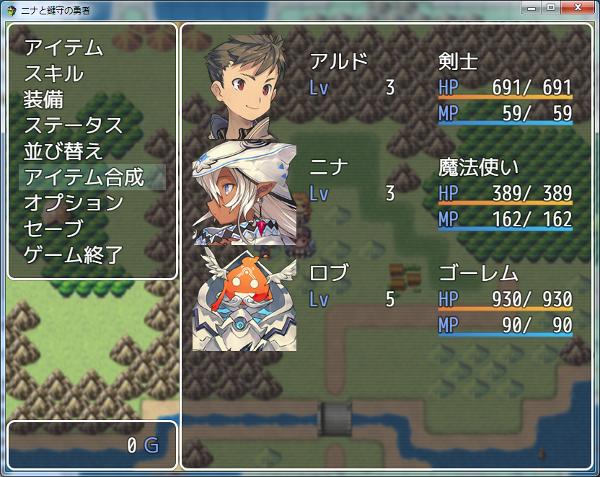

[トップページに戻る](README.md)

# [FTKR_ItemCompositionSystem](FTKR_ItemCompositionSystem.js) プラグイン

アイテム合成システムを実装するプラグインです。

ダウンロード: [FTKR_ItemCompositionSystem.js](https://raw.githubusercontent.com/futokoro/RPGMaker/master/FTKR_ItemCompositionSystem.js)

サンプルプロジェクト: [日本語版](sampleProject/ItemCompositionSample.zip)
※(MVコアスクリプト v1.5.1対応)

# 目次

以下の項目の順でプラグインの使い方を説明します。
1. [概要](#概要)
1. [当プラグインの用語](#当プラグインの用語)
1. [プラグインの導入](#プラグインの導入)
    1. [合成レシピの基本設定](#合成レシピの基本設定)
    1. [アイテム合成画面を表示する](#アイテム合成画面を表示する)
4. [合成の仕組み](FTKR_ItemCompositionSystem_1.ja.md)
    1. [合成の基本](FTKR_ItemCompositionSystem_1.ja.md#合成の基本)
    2. [合成の成功率](FTKR_ItemCompositionSystem_1.ja.md#合成の成功率)
    3. [特殊合成](FTKR_ItemCompositionSystem_1.ja.md#特殊合成)
3. [アイテムの合成の設定](FTKR_ItemCompositionSystem_2.ja.md)
    1. [アイテムのタグ設定](FTKR_ItemCompositionSystem_2.ja.md#アイテムのタグ設定)
    1. [カテゴリー合成の設定](FTKR_ItemCompositionSystem_2.ja.md#カテゴリー合成の設定)
    1. [マルチ合成の設定](FTKR_ItemCompositionSystem_2.ja.md#マルチ合成の設定)
    3. [特殊合成の設定](FTKR_ItemCompositionSystem_2.ja.md#特殊合成の設定)
2. [基本設定](FTKR_ItemCompositionSystem_3.ja.md)
    1. [メニューコマンドの設定](FTKR_ItemCompositionSystem_3.ja.md#メニューコマンドの設定)
    1. [アイテム合成画面の設定](FTKR_ItemCompositionSystem_3.ja.md#アイテム合成画面の設定)
    2. [アイテム合成時の設定](FTKR_ItemCompositionSystem_3.ja.md#アイテム合成時の設定)
6. [プラグインコマンド](#プラグインコマンド)
* [プラグインの更新履歴](#プラグインの更新履歴)
* [ライセンス](#ライセンス)

# 概要

本プラグインにより、アイテム合成システムを実装し、アイテム同士を合成して新たなアイテムを入手できるようになります。

[目次に戻る](#目次)

# 当プラグインの用語

当プラグインで使用する用語の意味を以下に示します。

## アイテムの区別に関する用語

### アイテム分類
データベース上の『アイテム』、『武器』、『防具』の区別のことを、アイテム分類と呼びます。

なお、当マニュアル上では、アイテム分類としての表記を『アイテム』、アイテム・武器・防具の総称としての表記を　アイテム と記載します。

また、個別のアイテムの名称（例：ポーション、など）は「ポーション」と記載します。

### 合成カテゴリー
当プラグインの機能により、アイテム分類に拠らずに自由に設定できる区別方法を、合成カテゴリーと呼びます。

合成カテゴリーは、任意の文字列を指定でき、また複数設定することができます。

合成カテゴリーは、ゲーム画面上で個別に表示させたり、レシピに設定することに使います。

### デフォルトカテゴリー
合成カテゴリーの１種ですが、プラグインのデフォルトで用意しているもので、アイテム、武器、防具の３種類の合成カテゴリーのことを指します。

[目次に戻る](#目次)

## 合成に関する用語

### アイテムの合成
当プラグインでは、複数のアイテムを消費して別のアイテムを入手することができます。

これを、アイテムの合成と呼びます。

### 合成アイテム
アイテムの合成によって入手するアイテムのことを、合成アイテムと呼びます。

### 合成素材

アイテムの合成で消費するアイテムのことを、合成素材と呼びます。

### 合成レシピ
当プラグインでは、あるアイテムを入手するために必要な、合成素材の組み合わせは、事前に設定しておかなければいけません。

この合成素材の組み合わせを、合成レシピと呼びます。または、レシピと呼びます。

○○の合成レシピ、という記載は、○○を入手するために必要な合成素材の組み合わせのことを意味します。

### 合成の成功
当プラグインでは、合成レシピ通りにアイテムを消費しても、合成アイテムを必ず入手できるとは限りません。
合成レシピの設定によって、その結果を確率で変えることができます。

設定通りにアイテムを入手できることを、合成の「成功」と呼びます。

他に、設定以上のアイテムを入手できる「大成功」、設定以下のアイテムを入手する「失敗」、アイテムを入手できない「消失」があります。

また「消失」の代わりに、使用した素材が戻ってくる「復元」もあります。

### 合成ランク
合成アイテム、合成素材にそれぞれ設定する、アイテムのレアリティを意味する数値を、合成ランクと呼びます。

合成素材のランクの平均値が、入手するアイテムのランク以上にならないと、合成に成功しないようにすることができます。

### 合成難易度
アイテムの合成の結果が、「成功」「大成功」「失敗」「消失」のどれになるかを決める値を、合成難易度と呼びます。

設定した値がそのまま確率を意味する場合と、パーティーの何らかのパラメータとの大小を比較する場合の２通りの使い方があります。

[目次に戻る](#目次)

## ゲーム画面に関する用語

### アイテム合成画面

アイテムの合成を行う当プラグイン専用画面のことを、アイテム合成画面と呼びます。

メニューから表示させたり、プラグインコマンドを使ってイベントで表示させることが出来ます。



[目次に戻る](#目次)

## 合成の種類に関する用語
当プラグインでは、アイテムを合成する方法は大きく４つに分けられます。

### アイテム合成
１つの合成レシピに対して、１つの合成アイテムを設定する方法を、アイテム合成と呼びます。

合成アイテムに直接レシピを設定することで、その合成レシピによって決まった合成アイテムが入手できます。

### カテゴリー合成
１つの合成レシピに対して、複数の合成アイテムを設定する方法を、カテゴリー合成と呼びます。

合成によって入手するアイテムは、設定した合成アイテムのいずれか一つになります。

合成アイテムに直接レシピを設定せずレシピ用のデータを別に作り、合成レシピに合成カテゴリーを指定します。

### マルチ合成
１つの合成レシピで、一度に複数の合成アイテムを作成できる合成を、マルチ合成と呼びます。

合成アイテムに直接レシピを設定せずレシピ用のデータを別に作り、そのデータで作成させる合成アイテムを複数指定します。「成功」「大成功」「失敗」でそれぞれ別の合成アイテムを設定できます。

### 特殊合成
アイテムの合成によってデータベースに設定されていないアイテムを入手できる方法を、特殊合成と呼びます。

この合成には、武器または防具しか使用することはできません。

[目次に戻る](#目次)

# プラグインの導入

この章では、アイテムの合成を行うために最低限必要な設定を説明します。

1. [合成レシピの基本設定](#合成レシピの基本設定)
1. [アイテム合成画面を表示する](#アイテム合成画面を表示する)

## 合成レシピの基本設定

アイテムの合成を行うためには、合成レシピを設定しなくては行けません。

合成レシピの設定は、下の図のように合成アイテムとなる『アイテム』『武器』『防具』のメモ欄に`<ICS レシピ>`または`<ICS RECIPES>`タグを記載して行います。

タグの記述方法は、以下の通りに`<ICS レシピ></ICS レシピ>`タグの間に、合成素材に使うアイテム名とその必要個数を記載します。
```
<ICS レシピ>
アイテム名: 必要個数
</ICS レシピ>
```

合成素材は５種類まで設定できます。

なお、当プラグインでは合成レシピをアクター等に事前に覚えさせる必要はありません。
レシピに必要な合成素材とその数を所持していれば、アイテムの合成を行うことができます。



[目次に戻る](#目次)

## アイテム合成画面を表示する

アイテム合成画面は、以下の方法で表示できます。

### メニューから表示

プラグインのデフォルト設定で、メニュー画面にコマンド「アイテム合成」が表示します。

このコマンドを選択すると、アイテム合成画面を表示します。



### プラグインコマンドで表示

以下のプラグインコマンドを実行することでも、アイテム合成画面を表示できます。
```
ICS_Open
ICS_合成画面表示
```

### YEP_MainMenuManagerを使う

YEP_MainMenuManagerを使ってコマンドをメニューに追加する場合は、以下のパラメータを設定してください。

| パラメータ名 | 設定内容 | 備考 |
| --- | --- | --- |
| Name | FTKR.ICS.basic.menuCmd[コマンドID].name | |
| Symbol | composition | |
| Show | this.isEnabledCompositionCmd(コマンドID) | |
| Enabled | true | |
| Ext | コマンドID | |
| Main Bind | this.commandIcs.bind(this) | |
| Actor Bind |  | 空欄 |

コマンドIDは、プラグインパラメータ`Menu Command`で設定した、表示させたいコマンドの [リストの番号 - 1] を指定してください。
通常は 0 です。

[目次に戻る](#目次)

## プラグインコマンド

### アイテム合成画面表示
```
ICS_Open [compositTitle] [slotTitle] [statusTitle] [commandList] [backGroundImage]
ICS_合成画面表示 [合成タイトル] [スロットタイトル] [情報タイトル] [コマンドリスト] [背景画像]
```
[]部の入力は必須ではありません。
入力した場合、プラグインパラメータの設定を無視して、合成画面の各表示に引数で設定した文字列を使用します。
[]部には制御文字を使用できます。

コマンドリスト - プラグインパラメータ<Command List>と同じ入力方式です。

背景画像 - プラグインパラメータ<BackGround Image Name>と同じ入力方式です。

```
ICS_Open [listNumber]
ICS_合成画面表示 [リスト番号]
```
リスト番号を指定すると、合成画面の表示内容をプラグインパラメータで設定したリストの番号のものに変更します。

### レシピを追加
```
ICS_ADD_RECIPE [ITEMNAME] [RecipeId]
ICS_レシピ追加 [アイテム名] [レシピID]

ICS_ADD_RECIPE [ITEM] [ItemId] [RecipeId]
ICS_レシピ追加 [アイテム] [アイテムID] [レシピID]
```
[アイテム]部は、『アイテム』の場合はアイテム(ITEM)、『武器』の場合は武器(WEAPON)、『防具』の場合は防具(ARMOR)と入力します。
指定したアイテムのレシピを覚えます。

[アイテム名]や、[アイテム]、[アイテムID]部に、v[n]と入力することで、ゲーム内変数ID n の内容を参照できます。
レシピIDを入力しない場合は、指定したアイテムの1つめのレシピになります。

入力例) アイテムID11 がポーションの場合、以下は同じ結果になります。
```
ICS_レシピ追加 ポーション 1
ICS_レシピ追加 アイテム 11 1
```

### レシピを削除
```
ICS_REDUCE_RECIPE [ITEMNAME] [RecipeId]
ICS_レシピ削除 [アイテム名] [レシピID]

ICS_REDUCE_RECIPE [ITEM] [ItemId] [RecipeId]
ICS_レシピ削除 [アイテム] [アイテムID] [レシピID]
```
[アイテム]部は、『アイテム』の場合はアイテム(ITEM)、『武器』の場合は武器(WEAPON)、『防具』の場合は防具(ARMOR)と入力します。
指定したアイテムのレシピを忘れます。

[アイテム名]や、[アイテム]、[アイテムID]部に、v[n]と入力することで、ゲーム内変数ID n の内容を参照できます。
レシピIDを入力しない場合は、指定したアイテムの1つめのレシピになります。

入力例) アイテムID11 がポーションの場合、以下は同じ結果になります。
```
ICS_レシピ削除 ポーション 1
ICS_レシピ削除 アイテム 11 1
```

[目次に戻る](#目次)

## プラグインの更新履歴

| バージョン | 公開日 | 更新内容 |
| --- | --- | --- |
| [ver1.7.2](FTKR_ItemCompositionSystem.js) | 2018/11/07 | 一つのアイテムに対して複数のレシピを覚えていた場合に、いずれか１つのレシピの素材をもっていれば、ほかのレシピで作れてしまう不具合を修正 |
| ver1.7.1 | 2018/10/22 | 素材選択時の数値入力を無効にする機能を追加 |
| ver1.7.0 | 2018/10/14 | 合成に使用した素材を合成成功時でも復元する機能を追加<br>コマンドとタイトル文字列の表示位置を調整する機能を追加<br>合成時に複数のアイテムを入手できる詳細合成を追加<br>アイテム名とアイテム数の間に区切り文字を設定する機能を追加 |
| ver1.6.0 | 2018/10/09 | 成功時のボーナスを設定する機能を追加 |
| ver1.5.4 | 2018/07/12 | 他プラグインとの競合回避 |
| ver1.5.3 | 2017/12/11 | レシピを設定したアイテムにカテゴリーを設定しても、特定のカテゴリーのアイテムだけ表示する合成コマンドの機能が反映されない不具合を修正 |
| ver1.5.2 | 2017/11/01 | レシピの素材にカテゴリーを設定する場合のヘルプの説明が間違っていたため修正 |
| ver1.5.1 | 2017/10/16 | 合成画面を表示するメニューコマンドの設定方式をリスト方式に変更<br>メニュー画面に複数の合成コマンドを設定する機能を追加 |
| ver1.5.0 | 2017/10/11 | 合成画面の表示内容を設定するプラグインパラメータの入力方式をリスト方式に変更<br>プラグインコマンドで合成画面を表示するときに、オプションでリスト番号を指定すると表示内容をリストの番号に合わせて変更する機能を追加<br>合成終了時に確認画面を表示する機能を追加 |
| ver1.4.0 | 2017/10/07 | プラグインコマンドで背景画像を設定する機能を追加<br>特定のカテゴリーのアイテムだけ表示する合成コマンドを作成する機能を追加<br>合成コマンドの、素材選択時とレシピ選択時で変える機能を拡張し、素材選択時だけ、またはレシピ選択時だけ表示できる機能を追加 |
| ver1.3.2 | 2017/09/03 | v1.3.0の変更部の不具合修正 |
| ver1.3.1 | 2017/09/02 | 背景画像を設定する機能を追加 |
| ver1.3.0 | 2017/09/01 | ウィンドウ背景の透明度と枠の有無を設定する機能を追加 |
| ver1.2.0 | 2017/08/29 | １つのアイテムに複数設定したレシピを正しく読み取れない不具合を修正<br>合成コマンドの、「アイテム」「武器」「防具」の表示名を素材選択時とレシピ選択時で変える機能を追加 |
| ver1.1.0 | 2017/08/21 | 合成コマンドの、「アイテム」「武器」「防具」の表示名をプラグインパラメータで設定できる機能を追加<br>合成レシピと使用素材の合致条件を設定する機能を追加<br>素材を何もセットしていない場合に、合成実行できないように変更 |
| ver1.0.6 | 2017/08/19 | 確認ウィンドウを無効にして合成を実行するとエラーになる不具合を修正 |
| ver1.0.5 | 2017/07/12 | レシピ素材が１種類でも合成できるように変更 |
| ver1.0.4 | 2017/07/07| プラグインコマンドで、レシピIDを指定しない場合に正しく処理できない不具合を修正 |
| ver1.0.3 | 2017/06/28| 合成情報ウィンドウに必要レシピを表示する機能が、正しく動作しない不具合を修正<br>素材数指定ウィンドウに、必要レシピを表示するかどうか設定するプラグインパラメータを追加 |
| ver1.0.2 | 2017/06/27| レシピタグで難易度を設定すると、正しく反映されない不具合を修正 |
| ver1.0.1 | 2017/06/27| ヘルプ修正 |
| ver1.0.0 | 2017/06/26 | レシピから選んで生成数を設定しても、スロットに正しい素材員数がセットされない不具合を修正<br>合成画面の表示コマンドの機能拡張<br>コマンド名を設定するプラグインパラメータの名称変更<br>プラグインコマンドの表記変更 |
| ver0.9.4 | 2017/06/11 | 合成情報ウィンドウの難易度表示をON/OFFする機能を追加<br>レシピから選ぶ場合、合成情報ウィンドウに必要レシピを表示する機能を追加 |
| ver0.9.3 | 2017/06/08 | 投入したアイテムが何のレシピにも該当しない場合に、使用したアイテムが戻る処理を追加 |
| ver0.9.2 | 2017/04/13 | 特殊合成を追加 |
| ver0.9.1 | 2017/04/13 | 不具合修正、デフォルトカテゴリーを追加 |
| ver0.9.0 | 2017/04/08 | 試作版公開 |

## ライセンス

本プラグインはMITライセンスのもとで公開しています。

[The MIT License (MIT)](https://opensource.org/licenses/mit-license.php)

#
[目次に戻る](#目次)

[トップページに戻る](README.md)