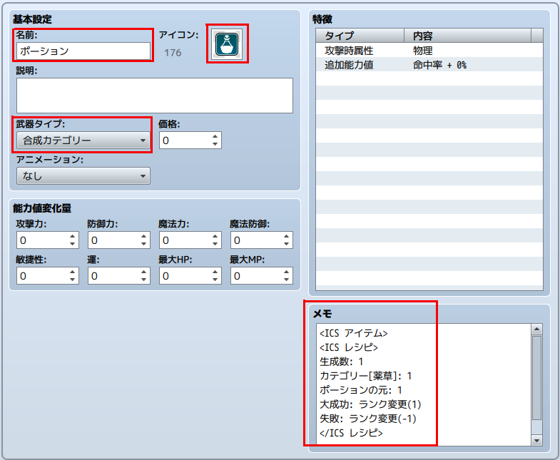
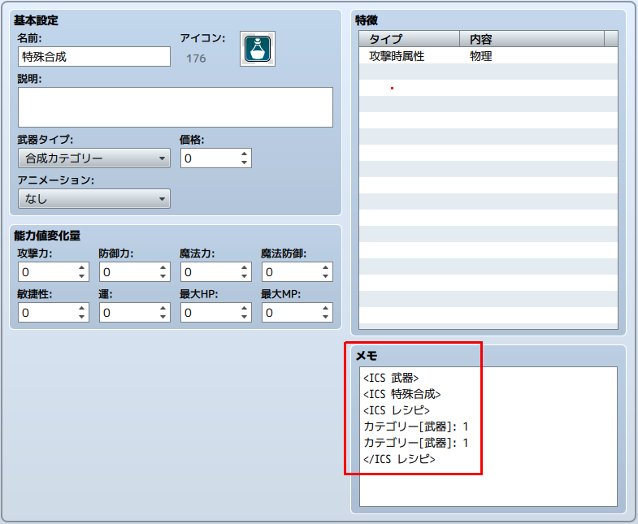

[トップページに戻る](README.md)
[目次に戻る](FTKR_ItemCompositionSystem.ja.md#目次)

# アイテムの合成の設定

# アイテムのタグ設定

アイテムに設定可能なタグは以下があります。

* [合成カテゴリー](#合成カテゴリーのタグ設定)
* [合成ランク](#合成ランクのタグ設定)
* [合成アイテム](#合成アイテムのタグ設定)
* [合成レシピ](#合成レシピのタグ設定)

## 合成カテゴリーのタグ設定

下記のいずれかを入力することで、合成カテゴリーを指定します。
設定しない場合は、アイテム分類と同じになります。
```
<ICS アイテム> または <ICS ITEM>
<ICS 武器> または <ICS WEAPON>
<ICS 防具> または <ICS ARMOR>
<ICS カテゴリー: カテゴリー名> または <ICS CATEGORY: categoryName>
```

[上に戻る](#アイテムの合成の設定)　　　[目次に戻る](FTKR_ItemCompositionSystem.ja.md#目次)

## 合成ランクのタグ設定
以下のタグで、アイテムにランクを設定できます。
```
<ICS ランク: x>
<ICS RANK: x>
```
合成後にできるアイテムのランクは、素材に使用したアイテムのランクの平均値です。
ランク 0 のアイテムは、ランク計算には使いません。
このタグを設定しない場合は、ランク 0 と見なします。

[上に戻る](#アイテムの合成の設定)　　　[目次に戻る](FTKR_ItemCompositionSystem.ja.md#目次)

## 合成アイテムのタグ設定
以下のノートタグで、アイテムを合成アイテムに設定できます。
```
<ICS 合成アイテム>
<ICS COMPOSIT_ITEM>
```
合成アイテムに指定すると、合成ランクの計算上で無いものとして扱われます。

[上に戻る](#アイテムの合成の設定)　　　[目次に戻る](FTKR_ItemCompositionSystem.ja.md#目次)

## 合成レシピのタグ設定
レシピは、以下の記述で入力します。
レシピの内容については、レシピの設定を参照してください。
レシピは、一つのアイテムやカテゴリーに対して複数設定することができます。

```
<ICS レシピ>
内容
</ICS レシピ>
```
または
```
<ICS RECIPES>
note
</ICS RECIPES>
```

内容(note)部分で設定できる項目は以下の通りです。

* [生成数の設定](#生成数の設定)
* [素材の設定](#素材の設定)
* [合成難易度の設定](#合成難易度の設定)
* [成功以外の合成結果の設定](#成功以外の合成結果の設定)
* [合成の必要条件の設定](#合成の必要条件の設定)
* [成功ボーナスの設定](#成功ボーナスの設定)

[上に戻る](#アイテムの合成の設定)　　　[目次に戻る](FTKR_ItemCompositionSystem.ja.md#目次)

### 生成数の設定
合成でできあがるアイテムの数を y に設定します。
```
生成数: y
NUMBER: y
```

### 素材の設定
合成に必要な素材アイテムを設定します。
２～５種類までの素材を設定してください。
１種類のみはできません。

#### IDで指定する
```
アイテム[x]: y
ITEM[x]: y

武器[x]: y
WEAPON[x]: y

防具[x]: y
ARMOR[x]: y
```
* x - 『アイテム』や『武器』『防具」のID
* y - 必要な個数

#### アイテムの名前で指定する
```
アイテム名: y
itemName: y
```
* y - 必要な個数

#### 合成カテゴリーで指定する
```
カテゴリー[カテゴリー名]: y
CATEGORY[categoryName]: y
```
* y - 必要な個数

### 合成難易度の設定
合成の難易度を数値で設定します。
「大成功」の難易度が x、「成功」が y、「失敗」が z です。
```
難易度: x, y, z
DIFFICULTY: x, y, z
```

### 成功以外の合成結果の設定
「大成功」および「失敗」時の合成アイテムの内容を設定します。
設定しない場合は、発生しません。
例えば、「大成功」の結果を設定しなければ、「大成功」が起きません。
```
大成功: 結果
GREAT SUCCESS: result

失敗: 結果
FAILURE: result
```
結果(result)部分は、以下の中から選んで入力してください。

* `生成数変更(x)`
* `CHANGE_NUMBER(x)`
    * 生成数を変更します。負の値の場合は減ります。

* `ランク変更(x)`
* `CHANGE_RANK(x)`
    * 生成後のアイテムのランクを変更します。負の値の場合は減ります。
    * ランクが減ったことで 0 になる、またはそのランク以下のアイテムが
    ない場合は、何も生成しません。

* `カテゴリー変更(カテゴリー名)`
*`CHANGE_CATEGORY(categoryName)`
    * 生成後のアイテムのカテゴリーを変更します。
      変更後のカテゴリーの同ランクのアイテムになります。

* `アイテム変更(アイテム名)`
* `CHANGE_ITEM(itemName)`
    * ランクやカテゴリーを無視して、指定したアイテムに変更します。

* `なし`
* `NONE`
    * 何も生成しません。生成数を 0 に変更します。

入力例)
```
大成功: 生成数変更(3)
失敗: 生成数変更(1)
```
大成功の時に生成数が3に、失敗の時に生成数が1になる。

### 合成の必要条件の設定
成功および大成功するために必要な条件を設定します。
この条件に満たない場合は、必ず失敗、または消失になります。
```
必要条件: 条件式
REQUIRED: conditions
```

### 成功ボーナスの設定
成功および大成功した時にアイテム入手以外にボーナスを設定できます。
```
大成功ボーナス: 結果
GREAT_BONUS: result

成功ボーナス: 結果
SUCCESS_BONUS: result
```
大成功ボーナスを設定しない場合、大成功時のボーナスは成功ボーナスになります。
結果(result)はスクリプト形式で入力できます。


### 条件式(conditions) の値について
条件式は、ダメージ計算式のように、計算式を入力することで、固定値以外の値を
使用することができます。以下のコードを使用できます。
* a[x].param - アクターID x のパラメータを参照します。
* s[x]    - スイッチID x の状態を参照します。
* v[x]    - 変数ID x の値を参照します。

[上に戻る](#アイテムの合成の設定)　　　[目次に戻る](FTKR_ItemCompositionSystem.ja.md#目次)

# カテゴリー合成の設定

カテゴリー合成レシピは、データベースの武器に作成します。


## 合成カテゴリーの設定

カテゴリー合成のレシピを作成するために、まず「武器タイプ」にカテゴリー合成レシピ用のタイプを作成してください。
武器タイプ名を「合成カテゴリー」などと付けると、分かりやすくなると思います。

設定した武器タイプIDは、プラグインパラメータ`Category Type ID`に設定してください。


[上に戻る](#アイテムの合成の設定)　　　[目次に戻る](FTKR_ItemCompositionSystem.ja.md#目次)

## カテゴリー合成レシピの設定

カテゴリー合成として設定が必要なデータは以下の通りです。

1. 武器タイプには、先ほど登録した合成カテゴリーIDを選択してください。
2. 『武器』の名前が合成カテゴリーの名前になります。
3. 『武器』のアイコンがアイテム合成画面でレシピを表示したときのアイコンになります。
4. メモ欄に合成用のタグを追加してください。

カテゴリー合成のレシピは、以下のように合成素材に合成カテゴリーを指定します。

```
<ICS レシピ>
カテゴリー[カテゴリー名]: 必要素材数
アイテム名: 必要素材数
</ICS レシピ>
```
合成素材には、合成カテゴリー以外も指定しても問題ないですが、基本的に１種類以上は合成カテゴリーを指定してください。



[上に戻る](#アイテムの合成の設定)　　　[目次に戻る](FTKR_ItemCompositionSystem.ja.md#目次)

## 合成素材の合成カテゴリー素材の設定

カテゴリー合成レシピに指定した合成カテゴリーに該当する合成素材を設定します。

合成カテゴリー用の素材には、以下のように合成カテゴリーと合成ランクのタグを設定してください。


[上に戻る](#アイテムの合成の設定)　　　[目次に戻る](FTKR_ItemCompositionSystem.ja.md#目次)

# マルチ合成の設定

マルチ合成レシピも、データベースの武器に作成します。

## マルチ合成レシピの設定

マルチ合成として設定が必要なデータは以下の通りです。

1. 武器タイプには、合成カテゴリーIDを選択してください。
2. 『武器』の名前がマルチ合成の名前になります。
3. 『武器』のアイコンがアイテム合成画面でレシピを表示したときのアイコンになります。
4. メモ欄に合成用のタグを追加してください。

マルチ合成のレシピの設定はアイテム合成と同じですが、マルチ合成ではさらに合成結果の設定が必要です。

なお、マルチ合成のレシピで設定可能な内容は、以下の通りです。
* [素材](#素材の設定)
* [合成難易度](#合成難易度の設定)
* [合成の必要条件](#合成の必要条件の設定)
* [成功ボーナス](#成功ボーナスの設定)


[上に戻る](#アイテムの合成の設定)　　　[目次に戻る](FTKR_ItemCompositionSystem.ja.md#目次)

## マルチ合成の合成結果の設定

合成結果の設定は、以下の記述で入力します。

```
<ICS 合成結果:[結果]>
内容
</ICS 合成結果>
```
または
```
<ICS RESULTS:[result]>
note
</ICS RESULTS>
```

[結果(result)]部には、「成功」「大成功」「失敗」を指定します。
これより、それぞれの合成結果で生成する合成アイテムとその員数を設定できます。

内容(note)部は、アイテム合成の[素材の設定](#素材の設定)と同じです。

[上に戻る](#アイテムの合成の設定)　　　[目次に戻る](FTKR_ItemCompositionSystem.ja.md#目次)

### 入力例

以下のように、レシピと合成結果を設定します。
```
<ICS レシピ>
ポーションの元: 3
低級薬草: 1
中級薬草: 1
高級薬草: 1
</ICS レシピ>
<ICS 合成結果:成功>
ローポーション: 1
ハイポーション: 1
フルポーション: 1
</ICS 合成結果>
<ICS 合成結果:大成功>
ローポーション: 2
ハイポーション: 2
フルポーション: 2
</ICS 合成結果>
<ICS 合成結果:失敗>
ローポーション: 1
</ICS 合成結果>
```

[上に戻る](#アイテムの合成の設定)　　　[目次に戻る](FTKR_ItemCompositionSystem.ja.md#目次)

### アイテム合成画面でのマルチ合成

このマルチ合成により、以下のように一度に複数のアイテムを入手することができます。


[上に戻る](#アイテムの合成の設定)　　　[目次に戻る](FTKR_ItemCompositionSystem.ja.md#目次)

# 特殊合成の設定

カテゴリー合成レシピに`<ICS 特殊合成>`または`<ICS SPECIAL_COMPOSITION>`タグを追記すると、この特殊合成になります。
通常の合成とは異なり、合成仕様が変わります。

素材に使用できるアイテム分類は『武器』および『防具』だけです。



[上に戻る](#アイテムの合成の設定)　　　[目次に戻る](FTKR_ItemCompositionSystem.ja.md#目次)

#
[トップページに戻る](README.md)