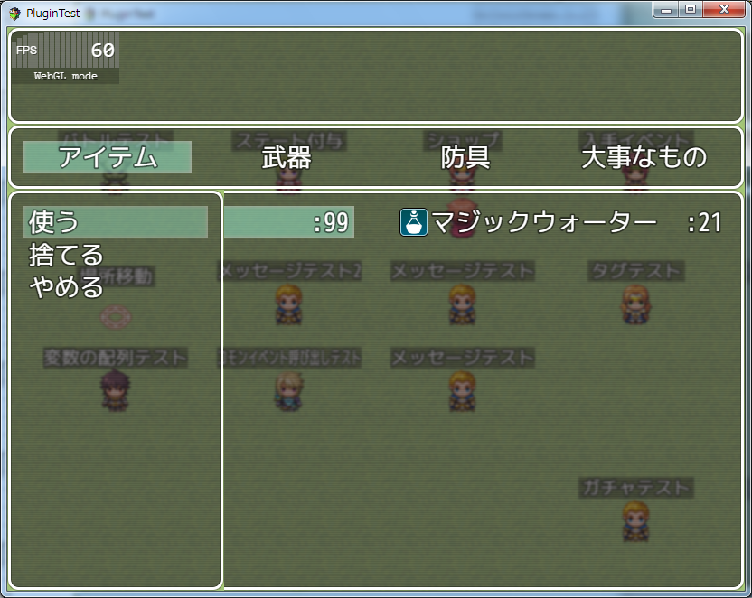
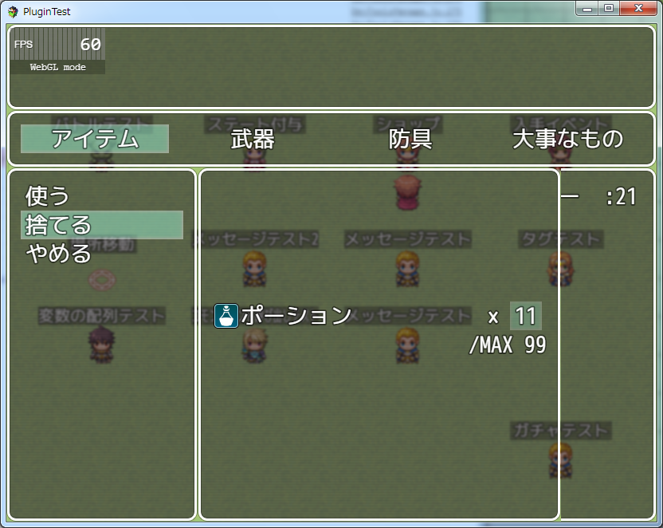
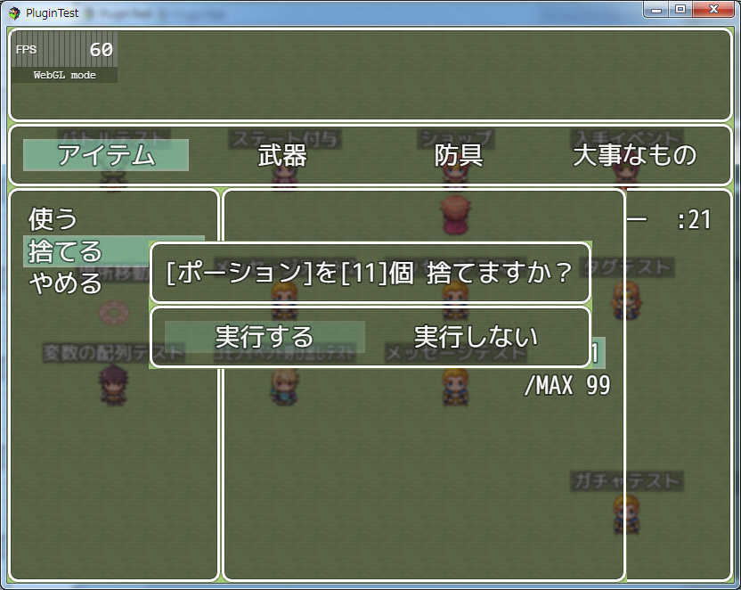
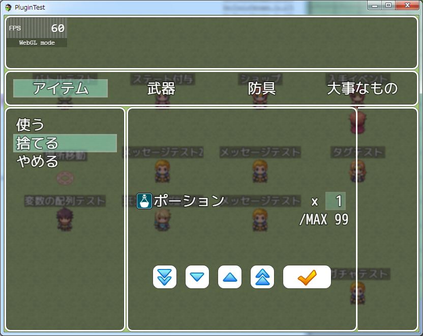

[トップページに戻る](README.md)

# [FTKR_ItemSubCommand](FTKR_ItemSubCommand.js) プラグイン

アイテムボックスにサブコマンドを追加するプラグインプラグインです。

ダウンロード: [FTKR_ItemSubCommand.js](https://raw.githubusercontent.com/futokoro/RPGMaker/master/FTKR_ItemSubCommand.js)

# 目次

以下の項目の順でプラグインの使い方を説明します。
1. [概要](#概要)
1. [サブコマンドの設定](#サブコマンドの設定)
1. [捨てるコマンド](#捨てるコマンド)
1. [装備コマンド](#装備コマンド)
1. [カスタムコマンド](#カスタムコマンド)
* [プラグインの更新履歴](#プラグインの更新履歴)
* [ライセンス](#ライセンス)

# 概要

当プラグインによりメニューのアイテム画面で、アイテム選択後にサブコマンドを追加します。

サブコマンドには以下のコマンドがあります。
1. 使う　 - アイテムを使用します。使用できない場合はグレー表示になります。
2. 捨てる - アイテムを捨てます。「大事なもの」は捨てることが出来ません。
3. 装備する - そのアイテムが、武器や防具ならアクターに装備させます。
4. やめる - サブコマンドを閉じます。
5. カスタム - プラグインパラメータで設定したコモンイベントを実行します。



[目次に戻る](#目次)

# サブコマンドの設定

プラグインパラメータ`<Command List>`で、表示するコマンドを設定します。
表示させたいコマンドのコードを、カンマ(,)で区切って入力すると入力した順番にコマンドを表示します。(すべて小文字)

```
<コマンド>　<コード>
使う　　　　use
捨てる　　　discard
装備する　　equip
やめる　　　cancel
カスタム　　custom*　　(*は各カスタムコマンド番号)
```

例)
```
use,discard,custom0,cancel
```

[目次に戻る](#目次)

# 「捨てる」コマンド 
「捨てる」コマンドでアイテムを捨てるすることができます。
「捨てる」を実行すると、捨てるアイテムの数を設定します。



数を決めると確認画面を表示し、その画面で「実行する」を選択することで、アイテムを捨てることができます。



確認画面は、プラグインパラメータ`<Enable Confirmation>`で非表示設定にすることができます。

以下のタグをアイテムのメモ欄に記載すると、そのアイテムは捨てることができません。

```
<捨てられない>
<NOT_DISCARDABLE>
```
また、タグの後ろに数字をつけると、そのＩＤのスイッチがＯＮの間は捨てることが出来なくなります。

```
<捨てられない: x>
<NOT_DISCARDABLE: x>
```
x : スイッチＩＤ

### タッチパネルの入力が有る場合 
捨てるアイテムの数を入力する画面に、タッチパネル用のボタンを表示します。



[目次に戻る](#目次)

# 装備コマンド

サブコマンドの「装備する」を実行すると、選択したアイテムが武器や防具ならアクターを選択して装備を変更することができます。

このサブコマンドは、武器、防具以外のアイテムを選択した場合はサブコマンドウィンドウ上に表示しません。


[目次に戻る](#目次)

### ！注意！

装備先のスロットは、そのアイテムの装備タイプによって自動的に設定されます。
他のプラグインにより、同じ装備タイプを複数装備できるようにしていた場合に正しく動作しない可能性があります。

[目次に戻る](#目次)

# カスタムコマンド

任意のコモンイベントを実行するカスタムコマンドを設定することができます。
設定したコマンドは、プラグインパラメータ`<Command List>`に追加してください。

### コマンド名
プラグインパラメータ`<Custom* Format>`で設定します。

### 実行するコモンイベントＩＤ
プラグインパラメータ`<Custom* EventID>`で設定します。
アイテム毎に実行するコモンイベントＩＤを設定することもできます。(*1)
プラグインパラメータとアイテムの個別設定が両方ある場合はアイテムの設定を優先します。

### 表示条件：サブコマンドウィンドウに表示するための条件
プラグインパラメータ`<Custom* Show Condition>`とアイテム毎の個別条件(*1)を設定できます。
スクリプト形式の条件式を入力します(*2)。
設定しない場合は、表示しません。
プラグインパラメータとアイテムの個別設定が両方ある場合は、両方の条件を満たした場合にのみ表示します。

### 有効条件：サブコマンドウィンドウを実行するための条件
プラグインパラメータ`<Custom* Enabled Condition>`とアイテム毎の個別条件(*1)を設定できます。
スクリプト形式の条件式を入力します(*2)。
設定しない場合は、実行できません。
プラグインパラメータとアイテムの個別設定が両方ある場合は、両方の条件を満たした場合にのみ実行できます。

### (*1)アイテム毎の個別条件の設定方法
以下のタグをメモ欄に記入することで、アイテム別に設定できます。
```
<カスタムコマンド:x>
表示条件: 条件式
有効条件: 条件式
コモンイベントID: y
</カスタムコマンド>
```
* x : カスタムコマンドの番号
* y : 実行するコモンイベントID

### (*2)条件式の入力方法
ダメージ計算式のように、スクリプト形式の計算式を入力することで、
固定値以外の値を使用することができます。以下のコードを使用できます。
* item- 使用するアイテムのデータを参照します。(item.id でアイテムＩＤ)
* number - 使用するアイテムの所持数を参照します。
* v[x]- 変数ID x の値を参照します。
* s[x]- スイッチID x の値を参照します。
* true- 常に有効になります。

[目次に戻る](#目次)

# プラグインの更新履歴

| バージョン | 公開日 | 更新内容 |
| --- | --- | --- |
| [ver1.5.2](FTKR_ItemSubCommand.js) | 2018/03/15 | カスタムコマンド名が表示されない不具合を修正 |
| ver1.5.1 | 2018/02/24 | スクリプト入力時に三項演算子を使うと反映されない不具合を修正 |
| ver1.5.0 | 2018/02/22 | アイテム画面から装備する機能を追加 |
| ver1.4.1 | 2017/12/02 | プラグインパラメータ「Disposal SE Name」の初期値の誤字を修正 |
| ver1.4.0 | 2017/09/24 | アイテム別に実行するコモンイベントIDを設定する機能を追加<br>サブコマンドウィンドウの高さをコマンドの数で自動調整する機能を追加 |
| ver1.3.0 | 2017/09/19 | 任意のコモンイベントを実行するコマンドの追加機能を追加 |
| ver1.2.1 | 2017/08/19 | アイテム無所持でもサブコマンドウィンドウを表示できてしまう不具合修正 |
| ver1.2.0 | 2017/07/23 | アイテムに個別に捨てられるかどうか設定する機能を追加<br>アイテムを捨てる時に任意のＳＥを鳴らす機能を追加 |
| ver1.1.0 | 2017/06/11 | サブコマンドのウィンドウサイズと位置を調整する機能を追加<br>数値入力画面の最大数の表示内容を変更する機能を追加 |
| ver1.0.0 | 2017/06/04 | 初版公開 |

# ライセンス

本プラグインはMITライセンスのもとで公開しています。

[The MIT License (MIT)](https://opensource.org/licenses/mit-license.php)

#
[目次に戻る](#目次)

[トップページに戻る](README.md)