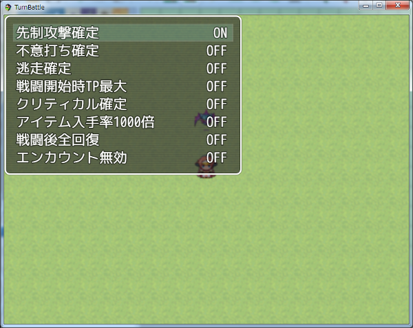

[トップページに戻る](README.md)

# [FTKR_OriginalDebugMode](FTKR_OriginalDebugMode.js) プラグイン

オリジナルのデバッグモードを追加するプラグインです。

ダウンロード: [FTKR_OriginalDebugMode.js](https://raw.githubusercontent.com/futokoro/RPGMaker/master/FTKR_OriginalDebugMode.js)

## 目次

以下の項目の順でプラグインの使い方を説明します。
1. [概要](#概要)
1. [プラグインの登録](#プラグインの登録)
2. [デバッグモードの操作](#デバッグモードの操作)
* [プラグインの更新履歴](#プラグインの更新履歴)
* [ライセンス](#ライセンス)

## 概要

オリジナルのデバッグモードを実装します。
この機能は、テストプレイ中のみ使用可能です。

[目次に戻る](#目次)

## プラグインの登録

このプラグインは、プラグイン管理画面で、一番下になるように登録してください。

[目次に戻る](#目次)

## デバッグモードの操作

デバッグモード呼び出し：F10キー

デバッグモード中の操作
* ↑↓キー                ：カーソル移動
* →←キー または 決定キー ：ON/OFF切替

デバッグモードで操作可能な項目
* 先制攻撃確定(*1)
* 不意打ち確定(*1)
* 逃走確定
* 戦闘開始時TP最大
* クリティカル確定
* アイテム入手率1000倍
* 戦闘後全回復
* エンカウント無効

(*1)先制攻撃と不意打ちをどちらも ON にした場合は、先制攻撃になります。

なお、デバッグモードの設定内容は記録されません。

[目次に戻る](#目次)

## プラグインの更新履歴

| バージョン | 公開日 | 更新内容 |
| --- | --- | --- |
| [ver1.0.0](FTKR_OriginalDebugMode.js) | 2018/04/02 | 初版公開 |

## ライセンス

本プラグインはMITライセンスのもとで公開しています。

[The MIT License (MIT)](https://opensource.org/licenses/mit-license.php)

#
[目次に戻る](#目次)

[トップページに戻る](README.md)