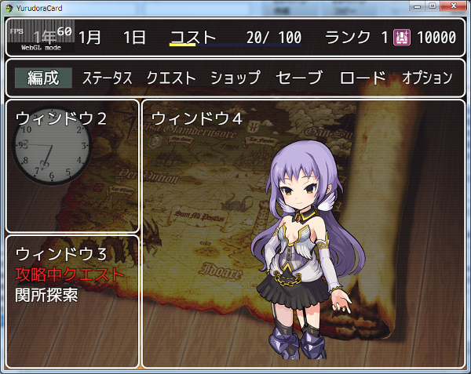

[トップページに戻る](README.md)

# [FTKR_OriginalSceneWindow](FTKR_OriginalSceneWindow.js) プラグイン

オリジナルのシーンやウィンドウを作成するプラグインです。

ダウンロード: [FTKR_OriginalSceneWindow.js](https://raw.githubusercontent.com/futokoro/RPGMaker/master/FTKR_OriginalSceneWindow.js)

# 目次

以下の項目の順でプラグインの使い方を説明します。
1. [概要](#概要)
1. [オリジナルシーンの表示と終了](#オリジナルシーンの表示と終了)
1. [オリジナルウィンドウの設定](#オリジナルウィンドウの設定)
    1. [ウィンドウの基本仕様](#ウィンドウの基本仕様)
    1. [ウィンドウのプライオリティについて](#ウィンドウのプライオリティについて)
    1. [ウィンドウ共通の設定パラメータ](#ウィンドウ共通の設定パラメータ)
    1. [コモンウィンドウの設定パラメータ](#コモンウィンドウの設定パラメータ)
    1. [コマンドウィンドウの設定パラメータ](#コマンドウィンドウの設定パラメータ)
    1. [セレクトウィンドウの設定パラメータ](#セレクトウィンドウの設定パラメータ)
* [プラグインの更新履歴](#プラグインの更新履歴)
* [ライセンス](#ライセンス)

# 概要

オリジナルのシーンやウィンドウを作成します。

1. オリジナルシーンの簡易作成機能
2. オリジナルシーンおよびマップシーン、バトルシーンにおけるウィンドウの作成機能

作成できるウィンドウは、以下の３種類です。
1. コモンウィンドウ　 - さまざまな文字列や数値、画像などを表示(*1)
2. コマンドウィンドウ - シーン変更やコモンイベントを実行するコマンドを表示
3. セレクトウィンドウ - さまざまな文字列や数値、画像などをリストで表示(*1)

(*1) コモンウィンドウに、文字列以外を表示させたい場合は FTKR_CustomSimpleActorStatus.js が必要です。

サンプル画像



画像の立ち絵は、ゆるドラシルのキャラクターです ©2014 CloverLab.,Inc.

[目次に戻る](#目次)

# オリジナルシーンの表示と終了
以下のプラグインコマンドを実行すると、オリジナルシーンを表示します。

```
OSW_オリジナルシーン表示
OSW_OPEN_ORIGINAL_SCENE
```
オリジナルシーンは、デフォルトでは何も表示しません。

以降の設定方法に従い、オリジナルシーンのウィンドウの設定を行ってください。

オリジナルシーンでは、コモンイベントの呼び出しが可能です。
ただし、文章を表示するタイプのイベントコマンドや、アニメーション、ピクチャ表示のイベントコマンドなど使用できないイベントコマンドがあります。

また、オリジナルシーン中に、コモンイベント内で以下のプラグインコマンドを実行すると、オリジナルシーンを終了します。

```
OSW_オリジナルシーン終了
OSW_CLOSE_ORIGINAL_SCENE
```
オリジナルシーン以外で実行しても無視します。
オリジナルシーンを終了すると、元のシーン(*1)に戻ります。

(*1)オリジナルシーンを表示する前のシーン

このプラグインコマンド以外にオリジナルシーンを終了させるためには、コマンドウィンドウかセレクトウィンドウに、シーン終了コマンドの設定をする必要があります。

### 背景画像の設定

オリジナルシーンでは、背景画像をプラグインパラメータ`Background Image Name`で設定できます。

画像ファイルは、/img/systemに保存してください。

[目次に戻る](#目次)

# オリジナルウィンドウの設定

## ウィンドウの基本仕様

### ウィンドウ設定のプラグインコマンド
当プラグインで作成するウィンドウの設定方法は、以下のプラグインコマンドで行います。

```
OSW_[ウィンドウタイプ]設定 [シーン名] [ウィンドウID] [設定パラメータ]
OSW_SET_[windowType] [scene] [windowId] [setting]
```

#### ウィンドウタイプ
ウィンドウタイプには、作成するウィンドウに合わせて以下を設定してください。

* コモン　 or COMMON
* コマンド or COMMAND
* セレクト or SELECT

#### シーン名
シーン名には、表示させるシーンに合わせて以下を設定してください。

* オリジナル or ORIGINAL
* マップ　　 or MAP
* バトル　　 or BATTLE

#### ウィンドウID
ウィンドウIDには、設定するウィンドウのIDを指定します。
ウィンドウIDは、0 ～ ウィンドウの生成数-1 の間の数値を入力してください。

#### 設定パラメータ
この部分の記述で、ウィンドウの各パラメータを設定・変更します。
設定パラメータには、複数のパラメータを入力することが可能です。

#### 入力例
```
OSW_コモン設定 オリジナル 0 サイズ 240 100 位置 0 0
OSW_SET_COMMON ORIGINAL 0 SIZE 240 100 位置 0 0
```
上記のプラグインコマンドで、オリジナルシーンのコモンウィンドウ ID0 のサイズと表示位置を設定します。

### ウィンドウの生成

ウィンドウを各シーンで表示させるためには、ウィンドウの生成が必要です。
シーンによって生成の手順が異なります。

#### オリジナルシーンおよびマップシーンの場合

以下のプラグインコマンドでウィンドウIDを指定して生成します。
* このプラグインコマンドは、最初に実行してください。
* この設定パラメータは単独で実行してください。

設定パラメータ：生成 or CREATE
```
OSW_[ウィンドウタイプ]設定 [シーン名] [ウィンドウID] 生成
OSW_SET_[windowType] [scene] [windowId] CREATE
```

入力例
```
OSW_コモン設定 オリジナル 0 生成
OSW_SET_COMMON ORIGINAL 0 CREATE
```

#### バトルシーンの場合

バトルシーンの場合は、自動的にウィンドウの生成が行われますので、生成コマンドの実行は不要です。

[目次に戻る](#目次)

## ウィンドウのプライオリティについて
オリジナルシーンとマップシーンの場合は、独立したレイヤーに表示します。
レイヤーのプライオリティは以下の通りです。

オリジナルシーンの場合
```
背景 ＜ 当プラグインレイヤー ＜ デフォルトレイヤー
```

マップシーンの場合
```
マップスプライト ＜ 当プラグインレイヤー ＜ マップ名
          ＜ デフォルトレイヤー ＜ スクリーンスプライト
```

当プラグインのウィンドウ間のプライオリティは、生成コマンドを実行した順番です。
つまり、後に生成したウィンドウの方が手前に表示されます。

バトルシーンの場合は、デフォルトレイヤーに追加します。

バトルシーンの場合(デフォルトレイヤー内)
```
ログウィンドウ ＜ 当プラグインウィンドウ ＜ ステータスウィンドウ ＜ ...
```

当プラグインのウィンドウ間のプライオリティは、ウィンドウID順です。
ウィンドウIDが大きい方が手前に表示されます。

[目次に戻る](#目次)

## ウィンドウ共通の設定パラメータ

コモン、コマンド、セレクトの各ウィンドウで共通で使用できる設定パラメータです。

以下のパラメータがあります。

1. [表示位置の設定](#表示位置の設定)
2. [ウィンドウサイズの設定](#ウィンドウサイズの設定)
3. [フォントサイズの設定](#フォントサイズの設定)
1. [行の高さの設定](#行の高さの設定)
1. [ウィンドウの余白の設定](#ウィンドウの余白の設定)
1. [ウィンドウ背景の透明度の設定](#ウィンドウ背景の透明度の設定)
1. [フレームの表示設定](#フレームの表示設定)
1. [表示の更新](#表示の更新)
1. [表示の設定](#表示の設定)
1. [表示スイッチの設定](#表示スイッチの設定)
1. [カーソル位置の初期化](#カーソル位置の初期化)

### 表示位置の設定
```
位置 [x] [y]
POSITION [x] [y]
```
ウィンドウの表示位置を pixel単位 で指定します。<br>
x に -1 を入力すると、ウィンドウサイズに合わせて画面右寄せします。<br>
y に -1 を入力すると、ウィンドウサイズに合わせて画面下寄せします。

このパラメータを設定しない場合は、プラグインパラメータの設定を使用します。

### ウィンドウサイズの設定
コマンドウィンドウは、設定するパラメータの数が異なるため注意してください。

#### コモンウィンドウおよびセレクトウィンドウの場合
```
サイズ [width] [height]
SIZE [width] [height]
```
ウィンドウのサイズを pixel単位 で指定します。<br>
width に -1 を入力すると、画面の幅に合わせます。<br>
height に -1 を入力すると、画面の高さに合わせます。

このパラメータを設定しない場合は、プラグインパラメータの設定を使用します。

#### コマンドウィンドウの場合
```
サイズ [width]
SIZE [width]
```
ウィンドウのサイズを pixel単位 で指定します。<br>
width に -1 を入力すると、画面の幅に合わせます。<br>
ウィンドウの高さは、設定したコマンドの数と最大列数により決まります。

このパラメータを設定しない場合は、プラグインパラメータの設定を使用します。

### フォントサイズの設定
```
フォントサイズ [value]
FONTSIZE [value]
```
ウィンドウのフォントサイズを pixel単位 で指定します。

このパラメータを設定しない場合は、プラグインパラメータ`Font Size`の設定を使用します。

### 行の高さの設定
```
行の高さ [value]
LINEHEIGHT [value]
```
ウィンドウの１行の高さを pixel単位 で指定します。

このパラメータを設定しない場合は、プラグインパラメータ`Window Line Height`の設定を使用します。

### ウィンドウの余白の設定
```
余白 [value]
PADDING [value]
```
ウィンドウの周囲の余白を pixel単位 で指定します。

このパラメータを設定しない場合は、プラグインパラメータ`Window Padding`の設定を使用します。

### ウィンドウ背景の透明度の設定
```
透明度 [value]
OPACITY [value]
```
ウィンドウ背景の透明度を指定します。

このパラメータを設定しない場合は、プラグインパラメータ`Window Opacity`の設定を使用します。

### フレームの表示設定
```
フレーム [ON or OFF]
FRAME [ON or OFF]
```
ウィンドウのフレームを表示するかどうか設定します。

このパラメータを設定しない場合は、プラグインパラメータ`Window Frame`の設定を使用します。

### 表示の更新
```
更新
REFRESH
```
設定内容をウィンドウに反映させます。
位置やサイズなど、設定した後には更新が必要です。
また、アクターなどのゲーム中に動的に変動するパラメータを表示させている場合に、表示を更新することにも使用します。

### 表示の設定
```
表示 [ON or OFF]
SHOW [ON or OFF]
```
ウィンドウの表示のON/OFFを切り替えます。
基本的に最後に設定してください。

### 表示スイッチの設定
```
表示スイッチ [スイッチID]
SHOW_SWITCH [switchId]
```
ウィンドウの表示のON/OFFを指定したスイッチIDで切り替えます。
表示をOFFにすると、自動的にアクティブもOFFになります。

### カーソル位置の初期化
```
カーソル位置初期化
CLEAR_CURSOR
```
カーソルの位置を初期位置（ウィンドウ左上）に移動させます。
この内容は、コモンウィンドウでは使えません。

[目次に戻る](#目次)

## コモンウィンドウの設定パラメータ

コモンウィンドウで使用できる設定パラメータです。

以下のパラメータがあります。

1. [コモンウィンドウのアクターの設定](#コモンウィンドウのアクターの設定)
1. [表示内容の設定](#表示内容の設定)

### コモンウィンドウのアクターの設定
ウィンドウ内で表示するパラメータの参照元のアクターを指定します。

#### アクターIDで直接指定する
```
アクター [アクターID]
ACTOR [actorId]
```
アクターIDには、\V[x]でゲーム内変数を使用できます。

#### パーティーの並び順で指定する
```
パーティー [メンバーID]
PARTY [memberId]
```
メンバーIDは、パーティーの先頭を0番とした並び順を指定します。
メンバーIDには、\V[x]でゲーム内変数を使用できます。

### 表示内容の設定

#### テキスト文の直接入力
```
テキスト [行数] [表示する文字列]
TEXT [line] [displayText]
```
ウィンドウに表示する文字列を設定します。
行数で、文字列を何行目(最上段を0とする)に表示するか指定します。
制御文字を使用できます。

一つのウィンドウでFTKR_CustomSimpleActorStatusによる表示設定と同時に使用することはできません。
```
テキスト初期化
CLEAR_TEXT
```
設定したテキストをすべて初期化します。

#### FTKR_CustomSimpleActorStatusによる表示設定
```
内容 [表示内容]
CONTENT [contentSetting]
```
FTKR_CustomSimpleActorStatus.js と組み合わせている場合に使用可能な記述です。

[表示内容]には以下の記述で設定します。

#### 表示させるステータスの設定
```
ステータス [表示させるステータス]
STATUS [displayStatus]
```
Actor Status Text1 ~ 3に相当する設定です。
セミコロン(;)でText1,Text2,Text3の内容を区切って入力してください。

#### 空白エリアの設定
```
描画間隔 [値1,値2,値3,値4]
DRAW_SPACE [value1,value2,value3,value4]
```
Actor Status Space に相当する設定です。
カンマ(,)で区切って、入力してください。

このパラメータを設定しない場合は、プラグインパラメータ`Actor Status Space`の設定を使用します。

#### 並べたステータス間隔の設定
```
並列間隔 [値]
PARALEL_SPACE [value]
```
Actor Status Space In Text に相当する設定です。

このパラメータを設定しない場合は、プラグインパラメータ`Actor Status Space In Text`の設定を使用します。

#### 描画エリアサイズの設定
```
幅比率 [値1,値2,値3]
WIDTH_RATE [value1,value2,value3]
```
Actor Status Width Rate に相当する設定です。
カンマ(,)で区切って、入力してください。

このパラメータを設定しない場合は、プラグインパラメータ`Actor Status Width Rate`の設定を使用します。

#### 入力例
```
内容 ステータス face;name;level 描画間隔 2,10,10,2 並列間隔 5 幅比率 2,3,3
CONTENT STATUS face;name;level DRAW_SPACE 2,10,10,2 PARALEL_SPACE 5 WIDTH_RATE 2,3,3
```

[目次に戻る](#目次)

## コマンドウィンドウの設定パラメータ

コモンウィンドウで使用できる設定パラメータです。

以下のパラメータがあります。

1. [コマンドウィンドウの最大列数の設定](#コマンドウィンドウの最大列数の設定)
1. [コマンドの表示位置の設定](#コマンドの表示位置の設定)
1. [コマンドの初期化](#コマンドの初期化)
1. [コマンドの追加](#コマンドの追加)
1. [キャンセル実行設定](#キャンセル実行設定)
1. [コマンドウィンドウのアクティブ設定](#コマンドウィンドウのアクティブ設定)

### コマンドウィンドウの最大列数の設定
```
最大列数 [value]
MAX_COLS [value]
```
コマンドを横に並べる数を設定します。

このパラメータを設定しない場合は、プラグインパラメータ`Command Max Cols`の設定を使用します。

### コマンドの表示位置の設定
```
コマンド位置 [align]
COMMAND_ALIGN [align]
```
ウィンドウ枠内で、コマンド名を表示する位置を設定します。
* left   - 左寄せ
* center - 中央
* right  - 右寄せ

このパラメータを設定しない場合は、プラグインパラメータ`Command Align`の設定を使用します。

### コマンドの初期化
```
コマンド初期化
CLEAR_COMMAND
```
設定したコマンドをすべて初期化します。

### コマンドの追加
```
コマンド追加 [コマンド名] [シンボル名] [実行条件] [メソッド]
ADD_COMMAND [name] [symbol] [enabled] [method]
```
コマンドを追加します。

#### コマンド名
表示する名前を文字列で設定します。

プラグインパラメータ`Enable Escape Code`が有効の場合、制御文字を使用できます。

#### シンボル名
コマンド同士を区別するための文字列を設定します。
異なるコマンド同士で、同じシンボルは使用しないでください。

#### 実行条件
スクリプトで実行条件を設定します。
true と入力すると、常にコマンドを実行できるようになります。

#### メソッド
コマンドを実行した時の動作を設定します。

##### シーンを閉じる
```
シーン終了
END_SCENE
```
コマンドを実行すると、シーンを終了して元のシーンに戻ります。
オリジナルシーンから、マップシーンに戻すときに使用します。
このメソッドは、オリジナルシーン以外で使わないでください。

##### シーンを変更する(呼び出す)
```
シーン変更(scene)
CHANGE_SCENE(scene)
```
コマンドを実行すると、scene で指定したシーンを表示します。<br>
sceneの例)
* Scene_Item  - アイテムシーン(*1)
* Scene_Skill - スキルシーン(*1)
* Scene_Save - セーブシーン(*1)
* Scene_Load - ロード(コンティニュー)シーン(*2)
* Scene_Options - オプションシーン(*2)
* Scene_OSW - オリジナルシーン

(*1) メニュー画面から表示するシーンと同じです。<br>
(*2) スタート画面から表示するシーンと同じです。

##### コモンイベントを実行する
```
コモンイベント(イベントId)
COMMON_EVENT(eventId)
```
コマンドを実行すると、イベントID で指定したコモンイベント実行します。

コマンドを実行すると、選択したコマンドの番号(先頭が0番)を記録します。
記録した番号は、以下のスクリプトで取得できます。
* オリジナルシーンの場合 - `$gameOswData._oswIndex`
* マップシーンの場合　　 - `$gameMap._oswIndex`

##### 別のウィンドウにカーソル操作を移す
```
ウィンドウアクティブ([ウィンドウタイプ],[ウィンドウID],[非表示化],[カーソル非表示],[変数ID])
WINDOW_ACTIVE([windowType],[windowId],[hideOn],[cursorOff],[varId])
```
コマンドを実行すると、このウィンドウのアクティブをOFFにして指定したウィンドウをアクティブONに変更します。

ウィンドウタイプには、以下を指定してください。
* コマンド or COMMAND
* セレクト or SELECT

非表示化には、以下を指定してください。
* true  - コマンド選択後にこのウィンドウを非表示にします。
* false - コマンド選択後にこのウィンドウを表示したままにします。

カーソル非表示には、以下を指定してください。
* true  - コマンド選択後にこのウィンドウのカーソルを非表示にします。
* false - コマンド選択後にこのウィンドウのカーソルを表示したままにします。

変数IDで指定したゲーム内変数に、コマンドの番号を格納します。
コマンドの番号とは、先頭のコマンドを 0番とした コマンドの並び順です。
設定しない場合は、格納しません。

### キャンセル実行設定
```
キャンセル実行設定 [メソッド]
SET_CANCEL_ACTION [method]
```
キャンセルを実行した時の動作を設定します。

#### メソッド
コマンド追加のメソッドと同じです。

### コマンドウィンドウのアクティブ設定
```
アクティブ [ON or OFF]
ACTIVE [ON or OFF]
```
コマンドウィンドウを選択可能な状態にするかどうか設定します。
複数のコマンドウィンドウやセレクトウィンドウを表示させる場合には、アクティブをONにするウィンドウは一つだけにしてください。

メッセージウィンドウを表示させる時には、アクティブをOFFに設定してください。

表示をOFFにすると、自動的にアクティブ設定もOFFになります。

[目次に戻る](#目次)

## セレクトウィンドウの設定パラメータ

セレクトウィンドウで使用できる設定パラメータです。

以下のパラメータがあります。

1. [セレクトウィンドウのアクターの設定](#セレクトウィンドウのアクターの設定)
1. [セレクトウィンドウの最大列数の設定](#セレクトウィンドウの最大列数の設定)
1. [カーソル高さの設定](#カーソル高さの設定)
1. [リストの初期化](#リストの初期化)
1. [リストの設定](#リストの設定)
1. [リストの実行設定](#リストの実行設定)
1. [セレクトウィンドウの表示内容の設定](#セレクトウィンドウの表示内容の設定)
1. [セレクトウィンドウのアクティブ設定](#セレクトウィンドウのアクティブ設定)

### セレクトウィンドウのアクターの設定
ウィンドウ内で表示するパラメータの参照元のアクターを指定します。

#### アクターIDで直接指定する
```
アクター [アクターID]
ACTOR [actorId]
```
アクターIDには、\V[x]でゲーム内変数を使用できます。

#### パーティーの並び順で指定する
```
パーティー [メンバーID]
PARTY [memberId]
```
メンバーIDは、パーティーの先頭を0番とした並び順を指定します。
メンバーIDには、\V[x]でゲーム内変数を使用できます。

### セレクトウィンドウの最大列数の設定
```
最大列数 [value]
MAX_COLS [value]
```
リストを横に並べる数を設定します。

このパラメータを設定しない場合は、プラグインパラメータ`Select Max Cols`の設定を使用します。

### カーソル高さの設定
```
カーソル高さ [value]
CURSOR_HEIGHT [value]
```
カーソルの高さ(行数)を設定します。

このパラメータを設定しない場合は、プラグインパラメータ`Select Cursor Height`の設定を使用します。

### リストの初期化
```
リスト初期化
CLEAR_LIST
```
設定したリストをすべて初期化します。

### リストの設定
```
リスト設定 [設定内容]
SET_LIST [setting]
```
リストのデータを設定します。

設定内容は、以下のいずれかを選んでください。

#### テキスト

```
テキスト [リスト1,リスト2,...]
TEXT [list1,list2,...]
```
リストの表示名を直接設定します。
カンマで区切って入力してください。
この設定の場合、内容パラメータは使用できません。

#### パーティー
```
パーティー [メンバー]
PARTY [MEMBER]
```
パーティーメンバーをリストに設定します。
別途、内容コマンドで表示するステータスを設定します。
この設定は、アクターの設定を上書きします。

メンバーには、以下を指定します。
* 全メンバー　　 or ALL_MENBAR
    - パーティー全員をリストに設定します。
* バトルメンバー or BATTLE_MENBAR
    - バトルメンバーをリストに設定します。
* 控えメンバー　 or RESERVE_MENBAR
    - 戦闘に参加しないパーティーメンバーをリストに設定します。

#### アクター
```
アクター [条件式]
ACTOR [enable]
```
データベースのアクターをリストに設定します。
別途、内容コマンドで表示するステータスを設定します。

#### 職業
```
職業 [条件式]
CLASS [enable]
```
データベースの職業をリストに設定します。
別途、内容コマンドで表示するステータスを設定します。

#### スキル
```
スキル [条件式]
SKILL [enable]
```
データベースのスキルをリストに設定します。
別途、内容コマンドで表示するステータスを設定します。

#### アイテム
```
アイテム [条件式]
ITEM [enable]
```
データベースのアイテムをリストに設定します。
別途、内容コマンドで表示するステータスを設定します。

#### 武器
```
武器 [条件式]
WEAPON [enable]
```
データベースの武器をリストに設定します。
別途、内容コマンドで表示するステータスを設定します。

#### 防具
```
防具 [条件式]
ARMOR [enable]
```
データベースの防具をリストに設定します。
別途、内容コマンドで表示するステータスを設定します。

#### 敵キャラ
```
敵キャラ [条件式]
ENEMY [enable]
```
データベースの敵キャラをリストに設定します。
別途、内容コマンドで表示するステータスを設定します。

#### 敵グループ
```
敵グループ [条件式]
TROOP [enable]
```
データベースの敵グループをリストに設定します。
別途、内容コマンドで表示するステータスを設定します。

#### 条件式の設定
条件式には、JS計算式記述の表示条件を設定します。
item でリストのデータを参照できます。(例: item.id = 対象のID)

名前が設定されていないデータは表示しません。
条件式を設定しない場合は、名前が設定されているすべてのデータを表示します。

### リストの実行設定
```
リスト実行設定 [実行タイプ] [メソッド]
SET_LIST_ACTION [action_type] [method]
```
セレクトウィンドウでカーソルを操作してキー操作した時の実行結果を設定します。

#### 実行タイプ
実行タイプには以下を指定します。
* 決定 or OK
   - 決定ボタンを押したとき(リストを選択したとき)の処理
* キャンセル or CANCEL
   - キャンセルボタンを押したときの処理

#### メソッド
実行した時の動作を設定します。

##### シーンを閉じる
```
シーン終了
END_SCENE
```
実行すると、シーンを終了して元のシーンに戻ります。
オリジナルシーンから、マップシーンに戻すときに使用します。

このメソッドは、オリジナルシーン以外で使わないでください。

##### シーンを変更する(呼び出す)
```
シーン変更(scene)
CHANGE_SCENE(scene)
```
実行すると、scene で指定したシーンを表示します。<br>
sceneの例)
* Scene_Item  - アイテムシーン(*1)
* Scene_Skill - スキルシーン(*1)
* Scene_Save - セーブシーン(*1)
* Scene_Load - ロード(コンティニュー)シーン(*2)
* Scene_Options - オプションシーン(*2)
* Scene_OSW - オリジナルシーン

(*1) メニュー画面から表示するシーンと同じです。<br>
(*2) スタート画面から表示するシーンと同じです。

##### コモンイベントを実行する
```
コモンイベント(イベントId)
COMMON_EVENT(eventId)
```
実行すると、イベントID で指定したコモンイベント実行します。

リストを選択すると、選択したリストの番号(先頭が0番)を記録します。
記録した番号は、以下のスクリプトで取得できます。
* オリジナルシーンの場合 - `$gameOswData._oswIndex`
* マップシーンの場合　　 - `$gameMap._oswIndex`

また、選択したリストのデータは、以下のスクリプトで取得できます。
* オリジナルシーンの場合 - `$gameOswData._oswItem`
* マップシーンの場合　　 - `$gameMap._oswItem`

例)リストがアイテムの場合は、選択したアイテムの`$dataItems[n]`のデータが格納されます。(n:アイテムID)

##### 別のウィンドウにカーソル操作を移す
```
ウィンドウアクティブ([ウィンドウタイプ],[ウィンドウID],[非表示化],[カーソル非表示],[変数ID])
WINDOW_ACTIVE([windowType],[windowId],[hideOn],[cursorOff],[varId])
```
実行すると、このウィンドウのアクティブをOFFにして指定したウィンドウをアクティブONに変更します。

ウィンドウタイプには、以下を指定してください。
* コマンド or COMMAND
* セレクト or SELECT

非表示化には、以下を指定してください。
* true  - 実行後に、このウィンドウを非表示にします。
* false - 実行後に、このウィンドウを表示したままにします。

カーソル非表示には、以下を指定してください。
* true  - 実行後に、このウィンドウのカーソルを非表示にします。
* false - 実行後に、このウィンドウのカーソルを表示したままにします。

変数IDで指定したゲーム内変数に、リストの番号を格納します。
リストの番号とは、先頭のリストを 0番とした リストの並び順です。
設定しない場合は、格納しません。

### 表示内容の設定
```
内容 [表示内容]
CONTENT [contentSetting]
```
FTKR_CustomSimpleActorStatus.js と組み合わせている場合に使用可能な記述です。

[表示内容]には以下の記述で設定します。

#### 表示させるステータスの設定
```
ステータス [表示させるステータス]
STATUS [displayStatus]
```
Actor Status Text1 ~ 3に相当する設定です。
セミコロン(;)でText1,Text2,Text3の内容を区切って入力してください。

item で、リストのデータを参照します。

#### 空白エリアの設定
```
描画間隔 [値1,値2,値3,値4]
DRAW_SPACE [value1,value2,value3,value4]
```
Actor Status Space に相当する設定です。
カンマ(,)で区切って、入力してください。

このパラメータを設定しない場合は、プラグインパラメータ`Select Status Space`の設定を使用します。

#### 並べたステータス間隔の設定
```
並列間隔 [値]
PARALEL_SPACE [value]
```
Actor Status Space In Text に相当する設定です。

このパラメータを設定しない場合は、プラグインパラメータ`Select Status Space In Text`の設定を使用します。

#### 描画エリアサイズの設定
```
幅比率 [値1,値2,値3]
WIDTH_RATE [value1,value2,value3]
```
Actor Status Width Rate に相当する設定です。
カンマ(,)で区切って、入力してください。

このパラメータを設定しない場合は、プラグインパラメータ`Select Status Width Rate`の設定を使用します。

#### 入力例
```
内容 ステータス face;name;level 描画間隔 2,10,10,2 並列間隔 5 幅比率 2,3,3
CONTENT STATUS face;name;level DRAW_SPACE 2,10,10,2 PARALEL_SPACE 5 WIDTH_RATE 2,3,3
```

### セレクトウィンドウのアクティブ設定
```
アクティブ [ON or OFF]
ACTIVE [ON or OFF
```
セレクトウィンドウを選択可能な状態にするかどうか設定します。
複数のコマンドウィンドウやセレクトウィンドウを表示させる場合には、アクティブをONにするウィンドウは一つだけにしてください。

メッセージウィンドウを表示させる時には、アクティブをOFFに設定してください。

表示をOFFにすると、自動的にアクティブ設定もOFFになります。

[目次に戻る](#目次)

# プラグインの更新履歴

| バージョン | 公開日 | 更新内容 |
| --- | --- | --- |
| [ver1.5.6](FTKR_OriginalSceneWindow.js) | 2018/07/31 | セレクトウィンドウで、リストにアクターを設定した場合に、アクターのゲームデータが正常に反映されない不具合を修正<br>コマンドまたはセレクトウィンドウの選択情報を、正しく取得できない不具合を修正 |
| ver1.5.5 | 2018/06/18 | プラグインパラメータEnable Escape Codeの設定が反映されない不具合を修正 |
| ver1.5.4 | 2018/05/24 | FTKR_CustomSimpleActorStatus.jsと組み合わせた時でも、テキスト表示コマンドが使えるように修正 |
| ver1.5.3 | 2018/05/20 | セレクトウィンドウのリストで、選択した対象のデータを取得するスクリプトをヘルプに追記 |
| ver1.5.2 | 2018/03/12 | アクター画像関係の表示透過度が変わってしまう不具合を修正 |
| ver1.5.1 | 2018/02/15 | コマンドウィンドウとセレクトウィンドウで、カーソル位置を初期位置に戻すコマンドを追加 |
| ver1.5.0 | 2018/02/14 | ゲーム内スイッチで、ウィンドウの表示のON/OFFを切り替える機能を追加s<br>プラグインパラメータで、ウィンドウの生成数を設定する機能を削除<br>バトルシーンでも、ウィンドウを作成するために生成コマンドの実行が必要なように変更 |
| ver1.4.0 | 2018/01/16 | コマンドウィンドウのキャンセル時の動作を設定するコマンドを追加<br>オリジナルシーンを終了するプラグインコマンドを追加 |
| ver1.3.0 | 2017/07/09 | 機能追加 |
| ver1.2.1 | 2017/06/23 | 表示内容の設定で、ステータスに制御文字を使用すると正しく反映されない不具合を修正<br>ウィンドウの表示をOFFにした時に、アクティブがOFFにならない不具合を修正<br>プラグインパラメータに@typeを対応 |
| ver1.2.0 | 2017/06/20 | セレクトウィンドウのリスト設定の表示内容を追加<br>セレクトウィンドウのアクターやデータをコモンウィンドウが受け取る参照コマンドを追加 |
| ver1.1.1 | 2017/06/19 | ヘルプ修正 |
| ver1.1.0 | 2017/06/19 | オリジナルシーンの「閉じる」コマンドのデフォルト設定を削除<br>コマンドウィンドウを表示OFFにした時に、アクティブもOFFにするように変更<br>コマンド追加のメソッドに、シーンを閉じる機能と、別のウィンドウをアクティブONにする機能を追加<br>オリジナルシーンでコモンイベントを呼び出せるように修正<br>セレクトウィンドウの作成機能を追加 |
| ver1.0.0 | 2017/06/17 | 初版公開 |

# ライセンス

本プラグインはMITライセンスのもとで公開しています。

[The MIT License (MIT)](https://opensource.org/licenses/mit-license.php)

#
[目次に戻る](#目次)

[トップページに戻る](README.md)