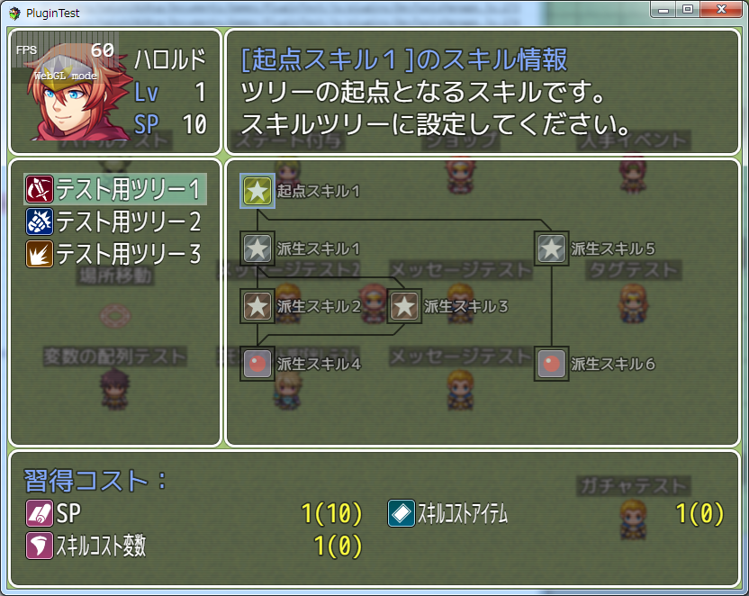

[トップページに戻る](README.md)

# [FTKR_STS_CustomWindow](FTKR_STS_CustomWindow.js) プラグイン

ツリー型スキル習得システム用 ウィンドウレイアウト変更プラグインです。<br>
本プラグインは、[FTKR_SkillTreeSystem](FTKR_SkillTreeSystem.ja.md)の拡張プラグインです。

ダウンロード: [FTKR_STS_CustomWindow.js](https://raw.githubusercontent.com/futokoro/RPGMaker/master/FTKR_STS_CustomWindow.js)

## 目次

以下の項目の順でプラグインの使い方を説明します。
1. [概要](#概要)
1. [プラグインの登録](#プラグインの登録)
1. [スキルツリータイプの表示設定](#スキルツリータイプの表示設定)
1. [コストの表示設定](#コストの表示設定)
1. [前提スキルの表示設定](#前提スキルの表示設定)
1. [ウィンドウの設定](#ウィンドウの設定)
1. [背景の設定](#背景の設定)
* [プラグインの更新履歴](#プラグインの更新履歴)
* [ライセンス](#ライセンス)

## 概要

本プラグインは、ツリー型のスキル習得システム用の拡張プラグインです。

本プラグインにより、スキル習得システムの専用画面のウィンドウレイアウトを変更することができます。

＜変更できる設定＞
 1. スキルツリーウィンドウで、スキルツリータイプを横に並べられる数
 1. コストウィンドウで、コストを横に並べられる数
 1. 前提スキルウィンドウで、前提スキルを横に並べられる数
 1. 各ウィンドウの位置
 2. 各ウィンドウのサイズ
 3. 各ウィンドウの透明度
 4. 背景に画像を表示
 5. 背景にアクターの立ち絵を表示

[目次に戻る](#目次)

## プラグインの登録

本プラグインを使用するためには、[FTKR_SkillTreeSystem](FTKR_SkillTreeSystem.js)の事前登録が必要です。
プラグイン管理画面で、以下の順の配置になるように登録してください。
```
FTKR_SkillTreeSystem.js
FTKR_STS_CustomWindow.js
```

[目次に戻る](#目次)

## スキルツリータイプの表示設定

以下のプラグインパラメータで設定ができます。

`<Tree Types Max Cols>`

スキルツリータイプを横に並べられる数です。
ウィンドウのサイズ変更に合わせて変更してください。

[目次に戻る](#目次)

## コストの表示設定

以下のプラグインパラメータで設定ができます。

`<Cost Max Cols>`

コストを横に並べられる数を設定します。

`<Cost Spacing>`

コストを横に並べた時の間隔を設定します。



[目次に戻る](#目次)

## 前提スキルの表示設定

以下のプラグインパラメータで設定ができます。

`<Preskill Max Cols>`

前提スキルを横に並べられる数を設定します。

`<Preskill Spacing>`

前提スキルを横に並べた時の間隔を設定します。

[目次に戻る](#目次)

## ウィンドウの設定

以下のプラグインパラメータで各ウィンドウの設定ができます。

`<windowname Position X>`

ウィンドウの左上の位置のX座標を指定します。(*1)

`<windowname Position Y>`

ウィンドウの左上の位置のY座標を指定します。(*1)

`<windowname Width>`

ウィンドウの幅を指定します。(*1)

`<windowname Height>`

ウィンドウの高さを指定します。(*1)

`<windowname Opacity>`

ウィンドウの透明率を指定します。
背景に画像を使用する場合は、透明の 0 を設定するとよいでしょう。

(*1)確認コマンドウィンドウのサイズと位置は、確認ウィンドウに合わせて自動調整するため、設定できません。

[目次に戻る](#目次)

## 背景の設定

### ウィンドウ背景の設定
以下のプラグインパラメータで背景の設定ができます。

`<Background Image Name>`

背景に使用する画像ファイル名を指定します。
画像ファイルは、/img/systemフォルダに保存してください。

### アクターの立ち絵の設定
また、以下のタグをアクターのメモ欄に追記することで、背景にアクターの立ち絵を表示できます。

```
<STS_画像:ImageName>
code
</STS_画像>
```
または
```
<STS_IMAGE:ImageName>
code
</STS_IMAGE>
```
ImageName - 背景に表示させたい画像名を入力します。

画像は、プロジェクトフォルダ内の/img/system/に保存してください。

#### code に使用できる項目
```
Bgi offset X: n
```
画面左上を原点として画像左上のX座標を入力します。
```
Bgi offset Y: n
```
画面左上を原点として画像左上のY座標を入力します。

[目次に戻る](#目次)

## プラグインの更新履歴

| バージョン | 公開日 | 更新内容 |
| --- | --- | --- |
| [ver1.3.1](FTKR_STS_CustomWindow.js) | 2018/09/08 | コストウィンドウと前提スキルウィンドウを常時表示させない設定の場合に正しく機能しない不具合を修正 |
| ver1.3.0 | 2018/09/04 | コストウィンドウと前提スキルウィンドウを常時表示させない機能を追加<br>スキルツリータイトルとして固定の文字列を表示可能なウィンドウを追加 |
| [ver1.2.1](FTKR_STS_CustomWindow.js) | 2017/06/07 | アクター立ち絵のタグを正しく読み取れない不具合を修正 |
| ver1.2.0 | 2017/06/06 | 習得コストと前提スキルを横に並べて表示する機能を追加 |
| ver1.1.1 | 2017/04/22 | ウィンドウサイズを変更しても、コンテンツエリアサイズが変わらない不具合を修正 |
| ver1.1.0 | 2017/04/21 | 背景画像ディプロイメント対応<br>アクター立ち絵のタグ変更 |
| ver1.0.0 | 2017/03/31 | 初版公開 |

## ライセンス

本プラグインはMITライセンスのもとで公開しています。

[The MIT License (MIT)](https://opensource.org/licenses/mit-license.php)

#
[目次に戻る](#目次)

[トップページに戻る](README.md)