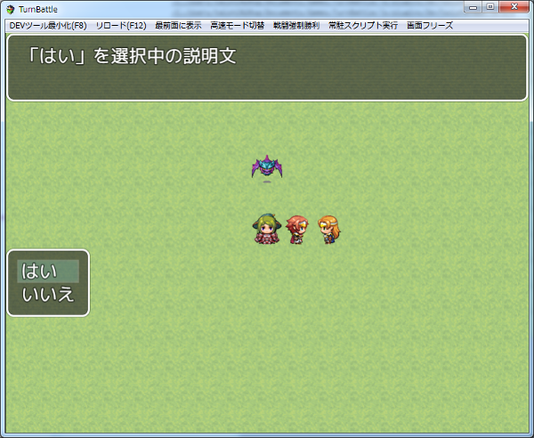

[トップページに戻る](README.md)

# [FTKR_SelectHelpWindow](FTKR_SelectHelpWindow.js) プラグイン

選択肢ウィンドウを表示中に選択肢の説明ウィンドウを表示するプラグインです。

ダウンロード: [FTKR_SelectHelpWindow.js](https://raw.githubusercontent.com/futokoro/RPGMaker/master/FTKR_SelectHelpWindow.js)

## 目次

以下の項目の順でプラグインの使い方を説明します。
1. [概要](#概要)
* [プラグインの更新履歴](#プラグインの更新履歴)
* [ライセンス](#ライセンス)

## 概要

選択肢ウィンドウを表示中に、選択肢ごとに設定した説明文を表示するウィンドウを追加で表示します。



説明文は、イベントコマンドの注釈で作成します。
注釈の最初の行に<SHW_説明>と記入されていると、以降の行の文章を説明文として取り込みます。

以下の様にイベントを作成してください。

```
◆選択肢の表示：はい, いいえ (ウィンドウ, 右, #1, #2)
：はいのとき
  ◆注釈：<SHW_説明>
  ：　　：「はい」を選択中の説明文
  ◆
：いいえのとき
  ◆注釈：<SHW_説明>
  ：　　：「いいえ」を選択中の説明文
  ◆
：分岐終了
```

説明文ウィンドウ画面上部に固定で表示します。
また説明文は２行まで表示できます。

[目次に戻る](#目次)

## プラグインの更新履歴

| バージョン | 公開日 | 更新内容 |
| --- | --- | --- |
| [ver1.1.0](FTKR_SelectHelpWindow.js) | 2018/08/06 | 注釈の設定がない場合は、説明ウィンドウを非表示にする機能を追加 |
| ver1.0.0 | 2018/04/15 | 初版公開 |

## ライセンス

本プラグインはMITライセンスのもとで公開しています。

[The MIT License (MIT)](https://opensource.org/licenses/mit-license.php)

#
[目次に戻る](#目次)

[トップページに戻る](README.md)