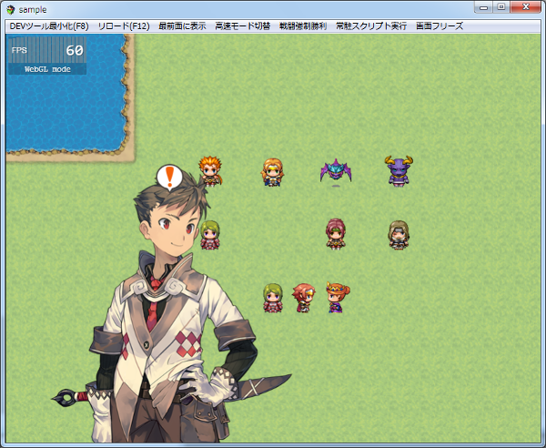

[トップページに戻る](README.md)

# [FTKR_ShowPictureBalloon](FTKR_ShowPictureBalloon.js) プラグイン

ピクチャにフキダシアイコンを表示させるプラグインです。

ダウンロード: [FTKR_ShowPictureBalloon.js](https://raw.githubusercontent.com/futokoro/RPGMaker/master/FTKR_ShowPictureBalloon.js)

## 目次

以下の項目の順でプラグインの使い方を説明します。
1. [概要](#概要)
2. [フキダシアイコンの表示](#フキダシアイコンの表示)
3. [フキダシアイコンの設定](#フキダシアイコンの設定)
* [プラグインの更新履歴](#プラグインの更新履歴)
* [ライセンス](#ライセンス)

# 概要

ピクチャーを指定してフキダシアイコンを表示させることができます。<br>
ピクチャとフキダシアイコンが重なった場合は、フキダシアイコンが上に表示されます。

また、イベントキャラに表示させるフキダシアイコンとは、別の画像ファイルを使用することもできます。



[目次に戻る](#目次)

# フキダシアイコンの表示

以下のプラグインコマンドで表示できます。<br>
※[]は実際の入力に使用しません

```
SPB_フキダシアイコンの表示 [ピクチャID] [フキダシアイコンID] [表示位置X] [表示位置Y] [ウェイト]
```

## ピクチャID
フキダシアイコンを表示させたいピクチャIDを指定します。
\v[n]で変数を指定することも可能です。

## フキダシアイコンID
表示させるフキダシアイコンを番号で指定します。<br>
フキダシアイコンに設定した画像内の上から1,2,3,...と数えます。
\v[n]で変数を指定することも可能です。

なお、デフォルトのBalloon.pngを指定している場合は、以下の文字列でも設定できます。
* 1  - びっくり
* 2  - はてな
* 3  - 音符
* 4  - ハート
* 5  - 怒り
* 6  - 汗
* 7  - くしゃくしゃ
* 8  - 沈黙
* 9  - 汗
* 10 - Zzz
* 11 ~ 15 - ユーザー定義1 ~ ユーザー定義5

※ユーザー定義の番号は半角です。

## 表示位置X
## 表示位置Y
ピクチャに対して、フキダシアイコンを表示する位置を
ピクチャサイズに対する比率で指定します。<br>
ピクチャ左上が原点です。

入力例）<br>

| X | Y | 表示位置 |
| --- | --- | --- |
| 0 | 0 | 原点に表示 |
| 0.5 | 0.5 | ピクチャの中心に表示 |
| 1 | 1 | ピクチャの右下に表示 |
| 1 | 0 | ピクチャの右上に表示 |

## ウェイト
完了までウェイトさせるか指定します。<br>
ウェイトさせる場合は、true と記入してください。
ウェイトさせない場合は、記入不要です。

## コマンド設定例）
### デフォルトアイコン画像を使用している場合

```
◆プラグインコマンド：SPB_フキダシアイコンの表示 1 びっくり 0.5 0 true
```
ピクチャID1 に びっくりアイコン をピクチャの上部中央に表示します。
完了までウェイトが掛かります。

### 独自アイコン画像を使用している場合

```
◆プラグインコマンド：SPB_フキダシアイコンの表示 1 2 0.5 0
```
ピクチャID1 に 2列目のアイコン をピクチャの上部中央に表示します。
ウェイトが掛からないため、即座に次のイベントコマンド実行に移ります。

[目次に戻る](#目次)

# フキダシアイコンの設定

プラグインパラメータで以下の設定を変更できます。

## 使用する画像
`iconImage`

使用する画像を選択してください。
画像ファイルはimg/systemフォルダに保存します。<br>
アイコンサイズは自由ですが、以下の仕様を守ってください。
* １）一つのフキダシアイコンは横１列にまとめてください。
* ２）アイコンサイズは統一してください。
* ３）アイコンのアニメーション枚数は、デフォルトと同じ８枚です。

## サイズ
`width`

フキダシアイコンの１つ分の幅を設定します。<br>
大きなアイコンを独自に作成した場合は、そのサイズに合わせて変更してください。

`height`

フキダシアイコンの１つ分の高さを設定します。<br>
大きなアイコンを独自に作成した場合は、そのサイズに合わせて変更してください。

## １コマの表示時間
`speed`

フキダシアイコンの１コマの表示時間を設定します。

## 表示後のウェイト
`waitTime`

フキダシアイコンの表示後のウェイト時間を設定します。

[目次に戻る](#目次)

## プラグインの更新履歴

| バージョン | 公開日 | 更新内容 |
| --- | --- | --- |
| [ver1.0.0](FTKR_ShowPictureBalloon.js) | 2018/03/25 | 初版公開 |

## ライセンス

本プラグインはMITライセンスのもとで公開しています。

[The MIT License (MIT)](https://opensource.org/licenses/mit-license.php)

#
[目次に戻る](#目次)

[トップページに戻る](README.md)