[トップページに戻る](README.md)

# [FTKR_SkillTreeSystem](FTKR_SkillTreeSystem.js) プラグイン

ツリー型のスキル習得システムを実装するプラグインです。

ダウンロード: [FTKR_SkillTreeSystem.js](https://raw.githubusercontent.com/futokoro/RPGMaker/master/FTKR_SkillTreeSystem.js)

サンプルプロジェクト: [英語版(English)](sampleProject/SkillTreeSample.zip)
※(MVコアスクリプト v1.5.2対応)<br>
※サンプルプロジェクト内のプラグインはバージョンが古い場合がありますので、ご利用の際には、最新のものか一度確認してください。

# 目次

以下の項目の順でプラグインの使い方を説明します。
1. [概要](#概要)
1. [プラグインの登録](#プラグインの登録)
2. [当プラグインの用語](#当プラグインの用語)
2. [スキルツリーの作成](#スキルツリーの作成)
    1. [スキルツリーIDの登録](#スキルツリーIDの登録)
    1. [スキルツリーの設定方法](#スキルツリーの設定方法)
    2. [スキルの設定](#スキルの設定)
    3. [スキルツリーをアクターとクラスに登録する](#スキルツリーをアクターとクラスに登録する)
3. [スキル習得画面の表示](#スキル習得画面の表示)
    1. [メニュー画面で表示](#メニュー画面で表示)
    1. [プラグインコマンドで表示](#プラグインコマンドで表示)
4. [基本設定](#基本設定)
    1. [スキルポイントの設定](#スキルポイントの設定)
    3. [スキルの複数回習得機能](#スキルの複数回習得機能)
    5. [スキルを忘れた時の設定](#スキルを忘れた時の設定)
4. [スキル習得画面の設定](#スキル習得画面の設定)
    1. [スキル習得時の設定](#スキル習得時の設定)
    1. [スキルツリーの表示設定](#スキルツリーの表示設定)
    2. [スキル表示設定](#スキル表示設定)
    3. [ウィンドウの表示設定](#ウィンドウの表示設定)
6. [その他の機能](#その他の機能)
    1. [スキルツリーの初期化](#スキルツリーの初期化)
    1. [制御文字の追加](#制御文字の追加)
5. [スキルツリーの作成例](#スキルツリーの作成例)
    1. [スキルを派生させる](#スキルを派生させる)
    2. [ツリーを分岐させる](#ツリーを分岐させる)
    3. [複数のスキルから派生させる](#複数のスキルから派生させる)
    3. [スキルの横方向の位置を調整する](#スキルの横方向の位置を調整する)
    3. [スキルの縦方向の位置を調整する](#スキルの縦方向の位置を調整する)
    3. [スキルの縦横両方向の位置を調整する](#スキルの縦横両方向の位置を調整する)
6. [スクリプトコマンド](#スクリプトコマンド)
7. [プラグインコマンド](#プラグインコマンド)
8. [条件式に使えるスクリプト](#条件式に使えるスクリプト)
* [プラグインの更新履歴](#プラグインの更新履歴)
* [拡張プラグイン](#拡張プラグイン)
* [ライセンス](#ライセンス)

# 概要

本プラグインにより、スキルツリーと呼ばれるスキル習得システムを実装します。

* 習得に必要な条件に、レベルだけではなくアクターのさまざまなパラメータを設定できる。
* 習得に必要なコストに、アイテムやお金、本プラグインの専用パラメータのスキルポイント(SP)などを設定できる。
* 習得するために、前提となるスキルを習得しなければいけないように設定できる。

また、これらの情報が見て分かるように前提スキルやそこから派生するスキルを線で結んだスキルツリーを画面に表示して、この画面上でスキルを習得することができます。

[目次に戻る](#目次)

# プラグインの登録

以下のプラグインと組み合わせて使用する場合は、プラグイン管理画面で、以下の順の配置になるように登録してください。
```
FTKR_SkillExpansion.js
FTKR_SkillTreeSystem.js(当プラグイン)
FTKR_STS_CustomWindow.js
```

[目次に戻る](#目次)

# 当プラグインの用語

当プラグインで使用する用語の意味を以下に示します。

### スキルツリー
あるスキルを習得すると、そのスキルを習得したことで別のスキルを習得する条件を満たすことができます。

この、スキル習得の条件として関係するスキル同士を、線で結んだものを、スキルツリーと呼びます。

### スキル習得画面

スキルツリーを表示する当プラグイン専用画面のことを、スキル習得画面と呼びます。

メニューから表示させたり、プラグインコマンドを使ってイベントで表示させることが出来ます。


### 起点スキル
スキルツリー上で一番最初に習得しなくてはいけないスキルのことを、起点スキルと呼びます。

１つのスキルツリーには、複数の起点スキルを設定することができます。

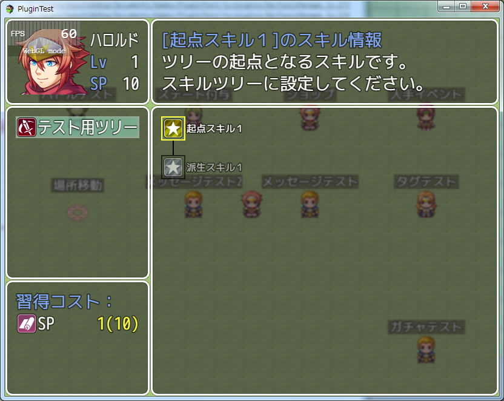

### 派生スキル
起点スキルを習得することで次に習得できるスキルのことを、派生スキルと呼びます。<br>
スキルツリー上で、習得したいスキルと線で繋がったスキルの中で、下側にあるスキルのことです。

派生スキルから、さらに別の派生スキルにつなげることができます。<br>
また、一つのスキルから複数のスキルに派生させることができます。

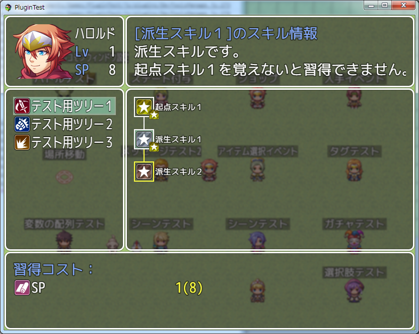

### 前提スキル
スキルを習得するために、先に習得していなければいけないスキルのことを、前提スキルと呼びます。<br>
スキルツリー上で、習得したいスキルと線で繋がったスキルの中で、上側にあるスキルのことです。<br>

一つのスキルに対して、複数の前提スキルを設定することができます。

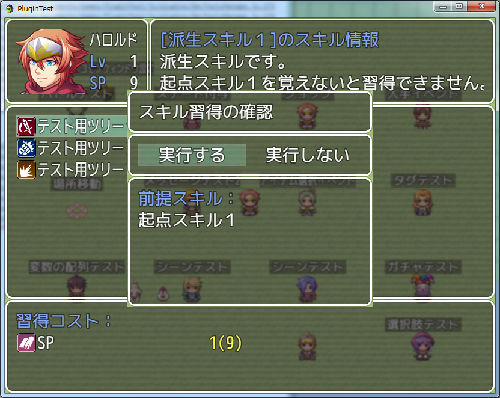

### スキルポイント
当プラグインにより追加するアクター別のパラメータです。<br>
スキルを習得するためのコストとして、設定することができます。<br>
デフォルトではレベルアップ時に入手できますが、アイテムやエネミーに設定することで、追加で入手させることができます。

[目次に戻る](#目次)

# スキルツリーの作成

## スキルツリーIDの登録

スキルツリーを作成するために、まず「武器タイプ」にスキルツリー用のタイプを作成してください。

武器タイプ名を「スキルツリー」などと付けると、分かりやすくなると思います。

作成した武器タイプIDは、プラグインパラメータ`Skill Tree Id`に入力してください。


[目次に戻る](#目次)

## スキルツリーの設定方法

スキルツリーは、データベースの武器に作成します。
作成した武器のIDが、後述のツリータイプIDになります。

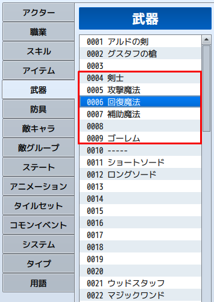

スキルツリーとして設定が必要なデータは以下の通りです。

1. 武器タイプには、先ほど登録したスキルツリーIDを選択してください。
2. 武器の名前がスキルツリーの名前として画面に表示します。
3. 武器のアイコンがスキルツリーのアイコンとして画面に表示します。
4. メモ欄にスキルツリー用のノートタグを追加してください。

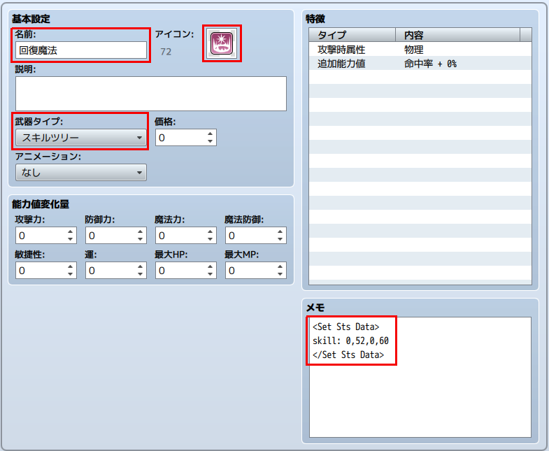

スキルツリーは、以下のノートタグで設定を行います。
```
<Set Sts Data>
code
</Set Sts Data>
```

### code に使用できる項目

#### 起点スキルの登録
```
skill: x1,x2,...
スキル: x1,x2,...
```
スキルツリーの起点となるスキルとして、ID x1,x2,...を登録します。
複数のIDを登録することで、複数の起点を持ったツリーにすることができます。
なお、IDの代わりに'0'を入力すると、その箇所はツリー上で空欄になります。
```
skill: 5,6
起点となるスキルを、スキルID5、6に設定する。
```
登録できるスキルID(0を含む)の数は、プラグインパラメータ`Skill Tree Max Cols`の設定値以内に収めなくてはいけません。設定値を超えた分の登録IDは認識しません。

```
skill y: x1,x2,...
スキル y: x1,x2,...
```
スキルツリーの起点となるスキルとして、ID x1,x2,...をy行目に登録します。
この設定は、別の起点スキルから派生するスキルツリーの情報と競合します。
派生スキルの表示位置と被らないように設定してください。
```
skill 3: 5,6
3行目に起点スキルID5、6を設定する。
```
登録できるスキルID(0を含む)の数は、プラグインパラメータ`Skill Tree Max Cols`の設定値以内に収めなくてはいけません。設定値を超えた分の登録IDは認識しません。

#### スキルツリーの習得条件
```
required: eval
習得条件: eval
```
スキルツリーの習得条件を eval に設定します。
```
required: a.level >= 3
スキルツリーを習得するために、レベル3以上必要。
```
条件式については、[条件式に使えるスクリプト](#条件式に使えるスクリプト)も参考にしてください。

#### eval の値について

eval部は、ダメージ計算式のように、計算式を入力することで、固定値以外の値を
使用することができます。以下のコードを使用できます。
* a.param - 使用者の[パラメータ](Code_List.ja.md#パラメータ)を参照します。(a.atk で使用者の攻撃力)
* s[x]    - スイッチID x の状態を参照します。
* v[x]    - 変数ID x の値を参照します。
* a.stsCount(x) - スキルID x の習得回数を参照します。

[目次に戻る](#目次)

## スキルの設定

スキルツリーを作成した後に、ツリーを構成するスキルの設定を行います。
ツリーを構成させる各スキルのメモ欄にスキル用のノートタグを追加してください。

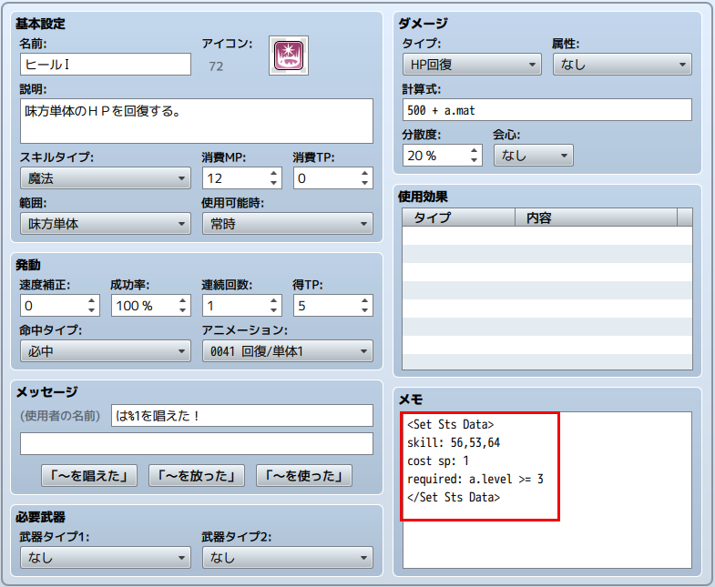

スキルは、以下のノートタグで設定を行います。
```
<Set Sts Data>
code
</Set Sts Data>
```

### code に使用できる項目

#### 派生スキルの登録
```
skill: y1,y2,...
スキル: y1,y2,...

tree x skill: y1,y2,...
ツリータイプ x スキル: y1,y2,...
```

そのスキルから派生するスキルとして、スキルID y1,y2,...を登録します。
tree x を加えた場合は、スキルツリーID x に対する派生先として登録します。
`tree 0 skill: y1,y2,...`と、`skill: y1,y2,...`の意味は同じです。

なお、複数のスキルから同じスキルに派生するように設定した場合、派生元のスキルをすべて習得しなければ、その派生スキルは、習得できません。

以下の例の場合、スキルCを習得するために、スキルAとスキルBをどちらも習得しなければいけません。
1. スキルAの派生スキルにスキルCを登録
2. スキルBの派生スキルにスキルCを登録

入力例）
```
skill: 56,53,64
tree 5 skill: 55,65
スキルID56、53、64に派生する。ただしスキルツリーID5ではスキルID55、65に派生する。
```

#### 習得済みスキルの削除
```
forget_skills: y1,y2,...
削除スキル: y1,y2,...
```
このスキルを習得した時に、習得済みのスキルID y1,y2,...を削除します。
なお、この設定で削除されたスキルは、スキルツリー上では習得済みのままです。

入力例）
```
削除スキル: 10,11
```
このスキルを習得した時に、スキルID10と11のスキルを削除する。(忘れる)

#### スキルの表示位置
```
position: y(, z)
表示位置: y(, z)
```
スキルの表示位置を y 行目に設定します。
y行目以前に派生スキルとして配置しても、自動的に y 行目に変更します。
ただし、別のスキルにより y 行目以降に配置する場合は、より後の行に表示します。

z を追加することで、表示位置を空欄 z 個分右にずらします。
横方向の表示位置を z 列目にするものではないことに注意してください。

例)<br>
表示位置を 3 行目に設定した場合、1行目のスキルから派生すると通常 2行目に配置しますが、3行目にずれて表示します。
ただし、 3 行目のスキルから派生する場合、設定した 3行目よりも後の 4行目に配置します。

#### スキルの表示条件
```
show: eval
表示条件: eval
```
スキルの表示条件を eval に設定します。

入力例）
```
show: s[10]
スキルツリー上に表示するために、スイッチID 10 のONが必要。
```
条件式については、[条件式に使えるスクリプト](#条件式に使えるスクリプト)も参考にしてください。


#### スキルの習得条件
```
required: eval
習得条件: eval
```
スキルの習得条件を eval に設定します。

入力例）
```
required: a.level >= 3
習得するために、レベル3以上が必要。
```
条件式については、[条件式に使えるスクリプト](#条件式に使えるスクリプト)も参考にしてください。

#### スキルの習得コスト
```
cost sp: eval
コスト sp: eval
```

習得に必要なSP を eval に設定します。
このコードで設定しない場合は、プラグインパラメータ`Default Required SP`の設定値を使用します。

入力例）
```
cost sp: a.stsCount(10) + 1
習得に必要なSPを スキルID10の習得回数 + 1 に設定する。
```

```
cost item[x]: eval
コスト アイテム[x]: eval

cost weapon[x]: eval
コスト 武器[x]: eval

cost armor[x]: eval
コスト 防具[x]: eval
```

それぞれ習得に必要なアイテム、武器、防具を eval 個に設定します。

入力例）
```
cost item[10]: 1
習得に必要なアイテムID10を 1個に設定する。
```

```
cost v[x]: eval
コスト v[x]: eval
```

習得に必要な変数ID x の値を eval に設定します。

入力例）
```
cost v[5]: 2
習得に必要な変数ID5の値を 2に設定する。
```

```
cost gold: eval
コスト 金: eval
```

習得に必要な金を eval に設定します。

入力例）
```
cost gold: 100
習得するために、金100が必要。
```

#### スキルの最大習得回数
```
max count: y
最大習得回数: y
```

最大習得回数を y に設定します。
このタグがない場合は、プラグインパラメータ`Default Max Count`の設定値に従います。

入力例）
```
max count: 9
最大習得回数を 9 に設定します。
```

#### 習得回数ごとの習得スキルの登録
```
learn_skill x : y
習得スキル x : y
```
このタグを設定すると、このスキルをスキルツリー上で習得した時に、その時の習得回数 x に合わせて、別のスキル y を習得します。<br>
スキル画面や戦闘中のスキル一覧には、このスキルは表示されずに、別のスキル y を表示します。

```
learn_skill x : y1 -d y2
習得スキル x : y1 -d y2
```
また、習得スキル y1 の後に -d と数字を指定することで スキル y1 を習得と同時に、 スキル y2 を忘れます。<br>
習得回数１で習得したスキルを、習得回数２のスキルを習得した時に忘れさせたい場合に使います。

#### eval の値について

eval部は、ダメージ計算式のように、計算式を入力することで、固定値以外の値を使用することができます。以下のコードを使用できます。

* a.param - 使用者の[パラメータ](Code_List.ja.md#パラメータ)を参照します。(a.atk で使用者の攻撃力)
* s[x]    - スイッチID x の状態を参照します。
* v[x]    - 変数ID x の値を参照します。
* a.stsCount(x) - スキルID x の習得回数を参照します。

#### スキルツリーの作成における注意事項

1つのスキルツリーの中で、同じスキルを重複して使用することはできません。
スキルが重複した場合、ツリーの終点に近い方を登録します。

派生スキルに登録できるスキルID(0を含む)の数は、プラグインパラメータ`Skill Tree Max Cols`の設定値以内に収めなくてはいけません。
これは、一つのスキルだけでなく、同じ行に表示するスキルの派生スキル数の合計についても同様です。設定値を超えた分の登録IDは認識しません。

[目次に戻る](#目次)

## スキルツリーをアクターとクラスに登録する

作成したスキルツリーは、アクターまたはクラスに登録することで使用できます。

### アクターとクラスの初期設定

アクターまたはクラスのメモ欄にノートタグを追加してください。

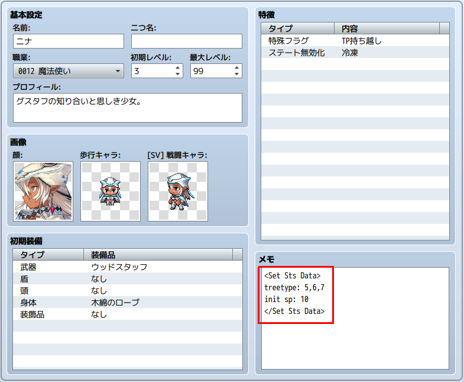

アクターとクラスは、以下のノートタグで設定を行います。

```
<Set Sts Data>
code
</Set Sts Data>
```

### code に使用できる項目

#### ツリータイプの登録
```
TreeType: x1,x2,...
ツリータイプ: x1,x2,...
```

そのアクター、またはクラスは、ツリータイプID x1,x2,...を使用できます。
ツリータイプIDとは、ツリーとして作成した武器のIDです。

入力例）
```
TreeType: 9
```
アクターの初期ツリータイプIDを 9 に設定します。

#### 初期SPの設定
```
Init Sp: x
初期 Sp: x
```

アクターの初期SPを x に設定します。
このタグは、アクター専用です。

入力例）
```
Init Sp: 5
```
初期SPを 5 に設定します。

### ゲーム中のツリータイプの追加・削除

以下のプラグインコマンドを実行することで、ゲーム中にスキルツリーの追加・削除ができます。

アクターID y にツリータイプID x を追加します。
```
STS ADD TreeType(x) Actor(y)
STS 追加 ツリータイプ(x) アクター(y)
```

アクターID y の、ツリータイプID x を削除します。
ただし、初期設定したツリータイプは削除できません。

```
STS REDUCE TreeType(x) Actor(y)
STS 削除 ツリータイプ(x) アクター(y)
```

[目次に戻る](#目次)

# スキル習得画面の表示

スキル習得画面は、以下の方法で表示できます。

* メニュー画面で表示
* プラグインコマンドで表示
* その他の方法で表示

## メニュー画面で表示

プラグインパラメータ`Show Skill Command`が 1 であることを確認してください。（デフォルトで設定済み）

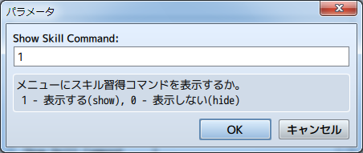

この状態の時に、メニュー画面にコマンド「スキル習得」が表示します。


コマンド「スキル習得」の表示は、プラグインパラメータ`Command Name`で変更できます。


また、以下のプラグインパラメータでメニュー欄への表示の有無をスイッチで制御できます。

`Skill Menue Switch ID`

0 を指定した場合は、この機能は無効です。
1 以上の値を設定した場合、そのIDのスイッチが ON 状態の時にメニューに表示します。

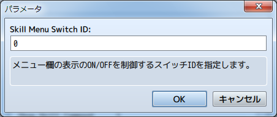

## プラグインコマンドで表示
以下のプラグインコマンドを実行することで、画面を表示します。
```
STS Open
STS スキルツリー画面表示
```

## その他の方法で表示
直接コアスクリプトを編集したり、メニューコマンドを編集するプラグインなどで表示させる場合には、以下の設定を使用してください。<br>
※大文字小文字は合わせてください。

### YEP_MainMenuManagerの場合

| パラメータ | 設定値 | 備考 |
| --- | --- | --- |
| Name | FTKR.STS.commandName |  |
| Symbol | learn skill | learn と skill の間は半角スペース |
| Show | true | スイッチで表示させる設定の場合は $gameSwitches.value(FTKR.STS.menuSwitchId) |
| Enabled | true |  |
| Ext | 空欄 |  |
| Main Bind | this.commandPersonal.bind(this) |  |
| Actor Bind | 空欄 |

### スクリプトで直接呼び出す

以下のスクリプトを実行してください。
```
SceneManager.push(Scene_STS)
```

[目次に戻る](#目次)

# 基本設定

当プラグインでは、以下の項目について設定を変更することができます。

## スキルポイントの設定

スキルを習得するためのコストとして、本プラグイン専用に、スキルポイント
というパラメータを用意しています。

### レベルアップ時の設定

スキルポイントは、レベルアップ時に入手できます。
以下のプラグインパラメータで入手量を設定できます。

`Get Level Up Sp`

レベルアップ時の入手SPを eval で設定します。

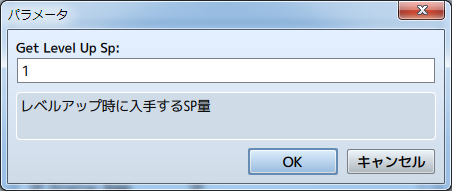

#### eval の値について
eval部は、ダメージ計算式のように、計算式を入力することで、固定値以外の値を
使用することができます。以下のコードを使用できます。
* a.param - 使用者の[パラメータ](Code_List.ja.md#パラメータ)を参照します。(a.atk で使用者の攻撃力)
* s[x]    - スイッチID x の状態を参照します。
* v[x]    - 変数ID x の値を参照します。

### プラグインコマンドによる取得

以下のプラグインコマンド(Plugin Command)で、SPを取得できます。

```
STS Add Sp(x) Actor(y)
STS 加算 Sp(x) アクター(y)
```
アクターID y に、SPを x 加算する。
 x および y には、 v[n] とすることでゲーム内変数ID n の値を指定できます。

入力例)
```
STS Add Sp(v[1]) Actor(2)
STS 加算 Sp(v[1]) アクター(2)
アクター2が、変数ID1に格納した値の分、SPを取得する。
```

### アイテムによる取得
以下のタグをアイテム(Item)に設定できます。
```
<STS Get Sp: x>
<STS SP 入手: x>
```
アイテムを使用した対象が、SPを x 取得する。

### 敵から取得

以下のタグをエネミー(Enemy)に設定できます。
```
<STS Get Sp: x>
<STS SP 入手: x>
```
設定したエネミーを倒すと、SPを x 取得する。

なお、取得したSPは戦闘終了時にメッセージで表示します。

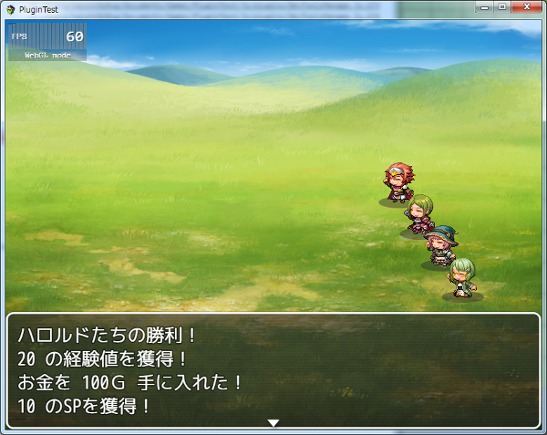

表示する文章は以下のプラグインパラメータで設定できます。

`<Display Get Sp>`

戦闘終了時の獲得SPを表示するメッセージ文を設定します。
%1 が獲得SP、%2がスキルポイント名に変換されます。
空欄にした場合は、表示しません。

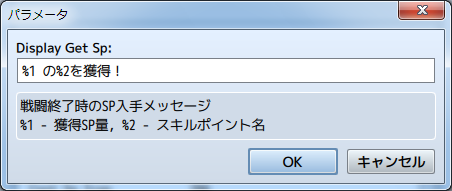

### 職業別SP

プラグインパラメータ`<Enable Class Sp>`を有効に設定することで、
職業毎に個別にSPを保持することができます。

職業毎の初期SPは、職業（クラス）のメモ欄で設定した初期SPになります。
また、アイテムや敵を倒すことで入手したSPは、その時点の職業の個別SPに加算されます。

### 最大SP

プラグインパラメータ`Default Max SP`を設定することで、各アクターが所持できるSPに最大値を設定することができます。

また、アクターまたは職業のメモ欄の`<Set Sts Data>`タグ内に、以下のタグを追記することで、個別に最大値を設定することもできます。

```
Max Sp: n
最大 Sp: n
```
最大値を n に設定します。
この設定は、プラグインパラメータの設定よりも優先します。

アクターと職業のどちらにも最大値の設定がある場合、大きい方の値が適用されます。
ただし、職業別SPを有効にしている場合は、職業の設定のみ適用されます。

[目次に戻る](#目次)

## スキルの複数回習得機能

#### 最大習得回数の有効化

以下のプラグインパラメータにより、スキルを複数回習得できるようになります。

`Enabled Skill Count`

複数回習得機能を有効にするかどうか設定します。


#### 最大習得回数の設定
スキルのタグに以下を追加することで、スキルの習得回数を設定できます。
```
<Set Sts Data>
Max count: x
</Set Sts Data>
```
スキルを x 回習得できるようにします。
このタグがない場合は、プラグインパラメータ`Default Max Count`の設定値に従います。

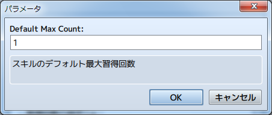

#### 習得回数の取得
スキルの習得回数は、以下のプラグインコマンドで取得できます。
```
STS Get Varcount(x) Actor(y) Skill(z)
STS 習得回数取得 変数(x) アクター(y) スキル(z)
```
アクターID y のスキルID z の取得回数を、変数ID x に格納する。
y および z には、 v[n] と入力することでゲーム内変数ID n の値を指定できます。

入力例)
```
STS 習得回数取得 変数(5) アクター(2) スキル(v[6])
アクターID 2 の、変数ID 6 の値で指定するスキルIDの習得回数を、変数ID 5 に格納する。
```

#### 習得回数の利用
スキルの取得回数は、スキルツリーや派生スキルなどのeval式に使用できます。
ダメージ計算式にも使用できます。

eval式に対して、以下のコードを使用できます。
* a.stsCount(x) - スキルID x の習得回数を参照します。
* this.stsCount() - そのスキルの習得回数を参照します。(ダメージ計算式のみ)(*1)

この機能により、習得回数によって習得できるようにすることや、スキルのダメージを変える、といった使い方ができます。

(*1)このコードは、FTKR_ExItemConfig_Damage.jsを組み合わせている場合は使用できません。

[目次に戻る](#目次)

## スキルを忘れた時の設定

以下のプラグインパラメータを設定することで、スキルを忘れた時の動作を変更できます。

`<Reset When Forgotten Skill>`

スキルを忘れた時にツリーをリセットするかを指定します。
* 1 - リセットする(デフォルト)
* 0 - リセットしない

リセットしない場合、スキルを忘れてもスキルツリーでは習得済みの状態のままになります。スキルを再習得するためには、ツリーのリセットまたは初期化が必要になります。


[目次に戻る](#目次)

# スキル習得画面の設定

## スキル習得時の設定

### スキル習得時の確認

`<Enable Confirmation>`

スキル習得実行時に確認画面を表示するか、指定します。
 * 1 - 確認する
 * 0 - 確認しない

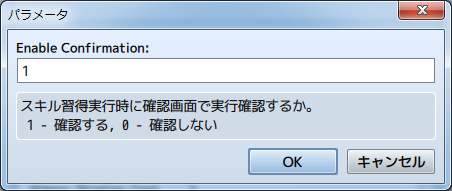

確認する場合は、スキル習得実行時に下のウィンドウを表示します。

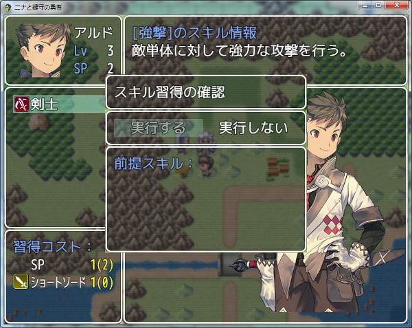

### スキル習得時のSEの設定

スキル習得時に鳴らすSEは種類、音量、ピッチ、位相を変更可能です。
以下のプラグインパラメータで書式を変更できます。

`<Learn SE Name>`

SEに使用する種類を変更します。使用したいSE名を記載してください。

`<Learn SE Volume>`

SEの音量を変更します。

`<Learn SE Pitch>`

SEのピッチを変更します。

`<Learn SE Pan>`

SEの位相を変更します。

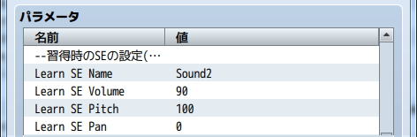

### 変数およびスイッチの操作機能

以下のプラグインパラメータを設定することで、スキル習得時のアクターとスキルの情報を取得できます。

`<Learned Actor Var ID>`

スキルを習得したアクターのIDを格納する変数IDを指定します。

`<Learned Skill Var ID>`

習得したスキルのIDを格納する変数IDを指定します。

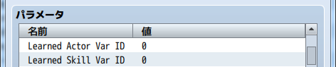

[目次に戻る](#目次)

## スキルツリーの表示設定

以下のプラグインパラメータの設定を変更することで、スキルツリーの表示を変えることができます。

`<Skill Tree Max Cols>`

スキルを横に並べられる最大数の設定します。

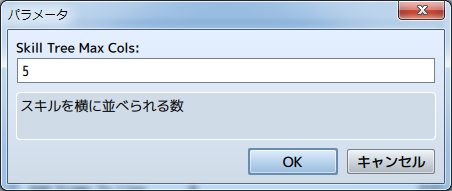

`<Skill Tree Height Space>`

スキルの縦の間隔を指定します。

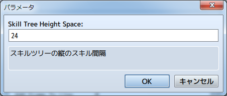

`<Draw Line Type>`

スキル間の線の引き方を指定します。
* 0 - 直線
* 1 - カギ線(A)(デフォルト)
* 2 - カギ線(B)
* 3 - 線なし

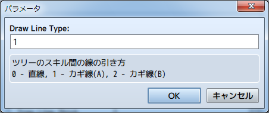

下の図は、上が直線、真ん中がカギ線(A)、下がカギ線(B)です。<br>
カギ線はAが派生先の方で曲がり、Bが派生元の方で曲がります。<br>
線なしの場合は、枠のみ表示します。

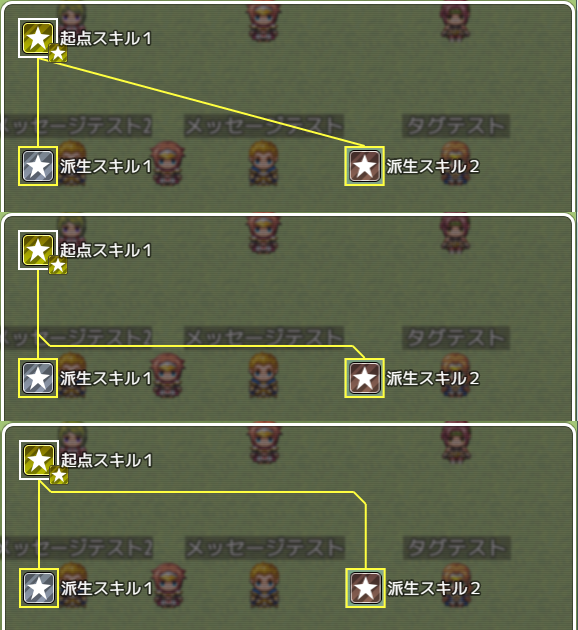

`<Tree Line Thick>`

ツリーの線の太さを指定します。

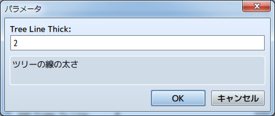

下の図は、左側が太さ 2 (デフォルト)、右側が太さ 4 です。
図のように、枠線の太さも変わります。


`<Add Frame To Line>`

ツリーの線に黒枠を付けるかどうか指定します。
* 1 - 付ける
* 0 - 付けない(デフォルト)


下の図は、左側が黒枠無し(デフォルト)、右側が黒枠有りです。
分かりやすくするため、線の太さを4にしています。

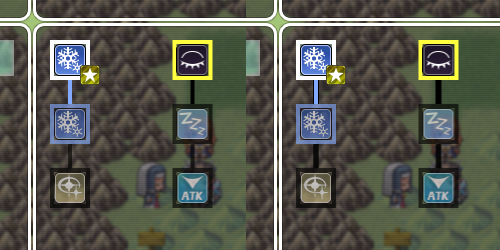

`<Fit Line Color To Frame>`

スキル間の線の色を枠の色に合わせるか指定します。
* 1 - 合わせる(デフォルト)
* 0 - 合わせない

合わせないにした場合は、スキル間の線の色は白になります。


[目次に戻る](#目次)

## スキル表示設定

スキルの表示は、以下で構成します。
1. スキル枠
2. スキルアイコン
3. スキルテキスト(デフォルトでは非表示)
4. スキルカウント枠(習得回数)

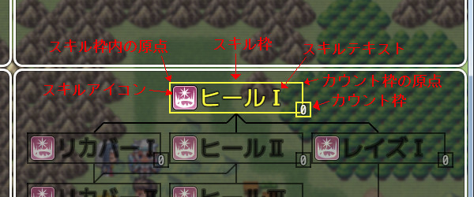

### スキル枠の設定

スキル枠には、以下の3種類の項目があります。
以下のプラグインパラメータで設定を変えることができます。

#### スキル枠の基本設定

以下のプラグインパラメータで、枠線の表示と、サイズを設定します。

`<Enabled Skill Frame>`

枠表示を有効にするか設定します。
* 1 - 有効 (デフォルト)
* 0 - 無効

`<Skill Frame Width>`

枠の幅を指定します。

`<Skill Frame Height>`

枠の高さを指定します。

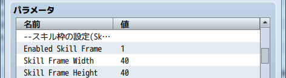

#### スキル枠線色

スキルの習得状況を線色で表すことができます。
以下のプラグインパラメータで、それぞれの色を設定できます。

`<Frame Color isLearned>`

習得済みスキルの枠線の色を指定します。

`<Frame Color isLearn OK>`

習得可能なスキルの枠線の色を指定します。

`<Frame Color isReqSkill NG>`

必要スキル未修得のスキルの枠線の色を指定します。

`<Frame Color isRequired NG>`

必要コストまたは習得条件未達のスキルの枠線の色を指定します。

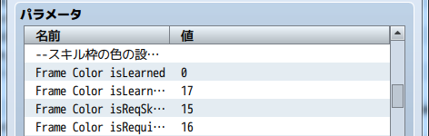

### スキルアイコンの設定

スキルアイコンに対しては、スキル枠内の表示位置を設定できます。

`<Skill Icon Offset X>`

スキル枠左上を原点としたアイコンのX座標

`<Skill Icon Offset Y>`

スキル枠左上を原点としたアイコンのY座標

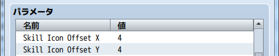

### スキルテキストの設定

以下のパラメータでスキル名の表示内容を設定できます。

`<Skill Name Format>`

%1でスキル名を表示します。制御文字を使用できます。
スキル名がスキル枠の幅よりも長い場合は、制御文字 \LW を使用して
表示幅を調整してください。

入力例)
```
\LW[100,%1]
スキル名の表示を100pixel内に収めます。
```

以下のパラメータで、スキル名の表示位置を調整できます。

`<Skill Name Offset X>`

スキル枠左上を原点としたスキル名のX座標

`<Skill Name Offset Y>`

スキル枠左上を原点としたスキル名のY座標

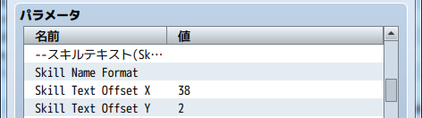

### スキルカウント枠の設定

スキルの複数取得回数機能を有効にした場合の表示内容を設定できます。
以下のパラメータで表示枠を設定します。

#### カウント枠の基本設定

`<Draw Count Frame>`

枠線を表示するか設定します。
* 1 - 有効 
* 0 - 無効 (デフォルト)

`<Count Frame Width>`

カウント枠の幅

`<Count Frame Height>`

カウント枠の高さ

`<Count Frame Thick>`

カウント枠の太さ


#### カウント枠の表示位置

以下のパラメータで、表示位置を調整できます。

`<Count Frame Offset X>`

スキル枠右上を原点としたカウント枠のX座標

`<Count Frame Offset Y>`

スキル枠右上を原点としたカウント枠のX座標

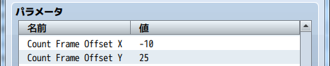

#### カウント枠の表示内容

以下のパラメータで表示内容を設定できます。

`<Count Frame Format>`

%1で習得回数を表示します。制御文字を使用できます。

`<Skill Count Offset X>`

カウント枠に対する習得回数のX座標

`<Skill Count Offset Y>`

カウント枠に対する習得回数のX座標


`<Skill Learned Icon>`

最大習得回数に達した時に表示するアイコン<br>
このアイコンは、複数習得回数機能を有効にしない場合でもスキルを習得すると表示します。

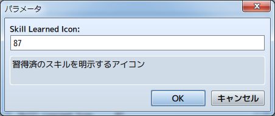

[目次に戻る](#目次)

## ウィンドウの表示設定

### アクターステータスウィンドウの表示設定

アクターステータスウィンドウには、デフォルトで以下のパラメータを表示します。
* アクターの顔画像
* 名前
* レベル
* SP値

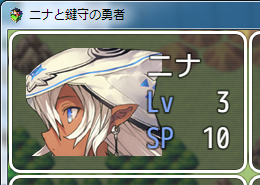

拡張プラグインのFTKR_CustomSimpleActorStatus.jsがある場合、プラグインパラメータ`<ステータスの表示設定/Actor Status Layout>`以下の設定に従い、表示内容を変更することができます。

各パラメータの意味と、設定方法は、FTKR_CustomSimpleActorStatus.jsのヘルプを参照してください。

なお、歩行キャラ、SV戦闘キャラ、カスタムパラメータ、カスタムゲージの設定は、FTKR_CustomSimpleActorStatus.jsの設定に従います。


### スキル説明ウィンドウの表示設定

以下のプラグインパラメータで、表示内容を変更します。

`<Skill Status Title Format>`

デフォルトで "[スキル名]のスキル情報" と表示している部分の設定です。
%1 を記述した箇所がアクター名に、%2 がスキル名に換わります。
制御文字が使えます。

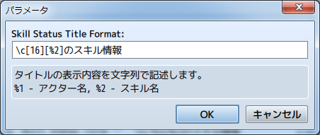

`<Adjust Skill Desc Width>`

説明文に制御文字が使えなくなる代わりに、ウィンドウの枠内に自動で納まるように調整する機能です。
* 0 - 無効(デフォルト)
* 1 - 有効

以下のタグをスキルのメモ欄に追記することで、スキル使用時の説明文とは別の文章を表示させることが出来ます。制御文字が使用できます。

```
<STS DESC>
文章
文章
</STS DESC>
```

### 習得コストウィンドウの表示設定

以下のプラグインパラメータで、表示内容を変更します。

`<Cost Title Format>`

デフォルトで "習得コスト" と表示している部分の設定です。
制御文字が使えます。

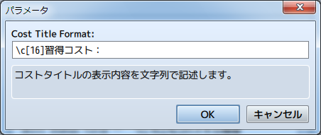

`<Cost Item Format>`

デフォルトで、アイコンの後の "SP" 等と表示している部分の設定です。
%1 を記述した箇所が コスト名 に換わります。
制御文字が使えます。


アイテム等のコストで表示が見切れる場合は、制御文字`\LW`を使うと表示幅を調整できます。

入力例)

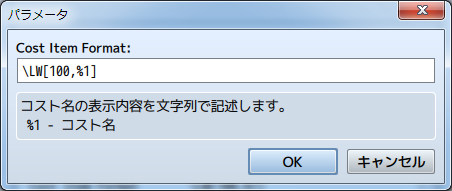

コスト名を 100pixel 内に収めて表示します。

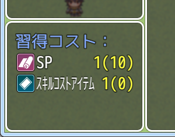

`<Cost Number Format>`

コストの数値を表示している部分の設定です。
'色番号, 文字列'の形式で記述します。
一つ目の数値がコスト数値の色を表します。
文字列に記述した %1 が コスト値、%2 が 手持ちの値に換わります。
文字列には制御文字は使用できません。


`<Cost Number Width>`

コスト数値の表示幅をpixel単位指定します。
コスト数値の文字列が表示幅を超える場合は、自動で文字サイズを調整します。
0 の場合は、幅を制限せずにそのまま表示します。

### 前提スキルウィンドウの表示設定

以下のプラグインパラメータで、表示内容を変更します。

`<Preskill Title Format>`

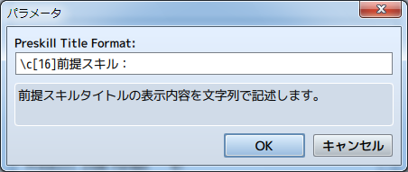

デフォルトで "前提スキル" と表示している部分の設定です。
制御文字が使えます。

`<Preskill Item Format>`

デフォルトで、前提スキル名を表示している部分の設定です。
%1 を記述した箇所が スキル名 に換わります。
制御文字が使えます。

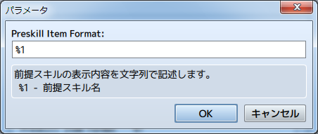

### 確認ウィンドウの表示設定

以下のプラグインパラメータで、表示内容を変更します。

`<Conf Title Format>`

デフォルトで "スキル習得の確認" と表示している部分の設定です。
%1 を記述した箇所がアクター名に、%2 がスキル名に換わります。
制御文字が使えます。

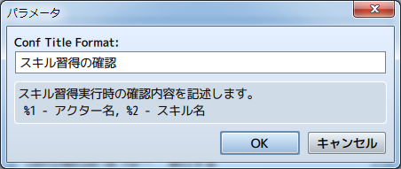

`<Confirmation Ok Format>`

デフォルトで、"実行する" を表示している部分の設定です。
制御文字は使えません。

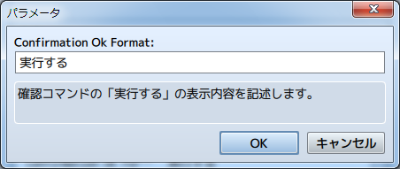

`<Confirmation Cancel Format>`

デフォルトで、"実行しない" を表示している部分の設定です。
制御文字は使えません。


[目次に戻る](#目次)

# その他の機能

## スキルツリーの初期化

スキルツリーは、ゲーム中にいくつかの手段で習得状況を初期状態に戻すことができます。
リセットと初期化は使用したコストが戻るか戻らないかの違いです。

なお、初期レベルで習得済みのスキルについては、コストを消費しているものとして計算します。

### プラグインコマンドで戻す

#### スキルツリーのリセット

以下のプラグインコマンドで、スキルツリーをリセットできます。
使用したコストはすべて戻ります。

```
STS Reset Actor(x) ALL
STS リセット アクター(x) すべて
```
アクターID x のスキルツリーをすべてリセットします。

```
STS Reset Actor(x) TreeType(y)
STS リセット アクター(x) ツリータイプ(y)
```
アクターID x のスキルツリーID y をすべてリセットします。

#### スキルツリーの初期化

以下のプラグインコマンドで、スキルツリーを初期化できます。
使用したコストは戻りません。

```
STS Clear Actor(x) ALL
STS 初期化 アクター(x) すべて
```
アクターID x のスキルツリーをすべて初期化します。

```
STS Clear Actor(x) TreeType(y)
STS 初期化 アクター(x) ツリータイプ(y)
```
アクターID x のスキルツリーID y をすべて初期化します。

### アイテムで戻す

また、以下のタグをアイテムのメモ欄に入力することで、ツリーを初期化する
アイテムにできます。

```
<STS Reset Tree>
<STS 全スキルツリー リセット>
```
対象のスキルツリーをすべてリセットします。
使用したコストはすべて戻ります。

```
<STS Clear Tree>
<STS 全スキルツリー 初期化>
```
対象のスキルツリーをすべて初期化します。
使用したコストは戻りません。

[目次に戻る](#目次)

## 制御文字の追加

本プラグインを実装することで、以下の制御文字を追加します。

`\LW[表示幅(,文章,表示位置)]`

### 表示幅
文章を表示させる幅を、pixel単位で指定します。
文章を標準のサイズで表示するために必要な幅よりも小さい値の場合は、
文章を横に圧縮して表示します。

### 文章
表示する文章を入力します。
制御文字は使用できません。
文章を入力しない場合、空欄をあける制御文字として使用できます。

### 表示位置
表示幅内で文章をどの位置に表示するか指定します。
指定しない場合は、左寄せで表示します。
* right - 右寄せ
* center - 中央揃え

入力例)
```
◆文章：なし,ウィンドウ,下
：   ：\LW[200,こんにちは]いい天気ですね。
◆
```
上記のイベントの場合、メッセージ表示は「こんにちは　　　いい天気ですね。」となります。

`\SDATA[スキルID,パラメータ名]`

### スキルID
表示させたいスキルのIDを入力します。

### パラメータ名
表示させたいパラメータに合わせて、以下の文字列を入力します。
 * name　 - スキル名を表示
 * mpCost - 消費MPを表示
 * tpCost - 消費TPを表示

入力例)
```
\SDATA[10,mpCost]
```
スキルID10の消費MPの値を表示します。


[目次に戻る](#目次)

# スキルツリーの作成例

実際のツクールとゲーム画面を用いてスキルツリーの作成例を説明します。

なお、以降のスキルツリー画面は、ウィンドウの設定を以下のように変更しています。

* `<Skill Name Format>` 　: `\}%1\{`
* `<Skill Name Offset X>` : `42`
* `<Skill Tree Max Cols>` : `4`

## スキルを派生させる
まず、基本的な設定である派生スキルの作成例を説明します。


### スキルツリーを作成

スキルID 15 がツリーの起点となるスキルです。

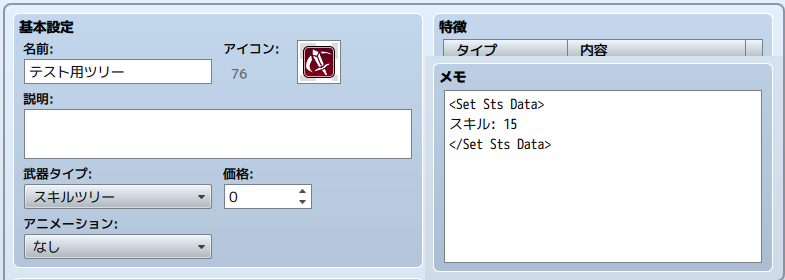

### スキルを作成

起点となるスキルとそこから派生するスキルを作成します。

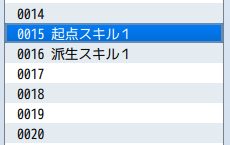

起点となるスキルのメモ欄に、派生させるスキルのIDを設定します。

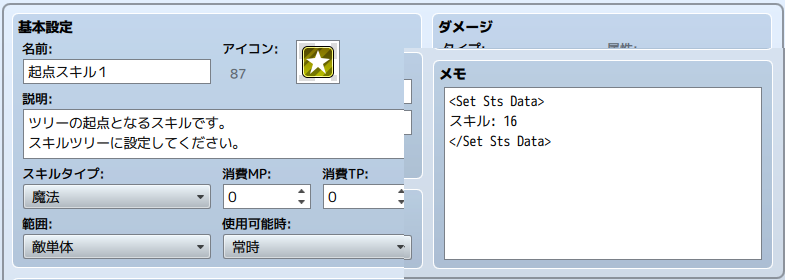

派生スキルのメモ欄には設定不要です。


### ゲーム画面を表示

以上設定により、初めに示したスキルツリー画面ようになります。
起点スキル１と派生スキル１が、線で結ばれました。

これが、派生スキルの作成方法です。


[目次に戻る](#目次)

## さらにスキルを派生させる

このままでは、２段しかないので寂しいスキルツリーですね。<br>
次は、先ほどの派生スキル１から更にスキルを派生させます。

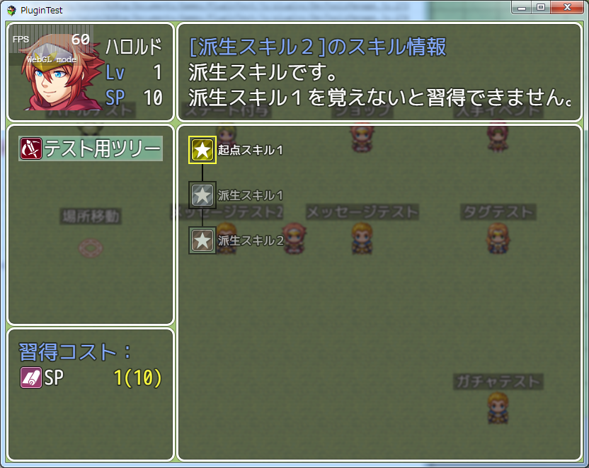

### 派生させるスキルを追加

さらに派生させるスキルとして「派生スキル２」をID 17 に追加します。

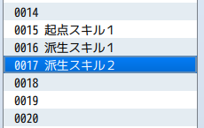

スキルのメモ欄には設定不要です。

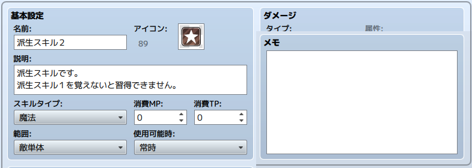

### 派生元のスキルを修正

派生元となる「派生スキル１」のメモ欄に、ID17 のスキルに派生するように設定を追加します。

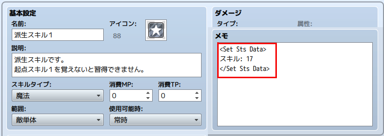

### ゲーム画面を表示

以上設定により、初めに示したスキルツリー画面ようになります。
派生スキル２が追加し、派生スキル１と派生スキル２が線で結ばれました。

このようにして、スキルを繋げていきます。


[目次に戻る](#目次)

## ツリーを分岐させる

ツリーは一本道にするだけではありません。
ツリーを分岐させることで、キャラの成長に自由度を持たせることが出来ます。

ここでは、先ほどのツリーで「派生スキル１」から分岐する方法を説明します。

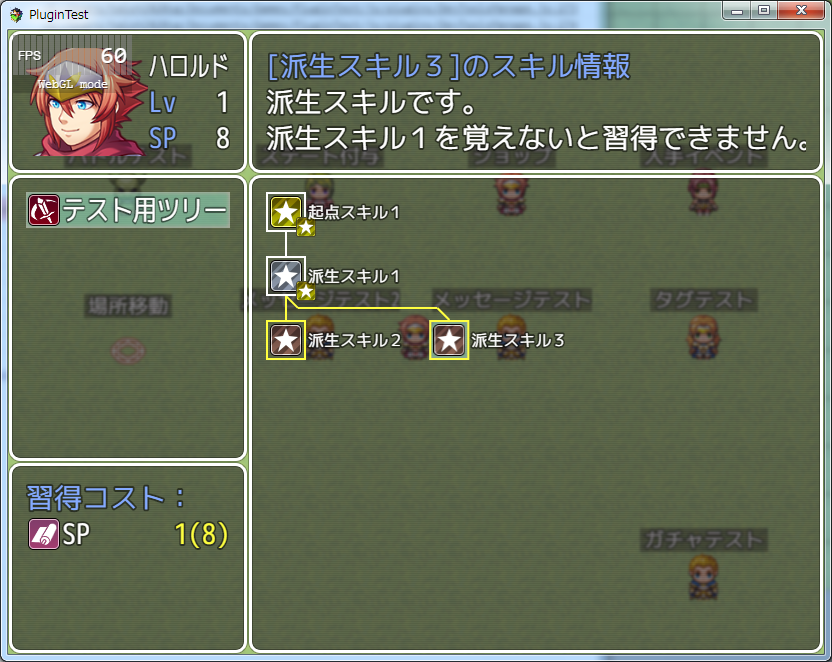

### 派生させるスキルを追加

さらに派生させるスキルとして「派生スキル３」をID 18 に追加します。

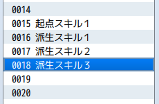

スキルのメモ欄には設定不要です。


### 派生元のスキルを修正

派生元となる「派生スキル１」のメモ欄に、ID18 のスキルに派生するように設定を追加します。
「スキル」タグに、カンマ(,)でID番号を追加するだけです。

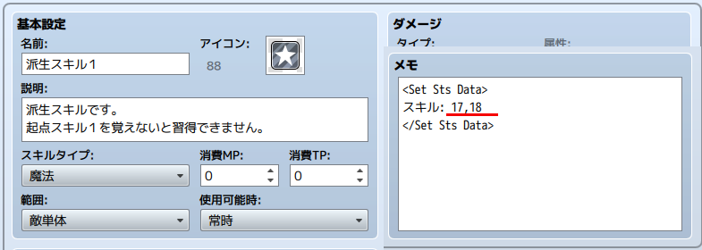

### ゲーム画面を表示

以上設定により、初めに示したスキルツリー画面ようになります。
派生スキル３が追加し、派生スキル１から派生スキル２と３が分岐しました。


### 派生先のスキルをどちらか１つだけ習得できるようにする

派生先の「スキル」タグに習得条件`!a.isStsLearnedSkill(スキルID)`を追加します。<br>
このスクリプトの意味は、`指定した「スキルID」のスキルを習得していない場合`という条件式です。

例えば、スキルID17とスキルID18に分岐する場合に、どちらか片方を習得すると、もう片方を習得できないようにしたい場合は、

スキルID17のタグに
```
習得条件: !a.isStsLearnedSkill(18)
```

スキルID18のタグに
```
習得条件: !a.isStsLearnedSkill(17)
```

を、それぞれ追加します。


[目次に戻る](#目次)

## 複数のスキルから派生させる

また、ツリーは分岐させるだけでもありません。
より強力なスキルは、複数の分岐のスキルを習得していないと覚えることができない、といった制限が必要になるかもしれません。

ここでは、先ほどのスキルツリーで分岐させた二つのスキルから、一つのスキルを派生させる方法を説明します。

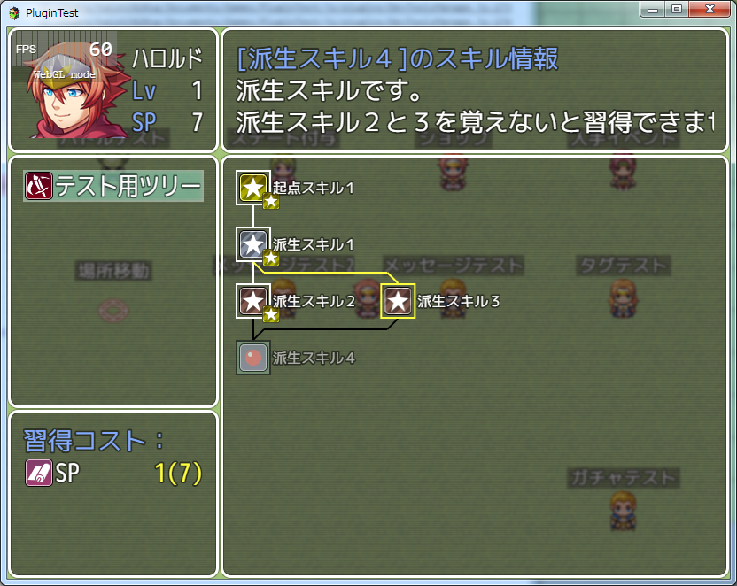

### 派生させるスキルを追加

さらに派生させるスキルとして「派生スキル４」をID 19 に追加します。


スキルのメモ欄には設定不要です。


### 派生元のスキルを修正

派生元となる「派生スキル２」と｢派生スキル３」のメモ欄に、ID19 のスキルに派生するように設定を追加します。


### ゲーム画面を表示

以上設定により、初めに示したスキルツリー画面ようになります。
派生スキル４が追加し、派生スキル２と派生スキル３から派生しました。

この派生スキル４は、派生スキル２と３を両方習得しないと覚えることはできません。


[目次に戻る](#目次)

## スキルの横方向の位置を調整する

ここまではツリーの形状を特に考えず、派生スキルや分岐を増やしていきましたが、スキルの数が増えていくと、見易さのためにツリーの形状やスキルの配置も考慮しなくてはいけません。

ここでは、下の図のように空欄を空けて、スキルの位置を調整する方法を説明します。


### 派生させるスキルを追加

派生させるスキルとして「派生スキル５」をID 20 に、「派生スキル６」をID 21 に追加します。


｢派生スキル５」のメモ欄に、ID21 のスキルに派生するように設定します。


「派生スキル６」のメモ欄には設定不要です。


### 派生元のスキルを修正

派生元となる「起点スキル１」のメモ欄に、ID20 のスキルに派生するように設定を追加します。


### ゲーム画面を表示

ここまでの設定で、スキルツリー画面がどうなるか一度見てみましょう。

派生スキル５と６が追加されましたが、派生スキルが斜めに配置しているため、ツリーの派生がわかりづらくなっていますね。

派生スキルは、設定された順番に左詰で表示されます。
そのため、先に設定したツリーの形状によって、追加した派生スキルのツリーの形状が変わってしまいます。


### スキルの位置を調整

派生スキル５と６が縦に繋がれば、ツリーの派生がわかりやすくなります。
そこで、派生スキル５の位置を右にずらすように調整します。

派生スキル５は起点スキル１から派生するため、起点スキル１のメモ欄を修正します。
横方向の調整方法は、以下のように「スキル」タグに、0 を追加するだけです。
今回は、派生スキル５(ID20)を右にずらしたいので、ID16 とID20 の間に 0 を追加します。


### ゲーム画面を表示

調整後のスキルツリー画面を以下に示します。

派生スキル５が右にずれて、派生スキル１との間に空欄ができました。
これで、派生スキル１から派生するツリーと、派生スキル５から派生するツリーが別れて見やすくなりました。

このようにして、横方向の位置を調整します。


[目次に戻る](#目次)

## スキルの縦方向の位置を調整する

横方向に位置を調整する方法を説明しましたが、ツリーやスキルの習得条件などによっては、縦方向に調整するような場合があるかもしれません。

下の図ように、先ほどのツリーの派生スキル６を、派生スキル４と同じ行に表示させる場合の調整方法を説明します。


### スキルの縦方向の位置を調整

「派生スキル６」のメモ欄に、表示位置を設定するタグを追加します。
派生スキル４は4行目にあるため、表示位置を 4 に設定します。


### ゲーム画面を表示

縦方向の調整は以上です。
ここまでの設定で、スキルツリー画面を表示すると以下のようになります。

派生スキル６が4行目に変わっていますが、横方向の配置が左にずれていますね。
このように、縦方向の位置が変わると、横方向の位置についても再計算します。

そのため、横方向についても位置を調整する必要があります。


### スキルの横方向の位置を調整

横方向にずらすためには、派生スキルに 0 を設定して空欄を作る方法を使います。
それでは、どのスキルに 0 を追加すればよいのでしょうか。

この場合、派生スキル４の右側に空欄をつければよいため、派生スキル４を設定しているスキルに追加します。
つまり、「派生スキル２」または「派生スキル３」です。

今回は、「派生スキル３」のメモ欄の ID19 の右に 0 を追加しました。


### ゲーム画面を表示

以上の設定を加えると、ツリー画面は以下のようになります。

これで、横方向の位置を変えずに、「派生スキル６」の縦方向の位置をずらすことができました。


[目次に戻る](#目次)

## スキルの縦横両方向の位置を調整する

縦方向の調整用タグを使って、横方向も同時に調整することもできます。
下の図のように、派生スキル２の位置を調整する場合、スキルタグに 0 を追加するスキルがないため、前述の方法ではできません。

この場合は、以下の方法で調整します。


### スキルの設定

起点スキル１をスキルID25に、派生スキル１をID26に、派生スキル２をID27に作成します。


起点スキル１のメモ欄の設定です。


派生スキル１のメモ欄の設定です。
3行目に表示するため、表示位置を 3 に設定します。


派生スキル２のメモ欄の設定です。
3行目に表示するため、表示位置を 3 に設定します。
さらに、派生スキル１と空欄１つあけるため、3 の後にカンマ(,)をつけて 1 と追記します。
このような表記にすることで、表示行数を設定しつつ、任意の空欄を空けることができます。


### ゲーム画面を表示

以上の設定を加えると、先ほど表示したツリー画面のようになります。

これで、縦方向と合わせて横方向の位置も調整することができます。


[目次に戻る](#目次)

# スクリプトコマンド

以下のスクリプトコマンドが使用できます。
eval値に使用する場合は、'$gameActors.actor(x)'を'a'に置き換えてください。

### 現在SPの取得

`$gameActors.actor(x).stsSp()`

指定したアクターの、現在SPを値を取得します。
* x - アクターID

### スキル習得回数の取得

`$gameActors.actor(x).stsCount(y)`

指定したアクターのスキルの習得回数を取得します。
* x - アクターID
* y - スキルID

### スキル習得有無の取得

`$gameActors.actor(x).isStsLearnedSkill(y)`

指定したアクターが、指定したスキルを習得したことがあるかどうかを取得します。
* x - アクターID
* y - スキルID

### スキル習得可否の判定

`$gameActors.actor(x).canStsLearnedSkill(y)`

指定したアクターが、指定したスキルを習得できるかどうかを判定します。
* x - アクターID
* y - スキルID

### スキルを習得

`$gameActors.actor(x).stsLearnSkill(y)`

指定したアクターが、指定したスキルを習得します。習得に必要なコストも同時に支払います。
ただし、指定したスキルを習得する条件(前提スキル、コスト、習得条件)を満たしていない場合は習得できません。
スキルの複数回習得機能を有効にしている場合は、習得回数も増加します。
このコマンドの結果はスキルツリーに反映します。
* x - アクターID
* y - スキルID

[目次に戻る](#目次)

# プラグインコマンド

### スキルツリー画面の表示
```
STS Open
STS スキルツリー画面表示
```

### SPの取得
```
STS ADD SP(x) ACTOR(y)
STS 加算 SP(x) アクター(y)
```
指定したアクターが、SPを取得します。
* x - 取得SP値
* y - アクターID


### スキルの取得回数の取得
```
STS GET VARCOUNT(x) ACTOR(y) SKILL(Z)
STS 習得回数取得 変数(x) アクター(y) スキル(z)
```
指定したアクターがスキルを習得している回数を
ゲーム内変数に格納します。
* x - 変数ID
* y - アクターID
* z - スキルID


### ツリーのリセット
```
STS RESET ACTOR(x) ALL
STS リセット アクター(x) すべて

STS RESET ACTOR(x) TREETYPE(y)
STS リセット アクター(x) ツリータイプ(y)
```
指定したアクターのスキルツリーを、すべてまたは指定した対象のみ
リセットします。
リセットしたツリーに使用したコストはアクターに戻ります。
* x - アクターID
* y - ツリータイプID


### ツリーの初期化
```
STS CLEAR ACTOR(x) ALL
STS 初期化 アクター(x) すべて

STS CLEAR ACTOR(x) TREETYPE(y)
STS 初期化 アクター(x) ツリータイプ(y)
```
指定したアクターのスキルツリーを、すべてまたは指定したツリーのみ
初期化します。
初期化したツリーに使用したコストはアクターに戻りません。
* x - アクターID
* y - ツリータイプID

### スキルを習得
```
STS LEARN ACTOR(x) SKILL(y)
STS スキル習得 アクター(x) スキル(y)
```
指定したアクターが、指定したスキルを習得します。
習得に必要なコストも同時に支払います。
ただし、指定したスキルを習得する条件(前提スキル、コスト、習得条件)を満たしていない場合は習得できません。
このコマンドの結果はスキルツリーに反映します。
* x - アクターID
* y - スキルID

### スキルツリーを追加する
```
STS ADD TREETYPE(x) ACTOR(y)
STS 追加 ツリータイプ(x) アクター(x)
```
指定したアクターに、指定したスキルツリーを追加します。
* x - ツリータイプID
* y - アクターID


### スキルツリーを削除する
```
STS REDUCE TREETYPE(x) ACTOR(y)
STS 削除 ツリータイプ(x) アクター(x)
```
指定したアクターの、指定したスキルツリーを削除します。
ただし、初めから適用しているツリータイプ(アクターとクラスのタグで
設定したもの)は削除できません。
* x - ツリータイプID
* y - アクターID

[目次に戻る](#目次)

# 条件式に使えるスクリプト

タグの習得条件や表示条件などの条件式に使えるスクリプトをいくつか紹介します。

## 別のスキルを習得している場合
```
a.isStsLearnedSkill(スキルID)
```
スキルIDで指定したスキルを習得している場合に、条件を満たします。<br>
```
!a.isStsLearnedSkill(スキルID)
```
上記のように、`a`の前に`!`を付けると、逆の意味(指定したスキルを習得していない場合)になります。

## 指定した職業である場合
```
a.isClass($dataClasses[職業ID])
```
指定した職業IDの職業である場合に、条件を満たします。<br>
`a`の前に`!`を付けると、逆の意味(指定した職業でない場合)になります。

## 複数の条件を組み合わせる場合
これまで紹介した条件式を2つ以上組み合わせる場合は、以下の例のように`&&`を使います。
```
a.isStsLearnedSkill(スキルID) && a.isClass($dataClasses[職業ID])
```

3つ以上に増やす場合も、以下のように`&&`で繋げることができます。
```
条件式A && 条件式B && 条件式C && ...
```
※条件式と`&&`の間の半角スペースは入れても入れなくてもよい。

[目次に戻る](#目次)

# プラグインの更新履歴

| バージョン | 公開日 | 更新内容 |
| --- | --- | --- |
| [ver1.18.1](FTKR_SkillTreeSystem.js) | 2019/04/22 | FTKR_CustomSimpleActorStatus と組み合わせた時に、Cursor Line Number の設定が反映されない不具合を修正 |
| ver1.18.0 | 2019/04/13 | 習得回数ごとに別のスキルを習得させる機能を追加<br>プラグインパラメータ Draw Line Type に、スキル間の線を非表示にする機能を追加 |
| ver1.17.1 | 2019/02/24 | プラグインパラメータ Enable Class Sp を有効にするとエラーになる不具合を修正 |
| ver1.17.0 | 2018/12/30 | 取得可能なSPに最大値を設定する機能を追加 |
| ver1.16.2 | 2018/09/07 | 最大習得回数に達した時にコスト数値の表示内容を変更できる機能を追加 |
| ver1.16.1 | 2018/09/04 | v.1.16.0の変更箇所の不具合修正 |
| ver1.16.0 | 2018/09/04 | プラグインパラメータ Cost Title Format と Preskill Title Format の値を空欄にした場合に、それぞれのウィンドウ上のコストや前提スキルの表示位置を一段上げるように修正<br>拡張プラグインの修正に合わせてリファクタリング |
| ver1.15.13 | 2018/08/26 | FTKR_SkillExpansionと組み合わせている場合に、スキルツリー画面のスキル説明文が正しく表示できない不具合を修正<br>FTKR_SkillExpansionと組み合わせていても、スキルツリー側の説明文の設定を優先して表示する機能を追加 |
| ver1.15.12 | 2018/08/16 | プラグイン適用前のセーブデータを使用した時に画面表示時にエラーになる不具合を修正 |
| ver1.15.11 | 2018/08/03 | 習得したスキルを忘れさせ再度習得した場合に、ツリーをリセットしても使用したコストが正しく戻らない不具合を修正 |
| ver1.15.10 | 2018/07/16 | FTKR_SkillExpansion.jsとの組み合わせ方について追記 |
| ver1.15.9 | 2018/05/04 | 習得回数を取得するスクリプトを追加(しぐれんさん案) |
| ver1.15.8 | 2018/05/03 | プラグインコマンドが認識しない不具合を修正 |
| ver1.15.7 | 2018/04/30 | メニュー画面に戻る時に、まれに画面がフリーズする不具合の暫定対処を見直し。 |
| ver1.15.6 | 2018/04/29 | メニュー画面に戻る時に、まれに画面がフリーズする不具合の暫定対処を追加。 |
| ver1.15.5 | 2018/04/23 | 他プラグインとの競合回避のため、Scene_STSクラスの継承元をScene_MenuBaseに変更 |
| ver1.15.4 | 2018/04/18 | スキルの表示条件が反映されない不具合を修正 |
| ver1.15.3 | 2018/04/16 | 他プラグインとの競合回避のため、関数名を変更 |
| ver1.15.2 | 2018/04/03 | エラー判定処理追加、ヘルプに注釈追加 |
| ver1.15.1 | 2018/03/25 | FTKR_ExItemConfig_ItemBasic.js未適用時にエラーになる不具合を修正 |
| ver1.15.0 | 2018/03/09 | FTKR_ExItemConfig_ItemBasic.jsに対応 |
| ver1.14.0 | 2018/02/20 | 職業毎に個別のSPをもてる機能を追加<br>スキル習得時に他のスキルを忘れさせた場合、ツリーをリセットしても使用したコストが戻らない不具合を修正 |
| ver1.13.0 | 2018/02/13 | スキルを習得した時に、他のスキルを忘れさせる機能を追加 |
| ver1.12.0 | 2017/12/20 | スキルのデータを表示する制御文字を追加<br>スキル習得画面の説明文を、スキル使用時の説明文と変える機能を追加 |
| ver1.11.4 | 2017/11/04 | プラグイン適用前のセーブデータを使用した時にレベルアップ等でスキルを習得した際に発生するエラーを回避する処理を追加 |
| ver1.11.3 | 2017/10/21 | FTKR_SkillUpgradeSystemとの競合回避 |
| ver1.11.2 | 2017/10/10 | リセット実行時にエラーで止まる不具合を修正 |
| ver1.11.1 | 2017/10/09 | リセット実行時にエラーで止まる不具合を修正 |
| ver1.11.0 | 2017/10/09 | スキルツリーリセット時に、コストとして消費したSP以外のアイテムやお金等も戻るように変更<br>コストに設定したお金が反映されない不具合を修正 |
| ver1.10.0 | 2017/08/22 | スキルツリーの起点スキルに対して行を指定して登録する機能を追加 |
| ver1.9.0 | 2017/07/25 | コアスクリプトv1.5.0以前にも仮対応<br>プラグインパラメータに@type適用<br>一部記述見直し |
| ver1.8.3 | 2017/07/21 | v1.8.2の変更部の不具合修正 |
| ver1.8.2 | 2017/07/21 | 他プラグインとの競合回避のため、描画関数の名前を変更 |
| ver1.8.1 | 2017/06/11 | ツリーリセットを繰り返すと通常よりも多くSPが戻る不具合を修正 |
| ver1.8.0 | 2017/06/09 | コアプラグイン v1.5.0 に対応 |
| [ver1.7.7](archive/FTKR_SkillTreeSystem_1.7.7.js) | 2017/06/11 | ツリーリセットを繰り返すと通常よりも多くSPが戻る不具合を修正<br>コアプラグイン v1.5.0未対応版 |
| ver1.7.6 | 2017/06/05 | 消費コストの表示が正しく反映されない不具合を修正<br>ツリーリセット時に通常よりも多くSPが戻る不具合を修正 |
| ver1.7.5 | 2017/06/03 | ツリーリセット時に複数回習得させた分のSPが戻らない不具合を修正 |
| ver1.7.4 | 2017/05/24 | ヘルプ修正 |
| ver1.7.3 | 2017/05/18 | 横方向の位置を調整する機能の不具合修正 |
| ver1.7.2 | 2017/05/13 | 戦闘終了時に獲得SPをメッセージとして表示する機能を追加 |
| ver1.7.1 | 2017/05/12 | 縦の表示位置を変更する機能に横方向の位置を調整する機能を追加<br>カギ線の表示タイプを追加 |
| ver1.7.0 | 2017/05/09 | スキルのスキルツリー上の縦の表示位置を変更する機能を追加 |
| ver1.6.7 | 2017/05/05 | スキルツリーの空欄設定が反映されない不具合を修正。 |
| ver1.6.6 | 2017/05/05 | 説明文とコスト数値の幅調整機能を追加。 |
| ver1.6.5 | 2017/04/29 | FTKR_ItemSelfVariablesのセルフ変数に対応 |
| ver1.6.4 | 2017/04/18 | stsCount()を計算式に入れたスキルを敵が使うと正しく計算できない不具合を修正。<br> スキルの表示条件を設定する機能を追加。 |
| ver1.6.3 | 2017/04/07 | ヘルププラグインと統合 |
| ver1.6.2 | 2017/04/02 | プラグイン内ヘルプ参照、[ツクマテ](http://tm.lucky-duet.com/viewtopic.php?f=5&t=3201)で公開 |
| ver1.6.1 | 2017/04/01 | ヘルプ修正 |
| ver1.6.0 | 2017/03/31 | TKR_SkillExpansion.jsとFTKR_SEP_ShowSkillStatus.jsに移していた処理を見直し。プラグイン単独で動作可能なように変更<br>ウィンドウレイアウトの変更機能を削除<br>FTKR_DisplayCommandFrame.js がない場合でも、枠線を表示できるように変更<br>専用の制御文字を使用する機能を削除、MV標準の制御文字を使用できるように変更<br>指定したテキスト幅n内に文章strを表示する制御文字\LW[n,str]を追加<br>スキルの複数回習得のデータ保存をFTKR_SkillExpansion.jsに依存しない方式に変更<br>スキルの実行処理部に例外処理を追加<br>プラグインコマンドに、スキル習得コマンドおよび日本語表記を追加<br>ヘルプ修正,、ライセンス表記変更 |
| ver1.5.0 | 2017/03/24 | FTKR_SkillExpansion.js v1.3.0 に合わせて処理を見直し<br>FTKR_CustomSimpleActorStatus.js がない場合でも、アクター名、レベル、SP量を表示するように変更<br>FTKR_DisplayCommandFrame.js がない場合に、枠表示機能が無効になるように変更 |
| ver1.4.0 | 2017/03/18 | FTKR_CustomSimpleActorStatus.js v1.1.0 に合わせてプラグインパラメータを見直し |
| ver1.3.0 | 2017/03/16 | FTKR_SEP_ShowSkillStatus.js v1.3.0 に合わせて処理を見直し<br>習得コストの値にjs計算式を使用できる機能を追加<br>スキルの習得条件に、他のスキルの習得回数を設定できる機能を追加<br>スキルを削除した時に習得回数をリセットしない機能を追加<br>前提スキルの有無の判定を、習得したことがあるかないかに変更 |
| ver1.2.0 | 2017/03/10 | アクターのステータス表示を、FTKR_CustomSimpleActorStatus.jsの方式に変更<br>枠の表示処理を、FTKR_DisplayCommandFrame.jsから読み取る方式に変更<br>確認ウィンドウの設定を、本プラグインの設定で上書きできるように変更 |
| ver1.1.0 | 2017/03/03 | ウィンドウサイズや位置を変更できる機能を追加<br>ウィンドウに背景画像を表示できる機能を追加<br>ツリーのスキル枠のサイズや位置、表示テキストなどを変更できる機能を追加<br>スキル枠やスキルカウント枠に画像を使用できる機能を追加<br>SPコストが0の場合に非表示にできる機能を追加<br>アクターステータスウィンドウの表示内容を変更できる機能を追加<br>プラグイン内の一部の関数をFTKR_SEP_ShowSkillStatus.jsに移動<br>ヘルプの記載内容を見直し |
| ver1.0.0 | 2017/02/25 | 初版作成、[ツクマテ](http://tm.lucky-duet.com/viewtopic.php?f=5&t=3201)で公開 |

旧バージョンを使用する場合は、ファイル名のバージョン部分(FTKR_SkillTreeSystem[_1.x.x].jsの[]部分)を削除してください。

# 拡張プラグイン

以下のプラグインを使用することで、本プラグインの機能を拡張できます。

* [FTKR_STS_CustomWindow](FTKR_STS_CustomWindow.ja.md) - レイアウト変更
* [FTKR_CustomSimpleActorStatus](FTKR_CustomSimpleActorStatus.ja.md) - アクターのステータス表示変更
* [FTKR_DisplayCommandFrame](FTKR_DisplayCommandFrame.js) - スキル枠の表示変更

# ライセンス

本プラグインはMITライセンスのもとで公開しています。

[The MIT License (MIT)](https://opensource.org/licenses/mit-license.php)

#
[目次に戻る](#目次)

[トップページに戻る](README.md)