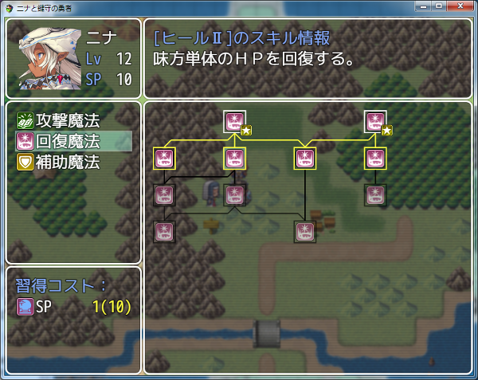
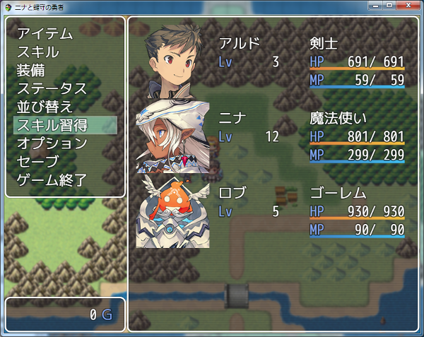
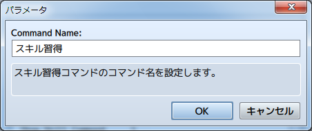
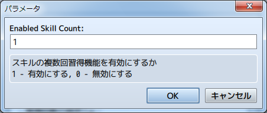
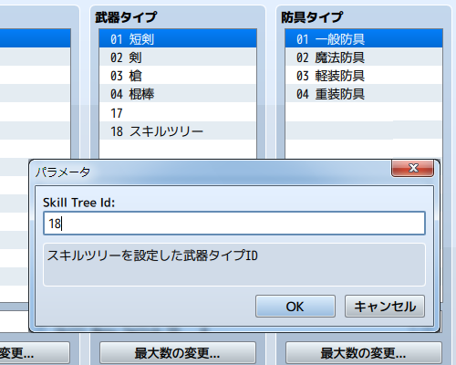
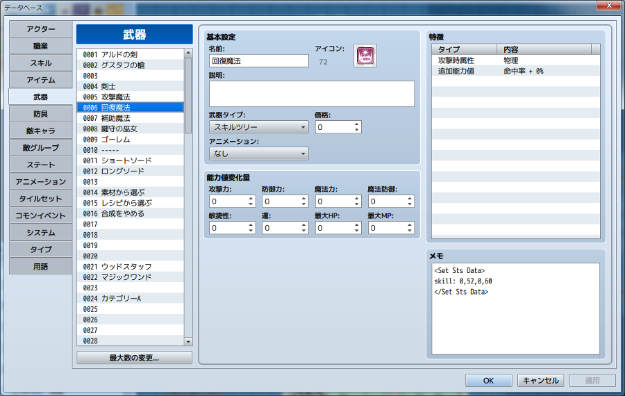
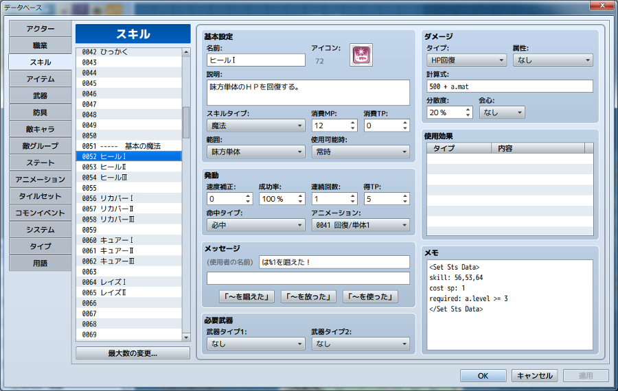
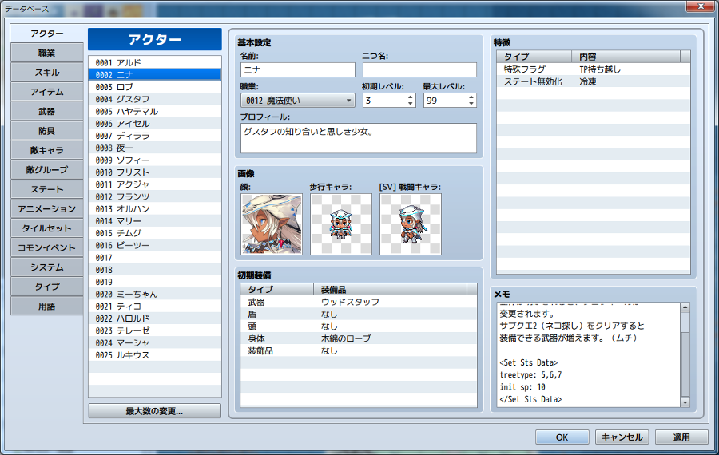

[トップページに戻る](README.ja.md)

# [FTKR_SkillTreeSystem](FTKR_SkillTreeSystem.js) プラグイン

ツリー型のスキル習得システムを実装するプラグインです。

ダウンロード: [FTKR_SkillTreeSystem.js](https://raw.githubusercontent.com/futokoro/RPGMaker/master/FTKR_SkillTreeSystem.js)

## 目次

以下の項目の順でプラグインの使い方を説明します。
1. [概要](#概要)
2. [基本設定](#基本設定)
    1. [スキル習得画面を表示する](#スキル習得画面を表示する)
    2. [スキルポイントの設定](#スキルポイントの設定)
    3. [スキルの複数回習得機能](#スキルの複数回習得機能)
3. [スキルツリーの設定](#スキルツリーの設定)
    1. [スキルツリーの設定方法](#スキルツリーの設定方法)
    2. [スキルの設定](#スキルの設定)
    3. [スキルツリーをアクターとクラスに登録する](#スキルツリーをアクターとクラスに登録する)
    4. [スキルツリーの初期化](#スキルツリーの初期化)
4. [レイアウトの変更](#レイアウトの変更)
* [プラグインの更新履歴](#プラグインの更新履歴)
* [拡張プラグイン](#拡張プラグイン)
* [ライセンス](#ライセンス)

## 概要

本プラグインにより、スキル習得システムの専用画面を表示し、視覚的にスキルを習得することができるようになります。

また、アクター毎にスキル習得時に使用できるスキルポイント(SP)を実装します。



[目次に戻る](#目次)

## 基本設定
## スキル習得画面を表示する

専用画面は、以下の方法で表示できます。

### メニューから表示

プラグインパラメータ`Show Skill Command`が 1 であることを確認してください。（デフォルトで設定済み）


この状態の時に、メニュー画面にコマンド「スキル習得」が表示します。



コマンド「スキル習得」の表示は、プラグインパラメータ`Command Name`で変更できます。



### プラグインコマンドを実行
以下のプラグインコマンドを実行することで、画面を表示します。
```
STS Open
STS スキルツリー画面表示
```

[目次に戻る](#目次)

## スキルポイントの設定

スキルを習得するためのコストとして、本プラグイン専用に、スキルポイント
というパラメータを用意しています。

### レベルアップ時の設定

スキルポイントは、レベルアップ時に入手できます。
以下のプラグインパラメータで入手量を設定できます。

`Get Level Up Sp`

レベルアップ時の入手SPを eval で設定します。


#### eval の値について
eval部は、ダメージ計算式のように、計算式を入力することで、固定値以外の値を
使用することができます。以下のコードを使用できます。
* a.param - 使用者のパラメータを参照します。(a.atk で使用者の攻撃力)
* s[x]    - スイッチID x の状態を参照します。
* v[x]    - 変数ID x の値を参照します。

### プラグインコマンドによる取得

以下のプラグインコマンド(Plugin Command)で、SPを取得できます。

```
STS Add Sp(x) Actor(y)
STS 加算 Sp(x) アクター(y)
```
アクターID y に、SPを x 加算する。
 x および y には、 v[n] とすることでゲーム内変数ID n の値を指定できます。

入力例)
```
STS Add Sp(v[1]) Actor(2)
STS 加算 Sp(v[1]) アクター(2)
アクター2が、変数ID1に格納した値の分、SPを取得する。
```

### アイテムによる取得
以下のタグをアイテム(Item)に設定できます。
```
<STS Get Sp: x>
```
アイテムを使用した対象が、SPを x 取得する。

### 敵から取得

以下のタグをエネミー(Enemy)に設定できます。
```
<STS Get Sp: x>
```
設定したエネミーを倒すと、SPを x 取得する。
 
 [目次に戻る](#目次)

## スキルの複数回習得機能

#### 最大習得回数の有効化

以下のプラグインパラメータにより、スキルを複数回習得できるようになります。

`Enabled Skill Count`

複数回習得機能を有効にするかどうか設定します。



#### 最大習得回数の設定
スキルのタグに以下を追加することで、スキルの習得回数を設定できます。
```
<Set Sts Data>
Max count: x
</Set Sts Data>
```
スキルを x 回習得できるようにする。
このタグがない場合は、プラグインパラメータ`Default Max Count`の設定値に従います。


#### 習得回数の取得
スキルの習得回数は、以下のプラグインコマンドで取得できます。
```
STS Get Varcount(x) Actor(y) Skill(z)
STS 習得回数取得 変数(x) アクター(y) スキル(z)
```
アクターID y のスキルID z の取得回数を、変数ID x に格納する。
 y および z には、 v[n] と入力することでゲーム内変数ID n の値を指定できます。

入力例)
```
STS 習得回数取得 変数(5) アクター(2) スキル(v[6])
アクターID 2 の、変数ID 6 の値で指定するスキルIDの習得回数を、変数ID 5 に格納する。
```


#### 習得回数の利用
スキルの取得回数は、各ステータスのeval式に使用できます。

eval式に対して、以下のコードを使用できます。
* a.stsCount(x) - スキルID x の習得回数を参照します。

この機能により、習得回数によって有効にすることや、ステータスの値自体を変える、といった使い方ができます。

[目次に戻る](#目次)

## スキルツリーの設定
## スキルツリーの設定方法

ツリー型のスキル習得システムを利用するために、まずスキルツリーの設定が必要です。

### スキルツリーIDの登録

スキルツリーを作成するために、まず「武器タイプ」にスキルツリー用のタイプを作成してください。
武器タイプ名を「スキルツリー」などと付けると、分かりやすくなると思います。



### スキルツリーの作成

スキルツリーは、データベースの武器に作成します。
作成した武器のIDが、後述のツリータイプIDになります。


スキルツリーとして設定が必要なデータは以下の通りです。

1. 武器タイプには、先ほど登録したスキルツリーIDを選択してください。
2. 武器の名前がスキルツリーの名前として画面に表示します。
3. 武器のアイコンがスキルツリーのアイコンとして画面に表示します。
4. メモ欄にスキルツリー用のノートタグを追加してください。




スキルツリーは、以下のノートタグで設定を行います。

```
<Set Sts Data>
code
</Set Sts Data>
```

#### code に使用できる項目

`skill: x1,x2,...`

スキルツリーの起点となるスキルとして、ID x1,x2,...を登録します。
複数のIDを登録することで、複数の起点を持ったツリーにすることができます。
なお、IDの代わりに'0'を入力すると、その箇所はツリー上で空欄になります。

```
skill: 5,6
起点となるスキルを、スキルID5、6に設定する。
```

`required: eval`

スキルツリーの表示条件を eval に設定します。

```
required: a.level >= 3
スキルツリーを表示するために、レベル3以上必要。
```

#### eval の値について

eval部は、ダメージ計算式のように、計算式を入力することで、固定値以外の値を
使用することができます。以下のコードを使用できます。

* a.param - 使用者のパラメータを参照します。(a.atk で使用者の攻撃力)
* s[x]    - スイッチID x の状態を参照します。
* v[x]    - 変数ID x の値を参照します。
* a.stsCount(x) - スキルID x の習得回数を参照します。

[目次に戻る](#目次)

## スキルの設定

スキルツリーを作成した後に、ツリーを構成するスキルの設定を行います。
ツリーを構成させる各スキルのメモ欄にスキル用のノートタグを追加してください。



スキルは、以下のノートタグで設定を行います。

```
<Set Sts Data>
code
</Set Sts Data>
```

#### code に使用できる項目

`skill: y1,y2,...`

`tree x skill: y1,y2,...`

そのスキルから派生するスキルとして、スキルID y1,y2,...を登録します。
tree x を加えた場合は、スキルツリーID x に対する派生先として登録します。
`tree 0 skill: y1,y2,...`と、`skill: y1,y2,...`の意味は同じです。

なお、複数のスキルから同じスキルに派生するように設定した場合、派生元のスキルをすべて習得しなければ、その派生スキルは、習得できません。

以下の例の場合、スキルCを習得するために、スキルAとスキルBをどちらも習得しなければいけません。
1. スキルAの派生スキルにスキルCを登録
2. スキルBの派生スキルにスキルCを登録

入力例）
```
skill: 56,53,64
tree 5 skill: 55,65
スキルID56、53、64に派生する。ただしスキルツリーID5ではスキルID55、65に派生する。
```

`required: eval`

スキルの習得条件を eval に設定します。

入力例）
```
required: a.level >= 3
習得するために、レベル3以上が必要。
```

`cost sp: eval`

習得に必要なSP を eval に設定します。
このコードで設定しない場合は、プラグインパラメータ`Default Required SP`の設定値を使用します。

入力例）
```
cost sp: a.stsCount(10) + 1
習得に必要なSPを スキルID10の習得回数 + 1 に設定する。
```

`cost item[x]: eval`

`cost weapon[x]: eval`

`cost armor[x]: eval`

それぞれ習得に必要なアイテム、武器、防具を eval 個に設定します。

入力例）
```
cost item[10]: 1
習得に必要なアイテムID10を 1個に設定する。
```

`cost v[x]: eval`

習得に必要な変数ID x の値を eval に設定します。

入力例）
```
cost v[5]: 2
習得に必要な変数ID5の値を 2に設定する。
```

`cost gold: eval`

習得に必要な金を eval に設定します。

入力例）
```
cost gold: 100
習得するために、金100が必要。
```

`max count: y`

最大習得回数を y に設定します。
このタグがない場合は、プラグインパラメータ`Default Max Count`の設定値に従います。

入力例）
```
max count: 9
最大習得回数を 9 に設定します。
```

#### eval の値について

eval部は、ダメージ計算式のように、計算式を入力することで、固定値以外の値を使用することができます。以下のコードを使用できます。

* a.param - 使用者のパラメータを参照します。(a.atk で使用者の攻撃力)
* s[x]    - スイッチID x の状態を参照します。
* v[x]    - 変数ID x の値を参照します。
* a.stsCount(x) - スキルID x の習得回数を参照します。

#### スキルツリーの作成における注意事項

1つのスキルツリーの中で、同じスキルを重複して使用することはできません。
スキルが重複した場合、ツリーの終点に近い方を登録します。

[目次に戻る](#目次)

## スキルツリーをアクターとクラスに登録する

作成したスキルツリーは、アクターまたはクラスに登録することで使用できます。

### アクターとクラスの初期設定

アクターまたはクラスのメモ欄にノートタグを追加してください。



アクターとクラスは、以下のノートタグで設定を行います。

```
<Set Sts Data>
code
</Set Sts Data>
```

#### code に使用できる項目

`TreeType: x1,x2,...`

そのアクター、またはクラスは、ツリータイプID x1,x2,...を使用できます。
ツリータイプIDとは、ツリーとして作成した武器のIDです。

入力例）
```
TreeType: 9
アクターの初期ツリータイプIDを 9 に設定します。
```

`Init Sp: x`

アクターの初期SPを x に設定します。
このタグは、アクター専用です。

入力例）
```
Init Sp: 5
初期SPを 5 に設定します。
```

### ゲーム中のツリータイプの追加・削除

以下のプラグインコマンドを実行することで、ゲーム中にスキルツリーの追加・削除ができます。

アクターID y にツリータイプID x を追加します。
```
STS ADD TreeType(x) Actor(y)
STS 追加 ツリータイプ(x) アクター(y)
```

アクターID y の、ツリータイプID x を削除します。
ただし、初期設定したツリータイプは削除できません。

```
STS REDUCE TreeType(x) Actor(y)
STS 削除 ツリータイプ(x) アクター(y)
```

[目次に戻る](#目次)

## スキルツリーの初期化

スキルツリーは、ゲーム中にいくつかの手段で習得状況を初期状態に戻すことができます。
なお、リセットと初期化は使用したSPが戻るか戻らないかの違いです。

### プラグインコマンドで戻す

以下のプラグインコマンドで、スキルツリーをリセットできます。
使用したSPはすべて戻ります。

#### スキルツリーのリセット

アクターID x のスキルツリーをすべてリセットします。

```
STS Reset Actor(x) ALL
STS リセット アクター(x) すべて
```

アクターID x のスキルツリーID y をすべてリセットします。

```
STS Reset Actor(x) TreeType(y)
STS リセット アクター(x) ツリータイプ(y)
```

#### スキルツリーの初期化

以下のプラグインコマンドで、スキルツリーを初期化できます。
使用したSPは戻りません。

アクターID x のスキルツリーをすべて初期化します。

```
STS Clear Actor(x) ALL
STS 初期化 アクター(x) すべて
```

アクターID x のスキルツリーID y をすべて初期化します。

```
STS Clear Actor(x) TreeType(y)
STS 初期化 アクター(x) ツリータイプ(y)
```

### アイテムで戻す

また、以下のタグをアイテムのノート欄に入力することで、ツリーを初期化する
アイテムにできます。

対象のスキルツリーをすべてリセットします。
使用したSPはすべて戻ります。

```
<STS Reset Tree>
```

対象のスキルツリーをすべて初期化します。
使用したSPは戻りません。

```
<STS Clear Tree>
```

[目次に戻る](#目次)

## レイアウトの変更

工事中

[目次に戻る](#目次)

## プラグインの更新履歴

| バージョン | 公開日 | 更新内容 |
| --- | --- | --- |
| [ver1.6.3](FTKR_SkillTreeSystem.js) | 2017/04/07 | ヘルププラグインと統合 |
| ver1.6.2 | 2017/04/02 | プラグイン内ヘルプ参照、[ツクマテ](http://tm.lucky-duet.com/viewtopic.php?f=5&t=3201)で公開 |
| ver1.0.0 | 2017/02/25 | 初版作成、[ツクマテ](http://tm.lucky-duet.com/viewtopic.php?f=5&t=3201)で公開 |

## 拡張プラグイン

以下のプラグインを使用することで、本プラグインの機能を拡張できます。

* [FTKR_STS_CustomWindow.js](FTKR_STS_CustomWindow.js) - レイアウト変更
* [FTKR_CustomSimpleActorStatus.js](FTKR_CustomSimpleActorStatus.js) - アクターのステータス表示変更
* [FTKR_DisplayCommandFrame.js](FTKR_DisplayCommandFrame.js) - スキル枠の表示変更

## ライセンス

本プラグインはMITライセンスのもとで公開しています。

[The MIT License (MIT)](https://opensource.org/licenses/mit-license.php)

#
[目次に戻る](#目次)

[トップページに戻る](README.ja.md)